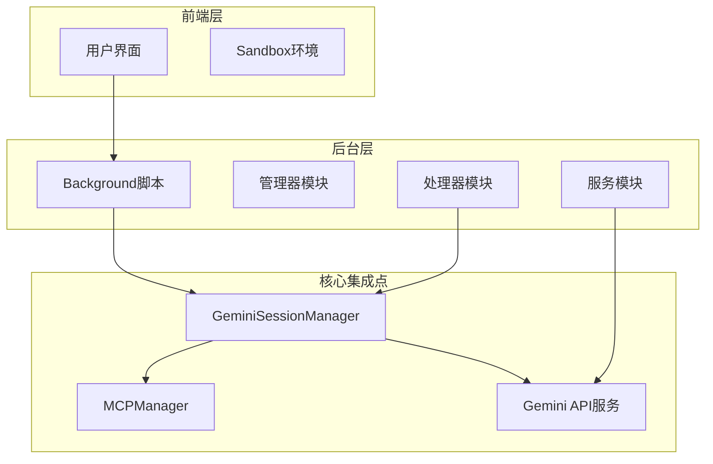
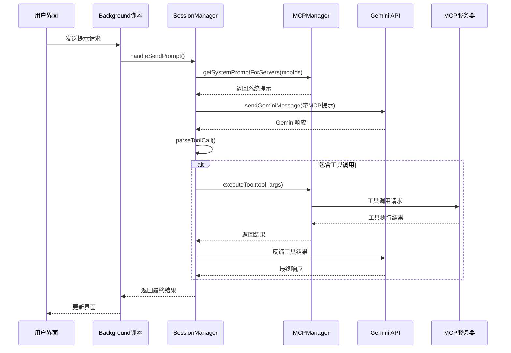
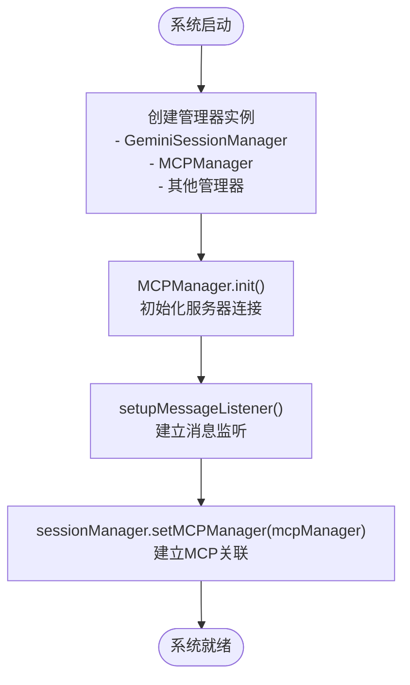
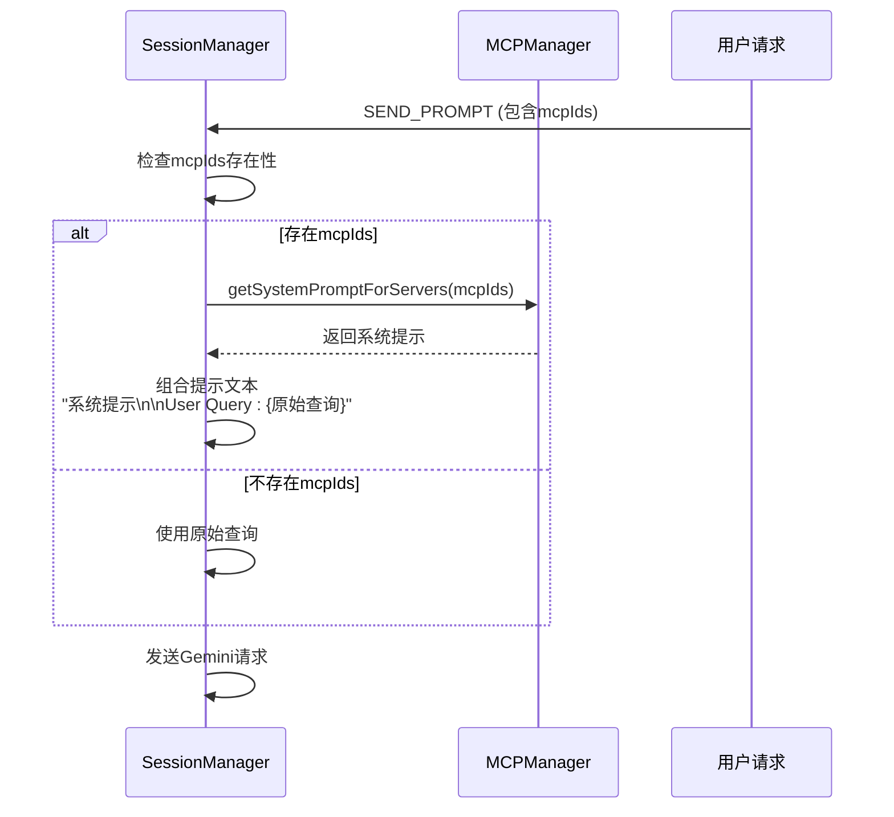
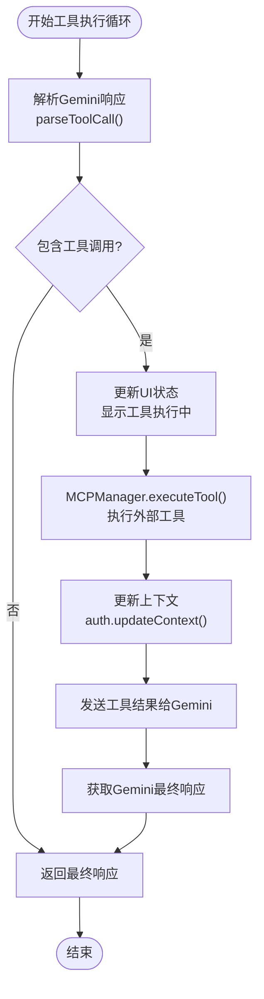
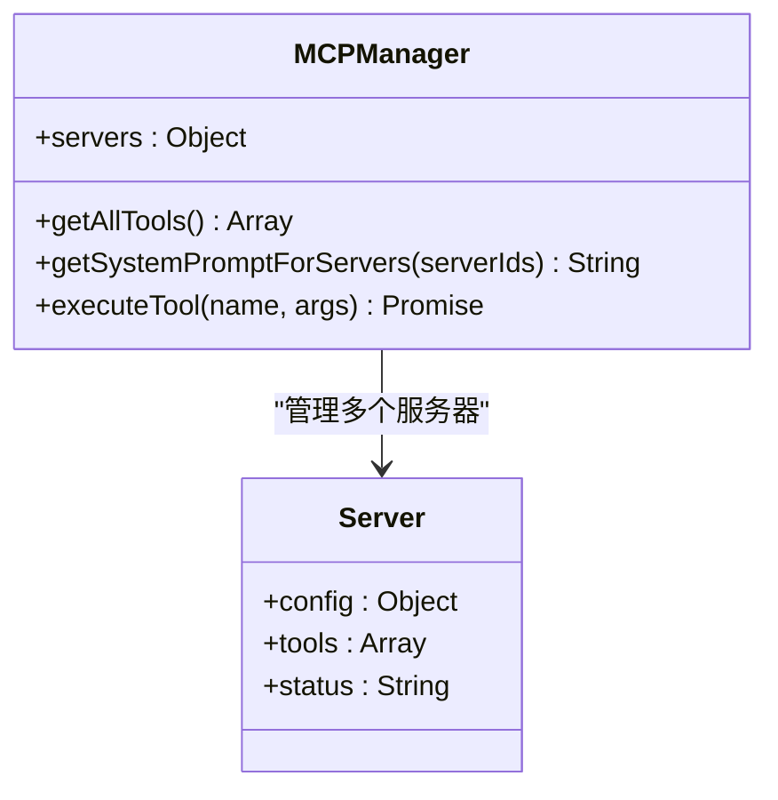
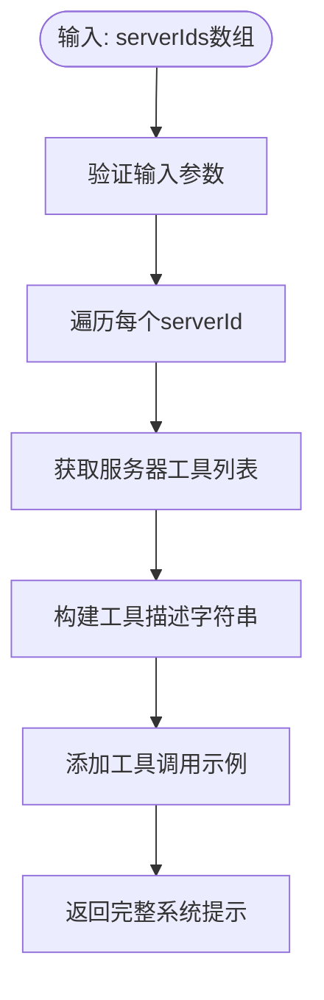
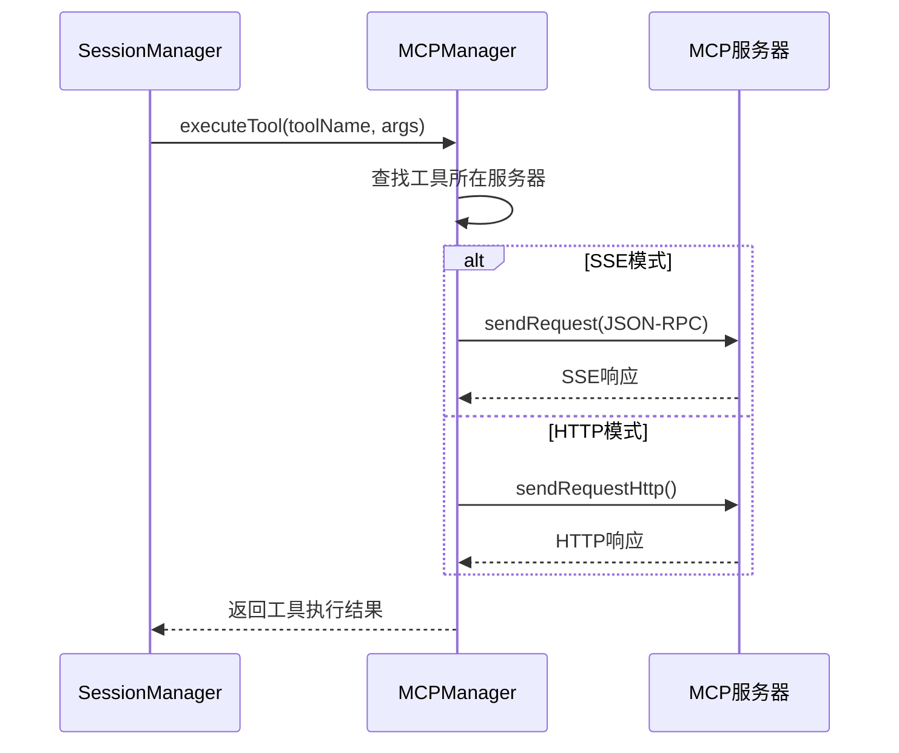
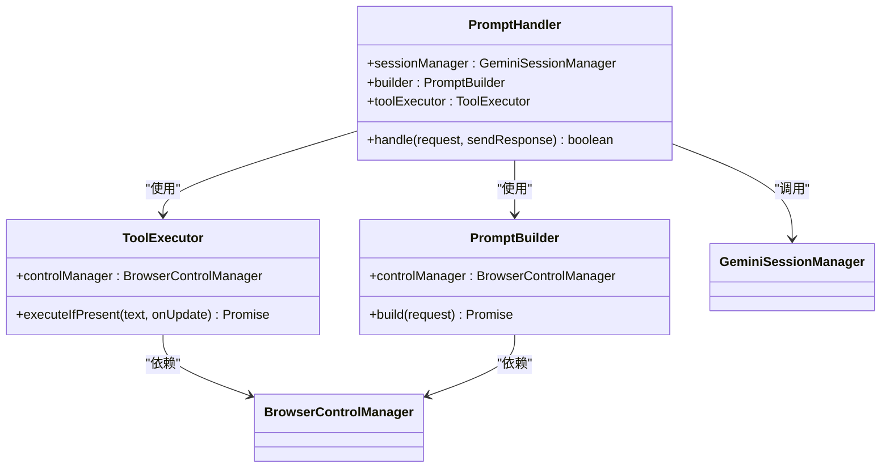
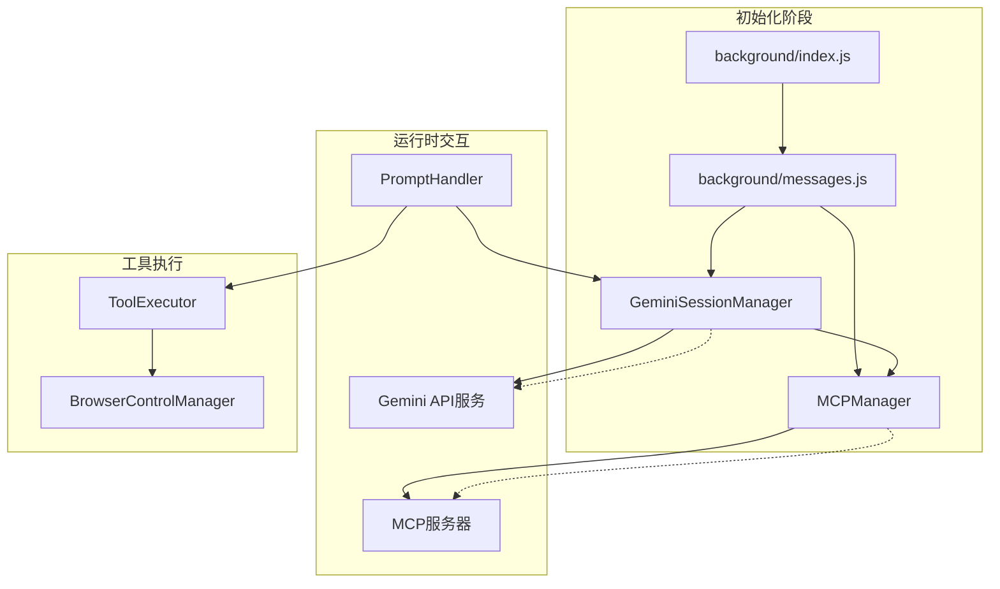

# SessionManager与MCPManager集成

<cite>
**本文档引用的文件**
- [background/managers/session_manager.js](file://background/managers/session_manager.js)
- [background/managers/mcp_manager.js](file://background/managers/mcp_manager.js)
- [background/messages.js](file://background/messages.js)
- [background/index.js](file://background/index.js)
- [background/handlers/session/prompt_handler.js](file://background/handlers/session/prompt_handler.js)
- [background/handlers/session/prompt/tool_executor.js](file://background/handlers/session/prompt/tool_executor.js)
- [background/handlers/session/prompt/builder.js](file://background/handlers/session/prompt/builder.js)
- [background/handlers/session/utils.js](file://background/handlers/session/utils.js)
- [services/gemini_api.js](file://services/gemini_api.js)
</cite>

## 目录
1. [简介](#简介)
2. [项目结构概览](#项目结构概览)
3. [核心组件分析](#核心组件分析)
4. [架构概览](#架构概览)
5. [详细组件分析](#详细组件分析)
6. [依赖关系分析](#依赖关系分析)
7. [性能考虑](#性能考虑)
8. [故障排除指南](#故障排除指南)
9. [结论](#结论)

## 简介

本文档详细分析了SessionManager与MCPManager的深度集成机制，重点阐述了SessionManager通过`setMCPManager(manager)`方法建立与MCPManager的关联关系。文档深入解析了以下关键功能：

- **系统提示注入机制**：当请求包含mcpIds时，SessionManager如何调用`this.mcpManager.getSystemPromptForServers(request.mcpIds)`获取系统提示，并将其注入到用户查询之前
- **工具调用循环**：当Gemini响应包含工具调用指令时，SessionManager如何调用`this.mcpManager.executeTool(toolCall.tool, toolCall.args)`执行外部工具，并将结果反馈给Gemini进行后续处理
- **MCPManager关键API**：getAllTools、getSystemPromptForServers和executeTool等核心接口的实现细节
- **完整数据流**：通过时序图清晰展示从用户查询到工具执行再到最终响应的完整流程

## 项目结构概览

该项目采用模块化架构设计，主要分为以下几个核心层次：

**图表来源**
- [background/index.js](file://background/index.js#L16-L26)
- [background/messages.js](file://background/messages.js#L14-L17)

**章节来源**
- [background/index.js](file://background/index.js#L1-L30)
- [background/messages.js](file://background/messages.js#L1-L82)

## 核心组件分析

### SessionManager类分析

GeminiSessionManager是整个系统的协调者，负责管理与Gemini的交互以及MCP工具的执行。

#### 关键特性

1. **MCP集成能力**：通过`setMCPManager()`方法建立与MCPManager的关联
2. **智能提示注入**：根据请求中的mcpIds动态生成系统提示
3. **工具执行循环**：自动检测并执行Gemini返回的工具调用指令
4. **错误处理机制**：完善的异常捕获和用户友好的错误提示

#### 主要方法

- `setMCPManager(manager)`: 建立MCPManager关联
- `handleSendPrompt(request, onUpdate)`: 主要的提示发送和处理逻辑
- `parseToolCall(text)`: 解析Gemini响应中的工具调用指令

**章节来源**
- [background/managers/session_manager.js](file://background/managers/session_manager.js#L6-L285)

### MCPManager类分析

MCPManager负责管理Model Context Protocol服务器的连接和工具调用。

#### 核心功能

1. **服务器管理**：支持SSE和HTTP两种传输模式
2. **工具发现**：自动发现和加载可用工具
3. **工具执行**：执行外部工具并返回结果
4. **状态监控**：跟踪服务器连接状态和工具可用性

#### 关键API

- `getAllTools()`: 获取所有可用工具
- `getSystemPromptForServers(serverIds)`: 为指定服务器生成系统提示
- `executeTool(name, args)`: 执行指定工具

**章节来源**
- [background/managers/mcp_manager.js](file://background/managers/mcp_manager.js#L2-L530)

## 架构概览

系统采用分层架构设计，各组件职责明确，通过消息传递机制实现松耦合集成。

**图表来源**
- [background/messages.js](file://background/messages.js#L14-L17)
- [background/managers/session_manager.js](file://background/managers/session_manager.js#L21-L128)
- [background/managers/mcp_manager.js](file://background/managers/mcp_manager.js#L479-L525)

## 详细组件分析

### SessionManager与MCPManager的集成机制

#### 初始化和关联建立

系统启动时，Background脚本会创建各个管理器实例，并通过消息监听器建立SessionManager与MCPManager的关联。

**图表来源**
- [background/index.js](file://background/index.js#L16-L26)
- [background/messages.js](file://background/messages.js#L14-L17)

#### 系统提示注入流程

当用户请求包含mcpIds时，SessionManager会动态生成系统提示并注入到用户查询中：

**图表来源**
- [background/managers/session_manager.js](file://background/managers/session_manager.js#L54-L63)
- [background/managers/mcp_manager.js](file://background/managers/mcp_manager.js#L446-L477)

**章节来源**
- [background/messages.js](file://background/messages.js#L14-L17)
- [background/managers/session_manager.js](file://background/managers/session_manager.js#L54-L63)

#### 工具调用执行循环

这是系统最复杂的部分，涉及Gemini响应解析、工具执行和结果反馈的完整循环：

**图表来源**
- [background/managers/session_manager.js](file://background/managers/session_manager.js#L76-L115)
- [background/managers/mcp_manager.js](file://background/managers/mcp_manager.js#L479-L525)

**章节来源**
- [background/managers/session_manager.js](file://background/managers/session_manager.js#L76-L115)

### MCPManager关键API详解

#### getAllTools() - 工具发现

该方法遍历所有连接的MCP服务器，收集可用工具并添加服务器标识：

**图表来源**
- [background/managers/mcp_manager.js](file://background/managers/mcp_manager.js#L407-L420)

#### getSystemPromptForServers() - 动态提示生成

根据指定的服务器ID生成定制化的系统提示，包含这些服务器的工具信息：

**图表来源**
- [background/managers/mcp_manager.js](file://background/managers/mcp_manager.js#L446-L477)

#### executeTool() - 工具执行

这是MCPManager的核心方法，负责定位工具、选择合适的传输模式并执行工具调用：

**图表来源**
- [background/managers/mcp_manager.js](file://background/managers/mcp_manager.js#L479-L525)

**章节来源**
- [background/managers/mcp_manager.js](file://background/managers/mcp_manager.js#L407-L525)

### PromptHandler与工具执行

虽然主要的MCP集成在SessionManager中，但PromptHandler也参与了工具执行的协调工作：

**图表来源**
- [background/handlers/session/prompt_handler.js](file://background/handlers/session/prompt_handler.js#L6-L11)
- [background/handlers/session/prompt/tool_executor.js](file://background/handlers/session/prompt/tool_executor.js#L4-L7)
- [background/handlers/session/prompt/builder.js](file://background/handlers/session/prompt/builder.js#L5-L7)

**章节来源**
- [background/handlers/session/prompt_handler.js](file://background/handlers/session/prompt_handler.js#L1-L103)
- [background/handlers/session/prompt/tool_executor.js](file://background/handlers/session/prompt/tool_executor.js#L1-L49)
- [background/handlers/session/prompt/builder.js](file://background/handlers/session/prompt/builder.js#L1-L45)

## 依赖关系分析

系统采用松耦合设计，通过消息传递实现组件间的通信：

**图表来源**
- [background/index.js](file://background/index.js#L16-L26)
- [background/messages.js](file://background/messages.js#L14-L17)
- [background/handlers/session/prompt_handler.js](file://background/handlers/session/prompt_handler.js#L14-L41)

**章节来源**
- [background/index.js](file://background/index.js#L1-L30)
- [background/messages.js](file://background/messages.js#L1-L82)

## 性能考虑

### 异步处理优化

1. **并发工具执行**：MCPManager支持HTTP和SSE两种模式，可根据服务器类型选择最优传输方式
2. **流式响应处理**：Gemini API支持流式响应，通过onUpdate回调实时更新UI
3. **超时控制**：MCP请求设置了10秒超时机制，避免长时间阻塞

### 内存管理

1. **请求取消**：AbortController确保用户可以随时取消正在进行的请求
2. **资源清理**：正确关闭EventSource连接和清理临时变量

### 错误恢复

1. **多账户轮换**：当遇到认证错误时，自动切换到下一个账户
2. **重试机制**：支持最多两次的请求重试（基于账户数量）
3. **降级策略**：工具执行失败时，向用户显示错误信息而非完全中断流程

## 故障排除指南

### 常见问题及解决方案

#### MCP服务器连接失败

**症状**：MCP服务器状态显示为"error"

**排查步骤**：
1. 检查服务器URL配置是否正确
2. 验证网络连接和防火墙设置
3. 确认服务器支持的传输协议类型

**解决方法**：
- 在设置中重新配置MCP服务器
- 尝试不同的传输模式（SSE vs HTTP）

#### 工具执行超时

**症状**：工具执行超过10秒后返回超时错误

**排查步骤**：
1. 检查目标服务器的响应时间
2. 验证工具参数的正确性
3. 确认服务器资源充足

**解决方法**：
- 优化工具执行逻辑
- 增加服务器资源
- 调整超时阈值

#### 认证错误

**症状**：出现"未登录"或"会话已过期"错误

**排查步骤**：
1. 检查当前使用的账户索引
2. 验证Google账户登录状态
3. 确认Gemini页面的登录状态

**解决方法**：
- 手动登录Google账户
- 清除浏览器缓存和Cookie
- 切换到其他账户索引

**章节来源**
- [background/managers/session_manager.js](file://background/managers/session_manager.js#L129-L199)

## 结论

SessionManager与MCPManager的集成展现了现代AI应用的典型架构模式：

1. **清晰的职责分离**：SessionManager专注于对话管理和工具协调，MCPManager专注于工具执行
2. **灵活的扩展性**：通过MCP协议支持任意第三方工具集成
3. **强大的容错能力**：完善的错误处理和恢复机制确保系统稳定性
4. **优秀的用户体验**：实时流式响应和直观的状态反馈

这种设计不仅满足了当前的功能需求，还为未来的功能扩展奠定了坚实的基础。通过标准化的MCP协议，系统可以轻松集成更多类型的工具和服务，为用户提供更加丰富的AI助手体验。