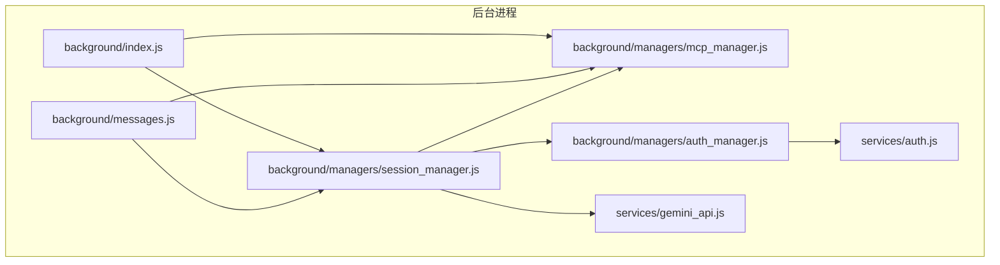
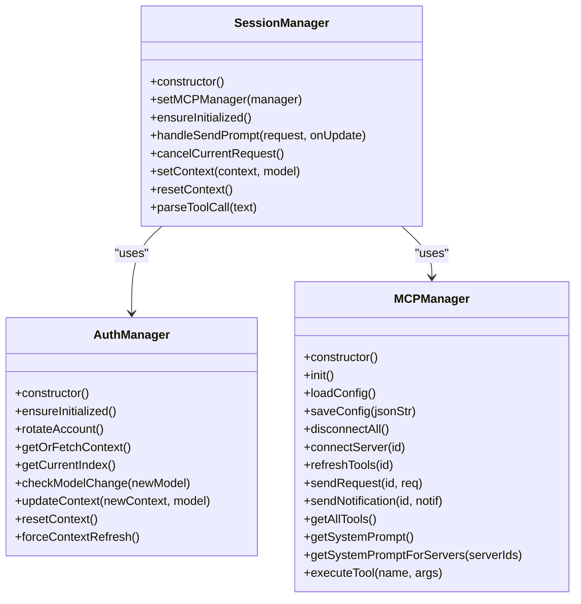
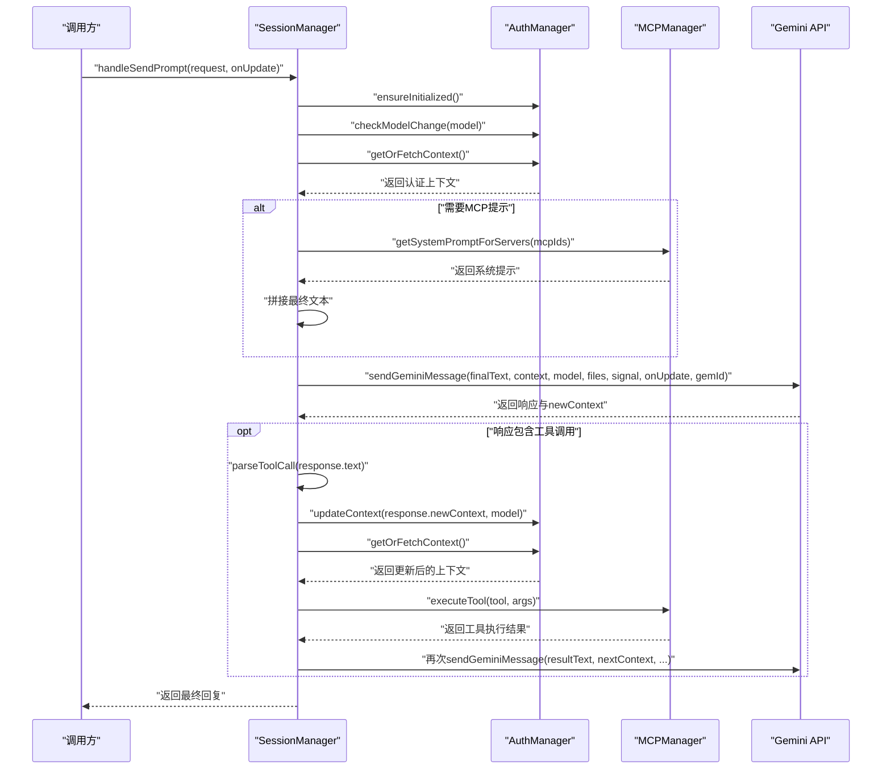
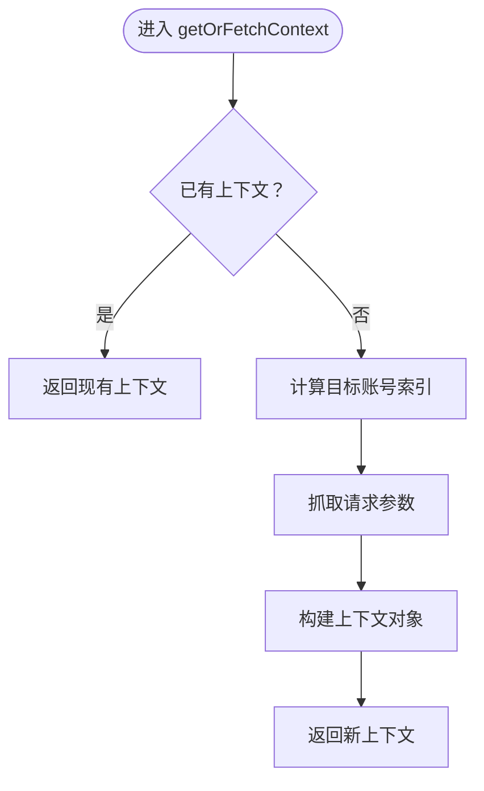
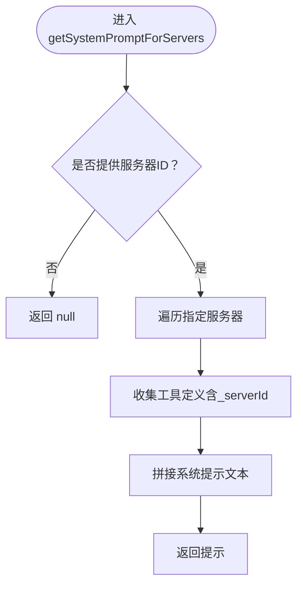
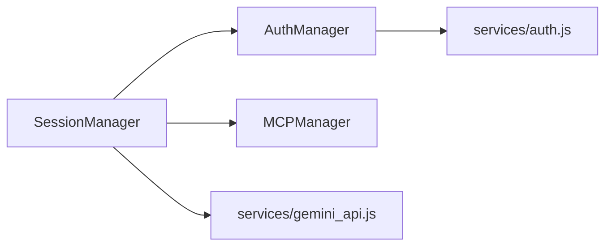

# 核心管理器依赖

<cite>
**本文引用的文件**
- [background/managers/session_manager.js](file://background/managers/session_manager.js)
- [background/managers/auth_manager.js](file://background/managers/auth_manager.js)
- [background/managers/mcp_manager.js](file://background/managers/mcp_manager.js)
- [background/messages.js](file://background/messages.js)
- [background/index.js](file://background/index.js)
- [services/auth.js](file://services/auth.js)
- [services/gemini_api.js](file://services/gemini_api.js)
</cite>

## 目录
1. [简介](#简介)
2. [项目结构](#项目结构)
3. [核心组件](#核心组件)
4. [架构总览](#架构总览)
5. [详细组件分析](#详细组件分析)
6. [依赖关系分析](#依赖关系分析)
7. [性能考量](#性能考量)
8. [故障排查指南](#故障排查指南)
9. [结论](#结论)

## 简介
本文件聚焦于Gemini Nexus中三个核心管理器：SessionManager、AuthManager与MCPManager之间的协作与依赖关系。重点阐述：
- SessionManager在构造函数中直接创建AuthManager实例以获取与刷新认证上下文；
- SessionManager通过setMCPManager建立与MCPManager的关联，用于注入系统提示与执行工具调用；
- AuthManager作为认证核心，提供ensureInitialized、getOrFetchContext、updateContext等关键服务；
- MCPManager为SessionManager提供getSystemPromptForServers与executeTool等能力。

## 项目结构
本节概览与本文相关的核心文件组织方式，便于定位依赖注入与调用链路。

图表来源
- [background/index.js](file://background/index.js#L16-L26)
- [background/messages.js](file://background/messages.js#L14-L17)
- [background/managers/session_manager.js](file://background/managers/session_manager.js#L6-L15)
- [background/managers/auth_manager.js](file://background/managers/auth_manager.js#L3-L4)
- [services/auth.js](file://services/auth.js#L3-L4)
- [services/gemini_api.js](file://services/gemini_api.js#L3-L6)

章节来源
- [background/index.js](file://background/index.js#L1-L30)
- [background/messages.js](file://background/messages.js#L1-L82)

## 核心组件
- SessionManager：负责会话生命周期、认证上下文管理、MCP集成与工具调用执行。
- AuthManager：负责认证状态恢复、上下文获取与刷新、账号轮换与模型变更检测。
- MCPManager：负责MCP服务器发现、连接、工具列表拉取与工具调用执行。

章节来源
- [background/managers/session_manager.js](file://background/managers/session_manager.js#L6-L15)
- [background/managers/auth_manager.js](file://background/managers/auth_manager.js#L5-L12)
- [background/managers/mcp_manager.js](file://background/managers/mcp_manager.js#L2-L6)

## 架构总览
下图展示了三者之间的“使用”关系与控制流，体现SessionManager对AuthManager与MCPManager的强依赖。

图表来源
- [background/managers/session_manager.js](file://background/managers/session_manager.js#L6-L15)
- [background/managers/auth_manager.js](file://background/managers/auth_manager.js#L5-L129)
- [background/managers/mcp_manager.js](file://background/managers/mcp_manager.js#L2-L529)

## 详细组件分析

### SessionManager：依赖注入与协作流程
- 构造函数注入AuthManager：在构造函数中直接创建AuthManager实例，确保后续可调用认证相关方法。
- 依赖注入MCPManager：通过setMCPManager建立与MCPManager的关联，以便在发送消息时注入系统提示与执行工具调用。
- 认证上下文管理：在发送消息前调用ensureInitialized与getOrFetchContext，保证上下文有效；在成功响应后调用updateContext更新上下文。
- 工具调用执行：当响应包含工具调用时，先更新上下文，再调用MCPManager.executeTool执行工具，并将结果回传给Gemini继续对话。

图表来源
- [background/managers/session_manager.js](file://background/managers/session_manager.js#L17-L119)
- [background/managers/auth_manager.js](file://background/managers/auth_manager.js#L75-L92)
- [background/managers/mcp_manager.js](file://background/managers/mcp_manager.js#L446-L477)
- [services/gemini_api.js](file://services/gemini_api.js#L26-L230)

章节来源
- [background/managers/session_manager.js](file://background/managers/session_manager.js#L6-L15)
- [background/managers/session_manager.js](file://background/managers/session_manager.js#L21-L120)

### AuthManager：认证上下文与账号管理
- 初始化：从本地存储恢复上下文、模型与账号索引，标记初始化完成。
- 上下文获取：若当前上下文为空，则根据当前账号索引抓取请求参数并构建上下文。
- 账号轮换：支持多账号轮换，更新指针并持久化。
- 模型变更检测：当模型变化时强制清空上下文，触发重新初始化。
- 上下文更新与重置：更新上下文与模型并持久化；重置时清除上下文并可能轮换账号。

图表来源
- [background/managers/auth_manager.js](file://background/managers/auth_manager.js#L75-L92)
- [services/auth.js](file://services/auth.js#L7-L40)

章节来源
- [background/managers/auth_manager.js](file://background/managers/auth_manager.js#L14-L48)
- [background/managers/auth_manager.js](file://background/managers/auth_manager.js#L75-L92)
- [background/managers/auth_manager.js](file://background/managers/auth_manager.js#L105-L128)

### MCPManager：系统提示与工具调用
- 初始化与配置：加载MCP配置，自动连接启用的服务器，维护工具列表。
- 系统提示生成：支持为所有服务器或指定服务器集合生成系统提示，指导模型调用工具。
- 工具调用：根据工具名查找对应服务器，选择HTTP或SSE模式发起调用，返回结果。

图表来源
- [background/managers/mcp_manager.js](file://background/managers/mcp_manager.js#L446-L477)

章节来源
- [background/managers/mcp_manager.js](file://background/managers/mcp_manager.js#L21-L61)
- [background/managers/mcp_manager.js](file://background/managers/mcp_manager.js#L446-L477)
- [background/managers/mcp_manager.js](file://background/managers/mcp_manager.js#L479-L525)

## 依赖关系分析
- SessionManager对AuthManager的依赖：强依赖。SessionManager在构造函数中创建AuthManager实例，并在发送消息前后多次调用其方法以管理认证上下文。
- SessionManager对MCPManager的依赖：强依赖。SessionManager通过setMCPManager注入MCPManager，在需要时生成系统提示并执行工具调用。
- AuthManager对services/auth.js的依赖：间接依赖。AuthManager通过fetchRequestParams获取认证参数，从而构建上下文。
- SessionManager对services/gemini_api.js的依赖：间接依赖。SessionManager调用sendGeminiMessage发送消息，该服务负责与Gemini后端通信。

图表来源
- [background/managers/session_manager.js](file://background/managers/session_manager.js#L7-L8)
- [background/managers/auth_manager.js](file://background/managers/auth_manager.js#L3)
- [services/auth.js](file://services/auth.js#L3)
- [services/gemini_api.js](file://services/gemini_api.js#L3)

章节来源
- [background/index.js](file://background/index.js#L16-L26)
- [background/messages.js](file://background/messages.js#L14-L17)
- [background/managers/session_manager.js](file://background/managers/session_manager.js#L6-L15)

## 性能考量
- 并发与重试：SessionManager在存在多个账号时支持一次重试与账号轮换，有助于提升可用性但需注意网络与速率限制。
- 流式响应：通过流式读取与增量更新，优化用户体验，减少首屏延迟。
- MCP工具调用：工具调用采用HTTP或SSE两种模式，按服务器类型自动切换，避免不必要的SSE开销。

## 故障排查指南
- 登录失效/会话过期：SessionManager在错误检测中识别登录状态问题，触发上下文刷新与账号轮换，并引导用户登录。
- 速率限制：检测到频繁请求时提示等待，避免进一步失败。
- 服务器无响应/响应解析失败：建议刷新页面后重试。
- 工具执行失败：捕获异常并在响应中追加错误信息，便于用户感知。

章节来源
- [background/managers/session_manager.js](file://background/managers/session_manager.js#L129-L198)

## 结论
SessionManager通过在构造函数中注入AuthManager与setMCPManager建立的关联，实现了认证上下文管理与MCP工具调用的无缝集成。AuthManager提供稳定的认证上下文获取与刷新机制，MCPManager提供灵活的系统提示与工具调用能力。整体设计体现了清晰的职责分离与强依赖关系，既保证了功能完整性，也便于扩展与维护。