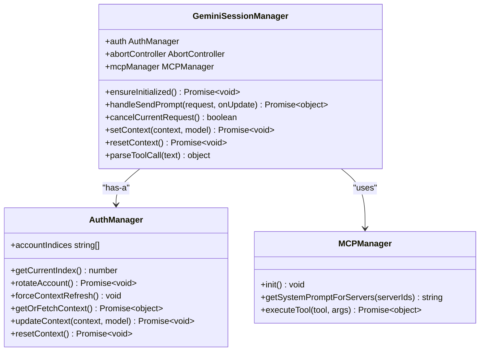
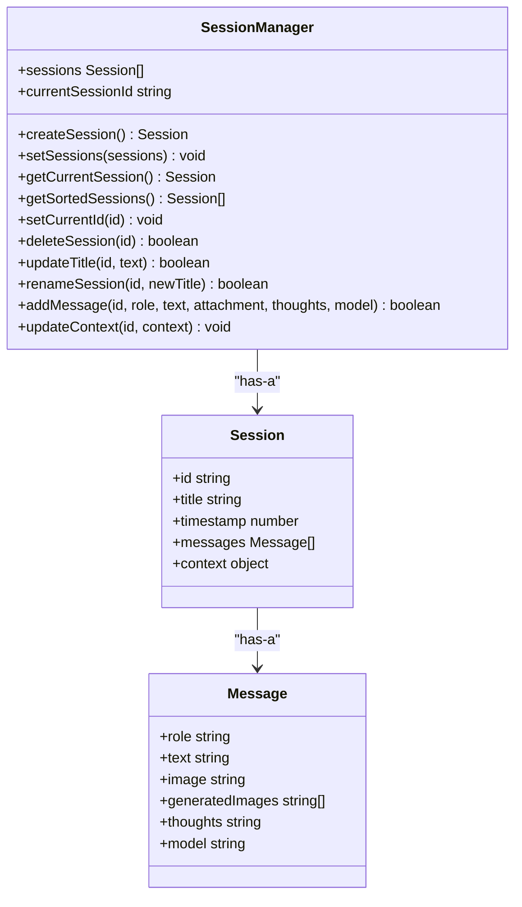
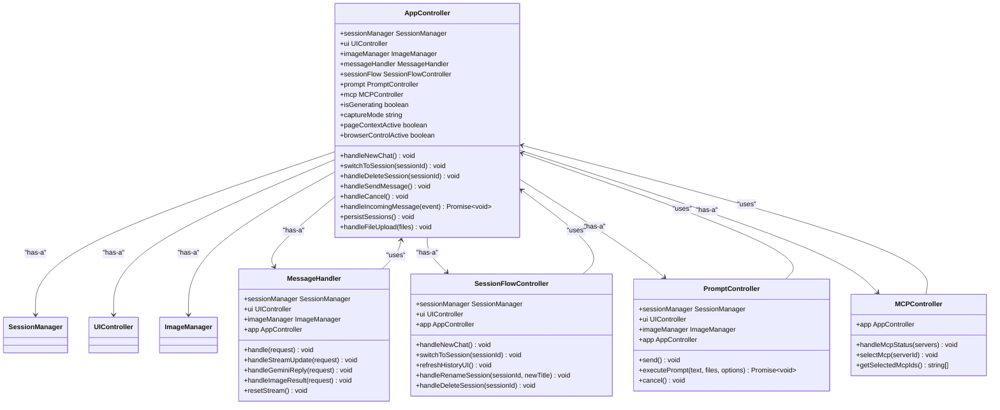
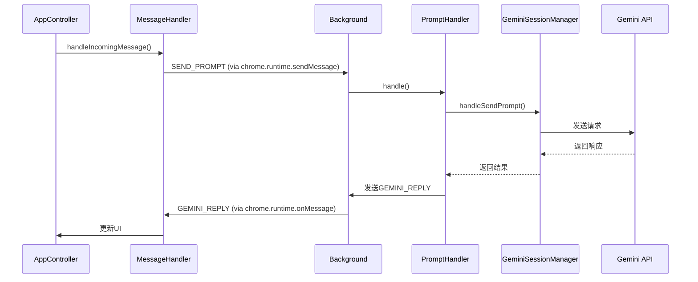
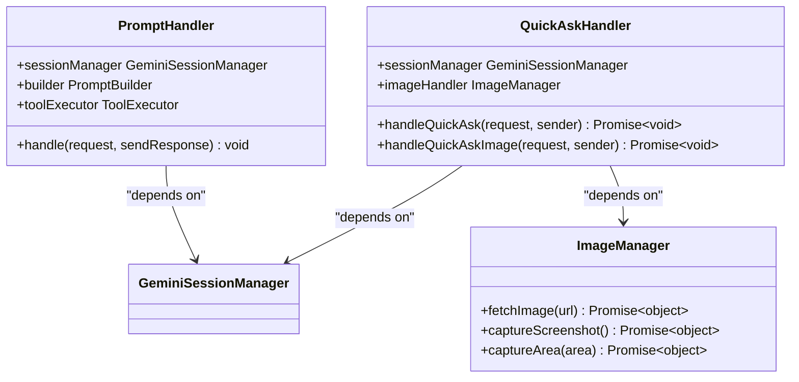

# 组件关系

<cite>
**本文档中引用的文件**   
- [session_manager.js](file://background/managers/session_manager.js)
- [session_manager.js](file://sandbox/core/session_manager.js)
- [index.js](file://background/index.js)
- [app.js](file://sandbox/boot/app.js)
- [app_controller.js](file://sandbox/controllers/app_controller.js)
- [message_handler.js](file://sandbox/controllers/message_handler.js)
- [prompt_handler.js](file://background/handlers/session/prompt_handler.js)
- [quick_ask_handler.js](file://background/handlers/session/quick_ask_handler.js)
- [image_manager.js](file://background/managers/image_manager.js)
- [image_manager.js](file://sandbox/core/image_manager.js)
- [messages.js](file://background/messages.js)
- [messaging.js](file://sandbox/boot/messaging.js)
- [history_manager.js](file://background/managers/history_manager.js)
- [session_flow.js](file://sandbox/controllers/session_flow.js)
- [prompt.js](file://sandbox/controllers/prompt.js)
- [session.js](file://background/handlers/session.js)
</cite>

## 目录
1. [引言](#引言)
2. [SessionManager双重实例化与数据同步](#sessionmanager双重实例化与数据同步)
3. [AppController作为协调者](#appcontroller作为协调者)
4. [后台处理器依赖关系](#后台处理器依赖关系)
5. [组件依赖关系图](#组件依赖关系图)

## 引言
Gemini Nexus扩展程序采用分层架构，将核心逻辑分离到background（后台）和sandbox（沙箱）两个独立的JavaScript环境中。这种设计确保了安全性和模块化，同时通过精心设计的通信机制保持数据一致性。本文档详细分析了关键组件之间的依赖和协作模式，重点阐述SessionManager在两个环境中的实例化机制、AppController在sandbox层的协调作用，以及后台处理器如何依赖SessionManager执行业务逻辑。

## SessionManager双重实例化与数据同步

在Gemini Nexus架构中，`SessionManager`类在background和sandbox两个环境中分别实例化，扮演不同的角色但保持数据同步。

在background环境中，`GeminiSessionManager`负责与Gemini API进行实际通信，处理身份验证、发送请求、管理会话上下文和错误处理。它在`background/index.js`中被实例化，并作为核心服务被其他后台组件（如`PromptHandler`）依赖。



**Diagram sources**
- [session_manager.js](file://background/managers/session_manager.js#L6-L284)
- [auth_manager.js](file://background/managers/auth_manager.js)
- [mcp_manager.js](file://background/managers/mcp_manager.js)

在sandbox环境中，`SessionManager`负责管理本地的聊天会话数据，包括创建、切换、删除会话以及维护消息历史。它在`sandbox/boot/app.js`中被实例化，并由`AppController`持有引用。



**Diagram sources**
- [session_manager.js](file://sandbox/core/session_manager.js#L5-L104)
- [app.js](file://sandbox/boot/app.js#L49-L50)

两个`SessionManager`实例通过消息传递机制保持数据同步。当sandbox中的用户发起请求时，`AppController`通过`MessageHandler`将请求发送到background。background的`GeminiSessionManager`处理请求后，将结果（包括更新后的上下文）通过消息发送回sandbox。sandbox的`SessionManager`接收到消息后，更新本地会话的上下文，从而实现数据同步。

**Section sources**
- [session_manager.js](file://background/managers/session_manager.js#L6-L284)
- [session_manager.js](file://sandbox/core/session_manager.js#L5-L104)
- [app.js](file://sandbox/boot/app.js#L49-L50)
- [index.js](file://background/index.js#L18-L19)

## AppController作为协调者

`AppController`是sandbox层的核心协调者，负责聚合和管理多个子控制器和组件，处理跨层通信。

在`sandbox/boot/app.js`中，`AppController`被实例化，并接收`SessionManager`、`UIController`和`ImageManager`等组件的实例作为构造函数参数。这表明`AppController`与这些组件之间存在“has-a”关系，即它持有这些组件的引用。



**Diagram sources**
- [app_controller.js](file://sandbox/controllers/app_controller.js#L10-L206)
- [message_handler.js](file://sandbox/controllers/message_handler.js#L8-L364)
- [session_flow.js](file://sandbox/controllers/session_flow.js#L7-L95)
- [prompt.js](file://sandbox/controllers/prompt.js#L7-L116)
- [app.js](file://sandbox/boot/app.js#L79-L80)

`AppController`通过`MessageHandler`处理来自background的跨层通信。`MessageHandler`被注入到`AppController`中，并在处理消息时调用`AppController`的方法来更新应用状态。例如，当收到`GEMINI_REPLY`消息时，`MessageHandler`会调用`AppController`的内部方法来更新UI和会话数据。

**Section sources**
- [app_controller.js](file://sandbox/controllers/app_controller.js#L10-L206)
- [message_handler.js](file://sandbox/controllers/message_handler.js#L8-L364)
- [app.js](file://sandbox/boot/app.js#L79-L80)

## 后台处理器依赖关系

在background环境中，`PromptHandler`和`QuickAskHandler`等后台处理器直接依赖`GeminiSessionManager`来执行核心业务逻辑。

`PromptHandler`在`background/handlers/session.js`中被实例化，并接收`GeminiSessionManager`的实例作为构造函数参数。它使用`GeminiSessionManager`的`handleSendPrompt`方法来发送用户请求到Gemini API，并处理响应。



**Diagram sources**
- [prompt_handler.js](file://background/handlers/session/prompt_handler.js#L6-L102)
- [session_manager.js](file://background/managers/session_manager.js#L6-L284)
- [session.js](file://background/handlers/session.js#L7-L55)
- [message_handler.js](file://sandbox/controllers/message_handler.js#L17-L28)

`QuickAskHandler`同样依赖`GeminiSessionManager`来处理快速提问功能。它使用`GeminiSessionManager`的`handleSendPrompt`方法来发送请求，并在请求前根据需要重置会话上下文。



**Diagram sources**
- [prompt_handler.js](file://background/handlers/session/prompt_handler.js#L6-L102)
- [quick_ask_handler.js](file://background/handlers/session/quick_ask_handler.js#L5-L98)
- [session_manager.js](file://background/managers/session_manager.js#L6-L284)
- [image_manager.js](file://background/managers/image_manager.js#L4-L96)

**Section sources**
- [prompt_handler.js](file://background/handlers/session/prompt_handler.js#L6-L102)
- [quick_ask_handler.js](file://background/handlers/session/quick_ask_handler.js#L5-L98)
- [session_manager.js](file://background/managers/session_manager.js#L6-L284)

## 组件依赖关系图

以下是Gemini Nexus关键组件的整体依赖关系图，展示了background和sandbox两个环境中的组件如何通过消息传递进行协作。

```mermaid
graph TD
subgraph "Sandbox Environment"
A[AppController]
B[MessageHandler]
C[SessionManager]
D[UIController]
E[ImageManager]
F[SessionFlowController]
G[PromptController]
H[MCPController]
end
subgraph "Background Environment"
I[GeminiSessionManager]
J[PromptHandler]
K[QuickAskHandler]
L[ImageManager]
M[SessionMessageHandler]
N[AuthManager]
O[MCPManager]
end
A --> B : "has-a"
A --> C : "has-a"
A --> D : "has-a"
A --> E : "has-a"
A --> F : "has-a"
A --> G : "has-a"
A --> H : "has-a"
B --> A : "uses"
F --> A : "uses"
G --> A : "uses"
H --> A : "uses"
A -- "SEND_PROMPT" --> M
M --> J : "delegates"
M --> K : "delegates"
J --> I : "uses"
K --> I : "uses"
K --> L : "uses"
I --> N : "has-a"
I --> O : "uses"
I -- "GEMINI_REPLY" --> B
L -- "FETCH_IMAGE_RESULT" --> B
```

**Diagram sources**
- [app_controller.js](file://sandbox/controllers/app_controller.js#L10-L206)
- [message_handler.js](file://sandbox/controllers/message_handler.js#L8-L364)
- [session_manager.js](file://sandbox/core/session_manager.js#L5-L104)
- [ui_controller.js](file://sandbox/ui/ui_controller.js#L8-L65)
- [image_manager.js](file://sandbox/core/image_manager.js#L4-L280)
- [session_flow.js](file://sandbox/controllers/session_flow.js#L7-L95)
- [prompt.js](file://sandbox/controllers/prompt.js#L7-L116)
- [mcp_controller.js](file://sandbox/controllers/mcp_controller.js)
- [session_manager.js](file://background/managers/session_manager.js#L6-L284)
- [prompt_handler.js](file://background/handlers/session/prompt_handler.js#L6-L102)
- [quick_ask_handler.js](file://background/handlers/session/quick_ask_handler.js#L5-L98)
- [image_manager.js](file://background/managers/image_manager.js#L4-L96)
- [session.js](file://background/handlers/session.js#L7-L55)
- [auth_manager.js](file://background/managers/auth_manager.js)
- [mcp_manager.js](file://background/managers/mcp_manager.js)