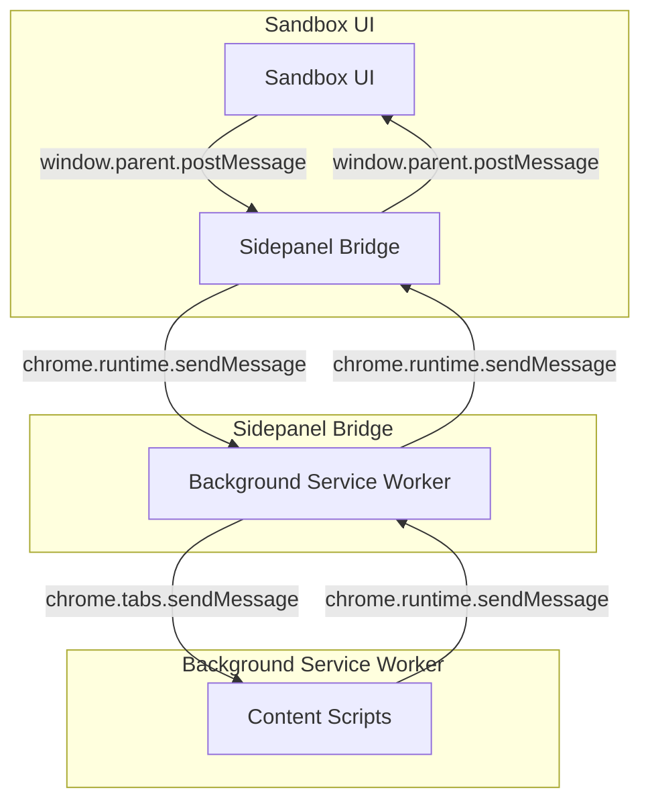
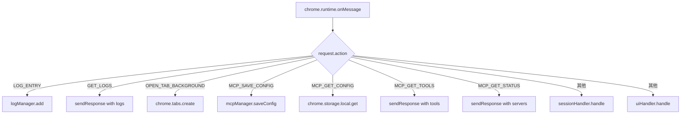
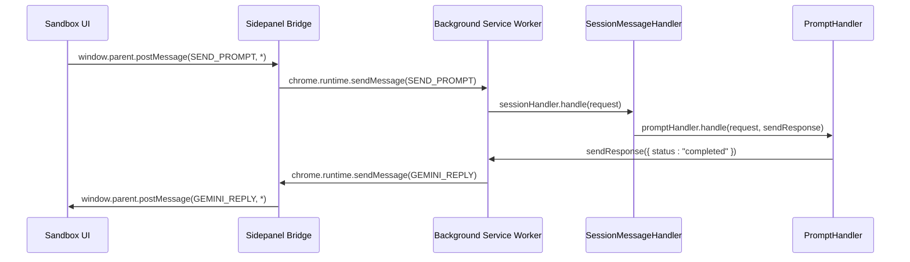

# 消息通信协议

<cite>
**本文档引用的文件**   
- [background/messages.js](file://background/messages.js)
- [sandbox/boot/messaging.js](file://sandbox/boot/messaging.js)
- [lib/messaging.js](file://lib/messaging.js)
- [background/index.js](file://background/index.js)
- [background/handlers/session.js](file://background/handlers/session.js)
- [background/handlers/ui.js](file://background/handlers/ui.js)
- [sandbox/boot/app.js](file://sandbox/boot/app.js)
- [sandbox/controllers/message_handler.js](file://sandbox/controllers/message_handler.js)
- [sidepanel/index.js](file://sidepanel/index.js)
</cite>

## 目录
1. [简介](#简介)
2. [通信架构概述](#通信架构概述)
3. [核心通信机制](#核心通信机制)
4. [消息路由机制](#消息路由机制)
5. [核心消息类型](#核心消息类型)
6. [消息处理流程](#消息处理流程)
7. [消息拦截与错误处理](#消息拦截与错误处理)
8. [安全考虑](#安全考虑)
9. [最佳实践](#最佳实践)
10. [附录](#附录)

## 简介
Gemini Nexus 扩展采用复杂的双向消息通信机制，连接 background service worker 与 sandbox UI 环境。该协议确保了用户界面与后台服务之间的高效、安全交互，支持会话管理、内容生成、图像处理和用户偏好同步等多种功能。本协议文档详细说明了 `chrome.runtime.sendMessage` 和 `window.postMessage` 两种通信方式的使用场景、消息路由机制、核心消息类型及其处理流程。

**Section sources**
- [background/index.js](file://background/index.js#L1-L30)
- [sandbox/boot/app.js](file://sandbox/boot/app.js#L1-L90)

## 通信架构概述
Gemini Nexus 的消息通信架构采用分层设计，通过 `sidepanel/index.js` 作为中间桥接层，协调 background service worker 与 sandbox UI 环境之间的消息传递。background service worker 作为核心处理单元，负责监听和处理来自 sandbox 的请求，而 sandbox UI 环境则通过 `window.parent.postMessage` 向 background 发送消息。`sidepanel/index.js` 负责验证消息来源并转发消息，确保通信的安全性和可靠性。

**Diagram sources **
- [sidepanel/index.js](file://sidepanel/index.js#L1-L425)
- [background/index.js](file://background/index.js#L1-L30)

**Section sources**
- [sidepanel/index.js](file://sidepanel/index.js#L1-L425)
- [background/index.js](file://background/index.js#L1-L30)

## 核心通信机制
Gemini Nexus 的核心通信机制依赖于 `chrome.runtime.sendMessage` 和 `window.postMessage` 两种方式。background service worker 通过 `chrome.runtime.onMessage` 监听来自 sandbox 的请求，而 sandbox 通过 `window.parent.postMessage` 向 background 发送消息。`sidepanel/index.js` 作为中间桥接层，负责验证消息来源并转发消息，确保通信的安全性和可靠性。

### Background 到 Sandbox 的通信
background service worker 使用 `chrome.runtime.sendMessage` 向 sandbox 发送消息。`sidepanel/index.js` 监听这些消息，并通过 `window.parent.postMessage` 将其转发到 sandbox。例如，当需要更新会话状态时，background 会发送 `SESSIONS_UPDATED` 消息，`sidepanel/index.js` 将其转发到 sandbox，sandbox 的 `AppMessageBridge` 处理该消息并更新 UI。

**Section sources**
- [sidepanel/index.js](file://sidepanel/index.js#L406-L424)
- [sandbox/boot/messaging.js](file://sandbox/boot/messaging.js#L29-L89)

### Sandbox 到 Background 的通信
sandbox 使用 `window.parent.postMessage` 向 `sidepanel/index.js` 发送消息。`sidepanel/index.js` 验证消息来源后，使用 `chrome.runtime.sendMessage` 将其转发到 background。例如，当用户点击“发送”按钮时，sandbox 会发送 `SEND_PROMPT` 消息，`sidepanel/index.js` 将其转发到 background，background 的 `SessionMessageHandler` 处理该消息并执行相应的操作。

**Section sources**
- [lib/messaging.js](file://lib/messaging.js#L4-L96)
- [sidepanel/index.js](file://sidepanel/index.js#L180-L196)

## 消息路由机制
消息路由机制是 Gemini Nexus 消息通信协议的核心。`setupMessageListener` 函数在 `background/messages.js` 中定义，负责根据 `request.action` 将消息分发给不同的处理器。主要处理器包括 `SessionMessageHandler` 和 `UIMessageHandler`，分别处理会话相关和 UI 相关的消息。

**Diagram sources **
- [background/messages.js](file://background/messages.js#L14-L81)

**Section sources**
- [background/messages.js](file://background/messages.js#L14-L81)

## 核心消息类型
Gemini Nexus 定义了多种核心消息类型，用于支持不同的功能。以下是一些关键消息类型及其消息结构和处理流程。

### SEND_PROMPT
`SEND_PROMPT` 消息用于发送用户输入的提示到 background，触发 Gemini API 调用。消息结构包括 `action`、`text`、`files`、`model` 等字段。`SessionMessageHandler` 处理该消息，调用 `PromptHandler` 执行提示。

**Section sources**
- [background/handlers/session.js](file://background/handlers/session.js#L17-L19)
- [background/handlers/session/prompt_handler.js](file://background/handlers/session/prompt_handler.js#L13-L103)

### CANCEL_PROMPT
`CANCEL_PROMPT` 消息用于取消当前的提示请求。消息结构仅包含 `action` 字段。`SessionMessageHandler` 处理该消息，调用 `sessionManager.cancelCurrentRequest` 取消请求。

**Section sources**
- [background/handlers/session.js](file://background/handlers/session.js#L38-L41)

### RESTORE_SESSIONS
`RESTORE_SESSIONS` 消息用于从 storage 中恢复会话数据。消息结构包含 `action` 和 `payload` 字段，`payload` 为会话数组。`sidepanel/index.js` 处理该消息，将会话数据通过 `window.parent.postMessage` 发送到 sandbox。

**Section sources**
- [sidepanel/index.js](file://sidepanel/index.js#L60-L63)
- [sandbox/boot/messaging.js](file://sandbox/boot/messaging.js#L49-L88)

### SAVE_SESSIONS
`SAVE_SESSIONS` 消息用于将会话数据保存到 storage。消息结构包含 `action` 和 `payload` 字段，`payload` 为会话数组。`sidepanel/index.js` 处理该消息，调用 `chrome.storage.local.set` 保存数据。

**Section sources**
- [lib/messaging.js](file://lib/messaging.js#L11-L16)
- [sidepanel/index.js](file://sidepanel/index.js#L295-L298)

## 消息处理流程
消息处理流程涉及多个组件的协同工作。当 sandbox 发送消息时，`sidepanel/index.js` 验证消息来源并转发到 background。background 的 `setupMessageListener` 根据 `request.action` 将消息分发给相应的处理器。处理器执行相应的操作，并通过 `sendResponse` 或 `chrome.runtime.sendMessage` 返回结果。

**Diagram sources **
- [background/messages.js](file://background/messages.js#L22-L81)
- [background/handlers/session.js](file://background/handlers/session.js#L15-L55)
- [background/handlers/session/prompt_handler.js](file://background/handlers/session/prompt_handler.js#L13-L103)

**Section sources**
- [background/messages.js](file://background/messages.js#L22-L81)
- [background/handlers/session.js](file://background/handlers/session.js#L15-L55)
- [background/handlers/session/prompt_handler.js](file://background/handlers/session/prompt_handler.js#L13-L103)

## 消息拦截与错误处理
消息拦截和错误处理是确保系统稳定性的关键。`sidepanel/index.js` 在转发消息前验证消息来源，防止恶意消息。`background/messages.js` 中的 `setupMessageListener` 使用 `try-catch` 块捕获异常，并通过 `sendResponse` 返回错误信息。例如，当 `MCP_GET_CONFIG` 请求失败时，`mcpManager` 会返回默认配置。

**Section sources**
- [sidepanel/index.js](file://sidepanel/index.js#L151-L196)
- [background/messages.js](file://background/messages.js#L42-L55)

## 安全考虑
消息通信的安全性至关重要。`sidepanel/index.js` 通过检查 `event.source` 确保消息来自可信的 iframe。`window.parent.postMessage` 的 `targetOrigin` 参数设置为 `'*'`，但 `sidepanel/index.js` 会验证消息来源。此外，敏感数据在传输前进行序列化，防止数据泄露。

**Section sources**
- [sidepanel/index.js](file://sidepanel/index.js#L153-L154)
- [lib/messaging.js](file://lib/messaging.js#L5-L8)

## 最佳实践
- **消息验证**：始终验证消息来源，防止跨站脚本攻击。
- **错误处理**：使用 `try-catch` 块捕获异常，并提供有意义的错误信息。
- **数据序列化**：在传输敏感数据前进行序列化，确保数据完整性。
- **性能优化**：使用异步操作，避免阻塞主线程。

**Section sources**
- [sidepanel/index.js](file://sidepanel/index.js#L151-L196)
- [background/messages.js](file://background/messages.js#L24-L81)

## 附录
### 消息类型列表
- `SEND_PROMPT`: 发送用户提示
- `CANCEL_PROMPT`: 取消提示请求
- `RESTORE_SESSIONS`: 恢复会话数据
- `SAVE_SESSIONS`: 保存会话数据
- `GET_LOGS`: 获取日志
- `MCP_GET_CONFIG`: 获取 MCP 配置
- `MCP_SAVE_CONFIG`: 保存 MCP 配置
- `MCP_GET_TOOLS`: 获取 MCP 工具
- `MCP_GET_STATUS`: 获取 MCP 状态

**Section sources**
- [background/messages.js](file://background/messages.js#L25-L79)
- [sidepanel/index.js](file://sidepanel/index.js#L60-L63)