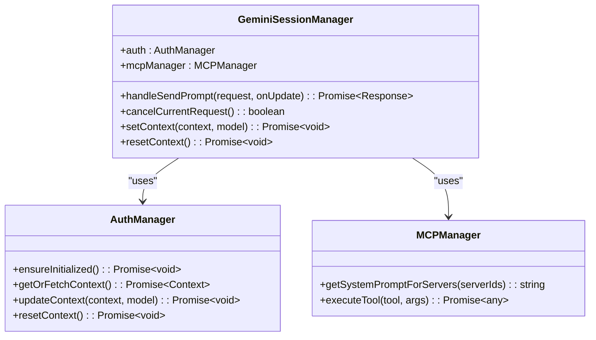
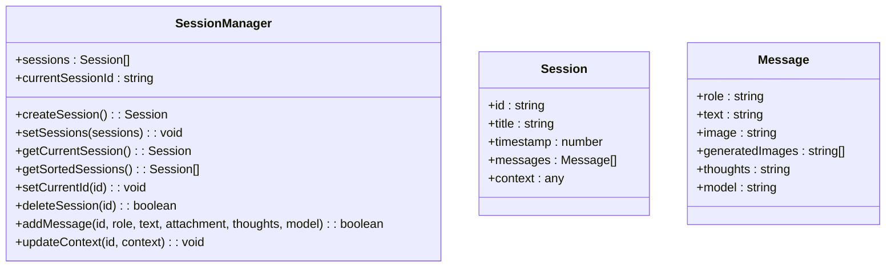
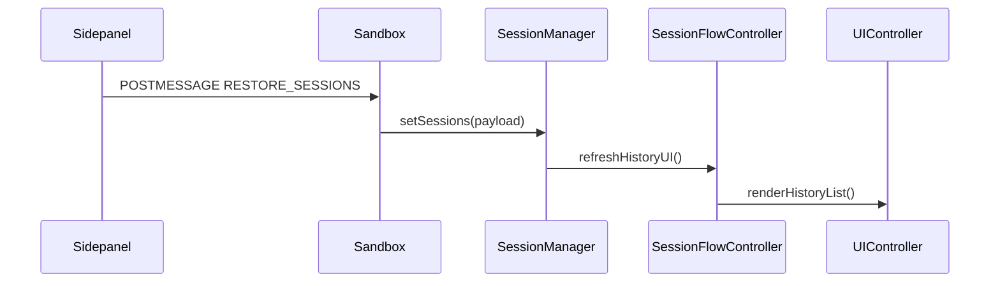
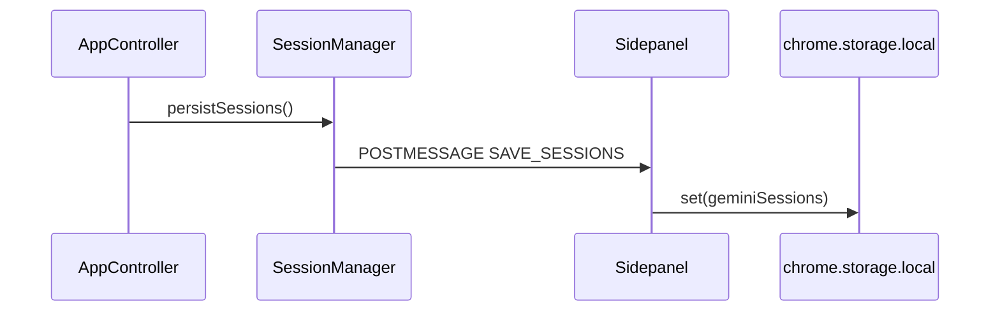
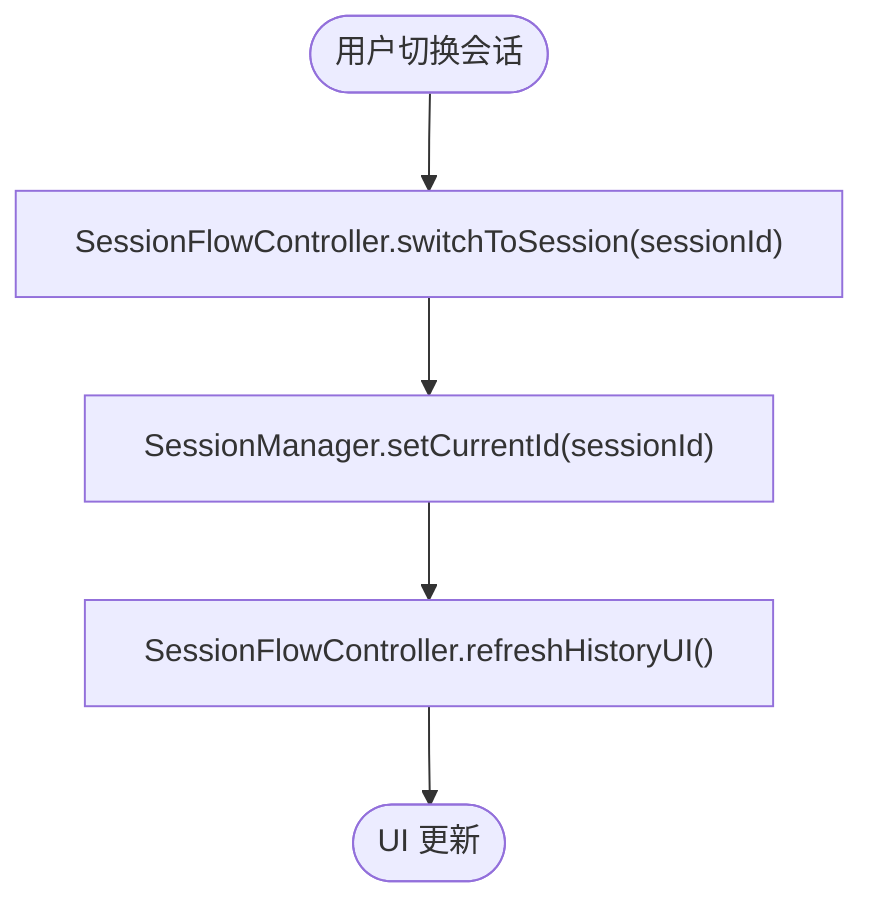
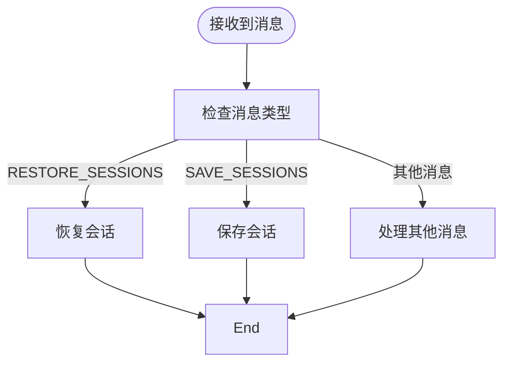
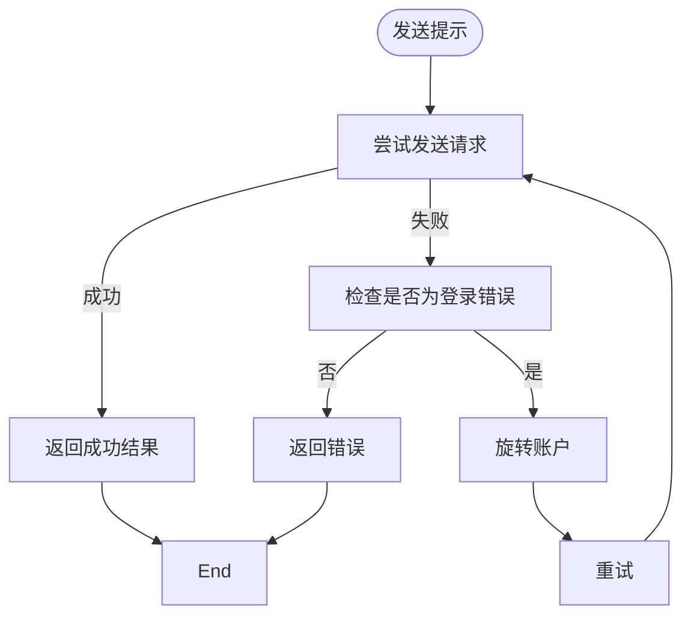
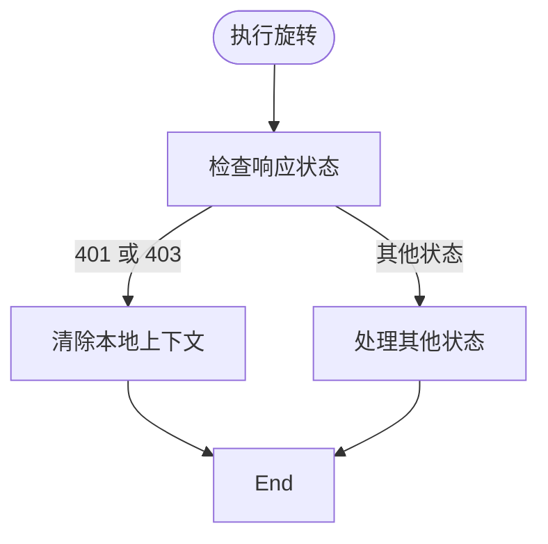
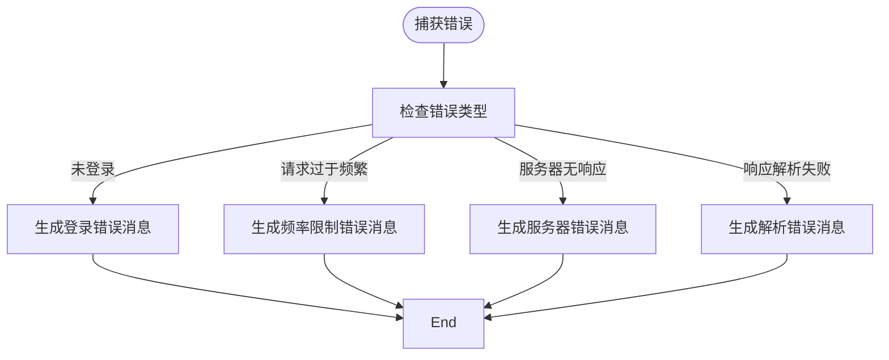
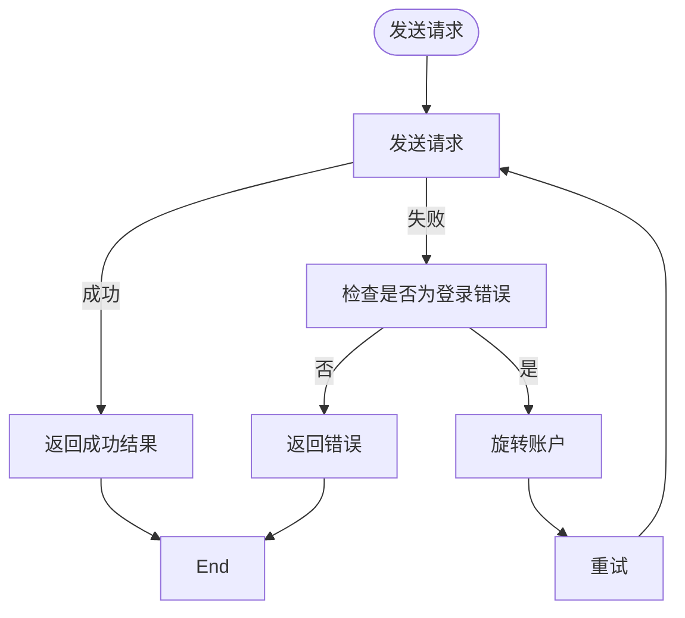

# 状态同步与数据一致性

<cite>
**本文档引用的文件**   
- [session_manager.js](file://background/managers/session_manager.js)
- [session_manager.js](file://sandbox/core/session_manager.js)
- [messages.js](file://background/messages.js)
- [messaging.js](file://sandbox/boot/messaging.js)
- [messaging.js](file://lib/messaging.js)
- [app.js](file://sandbox/boot/app.js)
- [app_controller.js](file://sandbox/controllers/app_controller.js)
- [session_flow.js](file://sandbox/controllers/session_flow.js)
- [sidepanel/index.js](file://sidepanel/index.js)
- [keep_alive.js](file://background/managers/keep_alive.js)
</cite>

## 目录
1. [项目结构](#项目结构)
2. [核心组件](#核心组件)
3. [状态同步机制](#状态同步机制)
4. [数据一致性保障](#数据一致性保障)
5. [错误处理与重试机制](#错误处理与重试机制)
6. [结论](#结论)

## 项目结构

Gemini Nexus 项目采用分层架构，将后台逻辑与沙箱环境分离，以确保安全性和可维护性。项目主要分为以下几个部分：

- **background**: 包含与 Gemini API 交互和业务逻辑处理的核心组件。
- **sandbox**: 负责本地状态存储和 UI 状态管理。
- **content**: 包含工具栏、UI 组件和事件处理。
- **css**: 样式文件。
- **lib**: 工具函数和常量。
- **services**: API 服务。
- **sidepanel**: 侧边栏界面。

```mermaid
graph TD
subgraph "Background"
A[GeminiSessionManager] --> B[AuthManager]
A --> C[MCPManager]
A --> D[sendGeminiMessage]
end
subgraph "Sandbox"
E[SessionManager] --> F[UIController]
E --> G[AppController]
end
A < --> |消息通信| E
```

**Diagram sources**
- [session_manager.js](file://background/managers/session_manager.js)
- [session_manager.js](file://sandbox/core/session_manager.js)

**Section sources**
- [session_manager.js](file://background/managers/session_manager.js)
- [session_manager.js](file://sandbox/core/session_manager.js)

## 核心组件

### GeminiSessionManager (Background)

`GeminiSessionManager` 是后台环境中的核心组件，负责与 Gemini API 交互和处理业务逻辑。它通过 `AuthManager` 管理认证状态，并使用 `MCPManager` 执行工具调用。



**Diagram sources**
- [session_manager.js](file://background/managers/session_manager.js)
- [auth_manager.js](file://background/managers/auth_manager.js)
- [mcp_manager.js](file://background/managers/mcp_manager.js)

**Section sources**
- [session_manager.js](file://background/managers/session_manager.js)

### SessionManager (Sandbox)

`SessionManager` 是沙箱环境中的核心组件，负责本地状态存储和 UI 状态管理。它管理会话列表、当前会话 ID 和会话数据。



**Diagram sources**
- [session_manager.js](file://sandbox/core/session_manager.js)

**Section sources**
- [session_manager.js](file://sandbox/core/session_manager.js)

## 状态同步机制

### 会话数据同步流程

会话数据的同步流程主要包括两个阶段：沙箱启动时的恢复和用户操作后的持久化。

#### 沙箱启动时的恢复

当沙箱启动时，通过 `RESTORE_SESSIONS` 消息从后台恢复会话列表。这一过程由 `sidepanel/index.js` 中的 `trySendInitData` 函数触发。



**Diagram sources**
- [sidepanel/index.js](file://sidepanel/index.js)
- [app_controller.js](file://sandbox/controllers/app_controller.js)
- [session_flow.js](file://sandbox/controllers/session_flow.js)

**Section sources**
- [sidepanel/index.js](file://sidepanel/index.js)
- [app_controller.js](file://sandbox/controllers/app_controller.js)

#### 用户操作后的持久化

用户操作后，通过 `SAVE_SESSIONS` 消息将数据持久化到本地存储。这一过程由 `lib/messaging.js` 中的 `saveSessionsToStorage` 函数触发。



**Diagram sources**
- [app_controller.js](file://sandbox/controllers/app_controller.js)
- [messaging.js](file://lib/messaging.js)
- [sidepanel/index.js](file://sidepanel/index.js)

**Section sources**
- [app_controller.js](file://sandbox/controllers/app_controller.js)
- [messaging.js](file://lib/messaging.js)

### currentSessionId 同步机制

`currentSessionId` 的同步通过 `switchToSession` 方法实现。当用户切换会话时，`SessionFlowController` 调用 `SessionManager` 的 `setCurrentId` 方法更新当前会话 ID。



**Diagram sources**
- [session_flow.js](file://sandbox/controllers/session_flow.js)
- [session_manager.js](file://sandbox/core/session_manager.js)

**Section sources**
- [session_flow.js](file://sandbox/controllers/session_flow.js)

## 数据一致性保障

### 操作排队

为了确保数据一致性，系统采用了操作排队机制。例如，在 `AppController` 中，`handleIncomingMessage` 方法处理消息时，会根据消息类型进行相应的操作。



**Diagram sources**
- [app_controller.js](file://sandbox/controllers/app_controller.js)

**Section sources**
- [app_controller.js](file://sandbox/controllers/app_controller.js)

### 错误重试

在 `GeminiSessionManager` 中，`handleSendPrompt` 方法实现了错误重试机制。当请求失败时，系统会尝试旋转账户并重试。



**Diagram sources**
- [session_manager.js](file://background/managers/session_manager.js)

**Section sources**
- [session_manager.js](file://background/managers/session_manager.js)

### 状态回滚

在 `keep_alive.js` 中，`KeepAliveManager` 实现了状态回滚机制。当会话过期时，系统会清除本地上下文，以便下次用户操作时触发新的认证检查。



**Diagram sources**
- [keep_alive.js](file://background/managers/keep_alive.js)

**Section sources**
- [keep_alive.js](file://background/managers/keep_alive.js)

## 错误处理与重试机制

### 错误处理

系统在多个层面实现了错误处理机制。例如，在 `GeminiSessionManager` 的 `handleSendPrompt` 方法中，捕获到错误后会根据错误类型生成相应的错误消息。



**Diagram sources**
- [session_manager.js](file://background/managers/session_manager.js)

**Section sources**
- [session_manager.js](file://background/managers/session_manager.js)

### 重试机制

重试机制主要体现在 `handleSendPrompt` 方法中。当遇到登录错误时，系统会尝试旋转账户并重试请求。



**Diagram sources**
- [session_manager.js](file://background/managers/session_manager.js)

**Section sources**
- [session_manager.js](file://background/managers/session_manager.js)

## 结论

Gemini Nexus 项目通过 `GeminiSessionManager` 和 `SessionManager` 分别在后台和沙箱环境中实现了状态同步与数据一致性。`GeminiSessionManager` 负责与 Gemini API 交互和业务逻辑处理，而 `SessionManager` 负责本地状态存储和 UI 状态管理。通过 `RESTORE_SESSIONS` 和 `SAVE_SESSIONS` 消息，系统实现了会话数据的同步。此外，系统还通过操作排队、错误重试和状态回滚机制保障了数据的一致性。这些机制共同确保了用户在不同环境下的体验一致性和数据可靠性。