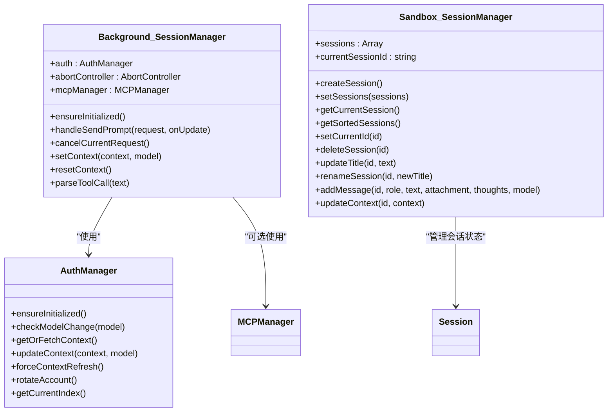
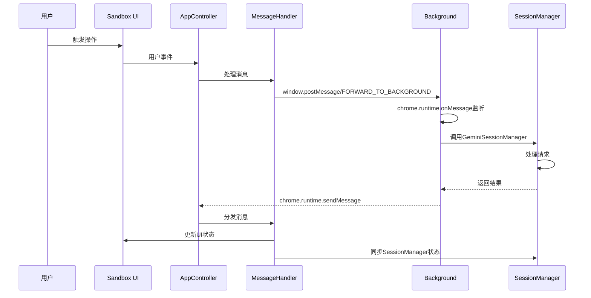
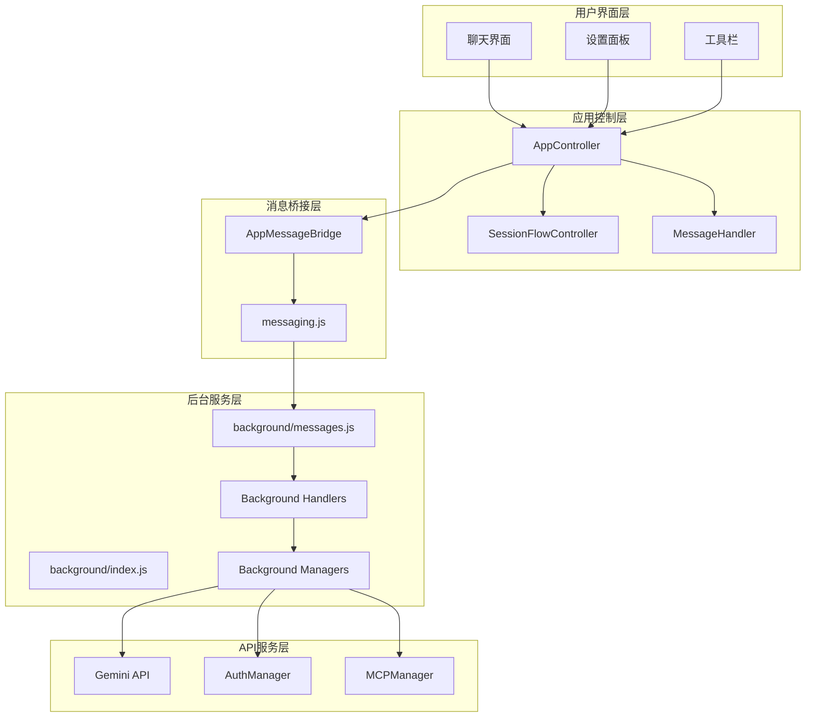
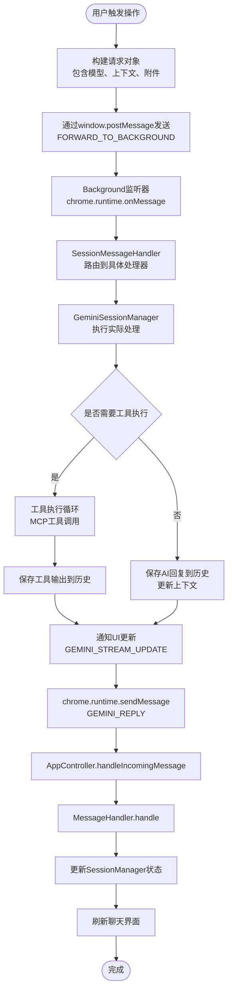
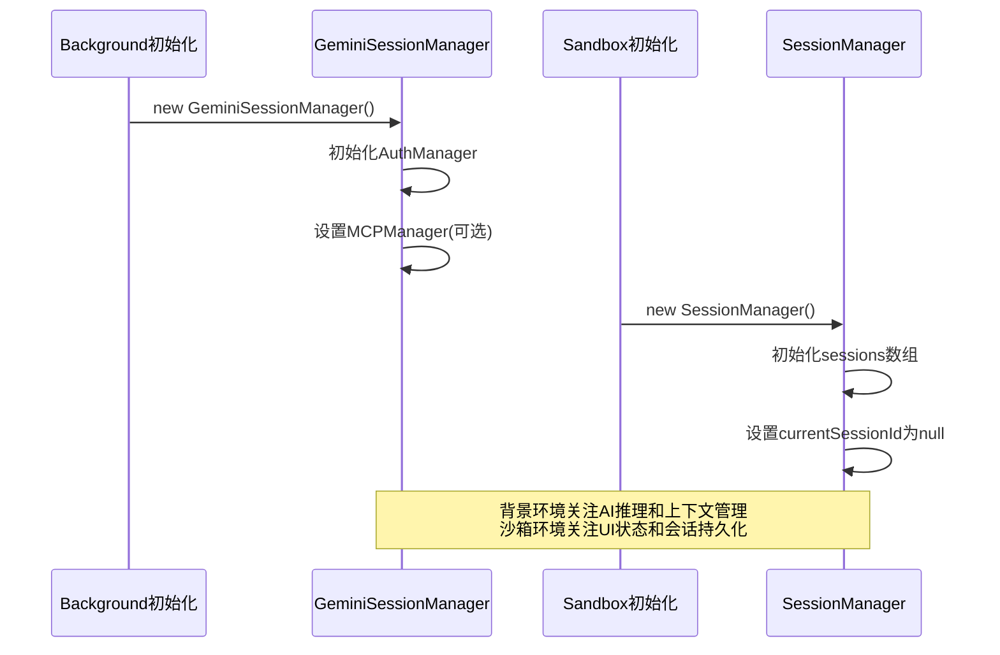
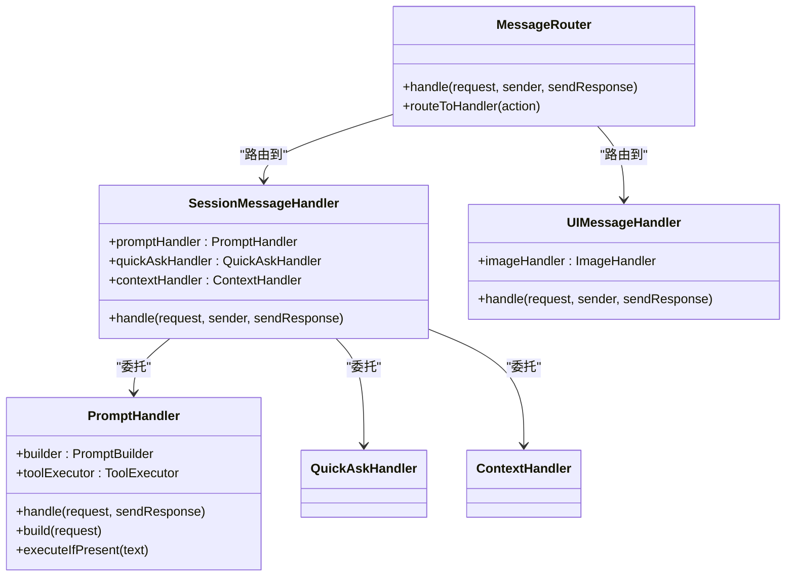

# 跨环境数据流

<cite>
**本文档引用的文件**
- [background/index.js](file://background/index.js)
- [sandbox/boot/app.js](file://sandbox/boot/app.js)
- [lib/messaging.js](file://lib/messaging.js)
- [sandbox/boot/messaging.js](file://sandbox/boot/messaging.js)
- [background/managers/session_manager.js](file://background/managers/session_manager.js)
- [sandbox/core/session_manager.js](file://sandbox/core/session_manager.js)
- [background/messages.js](file://background/messages.js)
- [sandbox/controllers/app_controller.js](file://sandbox/controllers/app_controller.js)
- [sandbox/controllers/message_handler.js](file://sandbox/controllers/message_handler.js)
- [background/handlers/session.js](file://background/handlers/session.js)
- [background/handlers/session/prompt_handler.js](file://background/handlers/session/prompt_handler.js)
- [sandbox/controllers/session_flow.js](file://sandbox/controllers/session_flow.js)
- [manifest.json](file://manifest.json)
</cite>

## 目录
1. [简介](#简介)
2. [项目结构](#项目结构)
3. [核心组件](#核心组件)
4. [架构总览](#架构总览)
5. [详细组件分析](#详细组件分析)
6. [依赖关系分析](#依赖关系分析)
7. [性能考虑](#性能考虑)
8. [故障排除指南](#故障排除指南)
9. [结论](#结论)

## 简介
本文件系统性描述Gemini Nexus在background service worker与sandbox UI环境之间的跨环境数据流机制。重点分析两个环境中SessionManager的实例化过程（background/index.js中的new GeminiSessionManager()和sandbox/boot/app.js中的new SessionManager()），并解释它们如何通过chrome.runtime.sendMessage和window.postMessage机制进行通信。详细说明数据流路径：用户在sandbox中触发操作→AppController通过messaging.js发送消息至background→background的SessionMessageHandler处理请求并调用GeminiSessionManager→处理结果通过消息返回sandbox→MessageHandler更新sandbox的SessionManager状态并刷新UI。通过序列图清晰展示这一双向通信流程，强调数据一致性维护和状态同步的关键点。

## 项目结构
Gemini Nexus采用Chrome Extension Manifest V3架构，包含以下关键模块：
- background：服务端逻辑，负责与Gemini API交互、会话管理、消息路由
- sandbox：隔离的UI环境，提供聊天界面和用户交互
- content：内容脚本，处理页面上下文和工具栏功能
- lib：共享库函数，包括消息传递封装
- services：API服务层，封装Gemini API调用

```mermaid
graph TB
subgraph "扩展宿主环境"
BG[Background Service Worker]
SB[Sandbox UI]
CS[Content Scripts]
end
subgraph "后台模块"
BM[Background Managers]
BH[Background Handlers]
MS[Message System]
end
subgraph "沙箱模块"
SM[Sandbox Managers]
SC[Sandbox Controllers]
SH[Sandbox Handlers]
end
BG --> BM
BG --> BH
BG --> MS
SB --> SM
SB --> SC
SB --> SH
CS --> BG
CS --> SB
SM -.->|window.postMessage|-. SB
BM -.->|chrome.runtime.sendMessage|-. BG
SC -.->|window.postMessage|-. SB
SH -.->|chrome.runtime.sendMessage|-. BG
```

**图表来源**
- [manifest.json](file://manifest.json#L11-L39)
- [background/index.js](file://background/index.js#L1-L30)
- [sandbox/boot/app.js](file://sandbox/boot/app.js#L1-L90)

**章节来源**
- [manifest.json](file://manifest.json#L1-L93)
- [background/index.js](file://background/index.js#L1-L30)
- [sandbox/boot/app.js](file://sandbox/boot/app.js#L1-L90)

## 核心组件
本节深入分析跨环境数据流的核心组件及其职责分工。

### SessionManager组件对比
两个环境中的SessionManager承担不同的职责，但保持一致的数据结构：



**图表来源**
- [background/managers/session_manager.js](file://background/managers/session_manager.js#L6-L285)
- [sandbox/core/session_manager.js](file://sandbox/core/session_manager.js#L5-L105)

### 消息传递机制
系统采用双通道消息传递机制：



**图表来源**
- [sandbox/controllers/app_controller.js](file://sandbox/controllers/app_controller.js#L129-L192)
- [background/messages.js](file://background/messages.js#L22-L80)
- [background/managers/session_manager.js](file://background/managers/session_manager.js#L21-L202)

**章节来源**
- [background/managers/session_manager.js](file://background/managers/session_manager.js#L1-L285)
- [sandbox/core/session_manager.js](file://sandbox/core/session_manager.js#L1-L105)
- [lib/messaging.js](file://lib/messaging.js#L1-L96)
- [sandbox/boot/messaging.js](file://sandbox/boot/messaging.js#L1-L90)

## 架构总览
Gemini Nexus采用分层架构设计，确保前后端职责分离和数据一致性。



**图表来源**
- [sandbox/boot/app.js](file://sandbox/boot/app.js#L11-L89)
- [background/index.js](file://background/index.js#L16-L29)
- [background/messages.js](file://background/messages.js#L14-L81)

## 详细组件分析

### 数据流处理流程
用户操作到结果返回的完整数据流如下：



**图表来源**
- [background/handlers/session/prompt_handler.js](file://background/handlers/session/prompt_handler.js#L13-L101)
- [sandbox/controllers/message_handler.js](file://sandbox/controllers/message_handler.js#L17-L86)

### 会话管理器实例化过程
两个环境中的SessionManager实例化体现了不同的设计目标：



**图表来源**
- [background/index.js](file://background/index.js#L17-L21)
- [sandbox/boot/app.js](file://sandbox/boot/app.js#L48-L49)
- [background/managers/session_manager.js](file://background/managers/session_manager.js#L7-L15)
- [sandbox/core/session_manager.js](file://sandbox/core/session_manager.js#L6-L9)

**章节来源**
- [background/index.js](file://background/index.js#L16-L21)
- [sandbox/boot/app.js](file://sandbox/boot/app.js#L48-L49)
- [background/managers/session_manager.js](file://background/managers/session_manager.js#L6-L20)
- [sandbox/core/session_manager.js](file://sandbox/core/session_manager.js#L5-L10)

### 消息路由机制
系统实现了灵活的消息路由机制，支持多种消息类型：



**图表来源**
- [background/messages.js](file://background/messages.js#L14-L81)
- [background/handlers/session.js](file://background/handlers/session.js#L7-L55)

**章节来源**
- [background/messages.js](file://background/messages.js#L1-L82)
- [background/handlers/session.js](file://background/handlers/session.js#L1-L56)

## 依赖关系分析
系统各组件间存在清晰的依赖关系，遵循单一职责原则：

```mermaid
graph TB
subgraph "沙箱环境依赖"
SBApp[app.js] --> SBSessionMgr[sandbox/core/session_manager.js]
SBApp --> SBAppCtrl[sandbox/controllers/app_controller.js]
SBApp --> SBMsgBridge[sandbox/boot/messaging.js]
SBApp --> LibMsg[lib/messaging.js]
SBAppCtrl --> SBSessionFlow[sandbox/controllers/session_flow.js]
SBAppCtrl --> SBMsgHandler[sandbox/controllers/message_handler.js]
SBSessionFlow --> SBSessionMgr
SBMsgHandler --> SBSessionMgr
end
subgraph "后台环境依赖"
BGIndex[background/index.js] --> BGSessionMgr[background/managers/session_manager.js]
BGIndex --> BGMsg[background/messages.js]
BGMsg --> BGSessionHandler[background/handlers/session.js]
BGSessionHandler --> BGPromptHandler[background/handlers/session/prompt_handler.js]
BGSessionMgr --> GeminiAPI[services/gemini_api.js]
BGSessionMgr --> AuthMgr[background/managers/auth_manager.js]
end
LibMsg -.->|window.postMessage|-. SBApp
BGMsg -.->|chrome.runtime.sendMessage|-. SBAppCtrl
```

**图表来源**
- [sandbox/boot/app.js](file://sandbox/boot/app.js#L1-L90)
- [background/index.js](file://background/index.js#L1-L30)
- [lib/messaging.js](file://lib/messaging.js#L1-L96)

**章节来源**
- [sandbox/boot/app.js](file://sandbox/boot/app.js#L1-L90)
- [background/index.js](file://background/index.js#L1-L30)
- [lib/messaging.js](file://lib/messaging.js#L1-L96)

## 性能考虑
系统在多个层面进行了性能优化：

### 流式响应处理
- 使用AbortController支持请求取消，避免资源浪费
- 实现增量更新机制，实时显示生成进度
- 工具执行循环限制最大迭代次数，防止无限循环

### 缓存和状态同步
- 会话状态本地存储，减少重复计算
- 上下文缓存机制，避免重复获取
- 双向状态同步，确保UI与后台状态一致

### 错误处理和重试
- 多账户轮换机制，提高可用性
- 智能错误分类和用户友好提示
- 自动重试和降级策略

## 故障排除指南
常见问题及解决方案：

### 消息传递问题
- **症状**：消息无法到达或接收
- **排查**：检查window.postMessage的目标源和chrome.runtime.sendMessage的权限配置
- **解决**：确认manifest.json中的permissions和host_permissions配置

### 会话状态不一致
- **症状**：UI显示与后台状态不符
- **排查**：检查SessionManager的状态同步逻辑
- **解决**：确保所有状态变更都通过MessageHandler正确传播

### 工具执行失败
- **症状**：MCP工具调用异常
- **排查**：检查MCPManager配置和网络连接
- **解决**：验证工具服务器可达性和认证信息

**章节来源**
- [background/managers/session_manager.js](file://background/managers/session_manager.js#L129-L201)
- [sandbox/controllers/message_handler.js](file://sandbox/controllers/message_handler.js#L231-L280)

## 结论
Gemini Nexus通过精心设计的跨环境数据流机制，实现了稳定可靠的消息传递和状态同步。背景环境专注于AI推理和上下文管理，沙箱环境专注于用户界面和会话状态管理，两者通过标准化的消息协议实现松耦合集成。该架构具有良好的扩展性，能够支持未来功能增强和性能优化。

系统的关键优势包括：
- 清晰的职责分离和模块化设计
- 强大的错误处理和恢复机制  
- 高效的流式响应处理
- 完善的状态同步保障
- 灵活的消息路由机制

通过本文档的分析，开发者可以更好地理解和维护这个复杂的跨环境数据流系统。