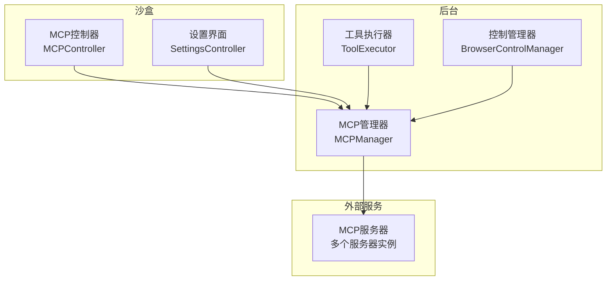
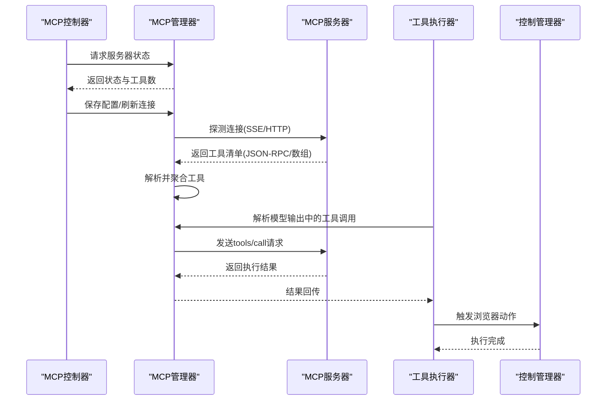
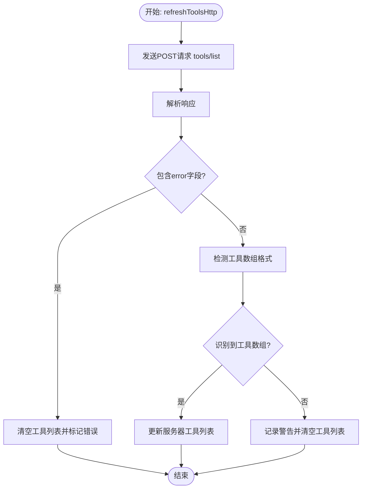
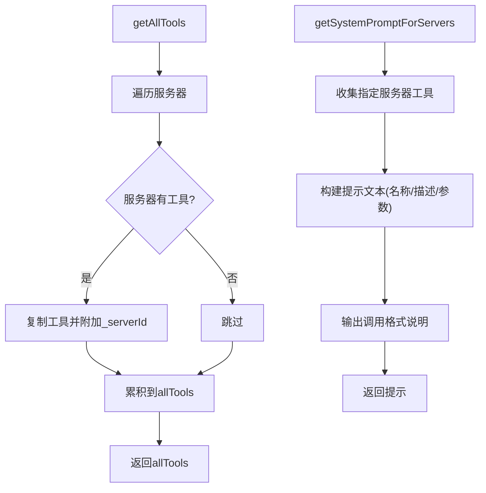
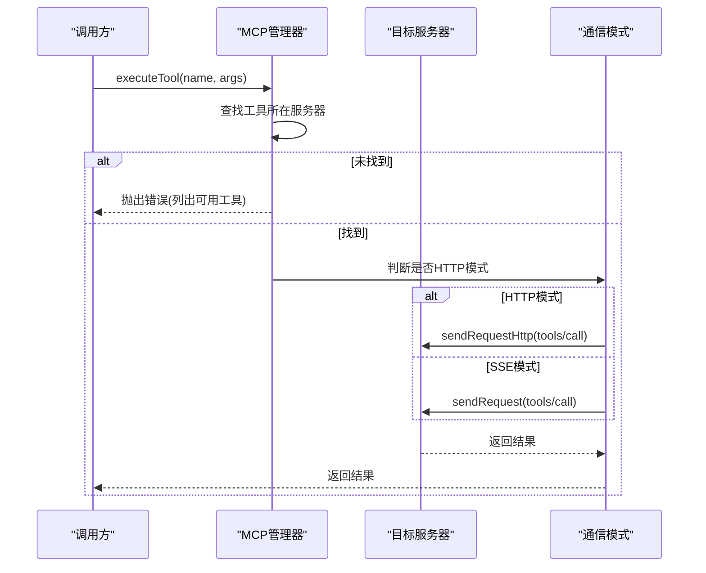
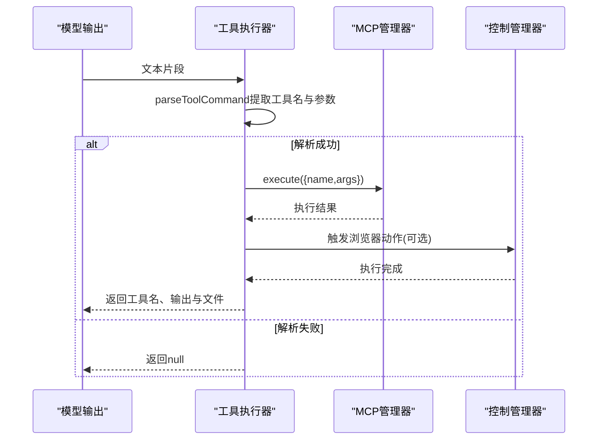
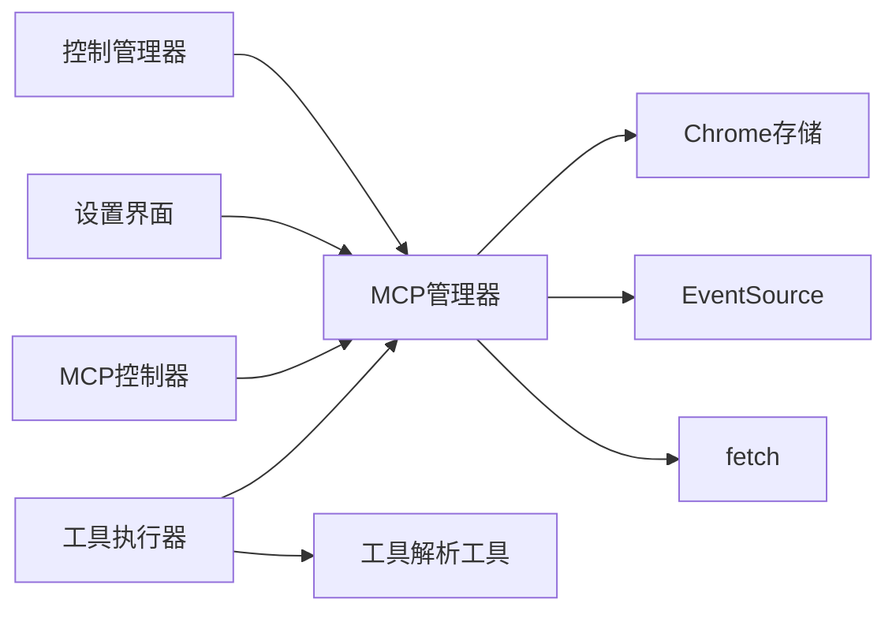

# MCP工具集成

<cite>
**本文档引用的文件**
- [mcp_manager.js](file://background/managers/mcp_manager.js)
- [mcp_controller.js](file://sandbox/controllers/mcp_controller.js)
- [tool_executor.js](file://background/handlers/session/prompt/tool_executor.js)
- [utils.js](file://background/handlers/session/utils.js)
- [control_manager.js](file://background/managers/control_manager.js)
- [settings.js](file://sandbox/ui/settings.js)
- [settings.js](file://sandbox/ui/templates/settings.js)
- [manifest.json](file://manifest.json)
</cite>

## 目录
1. [简介](#简介)
2. [项目结构](#项目结构)
3. [核心组件](#核心组件)
4. [架构总览](#架构总览)
5. [详细组件分析](#详细组件分析)
6. [依赖关系分析](#依赖关系分析)
7. [性能考虑](#性能考虑)
8. [故障排除指南](#故障排除指南)
9. [结论](#结论)

## 简介
本文件面向MCP（Model Context Protocol）工具集成，重点阐述以下能力：
- 工具发现：refreshTools与refreshToolsHttp如何通过tools/list请求从服务器获取工具清单，并兼容多种响应格式（JSON-RPC标准格式、直接tools数组等）
- 系统提示生成：getAllTools与getSystemPromptForServers如何聚合工具并生成面向Gemini对话的系统提示
- 工具执行：executeTool如何按工具名定位目标服务器，自动选择SSE或HTTP通信模式，并通过tools/call请求执行工具
- 调试方法：getDebugInfo如何查看服务器状态与工具列表，辅助问题诊断

## 项目结构
MCP集成涉及后台管理器、沙盒控制器、会话处理器、控制管理器以及设置界面等多个模块。整体采用分层设计：
- 后台层负责MCP连接、工具发现与执行
- 沙盒层负责用户交互与状态展示
- 会话层负责解析模型输出中的工具调用指令
- 控制层负责浏览器端具体动作执行

图表来源
- [mcp_manager.js](file://background/managers/mcp_manager.js#L1-L530)
- [mcp_controller.js](file://sandbox/controllers/mcp_controller.js#L1-L221)
- [tool_executor.js](file://background/handlers/session/prompt/tool_executor.js#L1-L49)
- [control_manager.js](file://background/managers/control_manager.js#L1-L159)
- [settings.js](file://sandbox/ui/settings.js#L1-L249)

章节来源
- [mcp_manager.js](file://background/managers/mcp_manager.js#L1-L530)
- [mcp_controller.js](file://sandbox/controllers/mcp_controller.js#L1-L221)
- [tool_executor.js](file://background/handlers/session/prompt/tool_executor.js#L1-L49)
- [control_manager.js](file://background/managers/control_manager.js#L1-L159)
- [settings.js](file://sandbox/ui/settings.js#L1-L249)

## 核心组件
- MCP管理器（MCPManager）：负责服务器连接、工具发现、请求发送、响应处理与调试信息导出
- MCP控制器（MCPController）：负责UI中MCP服务器的选择与状态展示
- 工具执行器（ToolExecutor）：负责解析模型输出中的工具调用指令并触发执行
- 控制管理器（BrowserControlManager）：负责浏览器端具体动作的执行（如截图、导航等）

章节来源
- [mcp_manager.js](file://background/managers/mcp_manager.js#L1-L530)
- [mcp_controller.js](file://sandbox/controllers/mcp_controller.js#L1-L221)
- [tool_executor.js](file://background/handlers/session/prompt/tool_executor.js#L1-L49)
- [control_manager.js](file://background/managers/control_manager.js#L1-L159)

## 架构总览
MCP工具集成的关键流程如下：
- 初始化：加载配置并连接已启用的服务器
- 连接探测：对SSE服务器进行探测，若返回JSON则切换到HTTP模式
- 工具发现：通过tools/list请求获取工具清单，兼容多种响应格式
- 系统提示：聚合工具生成系统提示，供Gemini对话使用
- 工具执行：根据工具名定位服务器，自动选择SSE或HTTP模式，执行tools/call

图表来源
- [mcp_manager.js](file://background/managers/mcp_manager.js#L71-L150)
- [mcp_manager.js](file://background/managers/mcp_manager.js#L153-L213)
- [mcp_manager.js](file://background/managers/mcp_manager.js#L287-L306)
- [mcp_manager.js](file://background/managers/mcp_manager.js#L479-L525)
- [tool_executor.js](file://background/handlers/session/prompt/tool_executor.js#L9-L47)
- [control_manager.js](file://background/managers/control_manager.js#L43-L157)

## 详细组件分析

### 工具发现：refreshTools与refreshToolsHttp
- 功能概述
  - refreshTools：统一入口，根据服务器类型自动选择SSE或HTTP模式进行工具发现
  - refreshToolsHttp：在HTTP模式下直接通过POST发送JSON-RPC请求tools/list，解析多种可能的响应格式
- 响应格式兼容
  - 标准JSON-RPC：result.tools
  - 直接tools数组：tools
  - result数组：result
  - 直接数组：[]
- 处理逻辑
  - 若返回错误字段，记录错误并清空工具列表
  - 若无法识别格式，记录警告并清空工具列表
  - 成功时更新服务器工具列表

图表来源
- [mcp_manager.js](file://background/managers/mcp_manager.js#L153-L213)

章节来源
- [mcp_manager.js](file://background/managers/mcp_manager.js#L153-L213)

### 工具聚合与系统提示：getAllTools与getSystemPromptForServers
- getAllTools
  - 遍历所有服务器，将每个工具复制一份并附加_serverId元数据，形成全局工具集合
- getSystemPromptForServers
  - 仅针对指定服务器ID集合生成系统提示，包含工具名称、描述与输入模式（inputSchema）
  - 提示模板强调以特定JSON代码块格式调用工具，并在调用后停止生成

图表来源
- [mcp_manager.js](file://background/managers/mcp_manager.js#L407-L420)
- [mcp_manager.js](file://background/managers/mcp_manager.js#L446-L477)

章节来源
- [mcp_manager.js](file://background/managers/mcp_manager.js#L407-L420)
- [mcp_manager.js](file://background/managers/mcp_manager.js#L446-L477)

### 工具执行：executeTool
- 查找目标服务器
  - 遍历所有服务器工具，按名称匹配定位目标服务器
  - 若未找到，汇总可用工具并抛出错误
- 通信模式选择
  - 若目标服务器处于HTTP模式，则使用sendRequestHttp；否则使用sendRequest
- 执行流程
  - 组装tools/call请求（name与arguments）
  - 发送请求并等待响应
  - 返回结果（通常包含内容与错误标志）

图表来源
- [mcp_manager.js](file://background/managers/mcp_manager.js#L479-L525)

章节来源
- [mcp_manager.js](file://background/managers/mcp_manager.js#L479-L525)

### 会话中的工具调用解析与执行
- 工具调用解析
  - ToolExecutor在会话处理器中解析模型输出中的工具调用指令
  - 使用parseToolCommand提取工具名与参数
- 执行与反馈
  - 调用控制管理器执行工具
  - 对结构化结果（如截图）进行特殊处理，返回文本与文件信息

图表来源
- [tool_executor.js](file://background/handlers/session/prompt/tool_executor.js#L9-L47)
- [utils.js](file://background/handlers/session/utils.js#L4-L21)
- [control_manager.js](file://background/managers/control_manager.js#L43-L157)

章节来源
- [tool_executor.js](file://background/handlers/session/prompt/tool_executor.js#L1-L49)
- [utils.js](file://background/handlers/session/utils.js#L1-L64)
- [control_manager.js](file://background/managers/control_manager.js#L1-L159)

### MCP控制器与设置界面
- MCP控制器
  - 负责UI中MCP服务器的选择、状态展示与标签管理
  - 通过消息传递向后台请求服务器状态
- 设置界面
  - 提供MCP配置的编辑与保存功能
  - 支持从后台读取与写入mcpConfig

章节来源
- [mcp_controller.js](file://sandbox/controllers/mcp_controller.js#L1-L221)
- [settings.js](file://sandbox/ui/settings.js#L1-L249)
- [settings.js](file://sandbox/ui/templates/settings.js#L1-L174)

## 依赖关系分析
- MCP管理器依赖
  - 浏览器存储：用于持久化mcpConfig
  - EventSource：用于SSE连接与事件监听
  - fetch：用于HTTP请求与JSON-RPC通信
- 工具执行链路
  - ToolExecutor依赖parseToolCommand解析工具调用
  - 控制管理器封装浏览器动作执行
- UI与后台通信
  - MCP控制器通过postMessage与后台交互
  - 设置界面通过消息与后台交换配置

图表来源
- [mcp_manager.js](file://background/managers/mcp_manager.js#L1-L530)
- [tool_executor.js](file://background/handlers/session/prompt/tool_executor.js#L1-L49)
- [utils.js](file://background/handlers/session/utils.js#L1-L64)
- [mcp_controller.js](file://sandbox/controllers/mcp_controller.js#L1-L221)
- [settings.js](file://sandbox/ui/settings.js#L1-L249)

章节来源
- [mcp_manager.js](file://background/managers/mcp_manager.js#L1-L530)
- [tool_executor.js](file://background/handlers/session/prompt/tool_executor.js#L1-L49)
- [utils.js](file://background/handlers/session/utils.js#L1-L64)
- [mcp_controller.js](file://sandbox/controllers/mcp_controller.js#L1-L221)
- [settings.js](file://sandbox/ui/settings.js#L1-L249)

## 性能考虑
- 连接探测与模式切换
  - SSE探测失败时自动切换至HTTP模式，避免长时间等待
- 请求超时与并发
  - 发送SSE请求时使用Promise与超时机制，防止阻塞
- 工具列表缓存
  - 在HTTP模式下立即刷新工具列表，减少后续查询成本
- UI渲染优化
  - MCP控制器仅在状态变化时重新渲染服务器列表

[本节为通用建议，不直接分析具体文件]

## 故障排除指南
- 获取调试信息
  - 使用getDebugInfo查看各服务器状态、类型、URL、POST地址与工具数量
- 常见问题定位
  - 服务器无URL/端点：检查配置项url或endpoint
  - SSE连接失败：确认服务器支持SSE且返回正确的Content-Type
  - HTTP模式工具为空：检查tools/list响应格式是否符合预期
  - 工具未找到：核对工具名称大小写与拼写，使用getAllTools查看可用工具
- 日志与下载
  - 设置界面提供下载日志功能，便于收集运行时信息

章节来源
- [mcp_manager.js](file://background/managers/mcp_manager.js#L389-L403)
- [settings.js](file://sandbox/ui/settings.js#L143-L167)

## 结论
本MCP工具集成为Gemini对话提供了强大的外部工具扩展能力。通过统一的工具发现、灵活的系统提示生成与可靠的工具执行机制，结合完善的调试与配置界面，实现了从服务器接入到工具调用的完整闭环。建议在生产环境中：
- 明确服务器类型与响应格式，确保tools/list返回一致结构
- 在系统提示中明确工具调用格式，提升模型理解与稳定性
- 定期使用调试接口监控服务器状态与工具可用性