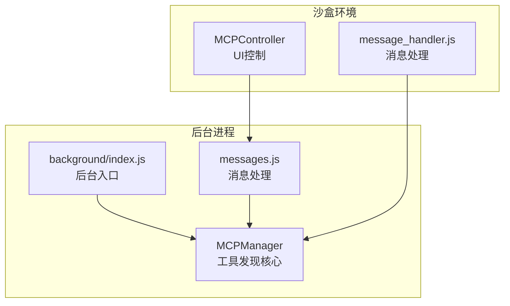
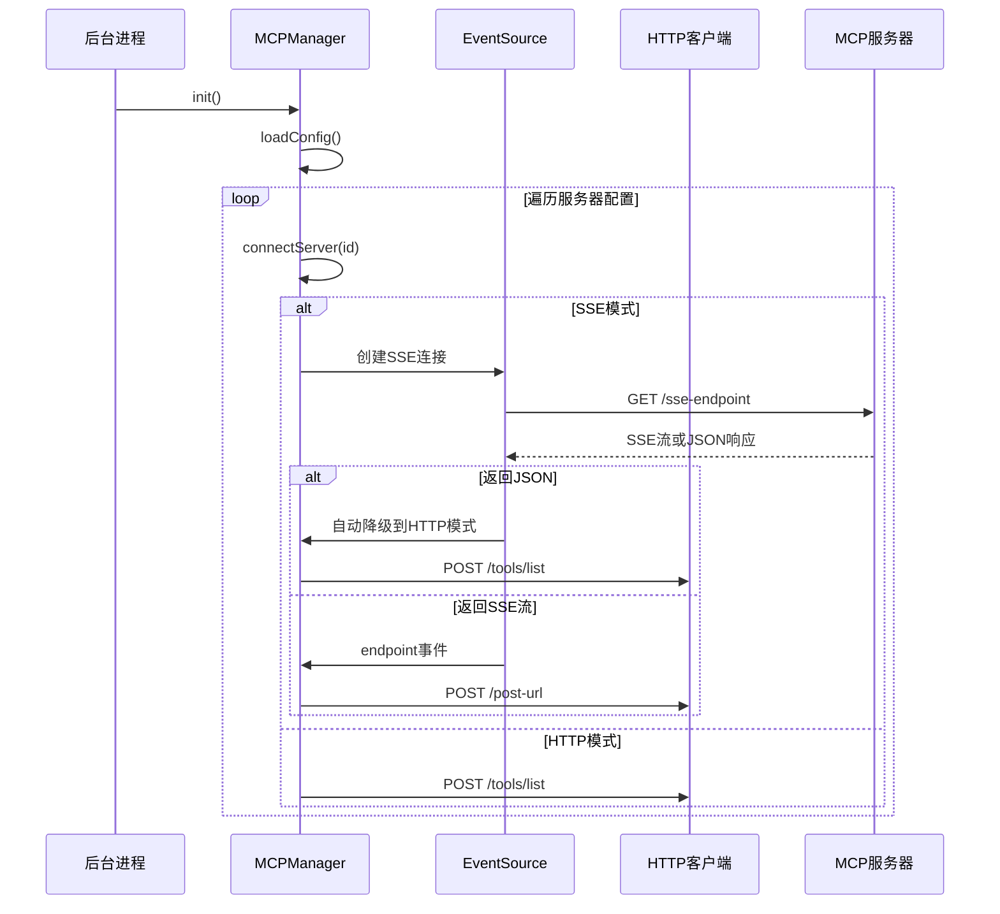
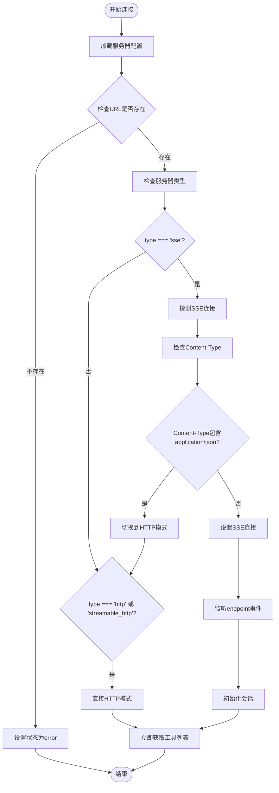
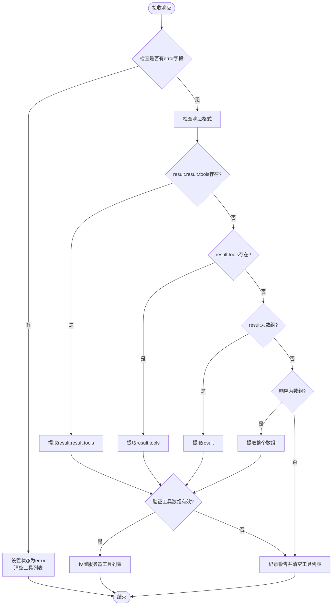
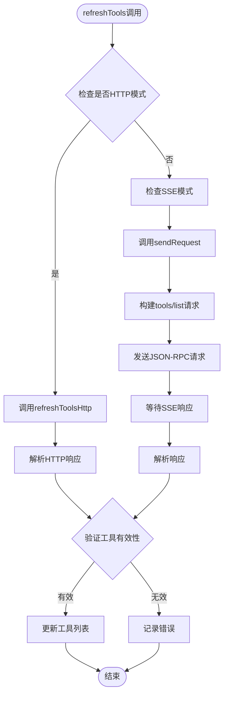
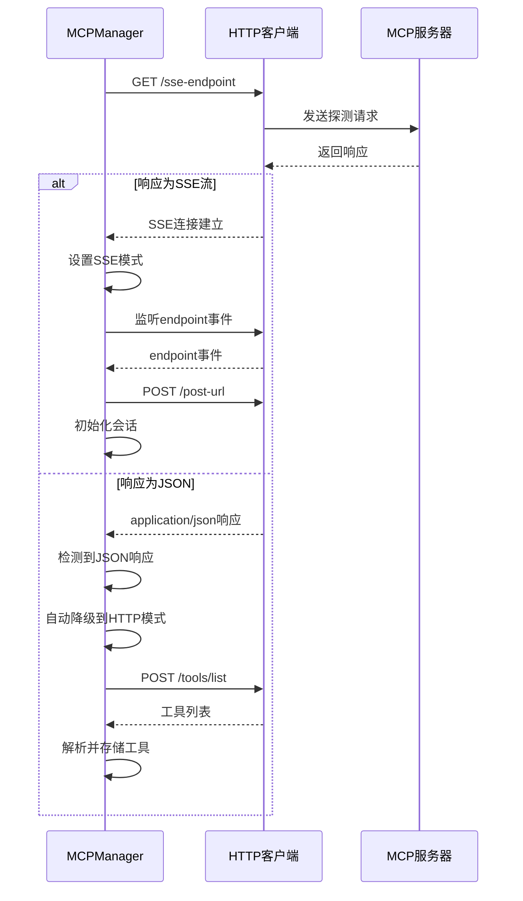
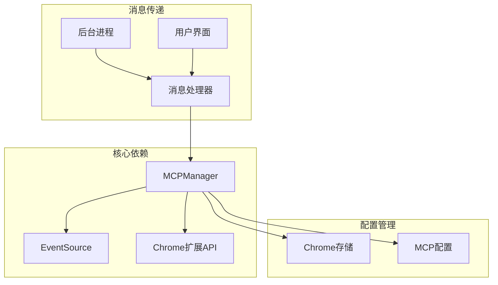
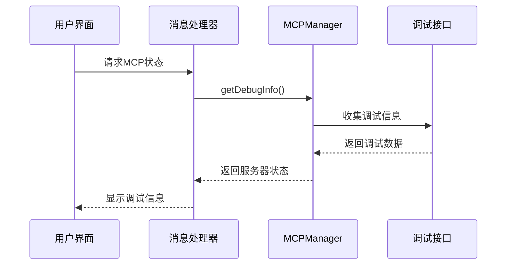

# 工具发现机制

<cite>
**本文档引用的文件**
- [mcp_manager.js](file://background/managers/mcp_manager.js)
- [messages.js](file://background/messages.js)
- [mcp_controller.js](file://sandbox/controllers/mcp_controller.js)
- [message_handler.js](file://sandbox/controllers/message_handler.js)
- [background_index.js](file://background/index.js)
</cite>

## 目录
1. [简介](#简介)
2. [项目结构](#项目结构)
3. [核心组件](#核心组件)
4. [架构概览](#架构概览)
5. [详细组件分析](#详细组件分析)
6. [依赖关系分析](#依赖关系分析)
7. [性能考虑](#性能考虑)
8. [故障排除指南](#故障排除指南)
9. [结论](#结论)

## 简介

本文档深入解析MCP（Model Context Protocol）工具发现机制，重点分析`refreshTools`和`refreshToolsHttp`方法的实现。该机制负责自动检测和连接MCP服务器，支持多种通信模式（SSE、streamable_http、http），并能够处理不同格式的工具列表响应。

系统通过`connectServer`方法初始化连接，根据服务器配置的`type`字段自动选择通信模式。当服务器返回`application/json`内容类型时，系统会自动降级到HTTP模式，确保兼容性。

## 项目结构

MCP工具发现机制分布在以下关键文件中：



**图表来源**
- [background_index.js](file://background/index.js#L1-L30)
- [mcp_manager.js](file://background/managers/mcp_manager.js#L1-L530)
- [messages.js](file://background/messages.js#L1-L82)
- [mcp_controller.js](file://sandbox/controllers/mcp_controller.js#L1-L221)
- [message_handler.js](file://sandbox/controllers/message_handler.js#L75-L113)

**章节来源**
- [background_index.js](file://background/index.js#L1-L30)
- [mcp_manager.js](file://background/managers/mcp_manager.js#L1-L530)

## 核心组件

### MCPManager类

MCPManager是工具发现机制的核心，负责：
- 服务器连接管理
- 工具列表刷新
- 多种通信模式支持
- 调试信息收集

主要方法包括：
- `connectServer()`: 初始化服务器连接
- `refreshTools()`: 刷新工具列表
- `refreshToolsHttp()`: HTTP模式下的工具刷新
- `isHttpMode()`: 检查服务器是否处于HTTP模式
- `getDebugInfo()`: 获取调试信息

**章节来源**
- [mcp_manager.js](file://background/managers/mcp_manager.js#L2-L530)

### 通信模式检测

系统支持三种通信模式：
1. **SSE模式** (`type: 'sse'`): 标准MCP协议，使用Server-Sent Events
2. **HTTP模式** (`type: 'http'`): 直接HTTP POST请求
3. **流式HTTP模式** (`type: 'streamable_http'`): 支持流式响应的HTTP模式

**章节来源**
- [mcp_manager.js](file://background/managers/mcp_manager.js#L75-L96)

## 架构概览



**图表来源**
- [mcp_manager.js](file://background/managers/mcp_manager.js#L71-L150)
- [mcp_manager.js](file://background/managers/mcp_manager.js#L152-L213)

## 详细组件分析

### connectServer方法分析

connectServer方法是工具发现机制的入口点，负责初始化服务器连接并选择合适的通信模式。

#### 连接初始化流程



**图表来源**
- [mcp_manager.js](file://background/managers/mcp_manager.js#L71-L150)

#### 服务器连接探测机制

系统实现了智能的服务器连接探测机制：

1. **SSE模式探测**: 发送GET请求并检查`Accept`头
2. **Content-Type检查**: 如果服务器返回`application/json`而非SSE流
3. **自动降级**: 将服务器切换到HTTP模式
4. **SSE流建立**: 成功时建立EventSource连接

**章节来源**
- [mcp_manager.js](file://background/managers/mcp_manager.js#L101-L113)

### refreshToolsHttp方法详解

refreshToolsHttp方法专门处理HTTP模式下的工具列表获取，支持多种响应格式。

#### JSON-RPC请求构建

```mermaid
sequenceDiagram
participant MM as MCPManager
participant HTTP as HTTP客户端
participant SV as MCP服务器
MM->>MM : refreshToolsHttp(id)
MM->>HTTP : POST /tools/list
HTTP->>HTTP : 构建JSON-RPC请求
HTTP->>SV : {
"jsonrpc" : "2.0",
"id" : "随机ID",
"method" : "tools/list",
"params" : {}
}
SV-->>HTTP : 返回工具列表
HTTP-->>MM : 解析响应
MM->>MM : 处理多种响应格式
```

**图表来源**
- [mcp_manager.js](file://background/managers/mcp_manager.js#L159-L168)

#### 响应格式处理策略

系统支持四种不同的响应格式：

| 格式 | 结构 | 用途 |
|------|------|------|
| 标准JSON-RPC | `{ "result": { "tools": [...] } }` | 完整的JSON-RPC响应 |
| 直接tools | `{ "tools": [...] }` | 简化的工具数组包装 |
| result为数组 | `{ "result": [...] }` | 直接返回工具数组 |
| 直接数组 | `[...]` | 最简化的数组格式 |



**图表来源**
- [mcp_manager.js](file://background/managers/mcp_manager.js#L181-L210)

**章节来源**
- [mcp_manager.js](file://background/managers/mcp_manager.js#L152-L213)

### refreshTools方法分析

refreshTools方法根据服务器配置决定使用哪种工具刷新方式。

#### 调用路径决策



**图表来源**
- [mcp_manager.js](file://background/managers/mcp_manager.js#L287-L306)

**章节来源**
- [mcp_manager.js](file://background/managers/mcp_manager.js#L287-L306)

### 服务器连接探测机制

系统实现了智能的服务器连接探测机制，确保与各种MCP服务器的兼容性。

#### 探测流程



**图表来源**
- [mcp_manager.js](file://background/managers/mcp_manager.js#L101-L113)

**章节来源**
- [mcp_manager.js](file://background/managers/mcp_manager.js#L101-L113)

## 依赖关系分析



**图表来源**
- [mcp_manager.js](file://background/managers/mcp_manager.js#L1-L530)
- [messages.js](file://background/messages.js#L1-L82)

**章节来源**
- [mcp_manager.js](file://background/managers/mcp_manager.js#L1-L530)
- [messages.js](file://background/messages.js#L1-L82)

## 性能考虑

### 连接优化策略

1. **延迟初始化**: 仅在需要时建立SSE连接
2. **自动降级**: 当服务器不支持SSE时自动切换到HTTP模式
3. **缓存机制**: 已连接的服务器状态会被缓存
4. **超时处理**: 请求超时时间为10秒

### 内存管理

- 使用`disconnectAll()`方法清理EventSource连接
- 及时清理pending请求映射
- 合理的错误状态管理

## 故障排除指南

### 调试信息获取

系统提供了完整的调试接口，可通过`getDebugInfo()`方法获取服务器状态和工具列表信息。

#### 调试信息结构

| 字段 | 类型 | 描述 |
|------|------|------|
| status | string | 服务器连接状态 |
| type | string | 服务器类型 (sse/http/streamable_http) |
| url | string | 服务器URL |
| postUrl | string | POST端点URL |
| toolCount | number | 工具数量 |
| tools | array | 工具名称列表 |

#### 调试信息访问流程



**图表来源**
- [messages.js](file://background/messages.js#L63-L67)
- [mcp_manager.js](file://background/managers/mcp_manager.js#L389-L403)

**章节来源**
- [mcp_manager.js](file://background/managers/mcp_manager.js#L389-L403)
- [messages.js](file://background/messages.js#L63-L67)

### 常见问题诊断

1. **服务器无法连接**
   - 检查服务器URL配置
   - 查看浏览器开发者工具网络面板
   - 验证服务器是否支持MCP协议

2. **工具列表为空**
   - 确认服务器已正确配置工具
   - 检查服务器响应格式
   - 使用调试接口查看具体错误

3. **SSE连接失败**
   - 服务器可能不支持SSE
   - 系统会自动降级到HTTP模式
   - 检查服务器日志

## 结论

MCP工具发现机制通过智能的连接管理和多格式响应处理，实现了对不同类型MCP服务器的广泛兼容性。其核心优势包括：

1. **自动模式选择**: 根据服务器能力自动选择最优通信模式
2. **灵活响应处理**: 支持多种JSON-RPC响应格式
3. **完善的调试支持**: 提供详细的服务器状态和工具信息
4. **健壮的错误处理**: 包容性设计确保与各种服务器的兼容

该机制为Gemini Nexus应用提供了可靠的MCP工具集成基础，支持用户在不同MCP服务器间无缝切换和使用。