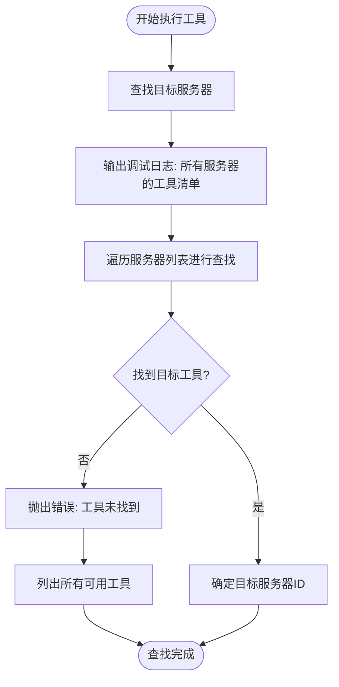
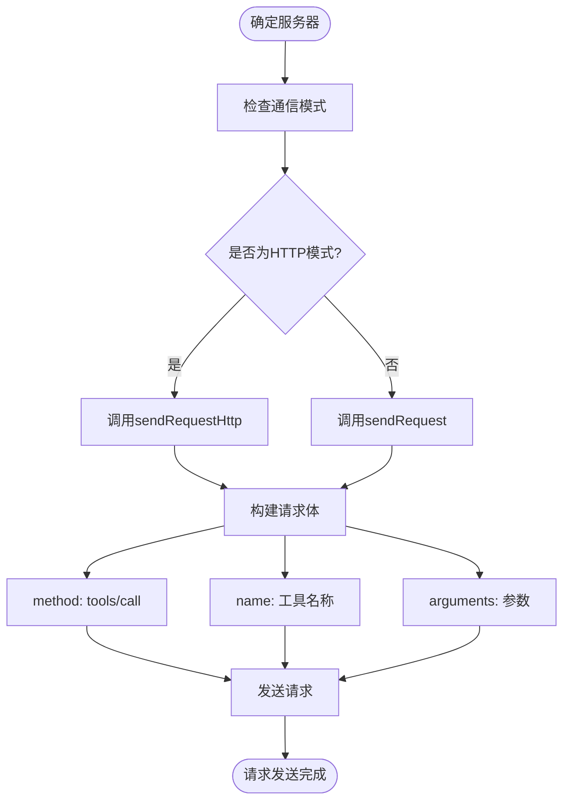
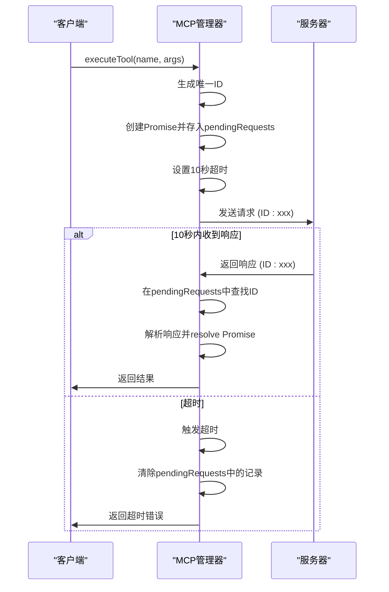
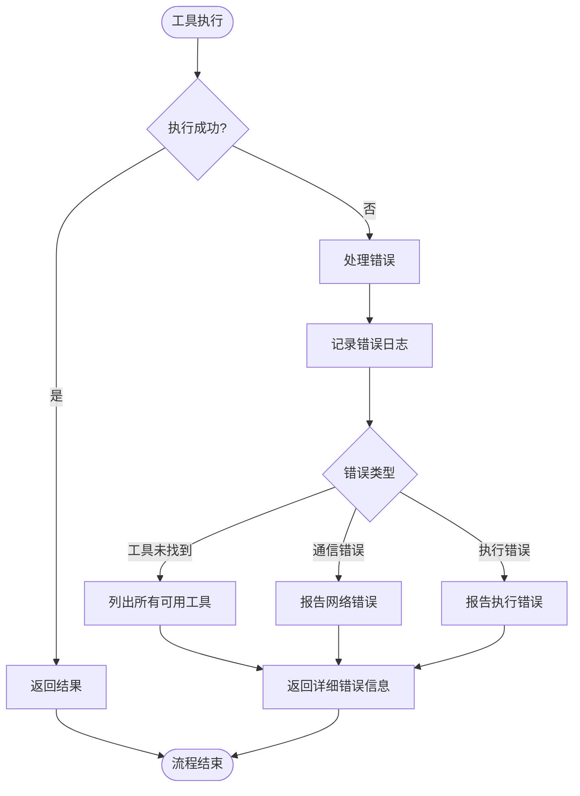

# 工具执行流程

<cite>
**本文档引用的文件**
- [mcp_manager.js](file://background/managers/mcp_manager.js)
- [tool_executor.js](file://background/handlers/session/prompt/tool_executor.js)
- [utils.js](file://background/handlers/session/utils.js)
- [messages.js](file://background/messages.js)
- [control_manager.js](file://background/managers/control_manager.js)
</cite>

## 目录
1. [执行流程概述](#执行流程概述)
2. [工具查找与服务器定位](#工具查找与服务器定位)
3. [通信模式判断与请求发送](#通信模式判断与请求发送)
4. [请求响应关联与超时机制](#请求响应关联与超时机制)
5. [结果处理与返回值](#结果处理与返回值)
6. [错误处理与调试信息](#错误处理与调试信息)

## 执行流程概述

MCP工具执行流程的核心是`executeTool`方法，该方法负责将工具调用请求发送到正确的服务器并处理响应。整个流程从工具名称的解析开始，经过服务器查找、通信模式判断、请求发送、响应处理等多个步骤，最终将执行结果返回给调用方。

**Section sources**
- [mcp_manager.js](file://background/managers/mcp_manager.js#L479-L524)

## 工具查找与服务器定位

当调用`executeTool`方法时，首先需要确定目标工具所在的服务器。该过程通过`getAllTools`的逆向查找实现。方法会遍历所有已连接的服务器，检查每个服务器的工具列表，寻找与目标工具名称匹配的条目。

在查找之前，系统会输出详细的调试日志，列出所有服务器及其工具清单，便于问题排查。如果在所有服务器中都未找到目标工具，系统会抛出详细的错误信息，其中包含所有可用工具的列表。



**Diagram sources**
- [mcp_manager.js](file://background/managers/mcp_manager.js#L484-L506)

**Section sources**
- [mcp_manager.js](file://background/managers/mcp_manager.js#L484-L506)

## 通信模式判断与请求发送

一旦确定了目标服务器，系统会根据`isHttpMode`判断通信模式。该方法检查服务器配置的类型，如果为`streamable_http`或`http`，则使用HTTP模式；否则使用SSE（Server-Sent Events）模式。

根据通信模式的不同，系统会选择不同的方法发送`tools/call`请求：
- HTTP模式：调用`sendRequestHttp`方法
- SSE模式：调用`sendRequest`方法

请求体的结构遵循JSON-RPC规范，包含以下字段：
- `method`: 固定为"tools/call"
- `name`: 工具名称
- `arguments`: 工具调用参数



**Diagram sources**
- [mcp_manager.js](file://background/managers/mcp_manager.js#L508-L521)

**Section sources**
- [mcp_manager.js](file://background/managers/mcp_manager.js#L508-L521)

## 请求响应关联与超时机制

在SSE模式下，系统使用`pendingRequests`映射表来实现请求与响应的关联。当发送请求时，系统会生成一个唯一的JSON-RPC ID，并将该ID与一个Promise关联，存储在`pendingRequests`映射表中。

当服务器通过SSE连接返回响应时，系统会检查响应中的ID，并在`pendingRequests`映射表中查找对应的Promise，从而实现请求与响应的正确关联。

系统实现了10秒的超时机制。如果在10秒内未收到响应，系统会自动触发超时，清除对应的Promise，并返回超时错误。



**Diagram sources**
- [mcp_manager.js](file://background/managers/mcp_manager.js#L324-L329)
- [mcp_manager.js](file://background/managers/mcp_manager.js#L370-L380)

**Section sources**
- [mcp_manager.js](file://background/managers/mcp_manager.js#L324-L380)

## 结果处理与返回值

工具执行的结果通常包含一个`content`数组和一个`isError`标志。`content`数组包含执行结果的内容，而`isError`标志指示执行是否出错。

成功场景的返回值示例：
```json
{
  "content": [
    {
      "type": "text",
      "text": "工具执行成功"
    }
  ],
  "isError": false
}
```

失败场景的返回值示例：
```json
{
  "content": [
    {
      "type": "error",
      "text": "工具执行失败: 错误详情"
    }
  ],
  "isError": true
}
```

系统会直接返回原始结果，由上层调用者负责解析和处理。

**Section sources**
- [mcp_manager.js](file://background/managers/mcp_manager.js#L522-L524)

## 错误处理与调试信息

系统实现了完善的错误处理机制。当工具未找到时，系统会收集所有可用工具的列表，并在错误信息中提供，帮助用户了解可用的工具选项。

在执行过程中，系统会输出详细的调试日志，包括：
- 查找工具时的调试信息
- 每个服务器的工具清单
- 请求发送和响应接收的详细信息

这些调试信息对于问题排查和系统监控非常重要。



**Diagram sources**
- [mcp_manager.js](file://background/managers/mcp_manager.js#L501-L505)

**Section sources**
- [mcp_manager.js](file://background/managers/mcp_manager.js#L501-L505)