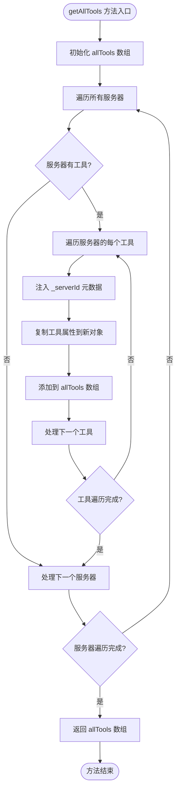
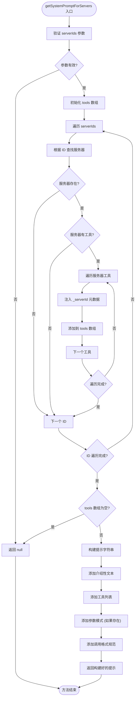
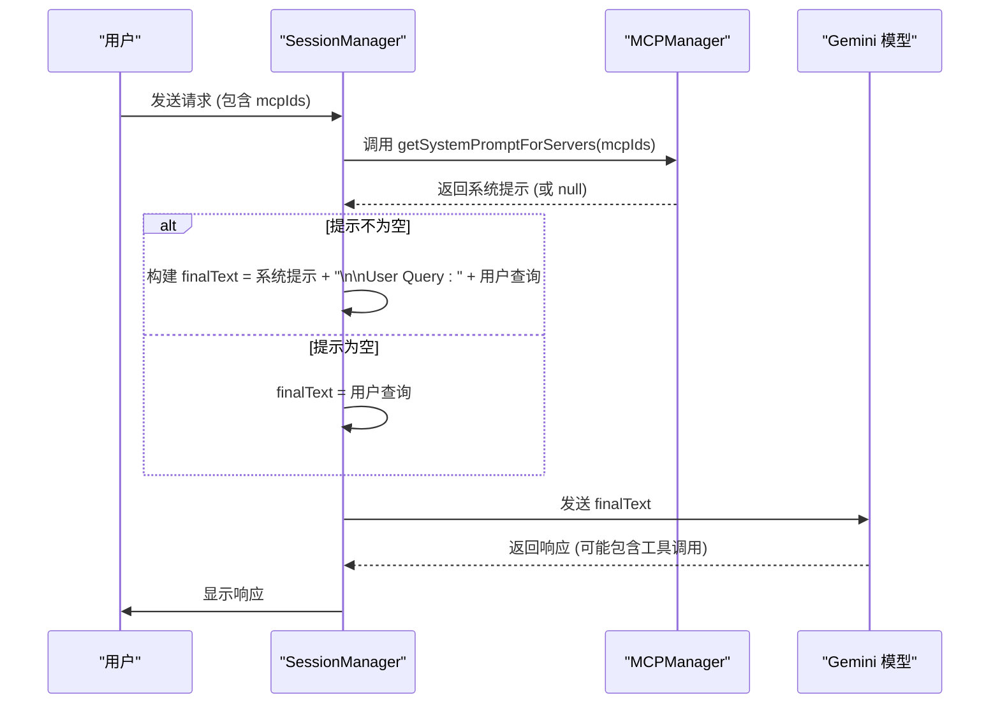

# 系统提示注入

<cite>
**本文档引用的文件**
- [mcp_manager.js](file://background/managers/mcp_manager.js)
- [session_manager.js](file://background/managers/session_manager.js)
- [builder.js](file://background/handlers/session/prompt/builder.js)
- [preamble.js](file://background/handlers/session/prompt/preamble.js)
- [tool_executor.js](file://background/handlers/session/prompt/tool_executor.js)
- [control_manager.js](file://background/managers/control_manager.js)
</cite>

## 目录
1. [简介](#简介)
2. [核心组件](#核心组件)
3. [getAllTools 方法分析](#getalltools-方法分析)
4. [getSystemPromptForServers 方法分析](#getsystempromptforservers-方法分析)
5. [系统提示注入流程](#系统提示注入流程)
6. [工具调用执行机制](#工具调用执行机制)
7. [空值与默认值处理](#空值与默认值处理)
8. [实际提示样例](#实际提示样例)
9. [结论](#结论)

## 简介
本文档详细阐述了MCP（Model Context Protocol）系统中提示生成的核心机制，重点分析`getSystemPromptForServers`和`getAllTools`两个关键方法的实现原理。文档将解释这些方法如何协同工作，为Gemini模型提供精确的工具调用指导，确保生成的JSON代码块符合MCP协议规范。

## 核心组件

MCP系统的提示生成功能涉及多个核心组件的协同工作。`MCPManager`负责管理所有已连接的MCP服务器及其工具列表，`SessionManager`负责会话的生命周期和提示注入，而`PromptBuilder`则负责构建最终发送给模型的完整提示。

**Section sources**
- [mcp_manager.js](file://background/managers/mcp_manager.js#L1-L530)
- [session_manager.js](file://background/managers/session_manager.js#L1-L285)
- [builder.js](file://background/handlers/session/prompt/builder.js#L1-L45)

## getAllTools 方法分析

`getAllTools`方法是MCP系统中用于聚合所有已连接服务器工具列表的核心函数。该方法通过遍历`MCPManager`实例中的`servers`对象，收集每个服务器的工具信息。

方法首先初始化一个空数组`allTools`，然后使用`Object.entries(this.servers)`遍历所有服务器。对于每个服务器，它检查`server.tools`是否存在且不为空。如果存在，它会遍历该服务器的所有工具，并使用扩展运算符`...`将每个工具的属性复制到新对象中，同时注入一个名为`_serverId`的元数据字段，其值为当前服务器的ID。

这种设计确保了每个工具都携带了其来源服务器的信息，这对于后续的工具调用路由至关重要。当`executeTool`方法需要执行一个工具时，它可以根据`_serverId`元数据快速定位到正确的服务器。



**Diagram sources**
- [mcp_manager.js](file://background/managers/mcp_manager.js#L407-L420)

**Section sources**
- [mcp_manager.js](file://background/managers/mcp_manager.js#L407-L420)

## getSystemPromptForServers 方法分析

`getSystemPromptForServers`方法负责为指定的服务器ID列表生成针对性的系统提示。该方法是实现精细化工具访问控制的关键。

方法接收一个`serverIds`数组作为参数。首先，它会进行空值检查，如果`serverIds`为空或长度为0，则直接返回`null`，表示无需注入提示。接着，它初始化一个空的`tools`数组，用于收集目标服务器的工具。

方法遍历`serverIds`数组中的每一个ID，根据ID从`this.servers`对象中查找对应的服务器实例。如果服务器存在且拥有工具列表，它会将该服务器的每个工具（同样注入`_serverId`元数据）添加到`tools`数组中。

在收集完所有目标工具后，方法再次检查`tools`数组的长度。如果为空，说明指定的服务器均无可用工具，方法返回`null`。否则，它开始构建提示字符串。

提示字符串的构建分为三个部分：
1.  **介绍性文本**：说明模型可通过MCP协议访问工具，并指导其使用JSON代码块调用工具。
2.  **工具列表**：遍历`tools`数组，为每个工具生成一行描述，格式为`- 工具名: 工具描述`。如果工具描述缺失，则使用`No description`作为默认值。如果工具定义了`inputSchema`，方法会尝试将其`properties`部分序列化为JSON字符串，并作为参数说明添加到提示中。
3.  **调用格式规范**：明确告知模型必须输出的JSON代码块格式，包括`action`、`tool`和`args`字段，并要求模型在输出工具调用后停止生成。



**Diagram sources**
- [mcp_manager.js](file://background/managers/mcp_manager.js#L446-L477)

**Section sources**
- [mcp_manager.js](file://background/managers/mcp_manager.js#L446-L477)

## 系统提示注入流程

系统提示的注入发生在用户发起请求时，由`SessionManager`协调完成。当`handleSendPrompt`方法被调用时，它会检查请求中是否包含`mcpIds`字段。

如果`mcpIds`存在且不为空，`SessionManager`会调用`MCPManager`的`getSystemPromptForServers`方法，传入`mcpIds`作为参数。如果该方法返回了一个有效的提示字符串，`SessionManager`会将此提示字符串与用户的原始查询文本进行拼接，形成最终发送给Gemini模型的`finalText`。

这个拼接过程通常将系统提示放在前面，用户的查询放在后面，中间用换行符分隔。这样，模型在处理用户请求时，会首先看到可用的工具列表和调用规范，从而能够生成符合要求的工具调用指令。



**Diagram sources**
- [session_manager.js](file://background/managers/session_manager.js#L54-L64)

**Section sources**
- [session_manager.js](file://background/managers/session_manager.js#L54-L64)

## 工具调用执行机制

当Gemini模型的响应中包含符合规范的工具调用JSON代码块时，`SessionManager`会通过`parseToolCall`方法解析出`tool`和`args`。随后，它会调用`MCPManager`的`executeTool`方法来执行该工具。

`executeTool`方法首先会遍历所有服务器，查找哪个服务器拥有与调用请求中`tool`字段同名的工具。一旦找到，它会记录下该工具所在的`targetServerId`。如果找不到，方法会抛出一个错误，并列出所有可用的工具名称。

找到目标服务器后，`executeTool`会根据服务器的模式（HTTP或SSE）选择合适的通信方法（`sendRequestHttp`或`sendRequest`），向目标服务器发送一个`tools/call`的JSON-RPC请求。服务器执行完工具后，会将结果返回给`MCPManager`，再由`SessionManager`将结果作为新的消息发送回Gemini模型，形成一个完整的交互循环。

**Section sources**
- [mcp_manager.js](file://background/managers/mcp_manager.js#L479-L525)
- [session_manager.js](file://background/managers/session_manager.js#L78-L114)

## 空值与默认值处理

系统在处理提示生成时，对各种边界情况进行了妥善的空值处理：

-   **无服务器ID**：如果`getSystemPromptForServers`的`serverIds`参数为空或未提供，方法直接返回`null`，避免生成无意义的提示。
-   **无可用工具**：如果指定的服务器列表中没有任何工具，`tools`数组将为空，方法同样返回`null`。
-   **缺失工具描述**：在构建工具列表时，如果某个工具的`description`字段缺失，系统会使用`'No description'`作为默认值，确保提示的完整性。
-   **无效输入模式**：在尝试序列化`inputSchema.properties`时，代码使用了`try-catch`块。如果序列化失败（例如，`properties`不是有效的JSON对象），捕获异常并忽略该步骤，避免因单个工具的问题导致整个提示生成失败。

这些处理逻辑保证了系统的健壮性，即使在配置不完整或网络请求异常的情况下，也能优雅地降级，而不是完全崩溃。

**Section sources**
- [mcp_manager.js](file://background/managers/mcp_manager.js#L447-L459)
- [mcp_manager.js](file://background/managers/mcp_manager.js#L464-L469)

## 实际提示样例

以下是`getSystemPromptForServers`方法可能生成的一个实际提示样例：

```
You have access to the following tools via Model Context Protocol (MCP). To use a tool, output a JSON code block with the tool name and arguments.

Available Tools:
- take_snapshot: Returns the Accessibility Tree with UIDs.
  Arguments: {"type":{"type":"string","enum":["full","visible"]}}
- click: Click an element using its UID.
  Arguments: {"uid":{"type":"string"},"dblClick":{"type":"boolean"}}
- fill: Type text into an input field or select an option.
  Arguments: {"uid":{"type":"string"},"value":{"type":"string"}}
- navigate_page: Go to a URL or navigate history.
  Arguments: {"url":{"type":"string"},"type":{"type":"string","enum":["url","back","reload"]}}

To invoke a tool, YOU MUST output a code block like this:
```json
{
  "action": "call_tool",
  "tool": "tool_name",
  "args": { ... }
}
```
Stop generating after outputting the tool call. I will provide the result in the next message.
```

这个提示清晰地列出了可用的工具、它们的描述、参数的JSON模式，并严格规定了输出格式，指导Gemini模型生成正确的工具调用。

## 结论

`getSystemPromptForServers`和`getAllTools`方法共同构成了MCP系统与Gemini模型之间通信的桥梁。通过动态聚合工具列表、注入来源元数据、生成结构化提示并精确控制注入时机，该系统实现了强大的、可扩展的工具调用能力。其健壮的空值处理和清晰的格式规范确保了交互的可靠性和可预测性，为构建复杂的自动化工作流奠定了坚实的基础。