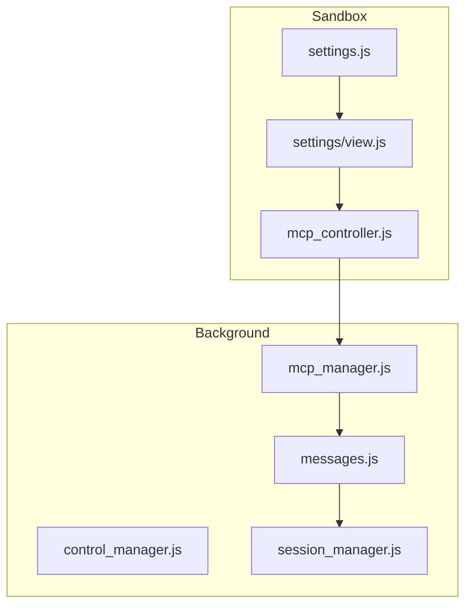
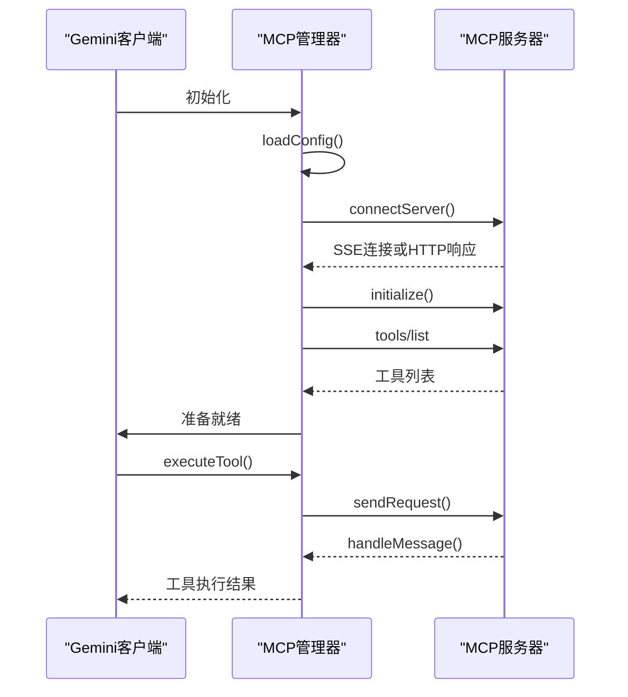
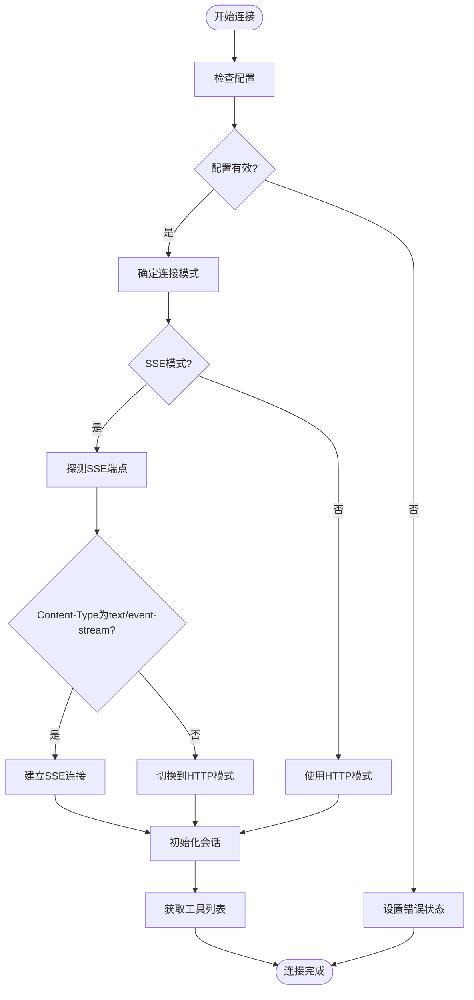
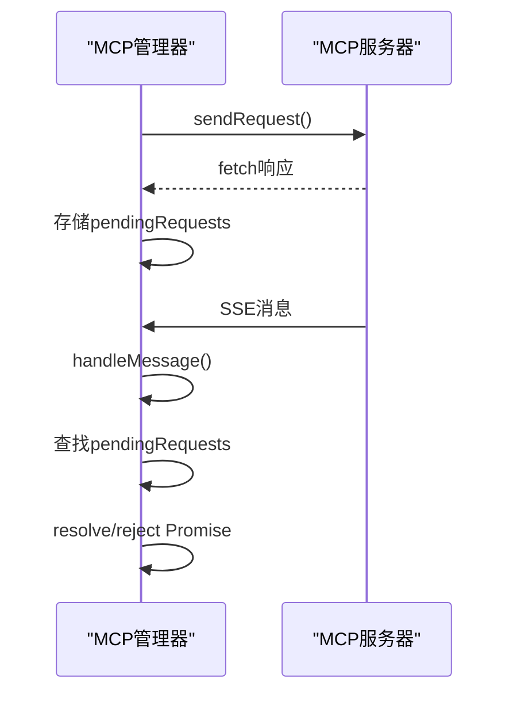
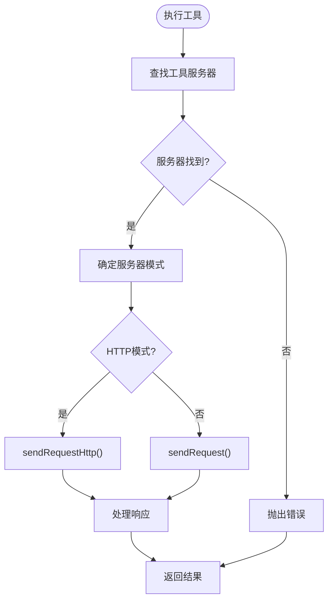
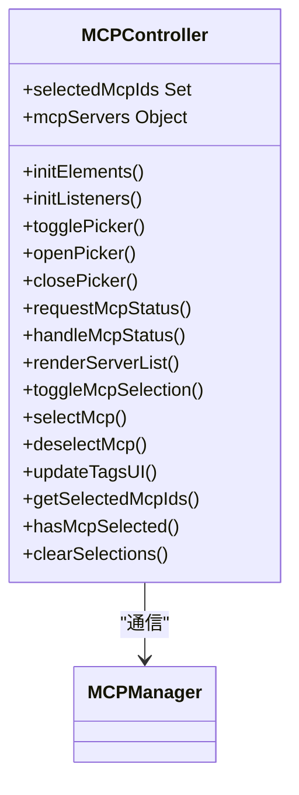
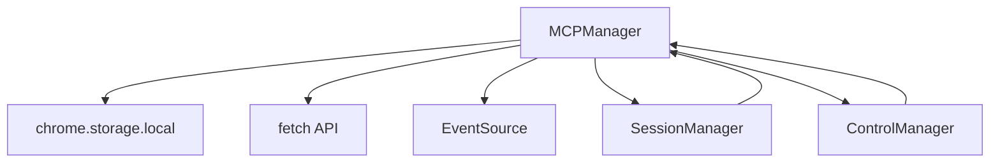

# MCP管理器

<cite>
**本文档引用的文件**
- [mcp_manager.js](file://background/managers/mcp_manager.js)
- [mcp_controller.js](file://sandbox/controllers/mcp_controller.js)
- [settings.js](file://sandbox/ui/settings.js)
- [settings/view.js](file://sandbox/ui/settings/view.js)
- [messages.js](file://background/messages.js)
- [session_manager.js](file://background/managers/session_manager.js)
- [control_manager.js](file://background/managers/control_manager.js)
- [tool_executor.js](file://background/handlers/session/prompt/tool_executor.js)
- [utils.js](file://background/handlers/session/utils.js)
</cite>

## 目录
1. [简介](#简介)
2. [项目结构](#项目结构)
3. [核心组件](#核心组件)
4. [架构概述](#架构概述)
5. [详细组件分析](#详细组件分析)
6. [依赖分析](#依赖分析)
7. [性能考虑](#性能考虑)
8. [故障排除指南](#故障排除指南)
9. [结论](#结论)

## 简介
MCP管理器（MCPManager）是Gemini Nexus扩展中的核心组件，负责实现Model Context Protocol（MCP）客户端功能。它管理与外部MCP服务器的连接，支持SSE和HTTP两种连接模式，并自动探测服务器端点。MCP管理器通过加载和解析mcpConfig配置，动态发现和管理工具列表，并将这些工具能力注入到Gemini对话流中。本文档详细说明MCP管理器的实现细节，包括连接管理、请求-响应关联机制、工具执行和系统提示生成。

## 项目结构
MCP管理器的实现分布在多个文件中，主要位于`background/managers`和`sandbox/controllers`目录下。`mcp_manager.js`文件包含MCP管理器的核心逻辑，而`mcp_controller.js`文件处理UI层的MCP服务器选择和状态管理。配置界面由`sandbox/ui/settings.js`和`sandbox/ui/settings/view.js`文件实现。

**图表来源**
- [mcp_manager.js](file://background/managers/mcp_manager.js)
- [mcp_controller.js](file://sandbox/controllers/mcp_controller.js)
- [settings.js](file://sandbox/ui/settings.js)
- [settings/view.js](file://sandbox/ui/settings/view.js)

**本节来源**
- [mcp_manager.js](file://background/managers/mcp_manager.js)
- [mcp_controller.js](file://sandbox/controllers/mcp_controller.js)

## 核心组件
MCP管理器的核心功能包括配置加载、连接管理、工具发现和执行。它通过`loadConfig`方法从`chrome.storage.local`加载mcpConfig配置，并使用`connectServer`方法建立与MCP服务器的连接。`getAllTools`和`refreshTools`方法用于动态发现和管理工具列表，而`executeTool`方法负责执行工具调用。

**本节来源**
- [mcp_manager.js](file://background/managers/mcp_manager.js)

## 架构概述
MCP管理器的架构基于事件驱动模型，使用SSE（Server-Sent Events）或HTTP模式与MCP服务器通信。它通过`sendRequest`和`handleMessage`方法实现JSON-RPC 2.0协议的请求-响应关联机制。`getSystemPromptForServers`和`executeTool`方法将外部工具能力注入到Gemini对话流中。

**图表来源**
- [mcp_manager.js](file://background/managers/mcp_manager.js)

## 详细组件分析

### MCP管理器分析
MCP管理器是MCP功能的核心实现，负责管理与外部MCP服务器的连接和通信。

#### 连接管理

**图表来源**
- [mcp_manager.js](file://background/managers/mcp_manager.js#L71-L150)

#### 请求-响应关联

**图表来源**
- [mcp_manager.js](file://background/managers/mcp_manager.js#L308-L351)

#### 工具执行流程

**图表来源**
- [mcp_manager.js](file://background/managers/mcp_manager.js#L479-L524)

**本节来源**
- [mcp_manager.js](file://background/managers/mcp_manager.js)

### MCP控制器分析
MCP控制器负责UI层的MCP服务器选择和状态管理。

**图表来源**
- [mcp_controller.js](file://sandbox/controllers/mcp_controller.js)

**本节来源**
- [mcp_controller.js](file://sandbox/controllers/mcp_controller.js)

## 依赖分析
MCP管理器与其他组件有紧密的依赖关系。它依赖`chrome.storage.local`存储和读取配置，通过`fetch`和`EventSource`API与MCP服务器通信，并与`SessionManager`集成以将工具能力注入Gemini对话流。

**图表来源**
- [mcp_manager.js](file://background/managers/mcp_manager.js)
- [messages.js](file://background/messages.js)
- [session_manager.js](file://background/managers/session_manager.js)

**本节来源**
- [mcp_manager.js](file://background/managers/mcp_manager.js)
- [messages.js](file://background/messages.js)

## 性能考虑
MCP管理器在连接建立和工具执行时需要考虑性能因素。连接建立时的自动探测机制可能会增加延迟，而工具执行的异步特性需要妥善管理Promise和超时。建议在配置中明确指定连接模式以避免探测开销，并为请求设置合理的超时时间。

## 故障排除指南
当MCP管理器遇到连接问题时，可以按照以下步骤进行排查：

1. 检查mcpConfig配置是否正确，确保包含有效的服务器URL和类型。
2. 验证MCP服务器是否正常运行，并能够响应探测请求。
3. 检查浏览器控制台日志，查看是否有连接错误或超时信息。
4. 确认服务器返回的Content-Type是否符合预期，SSE模式应返回`text/event-stream`。
5. 使用`getDebugInfo`方法获取MCP管理器的调试信息，检查服务器状态和工具列表。

**本节来源**
- [mcp_manager.js](file://background/managers/mcp_manager.js#L389-L403)

## 结论
MCP管理器成功实现了Model Context Protocol客户端功能，支持SSE和HTTP两种连接模式，并能够自动探测服务器端点。它通过`connectServer`、`sendRequest`、`handleMessage`等方法实现了JSON-RPC 2.0协议的请求-响应关联机制，并通过`getSystemPromptForServers`和`executeTool`方法将外部工具能力注入到Gemini对话流中。`getAllTools`和`refreshTools`方法提供了动态发现和管理工具列表的能力。整体设计考虑了安全性，通过验证服务器URL和处理连接错误来确保系统的稳定性。