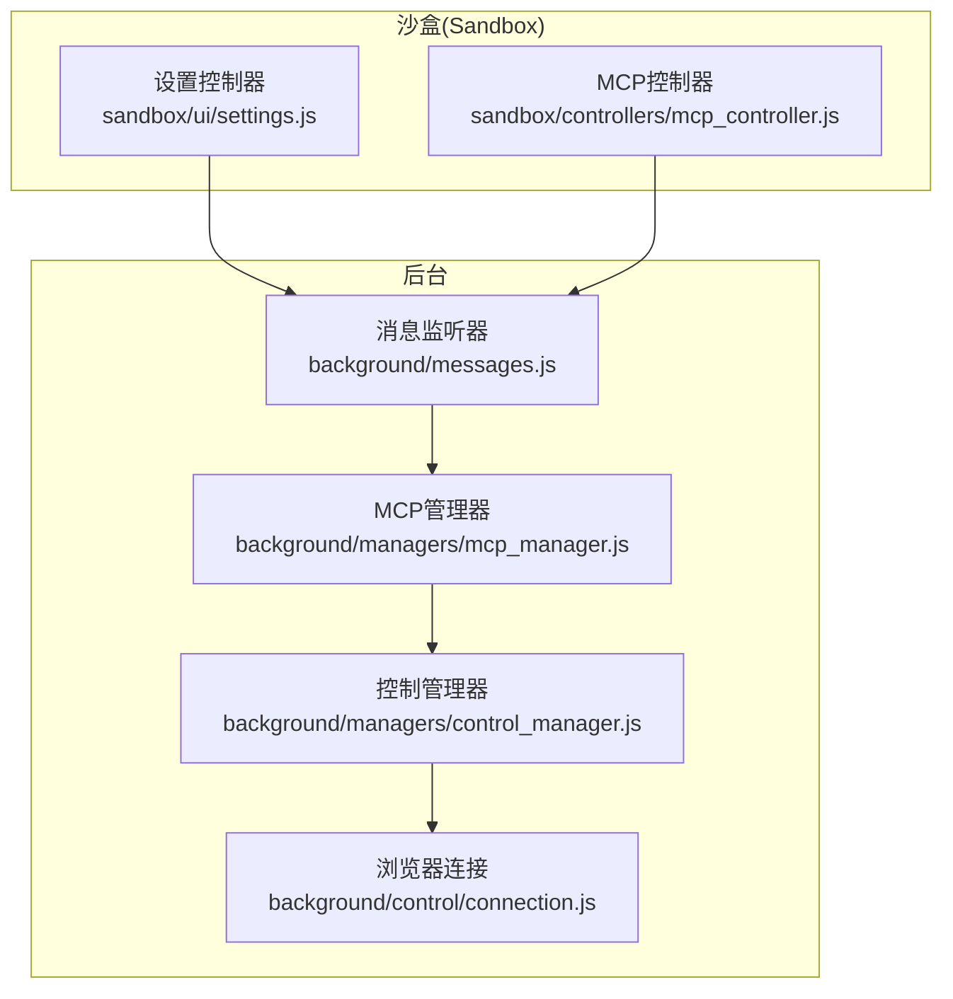
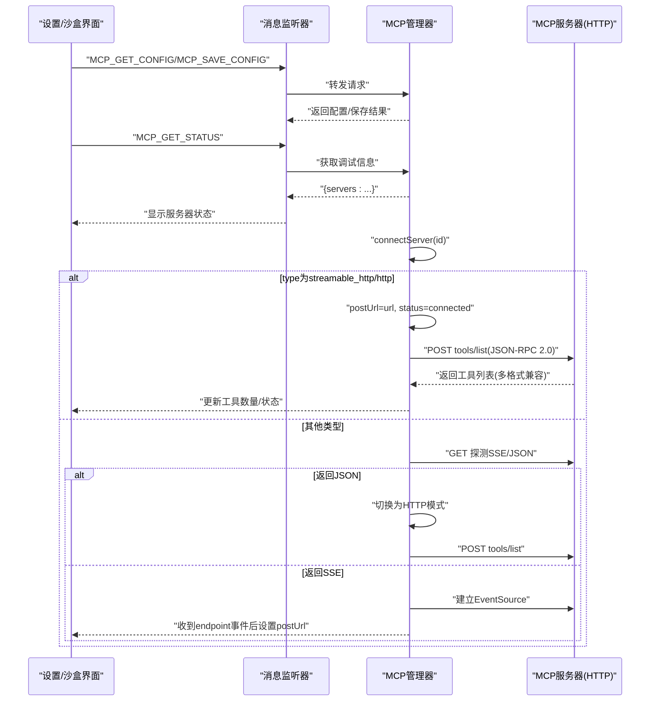
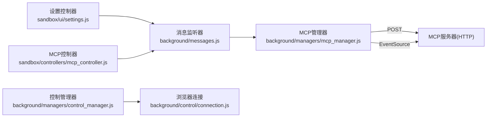

# HTTP直接连接

<cite>
**本文引用的文件**
- [mcp_manager.js](file://background/managers/mcp_manager.js)
- [messages.js](file://background/messages.js)
- [settings.js](file://sandbox/ui/settings.js)
- [mcp_controller.js](file://sandbox/controllers/mcp_controller.js)
- [connection.js](file://background/control/connection.js)
- [control_manager.js](file://background/managers/control_manager.js)
- [session.js](file://background/handlers/session.js)
</cite>

## 目录
1. [简介](#简介)
2. [项目结构](#项目结构)
3. [核心组件](#核心组件)
4. [架构总览](#架构总览)
5. [详细组件分析](#详细组件分析)
6. [依赖关系分析](#依赖关系分析)
7. [性能考量](#性能考量)
8. [故障排查指南](#故障排查指南)
9. [结论](#结论)
10. [附录](#附录)

## 简介
本文件聚焦于MCP（Model Context Protocol）在浏览器扩展中的HTTP直接连接模式，重点覆盖以下内容：
- 当服务器配置的type为'streamable_http'或'http'时，connectServer如何直接将URL作为postUrl使用并立即调用refreshToolsHttp发起工具列表请求；
- isHttpMode如何依据服务器配置的type字段判断通信模式；
- refreshToolsHttp与sendRequestHttp如何通过标准POST请求与服务器交互，包括JSON-RPC 2.0协议封装格式、请求ID生成、响应解析及多格式兼容处理（result.tools、tools、数组等）；
- HTTP模式下无需维护长连接的特性及其对资源消耗的影响；
- 常见问题排查（4xx/5xx错误响应、JSON解析失败、工具列表格式不匹配等），并对比SSE模式的适用场景。

## 项目结构
与MCP HTTP直接连接相关的核心模块分布如下：
- 背景页管理器：负责MCP服务器配置加载、连接建立、工具列表获取、请求发送与响应处理
- 消息通道：前后端消息桥接，支持MCP配置读取/保存、状态查询
- 设置界面：提供MCP配置编辑与保存入口
- 控制器：前端侧MCP服务器选择与状态展示



图表来源
- [mcp_manager.js](file://background/managers/mcp_manager.js#L1-L530)
- [messages.js](file://background/messages.js#L1-L82)
- [settings.js](file://sandbox/ui/settings.js#L1-L249)
- [mcp_controller.js](file://sandbox/controllers/mcp_controller.js#L1-L221)
- [connection.js](file://background/control/connection.js#L1-L147)
- [control_manager.js](file://background/managers/control_manager.js#L1-L159)

章节来源
- [mcp_manager.js](file://background/managers/mcp_manager.js#L1-L530)
- [messages.js](file://background/messages.js#L1-L82)
- [settings.js](file://sandbox/ui/settings.js#L1-L249)
- [mcp_controller.js](file://sandbox/controllers/mcp_controller.js#L1-L221)
- [connection.js](file://background/control/connection.js#L1-L147)
- [control_manager.js](file://background/managers/control_manager.js#L1-L159)

## 核心组件
- MCP管理器：负责服务器配置加载、连接策略（HTTP直连/SSE）、工具列表刷新、JSON-RPC请求封装与响应解析、工具调用路由
- 消息监听器：统一接收来自沙盒的MCP配置读取/保存、状态查询等请求，并转发至MCP管理器
- 设置控制器：提供MCP配置编辑界面，保存配置到存储并触发MCP重连
- MCP控制器：前端侧MCP服务器列表渲染与选择，状态展示
- 控制管理器：浏览器DevTools相关工具的本地实现（非HTTP直连）

章节来源
- [mcp_manager.js](file://background/managers/mcp_manager.js#L1-L530)
- [messages.js](file://background/messages.js#L1-L82)
- [settings.js](file://sandbox/ui/settings.js#L1-L249)
- [mcp_controller.js](file://sandbox/controllers/mcp_controller.js#L1-L221)
- [control_manager.js](file://background/managers/control_manager.js#L1-L159)

## 架构总览
HTTP直接连接的关键流程：
- 配置加载：从本地存储读取mcpConfig，逐个服务器初始化状态
- 连接策略：若type为'streamable_http'或'http'，直接将url/endpoint设为postUrl，标记为已连接，并立即调用refreshToolsHttp
- 工具列表：通过POST请求发送JSON-RPC 2.0的tools/list，兼容多种响应格式
- 请求发送：HTTP模式下使用sendRequestHttp，直接等待POST返回；SSE模式下使用sendRequest，基于事件流等待响应
- 工具调用：根据当前服务器模式选择对应请求方法



图表来源
- [mcp_manager.js](file://background/managers/mcp_manager.js#L71-L150)
- [messages.js](file://background/messages.js#L41-L67)
- [settings.js](file://sandbox/ui/settings.js#L234-L247)

## 详细组件分析

### connectServer：HTTP直连与SSE探测
- 输入：服务器ID与配置（包含url/endpoint与type）
- 行为：
  - 若type为'streamable_http'或'http'：直接将postUrl设为url，状态置为connected，并立即调用refreshToolsHttp
  - 否则进行SSE探测：先GET探测Content-Type，若返回application/json则切换为HTTP模式；否则建立EventSource并等待endpoint事件设置postUrl
- 关键点：
  - HTTP直连无需维护长连接，减少资源占用
  - SSE模式下通过endpoint事件获取POST端点，再进入会话初始化流程

章节来源
- [mcp_manager.js](file://background/managers/mcp_manager.js#L71-L150)

### isHttpMode：通信模式判定
- 判定逻辑：当服务器配置的type为'streamable_http'或'http'时返回true
- 作用：用于在工具列表刷新与工具调用时选择合适的请求路径（HTTP直连 vs SSE）

章节来源
- [mcp_manager.js](file://background/managers/mcp_manager.js#L215-L223)

### refreshToolsHttp：HTTP模式工具列表获取
- 请求封装：构造JSON-RPC 2.0对象，包含jsonrpc版本、随机id、method为tools/list、空参数
- 发送方式：使用fetch向postUrl发起POST请求
- 响应解析：兼容多种格式
  - result.result.tools
  - result.tools
  - result.result（数组）
  - 直接数组
- 错误处理：若响应包含error字段，记录错误并清空工具列表；异常捕获时记录失败原因

```mermaid
flowchart TD
Start(["开始"]) --> Build["构造JSON-RPC 2.0请求"]
Build --> Post["POST到postUrl"]
Post --> Resp{"响应成功?"}
Resp --> |否| Err["记录错误并清空工具列表"]
Resp --> |是| Parse["解析响应"]
Parse --> CheckErr{"包含error?"}
CheckErr --> |是| Err
CheckErr --> |否| Format{"匹配哪种格式?"}
Format --> |result.result.tools| Set1["提取tools"]
Format --> |result.tools| Set2["提取tools"]
Format --> |result.result(数组)| Set3["提取数组"]
Format --> |直接数组| Set4["提取数组"]
Set1 --> Done(["完成"])
Set2 --> Done
Set3 --> Done
Set4 --> Done
```

图表来源
- [mcp_manager.js](file://background/managers/mcp_manager.js#L152-L213)

章节来源
- [mcp_manager.js](file://background/managers/mcp_manager.js#L152-L213)

### sendRequestHttp：HTTP模式请求发送
- 请求封装：构造JSON-RPC 2.0对象，包含jsonrpc版本、随机id、method与params
- 发送方式：使用fetch向postUrl发起POST请求
- 响应处理：检查HTTP状态码，若非ok抛出错误；解析JSON；若包含error字段抛出错误；否则返回result字段
- 特性：该方法直接等待POST响应，不依赖SSE事件流

章节来源
- [mcp_manager.js](file://background/managers/mcp_manager.js#L225-L260)

### 工具调用：executeTool与模式选择
- 查找目标服务器：遍历所有服务器，按名称查找工具所在服务器
- 模式选择：若目标服务器处于HTTP模式，则使用sendRequestHttp；否则使用sendRequest（SSE）
- 结果返回：通常包含content与isError字段

章节来源
- [mcp_manager.js](file://background/managers/mcp_manager.js#L479-L525)

### 消息通道与设置集成
- 设置界面保存配置：校验JSON合法性后通过消息发送至后台
- 后台保存配置：写入本地存储并触发断开旧连接、重新加载配置、自动重连
- 状态查询：沙盒侧通过消息请求MCP状态，后台返回各服务器的连接状态、工具数量等

章节来源
- [messages.js](file://background/messages.js#L41-L67)
- [settings.js](file://sandbox/ui/settings.js#L234-L247)

## 依赖关系分析
- MCP管理器依赖：
  - 浏览器存储（读取/保存mcpConfig）
  - fetch API（HTTP请求）
  - crypto.randomUUID（JSON-RPC请求ID）
  - EventSource（SSE模式）
- 前后端交互：
  - 沙盒通过postMessage与window.parent.postMessage与后台通信
  - 后台通过chrome.runtime.onMessage监听消息并分发处理



图表来源
- [settings.js](file://sandbox/ui/settings.js#L234-L247)
- [mcp_controller.js](file://sandbox/controllers/mcp_controller.js#L88-L93)
- [messages.js](file://background/messages.js#L41-L67)
- [mcp_manager.js](file://background/managers/mcp_manager.js#L71-L150)
- [connection.js](file://background/control/connection.js#L1-L147)
- [control_manager.js](file://background/managers/control_manager.js#L1-L159)

章节来源
- [settings.js](file://sandbox/ui/settings.js#L1-L249)
- [mcp_controller.js](file://sandbox/controllers/mcp_controller.js#L1-L221)
- [messages.js](file://background/messages.js#L1-L82)
- [mcp_manager.js](file://background/managers/mcp_manager.js#L1-L530)
- [connection.js](file://background/control/connection.js#L1-L147)
- [control_manager.js](file://background/managers/control_manager.js#L1-L159)

## 性能考量
- HTTP直连优势：
  - 无需维护SSE长连接，降低内存与网络资源占用
  - 请求/响应为一次性POST，适合短时任务与工具列表获取
- SSE模式：
  - 需要维持EventSource连接，适合持续推送或双向通信场景
  - 在HTTP直连不可用时作为降级方案（探测到服务器返回JSON时自动切换）

章节来源
- [mcp_manager.js](file://background/managers/mcp_manager.js#L87-L96)
- [mcp_manager.js](file://background/managers/mcp_manager.js#L101-L149)

## 故障排查指南
- 4xx/5xx错误响应
  - 现象：sendRequestHttp中抛出HTTP错误
  - 排查：确认服务器URL可达、认证头正确、CORS允许范围
  - 参考位置：[sendRequestHttp](file://background/managers/mcp_manager.js#L248-L250)
- JSON解析失败
  - 现象：refreshToolsHttp或sendRequestHttp解析响应时异常
  - 排查：检查服务器返回是否为合法JSON；确认Content-Type为application/json
  - 参考位置：[refreshToolsHttp](file://background/managers/mcp_manager.js#L170)
- 工具列表格式不匹配
  - 现象：无法从响应中提取tools
  - 排查：确认服务器返回格式符合预期（result.result.tools、result.tools、result.result数组或直接数组）
  - 参考位置：[refreshToolsHttp](file://background/managers/mcp_manager.js#L181-L200)
- SSE模式切换失败
  - 现象：服务器返回JSON而非SSE，但未正确切换HTTP模式
  - 排查：检查Content-Type探测逻辑与endpoint事件处理
  - 参考位置：[connectServer](file://background/managers/mcp_manager.js#L101-L113)
- 配置保存无效
  - 现象：设置界面保存后无效果
  - 排查：确认JSON格式有效、后台保存成功回调、自动重连流程
  - 参考位置：[settings.js](file://sandbox/ui/settings.js#L238-L247)，[messages.js](file://background/messages.js#L41-L55)

## 结论
- 当服务器配置type为'streamable_http'或'http'时，MCP管理器采用HTTP直接连接策略，避免SSE长连接，降低资源消耗
- refreshToolsHttp与sendRequestHttp严格遵循JSON-RPC 2.0封装格式，具备多格式兼容解析能力
- 对于仅需一次性请求/响应的场景（如工具列表获取、工具调用），HTTP直连更高效；对于需要持续推送的场景可考虑SSE模式

## 附录
- 相关实现位置参考：
  - [connectServer](file://background/managers/mcp_manager.js#L71-L150)
  - [isHttpMode](file://background/managers/mcp_manager.js#L215-L223)
  - [refreshToolsHttp](file://background/managers/mcp_manager.js#L152-L213)
  - [sendRequestHttp](file://background/managers/mcp_manager.js#L225-L260)
  - [executeTool](file://background/managers/mcp_manager.js#L479-L525)
  - [消息通道](file://background/messages.js#L41-L67)
  - [设置保存与读取](file://sandbox/ui/settings.js#L234-L247)