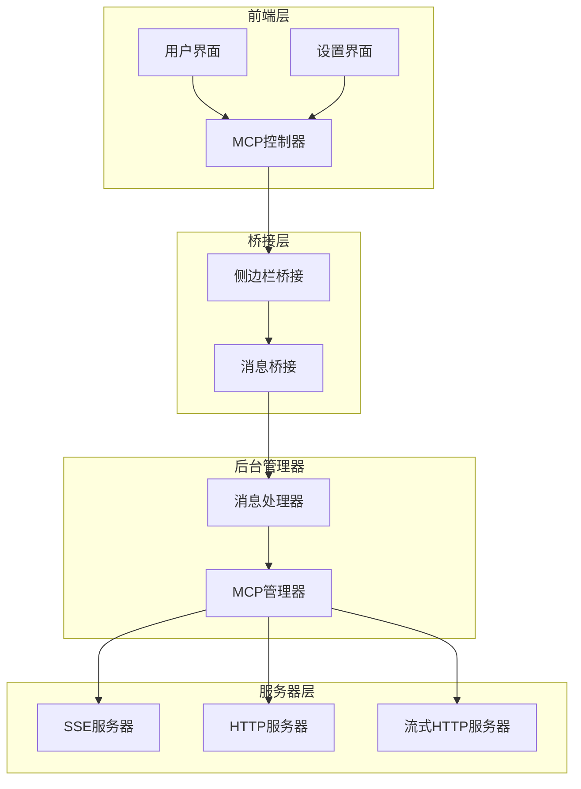
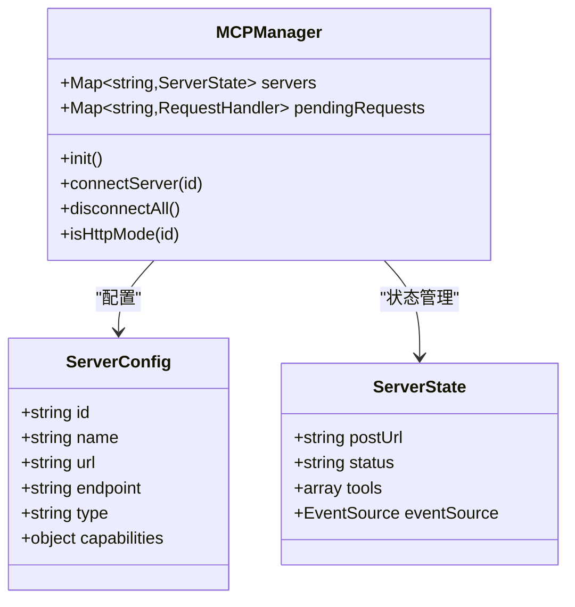
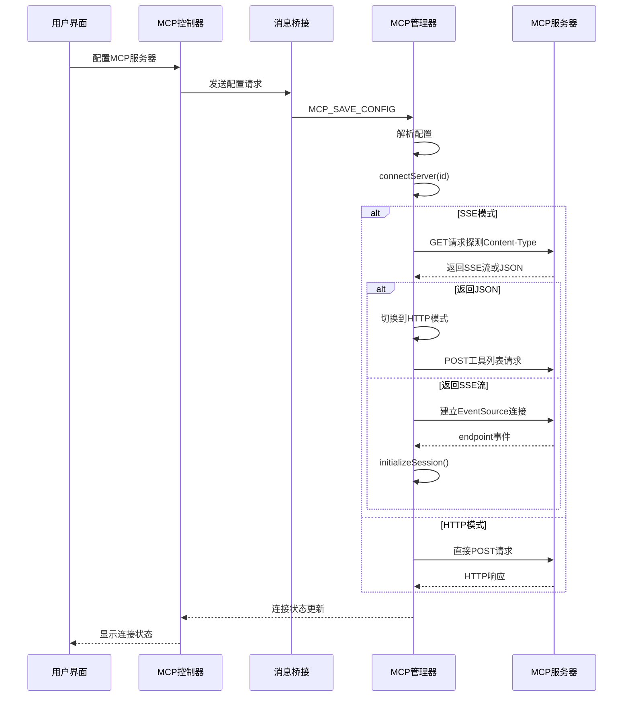
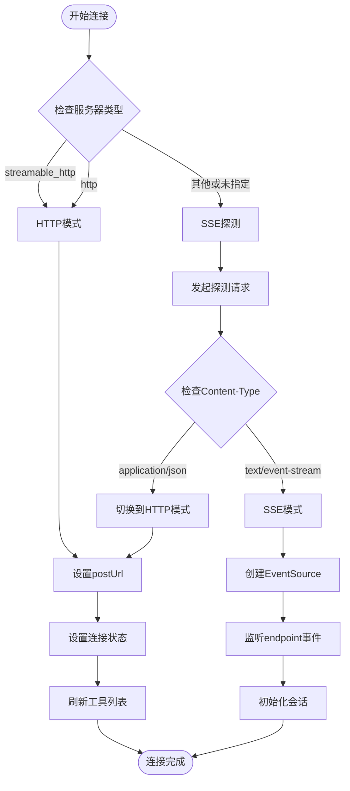
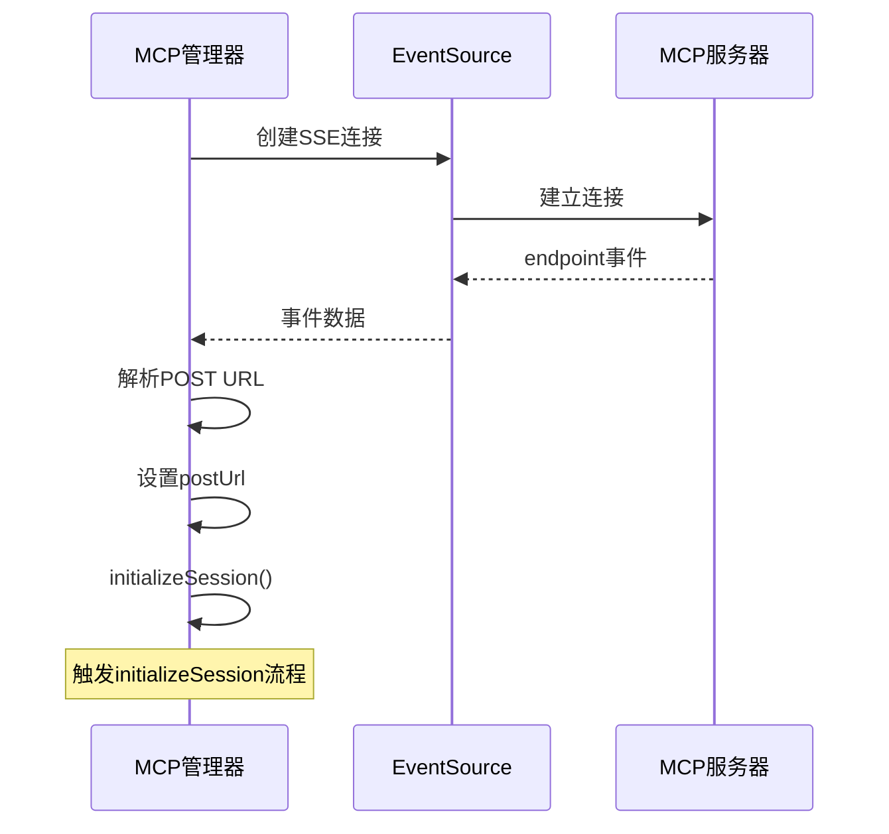
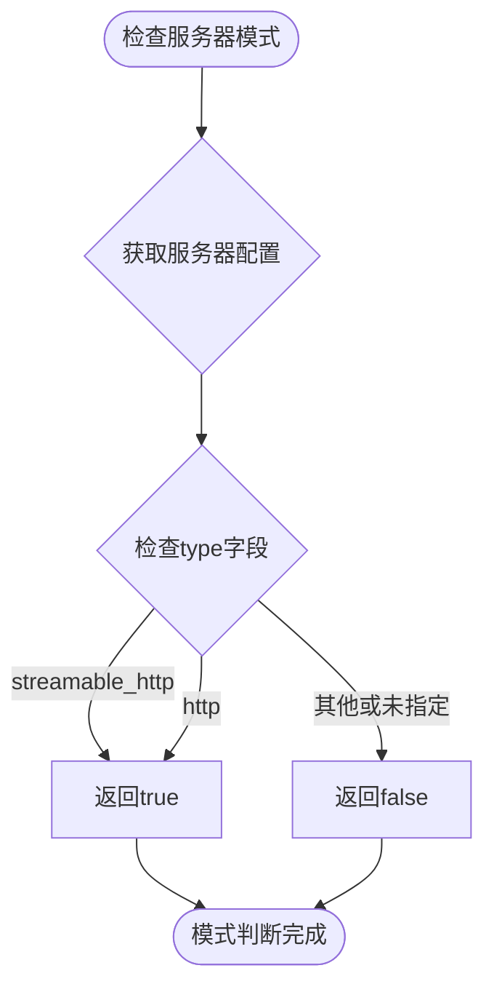
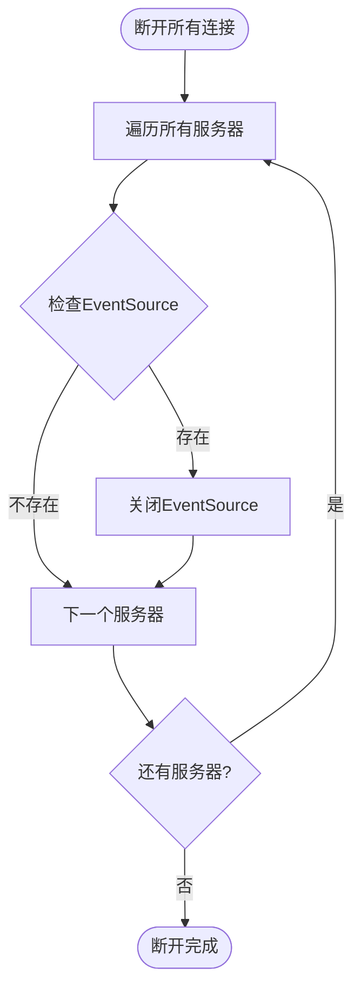
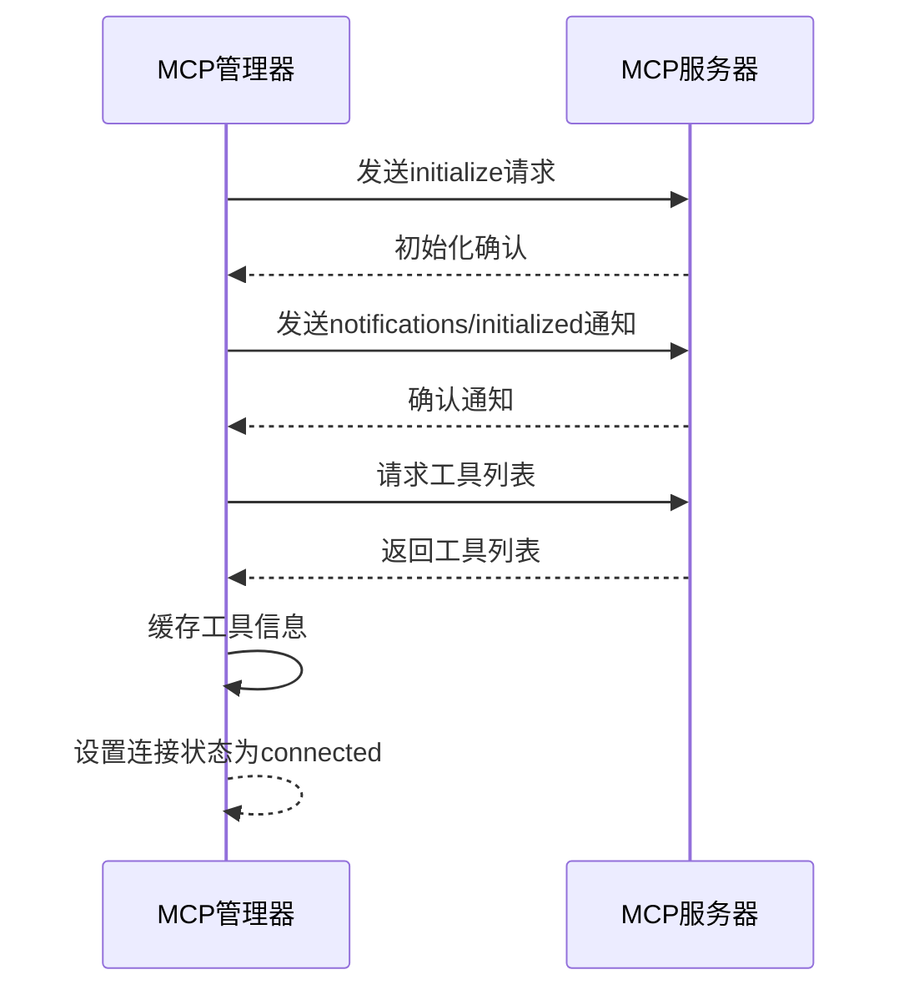
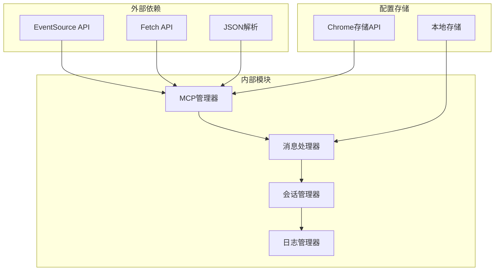

# MCP连接协议

<cite>
**本文档引用的文件**
- [mcp_manager.js](file://background/managers/mcp_manager.js)
- [messages.js](file://background/messages.js)
- [mcp_controller.js](file://sandbox/controllers/mcp_controller.js)
- [settings.js](file://sandbox/ui/templates/settings.js)
- [index.js](file://sidepanel/index.js)
</cite>

## 目录
1. [简介](#简介)
2. [项目结构](#项目结构)
3. [核心组件](#核心组件)
4. [架构概览](#架构概览)
5. [详细组件分析](#详细组件分析)
6. [依赖关系分析](#依赖关系分析)
7. [性能考虑](#性能考虑)
8. [故障排除指南](#故障排除指南)
9. [结论](#结论)

## 简介

MCP（Model Context Protocol）连接协议是Gemini Nexus扩展程序中的关键通信机制，负责与外部工具服务器建立连接并管理会话。该协议实现了SSE（Server-Sent Events）和HTTP双模式连接机制，提供了智能的服务器兼容性检测和自动降级功能。

本协议支持三种连接模式：
- **SSE模式**：标准的MCP over HTTP，使用EventSource进行双向通信
- **Streamable HTTP模式**：支持流式HTTP响应的MCP服务器
- **HTTP模式**：直接的HTTP POST请求响应模式

## 项目结构

MCP连接协议在项目中的组织结构如下：

**图表来源**
- [mcp_manager.js](file://background/managers/mcp_manager.js#L1-L530)
- [messages.js](file://background/messages.js#L1-L82)
- [mcp_controller.js](file://sandbox/controllers/mcp_controller.js#L1-L122)

**章节来源**
- [mcp_manager.js](file://background/managers/mcp_manager.js#L1-L530)
- [messages.js](file://background/messages.js#L1-L82)

## 核心组件

### MCP管理器类

MCP管理器是整个连接协议的核心，负责管理所有MCP服务器连接、状态跟踪和消息路由。

**主要职责：**
- 连接管理：建立和维护与MCP服务器的连接
- 模式检测：自动检测服务器类型并选择合适的连接模式
- 会话初始化：处理MCP协议的初始化流程
- 工具管理：获取和缓存服务器可用工具列表
- 消息路由：处理JSON-RPC消息的发送和接收

**关键属性：**
- `servers`：存储所有已配置服务器的状态信息
- `pendingRequests`：跟踪未完成的JSON-RPC请求
- `initialized`：指示管理器是否已完成初始化

**章节来源**
- [mcp_manager.js](file://background/managers/mcp_manager.js#L2-L6)

### 连接配置系统

MCP连接配置采用灵活的JSON结构，支持多种服务器配置选项：

**图表来源**
- [mcp_manager.js](file://background/managers/mcp_manager.js#L21-L38)

**章节来源**
- [mcp_manager.js](file://background/managers/mcp_manager.js#L21-L38)

## 架构概览

MCP连接协议采用分层架构设计，确保了良好的模块化和可维护性：

**图表来源**
- [mcp_manager.js](file://background/managers/mcp_manager.js#L71-L150)
- [messages.js](file://background/messages.js#L42-L67)

## 详细组件分析

### connectServer方法实现

connectServer方法是MCP连接协议的核心实现，负责根据服务器配置自动选择合适的连接模式：

#### 连接模式选择逻辑

**图表来源**
- [mcp_manager.js](file://background/managers/mcp_manager.js#L71-L150)

#### SSE模式下的智能探测机制

SSE模式实现了智能的服务器兼容性检测机制：

1. **探测请求**：使用`fetch()`向服务器发送GET请求，设置`Accept`头为`text/event-stream, application/json`
2. **内容类型检查**：解析响应的`Content-Type`头部
3. **自动降级**：如果服务器返回`application/json`而非SSE流，则自动切换到HTTP模式

这种机制确保了对不同MCP服务器实现的兼容性，无需手动配置服务器类型。

**章节来源**
- [mcp_manager.js](file://background/managers/mcp_manager.js#L101-L113)

#### SSE连接中的endpoint事件处理

当SSE连接成功建立后，服务器会通过`endpoint`事件发送POST端点URL：

**图表来源**
- [mcp_manager.js](file://background/managers/mcp_manager.js#L127-L133)

**章节来源**
- [mcp_manager.js](file://background/managers/mcp_manager.js#L127-L133)

#### HTTP模式下的直接通信

HTTP模式适用于以下服务器类型：
- `streamable_http`：支持流式HTTP响应的MCP服务器
- `http`：标准HTTP POST响应的MCP服务器

在HTTP模式下，连接过程简化为：
1. 直接使用配置的URL作为POST端点
2. 立即尝试获取工具列表
3. 通过POST请求进行双向通信

**章节来源**
- [mcp_manager.js](file://background/managers/mcp_manager.js#L88-L96)

### isHttpMode方法实现

isHttpMode方法提供了简单而有效的服务器模式判断：

**图表来源**
- [mcp_manager.js](file://background/managers/mcp_manager.js#L218-L223)

**章节来源**
- [mcp_manager.js](file://background/managers/mcp_manager.js#L218-L223)

### disconnectAll方法实现

disconnectAll方法确保了所有SSE连接的正确关闭：

**图表来源**
- [mcp_manager.js](file://background/managers/mcp_manager.js#L63-L69)

**章节来源**
- [mcp_manager.js](file://background/managers/mcp_manager.js#L63-L69)

### initializeSession流程

initializeSession方法负责MCP协议的标准初始化流程：

**图表来源**
- [mcp_manager.js](file://background/managers/mcp_manager.js#L262-L285)

**章节来源**
- [mcp_manager.js](file://background/managers/mcp_manager.js#L262-L285)

## 依赖关系分析

MCP连接协议的依赖关系体现了清晰的分层架构：

**图表来源**
- [mcp_manager.js](file://background/managers/mcp_manager.js#L1-L530)
- [messages.js](file://background/messages.js#L1-L82)

**章节来源**
- [mcp_manager.js](file://background/managers/mcp_manager.js#L1-L530)
- [messages.js](file://background/messages.js#L1-L82)

## 性能考虑

### 连接优化策略

1. **延迟初始化**：仅在需要时建立连接，避免不必要的资源消耗
2. **智能重连**：在连接失败时自动重试，提高系统稳定性
3. **内存管理**：及时清理EventSource实例，防止内存泄漏
4. **请求超时**：为异步操作设置合理的超时时间

### 内存使用优化

- 使用弱引用避免循环引用
- 及时清理未使用的事件监听器
- 合理管理工具列表缓存
- 控制日志输出频率

## 故障排除指南

### 网络连接问题

**常见症状：**
- 连接状态显示为"error"
- 控制台出现网络错误信息
- 工具列表加载失败

**诊断步骤：**
1. 检查服务器URL是否正确
2. 验证网络连接状态
3. 确认防火墙设置允许连接
4. 检查代理配置

**解决方案：**
- 更新服务器配置中的URL
- 检查网络访问权限
- 配置正确的代理设置
- 联系服务器管理员

### CORS跨域问题

**常见症状：**
- 浏览器控制台显示CORS错误
- 预检请求被拒绝
- 服务器响应被阻止

**诊断步骤：**
1. 检查服务器的CORS头部设置
2. 验证预检请求的响应
3. 确认Origin头部的处理

**解决方案：**
- 在服务器端添加适当的CORS头部
- 配置允许的源列表
- 设置正确的凭据处理
- 检查预检请求的响应头

### 服务器响应格式不匹配

**常见症状：**
- 工具列表无法解析
- JSON解析错误
- 协议版本不兼容

**诊断步骤：**
1. 检查服务器返回的Content-Type
2. 验证JSON响应格式
3. 确认MCP协议版本兼容性

**解决方案：**
- 确保服务器返回正确的Content-Type
- 验证JSON响应结构符合MCP规范
- 升级服务器到兼容的MCP版本
- 实现向后兼容的响应格式

### 连接状态监控

**调试信息获取：**
- 使用`MCP_GET_STATUS`消息获取当前连接状态
- 检查每个服务器的详细信息
- 监控连接状态变化

**章节来源**
- [mcp_manager.js](file://background/managers/mcp_manager.js#L389-L403)
- [messages.js](file://background/messages.js#L63-L67)

## 结论

MCP连接协议通过其智能的双模式连接机制，为Gemini Nexus扩展程序提供了强大而灵活的外部工具集成能力。该协议的主要优势包括：

1. **智能兼容性**：自动检测服务器类型并选择最佳连接模式
2. **无缝降级**：在SSE不可用时自动切换到HTTP模式
3. **标准化协议**：遵循MCP标准，确保与其他工具的互操作性
4. **健壮性设计**：完善的错误处理和重连机制

通过合理配置和使用，MCP连接协议能够有效提升Gemini Nexus的功能性和扩展性，为用户提供更加丰富的工具集和更好的使用体验。