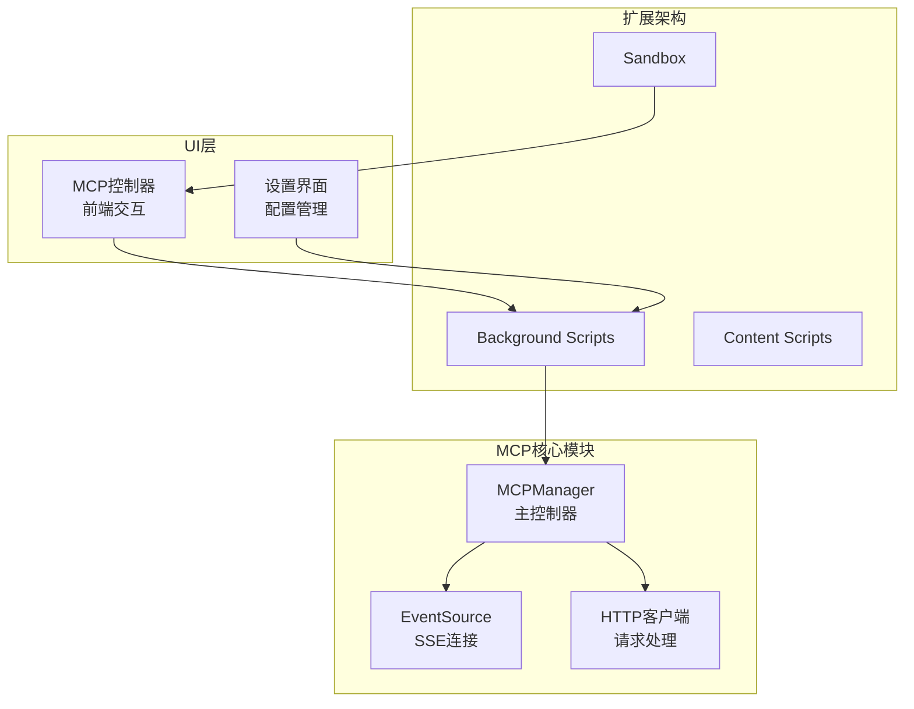
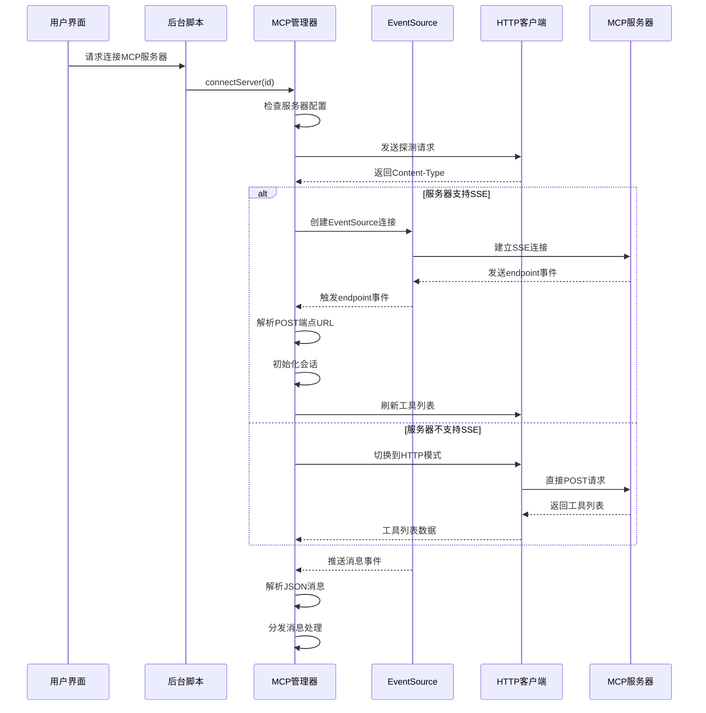
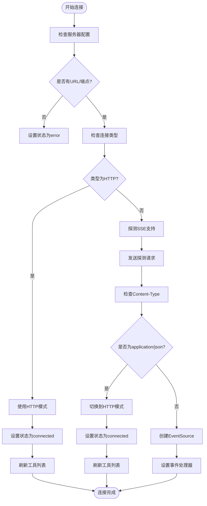
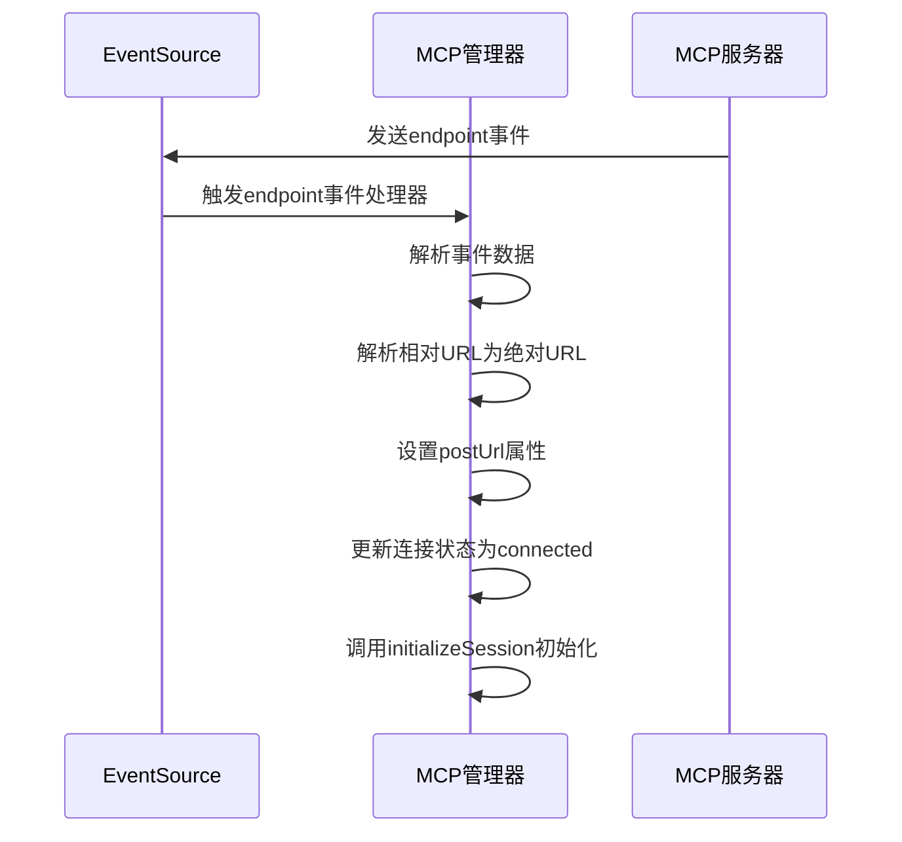
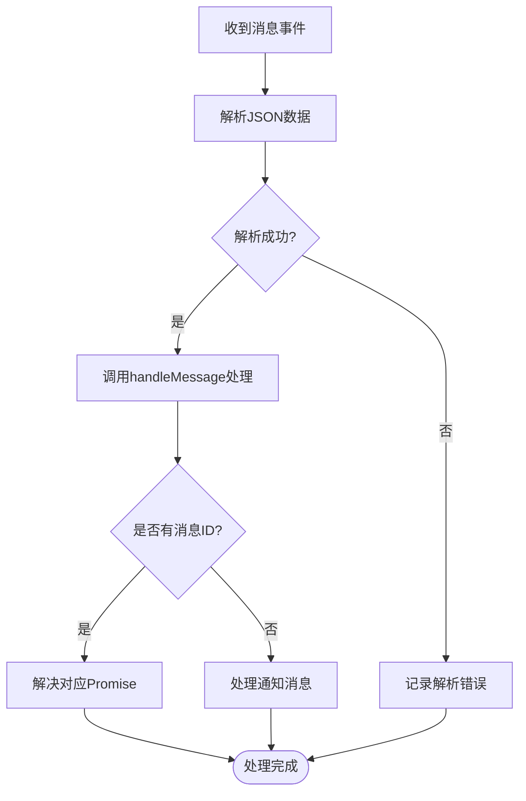
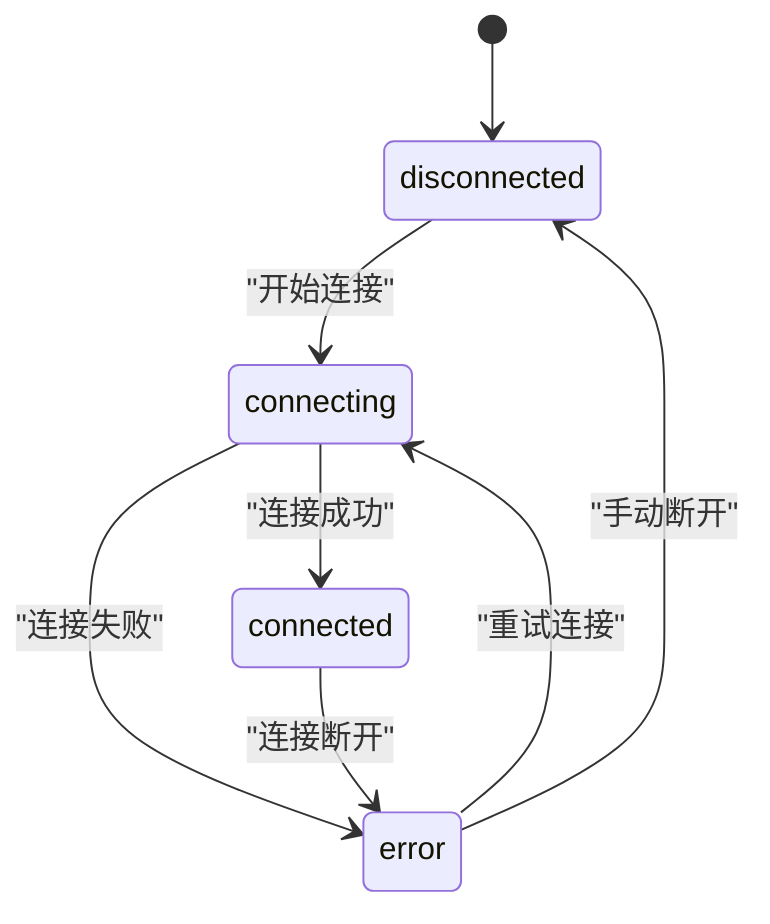
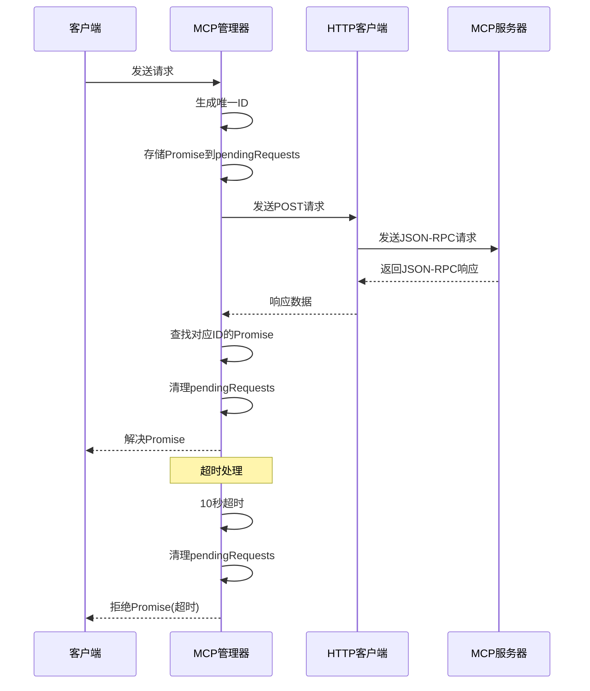
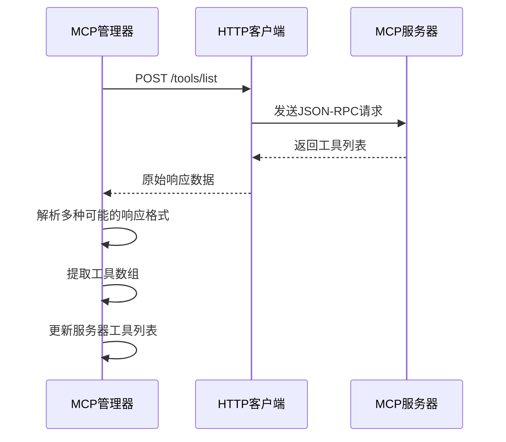
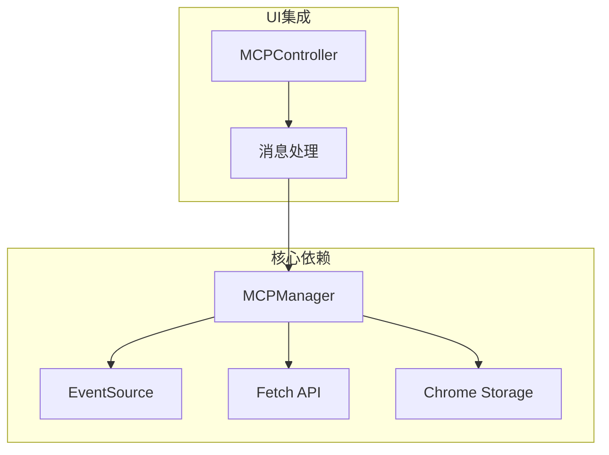

# SSE流式连接

<cite>
**本文档引用的文件**
- [mcp_manager.js](file://background/managers/mcp_manager.js)
- [messages.js](file://background/messages.js)
- [mcp_controller.js](file://sandbox/controllers/mcp_controller.js)
- [manifest.json](file://manifest.json)
</cite>

## 目录
1. [简介](#简介)
2. [项目结构](#项目结构)
3. [核心组件](#核心组件)
4. [架构概览](#架构概览)
5. [详细组件分析](#详细组件分析)
6. [依赖关系分析](#依赖关系分析)
7. [性能考虑](#性能考虑)
8. [故障排除指南](#故障排除指南)
9. [结论](#结论)

## 简介

本文档深入分析了MCP（Model Context Protocol）协议中的SSE（Server-Sent Events）流式连接机制，重点围绕`connectServer`方法中基于EventSource的SSE连接实现。该系统实现了智能兼容策略，能够自动检测服务器对SSE的支持情况，并在不支持时优雅地降级到HTTP模式。

MCP协议是Google开发的模型上下文协议，用于在AI助手和各种工具服务之间建立标准化的通信通道。本文档详细说明了从连接建立、状态管理到消息处理的完整流程，为开发者提供了全面的技术参考。

## 项目结构

该项目采用模块化架构设计，MCP功能主要集中在后台管理器中实现：



**图表来源**
- [mcp_manager.js](file://background/managers/mcp_manager.js#L1-L530)
- [messages.js](file://background/messages.js#L1-L82)

**章节来源**
- [mcp_manager.js](file://background/managers/mcp_manager.js#L1-L530)
- [manifest.json](file://manifest.json#L1-L93)

## 核心组件

### MCPManager类

MCPManager是整个MCP协议的核心控制器，负责管理所有MCP服务器连接、状态同步和消息路由。其主要职责包括：

- **服务器连接管理**：维护多个MCP服务器的连接状态
- **智能连接探测**：自动检测服务器支持的传输协议
- **消息路由**：处理SSE和HTTP两种传输模式的消息
- **会话初始化**：建立MCP协议的初始连接和能力协商

### 连接状态管理

系统实现了完整的连接状态管理机制，包含以下状态：

- **disconnected**：初始状态，连接尚未建立
- **connecting**：正在建立连接的状态
- **connected**：连接已建立，可以正常通信
- **error**：连接出现错误的状态

**章节来源**
- [mcp_manager.js](file://background/managers/mcp_manager.js#L21-L38)
- [mcp_manager.js](file://background/managers/mcp_manager.js#L71-L150)

## 架构概览

MCP协议SSE连接的整体架构采用分层设计，确保了良好的可维护性和扩展性：



**图表来源**
- [mcp_manager.js](file://background/managers/mcp_manager.js#L71-L150)
- [mcp_manager.js](file://background/managers/mcp_manager.js#L135-L145)

## 详细组件分析

### connectServer方法详解

`connectServer`方法是SSE连接的核心实现，采用了智能兼容策略来适配不同的服务器配置：

#### 连接建立流程



**图表来源**
- [mcp_manager.js](file://background/managers/mcp_manager.js#L71-L150)

#### 智能兼容策略

系统实现了三种连接模式的智能切换：

1. **HTTP模式**：直接使用POST请求，适用于不支持SSE的服务器
2. **SSE模式**：标准MCP协议，使用EventSource建立持久连接
3. **自动探测**：通过Content-Type头自动判断服务器支持的协议

**章节来源**
- [mcp_manager.js](file://background/managers/mcp_manager.js#L71-L150)

### EventSource事件处理器

SSE连接建立后，系统设置了多个事件处理器来处理不同类型的事件：

#### endpoint事件处理器

endpoint事件是MCP协议的关键事件，服务器通过此事件提供POST端点URL：



**图表来源**
- [mcp_manager.js](file://background/managers/mcp_manager.js#L127-L133)

#### onmessage事件处理器

onmessage事件处理器负责处理服务器推送的所有消息：



**图表来源**
- [mcp_manager.js](file://background/managers/mcp_manager.js#L135-L142)

**章节来源**
- [mcp_manager.js](file://background/managers/mcp_manager.js#L127-L142)

### 连接状态管理

系统实现了完整的连接状态转换机制：



**图表来源**
- [mcp_manager.js](file://background/managers/mcp_manager.js#L99-L125)

**章节来源**
- [mcp_manager.js](file://background/managers/mcp_manager.js#L99-L125)

### 消息处理机制

handleMessage方法实现了消息的统一处理逻辑：

#### 请求-响应关联

系统使用pendingRequests映射表来关联请求和响应：



**图表来源**
- [mcp_manager.js](file://background/managers/mcp_manager.js#L308-L351)

**章节来源**
- [mcp_manager.js](file://background/managers/mcp_manager.js#L370-L385)

### HTTP模式实现

对于不支持SSE的服务器，系统提供了完整的HTTP模式实现：

#### 工具列表获取



**图表来源**
- [mcp_manager.js](file://background/managers/mcp_manager.js#L153-L213)

**章节来源**
- [mcp_manager.js](file://background/managers/mcp_manager.js#L153-L213)

## 依赖关系分析

### 组件间依赖关系



**图表来源**
- [mcp_manager.js](file://background/managers/mcp_manager.js#L1-L530)
- [messages.js](file://background/messages.js#L1-L82)

### 外部依赖

系统主要依赖以下外部API：

- **Chrome Extension API**：用于存储管理和消息传递
- **Web API**：EventSource用于SSE连接，Fetch用于HTTP请求
- **浏览器API**：用于权限管理和安全策略

**章节来源**
- [mcp_manager.js](file://background/managers/mcp_manager.js#L1-L530)
- [messages.js](file://background/messages.js#L1-L82)

## 性能考虑

### 连接优化策略

1. **延迟初始化**：仅在需要时建立连接，避免不必要的资源消耗
2. **智能重连**：在连接失败时自动重试，提高系统稳定性
3. **内存管理**：及时清理断开连接的EventSource实例
4. **超时控制**：为异步操作设置合理的超时时间

### 内存泄漏防护

系统实现了完善的内存泄漏防护机制：

- **EventSource清理**：disconnectAll方法确保所有连接都被正确关闭
- **Promise清理**：超时后自动清理pendingRequests映射表
- **状态同步**：确保服务器状态与实际连接状态保持一致

**章节来源**
- [mcp_manager.js](file://background/managers/mcp_manager.js#L63-L69)
- [mcp_manager.js](file://background/managers/mcp_manager.js#L324-L350)

## 故障排除指南

### 常见问题诊断

#### CORS跨域限制

**问题表现**：
- 控制台显示CORS错误
- 探测请求被阻止
- 连接状态停留在connecting

**解决方案**：
1. 确保服务器正确设置CORS头
2. 验证服务器支持跨域请求
3. 检查浏览器安全策略

#### 服务器未返回text/event-stream类型

**问题表现**：
- 探测请求返回application/json
- 自动切换到HTTP模式
- 无法接收SSE事件

**解决方案**：
1. 检查服务器SSE实现
2. 验证Content-Type头设置
3. 确认服务器支持SSE协议

#### 网络中断和重连机制

**问题表现**：
- 连接意外断开
- 状态变为error
- 消息丢失

**解决方案**：
1. 实现自动重连逻辑
2. 使用指数退避算法
3. 添加连接状态监控

#### EventSource关闭问题

**问题表现**：
- EventSource实例未正确关闭
- 内存泄漏
- 连接资源占用

**解决方案**：
1. 使用disconnectAll方法清理所有连接
2. 在组件卸载时主动关闭连接
3. 监控EventSource状态变化

### 调试技巧

#### 日志分析

系统提供了丰富的日志输出，便于问题诊断：

- **连接状态日志**：显示连接建立和断开过程
- **消息处理日志**：记录消息解析和处理结果
- **错误日志**：详细记录异常情况和错误信息

#### 状态监控

通过MCP_GET_STATUS接口可以实时监控服务器状态：

```javascript
// 获取当前MCP服务器状态
chrome.runtime.sendMessage({
    action: 'MCP_GET_STATUS'
}, (response) => {
    console.log('MCP状态:', response.servers);
});
```

**章节来源**
- [mcp_manager.js](file://background/managers/mcp_manager.js#L389-L403)
- [messages.js](file://background/messages.js#L63-L67)

## 结论

MCP协议的SSE流式连接实现展现了现代Web应用中事件驱动架构的最佳实践。通过智能兼容策略，系统能够在不同服务器配置下自动选择最优的通信方式，确保了良好的用户体验和系统稳定性。

该实现的主要优势包括：

1. **智能兼容性**：自动检测服务器能力并选择最佳传输协议
2. **完整的状态管理**：清晰的连接状态转换和错误处理机制
3. **灵活的消息处理**：支持SSE和HTTP两种传输模式的消息处理
4. **完善的调试支持**：丰富的日志输出和状态监控功能

未来可以考虑的改进方向：

1. **增强重连机制**：实现更智能的重连策略和退避算法
2. **连接池管理**：优化多服务器连接的资源管理
3. **性能监控**：添加详细的性能指标收集和分析
4. **安全增强**：加强连接安全性和数据加密

这个实现为构建可靠的MCP协议客户端提供了坚实的基础，适合在生产环境中部署和使用。