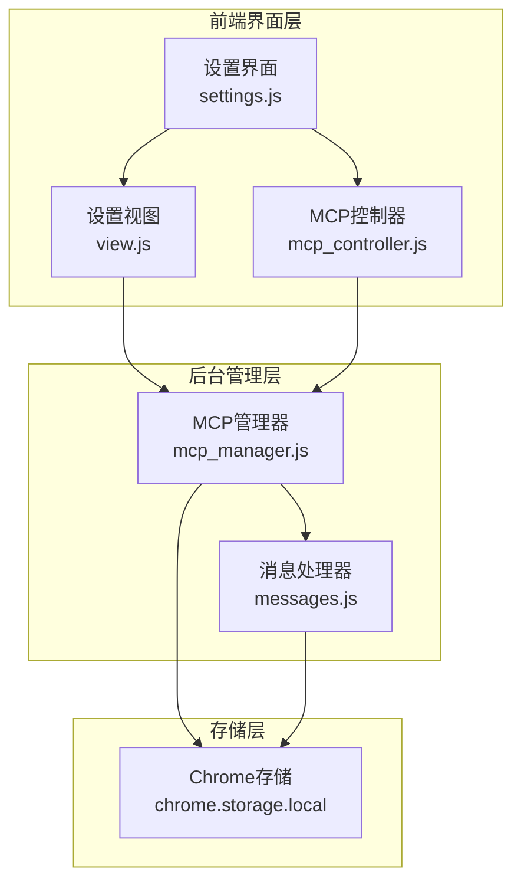
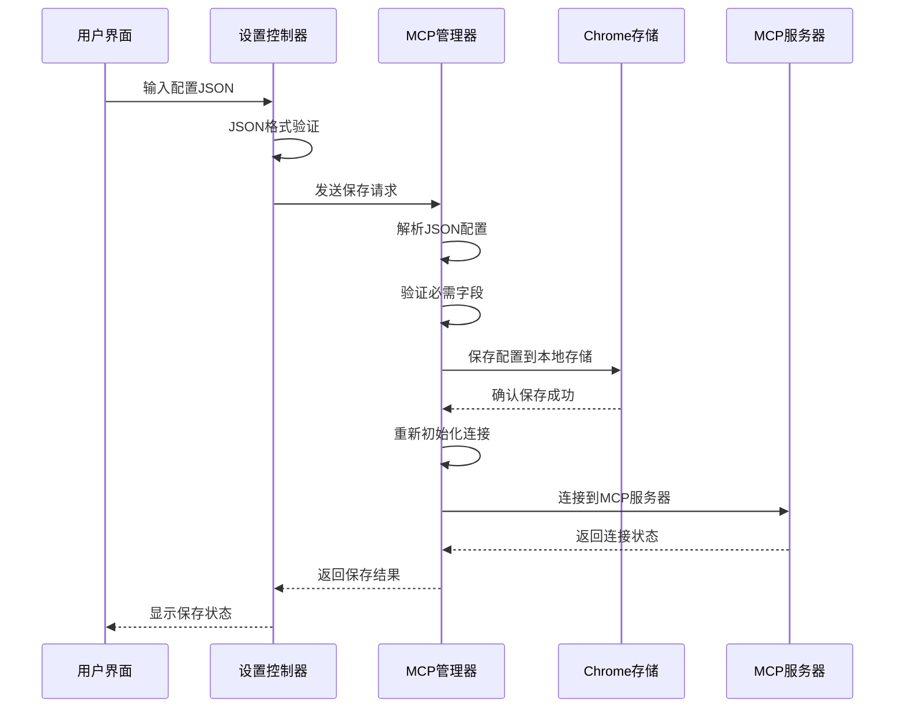
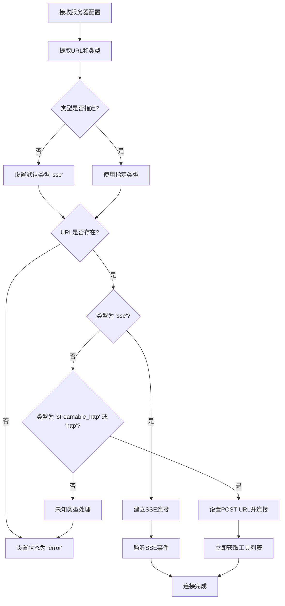
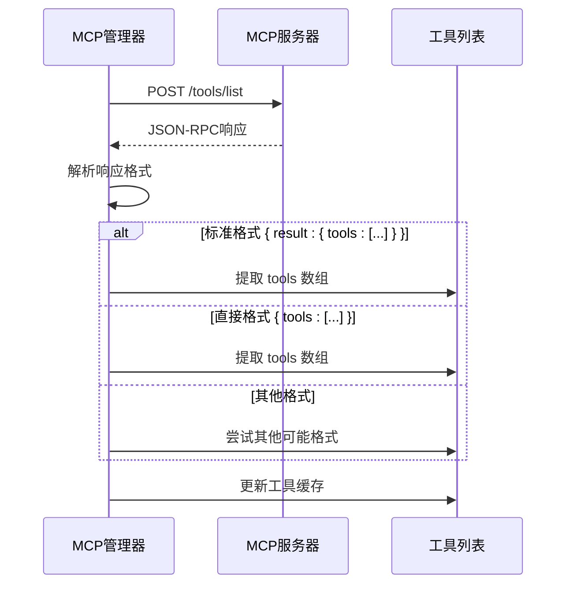
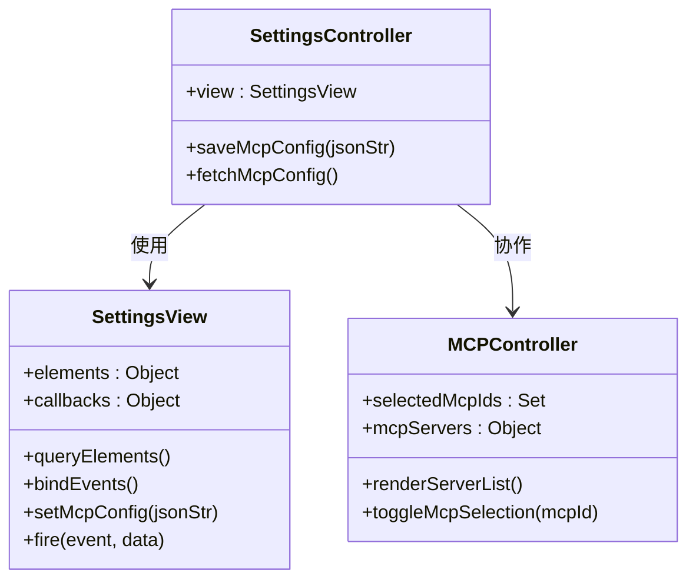
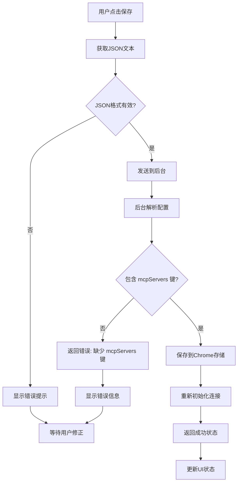
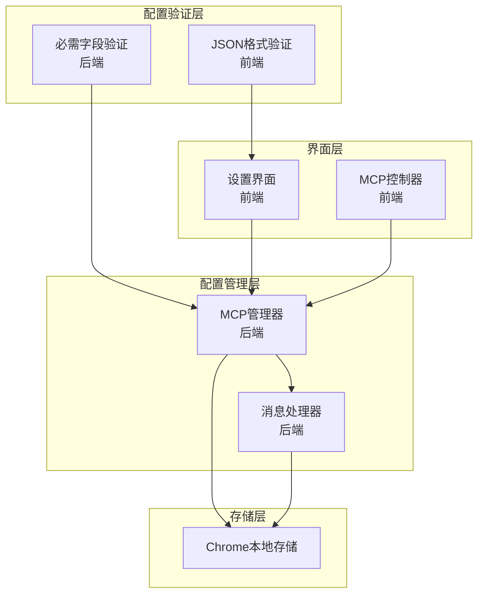

# MCP配置格式说明

<cite>
**本文档引用的文件**
- [mcp_manager.js](file://background/managers/mcp_manager.js)
- [messages.js](file://background/messages.js)
- [mcp_controller.js](file://sandbox/controllers/mcp_controller.js)
- [settings.js](file://sandbox/ui/settings.js)
- [view.js](file://sandbox/ui/settings/view.js)
- [settings.js](file://sandbox/ui/templates/settings.js)
</cite>

## 目录
1. [简介](#简介)
2. [项目结构](#项目结构)
3. [核心组件](#核心组件)
4. [架构概览](#架构概览)
5. [详细组件分析](#详细组件分析)
6. [依赖关系分析](#依赖关系分析)
7. [性能考虑](#性能考虑)
8. [故障排除指南](#故障排除指南)
9. [结论](#结论)

## 简介

MCP（Model Context Protocol）配置格式是Gemini Nexus扩展程序中用于管理外部工具连接的核心配置系统。该配置允许用户通过JSON格式定义多个MCP服务器连接，支持不同的传输协议类型，并提供完整的配置验证和错误处理机制。

本文件详细说明了MCP配置的数据结构、字段要求、验证规则以及最佳实践，帮助开发者和用户正确配置MCP连接以获得最佳使用体验。

## 项目结构

MCP配置系统在项目中的组织结构如下：



**图表来源**
- [settings.js](file://sandbox/ui/settings.js#L1-L249)
- [mcp_manager.js](file://background/managers/mcp_manager.js#L1-L530)
- [messages.js](file://background/messages.js#L1-L82)

**章节来源**
- [settings.js](file://sandbox/ui/settings.js#L1-L249)
- [mcp_manager.js](file://background/managers/mcp_manager.js#L1-L530)
- [messages.js](file://background/messages.js#L1-L82)

## 核心组件

MCP配置系统由以下核心组件构成：

### 配置对象结构

MCP配置采用JSON对象格式，具有以下根属性：

- **mcpServers** (必需): 对象类型，键为服务器ID（字符串），值为服务器配置对象
- 每个服务器配置对象包含以下字段：
  - **url** (必需): 字符串，服务器端点地址
  - **type** (可选): 字符串，连接类型，默认为'sse'
  - **enabled** (可选): 布尔值，是否启用

### 支持的连接类型

系统支持三种连接类型：

| 类型 | 描述 | 特点 |
|------|------|------|
| `sse` | 服务器发送事件 | 标准MCP协议，支持SSE流式传输 |
| `streamable_http` | 可流式HTTP | 支持HTTP模式的流式传输 |
| `http` | 直接HTTP | 标准HTTP请求响应模式 |

**章节来源**
- [mcp_manager.js](file://background/managers/mcp_manager.js#L71-L96)
- [mcp_manager.js](file://background/managers/mcp_manager.js#L218-L223)

## 架构概览

MCP配置系统的整体架构采用分层设计，确保配置的安全性和可靠性：



**图表来源**
- [settings.js](file://sandbox/ui/settings.js#L238-L247)
- [mcp_manager.js](file://background/managers/mcp_manager.js#L40-L61)
- [messages.js](file://background/messages.js#L42-L47)

## 详细组件分析

### MCP管理器（MCPManager）

MCP管理器是配置系统的核心组件，负责处理所有MCP相关的操作：

#### 配置加载机制

```mermaid
flowchart TD
A[启动应用] --> B[从Chrome存储获取配置]
B --> C{配置是否存在?}
C --> |否| D[使用默认配置 { mcpServers: {} }]
C --> |是| E[解析JSON配置]
E --> F[遍历服务器配置]
F --> G[初始化服务器状态]
G --> H[自动连接启用的服务器]
D --> H
```

**图表来源**
- [mcp_manager.js](file://background/managers/mcp_manager.js#L21-L38)

#### 连接类型处理逻辑



**图表来源**
- [mcp_manager.js](file://background/managers/mcp_manager.js#L71-L150)

#### 工具刷新机制

对于HTTP模式的服务器，系统会自动刷新可用工具：



**图表来源**
- [mcp_manager.js](file://background/managers/mcp_manager.js#L153-L213)

**章节来源**
- [mcp_manager.js](file://background/managers/mcp_manager.js#L1-L530)

### 设置界面组件

设置界面提供了用户友好的配置入口：

#### 配置输入界面

设置界面包含一个专门的文本区域用于输入MCP配置JSON：



**图表来源**
- [settings.js](file://sandbox/ui/settings.js#L1-L249)
- [view.js](file://sandbox/ui/settings/view.js#L1-L241)
- [mcp_controller.js](file://sandbox/controllers/mcp_controller.js#L1-L221)

#### 配置验证流程



**图表来源**
- [settings.js](file://sandbox/ui/settings.js#L238-L247)
- [mcp_manager.js](file://background/managers/mcp_manager.js#L40-L61)

**章节来源**
- [settings.js](file://sandbox/ui/settings.js#L1-L249)
- [view.js](file://sandbox/ui/settings/view.js#L1-L241)
- [settings.js](file://sandbox/ui/templates/settings.js#L75-L87)

## 依赖关系分析

MCP配置系统各组件之间的依赖关系如下：



**图表来源**
- [settings.js](file://sandbox/ui/settings.js#L238-L247)
- [mcp_manager.js](file://background/managers/mcp_manager.js#L40-L61)
- [messages.js](file://background/messages.js#L42-L67)

**章节来源**
- [messages.js](file://background/messages.js#L1-L82)
- [mcp_manager.js](file://background/managers/mcp_manager.js#L1-L530)

## 性能考虑

### 连接优化策略

1. **延迟连接**: 应用启动时不会自动连接所有服务器，只有在需要时才建立连接
2. **状态缓存**: 连接状态和工具列表会在内存中缓存，避免重复查询
3. **超时处理**: 所有网络请求都有适当的超时机制，防止长时间阻塞

### 内存管理

- 断开连接时会清理EventSource实例
- 失败的连接会被标记为错误状态，避免重复尝试
- 工具列表会定期刷新，保持数据新鲜度

## 故障排除指南

### 常见配置错误

#### 错误1: 缺少必需字段

**问题**: JSON配置缺少`mcpServers`键

**症状**: 保存配置时出现"缺少'mcpServers'键"错误

**解决方案**: 确保JSON包含完整的`mcpServers`对象

#### 错误2: URL为空

**问题**: 服务器配置缺少有效的URL

**症状**: 服务器状态显示为"error"，日志中出现"No URL/Endpoint found in config"

**解决方案**: 为每个服务器配置提供有效的URL地址

#### 错误3: JSON格式无效

**问题**: JSON语法不正确

**症状**: 保存时弹出"Invalid JSON format"警告

**解决方案**: 使用在线JSON验证工具检查语法

### 配置验证规则

系统实施以下验证规则：

1. **必需性检查**: 必须包含`mcpServers`键
2. **格式检查**: 必须是有效的JSON格式
3. **URL验证**: 每个服务器必须有有效的URL
4. **类型验证**: `type`字段必须是受支持的值之一

### 调试技巧

1. **检查浏览器控制台**: 查看详细的错误信息和调试日志
2. **验证JSON格式**: 使用浏览器的JSON验证功能
3. **测试服务器连通性**: 确保MCP服务器正在运行且可访问
4. **查看存储内容**: 检查Chrome存储中的配置数据

**章节来源**
- [mcp_manager.js](file://background/managers/mcp_manager.js#L79-L83)
- [mcp_manager.js](file://background/managers/mcp_manager.js#L42-L43)

## 结论

MCP配置格式为Gemini Nexus提供了灵活而强大的外部工具集成能力。通过清晰的数据结构定义、严格的验证机制和完善的错误处理，系统确保了配置的安全性和可靠性。

关键优势包括：
- **灵活性**: 支持多种连接类型和传输协议
- **安全性**: 完整的配置验证和错误处理
- **易用性**: 直观的设置界面和详细的错误反馈
- **可维护性**: 清晰的代码结构和良好的文档支持

建议用户在配置MCP服务器时遵循本文档的指导原则，确保获得最佳的使用体验和系统稳定性。