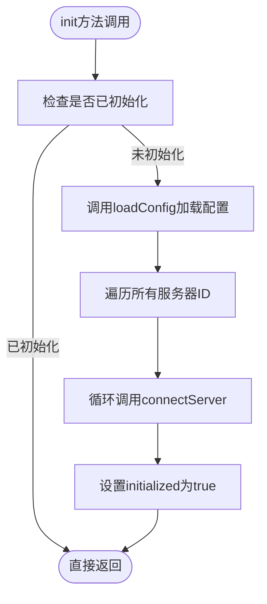
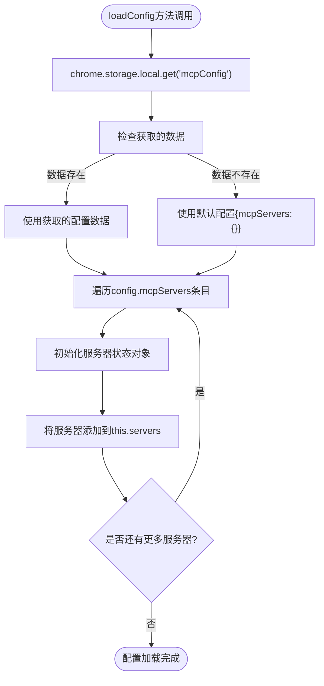
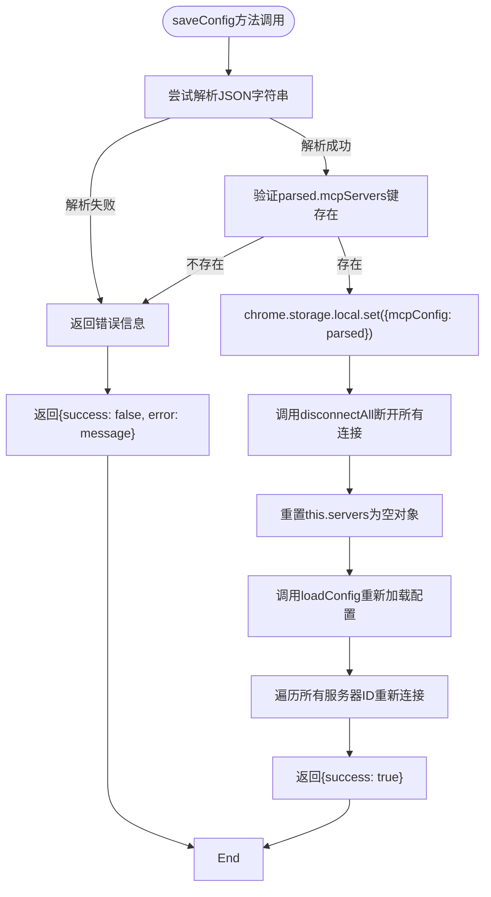
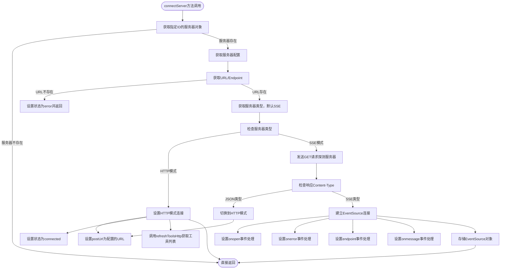
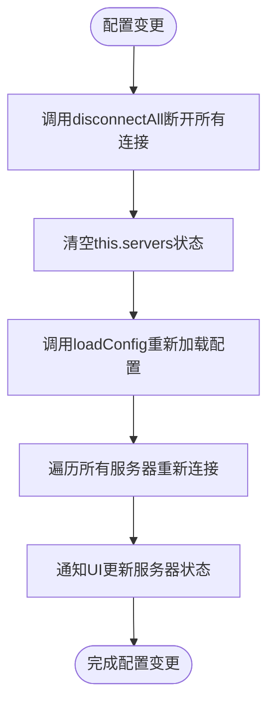
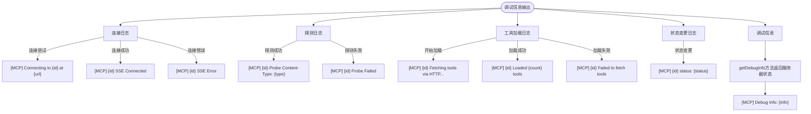
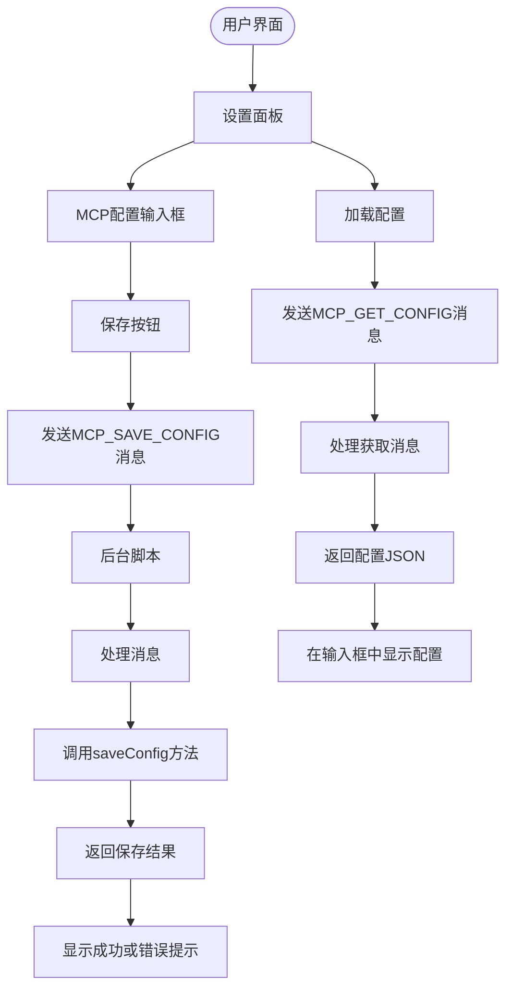
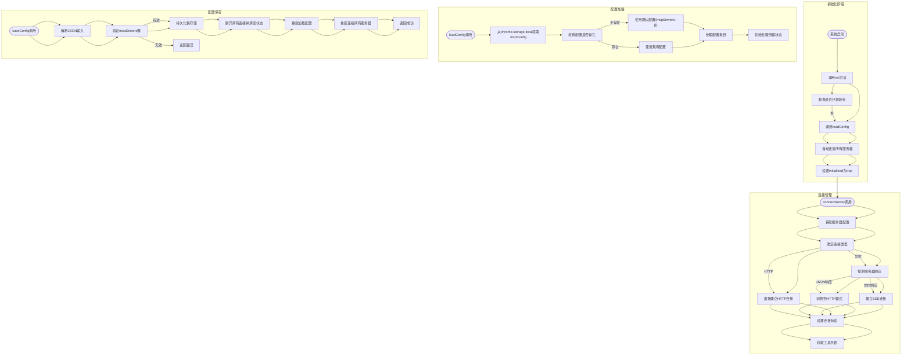

# MCP配置生命周期管理

<cite>
**本文档引用的文件**
- [mcp_manager.js](file://background/managers/mcp_manager.js)
- [messages.js](file://background/messages.js)
- [settings.js](file://sandbox/ui/settings.js)
- [view.js](file://sandbox/ui/settings/view.js)
- [mcp_controller.js](file://sandbox/controllers/mcp_controller.js)
</cite>

## 目录
1. [简介](#简介)
2. [配置初始化流程](#配置初始化流程)
3. [配置加载机制](#配置加载机制)
4. [配置保存流程](#配置保存流程)
5. [服务器连接管理](#服务器连接管理)
6. [配置变更副作用处理](#配置变更副作用处理)
7. [调试与日志输出](#调试与日志输出)
8. [用户界面交互](#用户界面交互)
9. [配置生命周期流程图](#配置生命周期流程图)

## 简介
MCP（Model Context Protocol）配置生命周期管理是Gemini Nexus扩展的核心功能之一，负责管理外部工具服务器的配置、连接和状态。该系统通过chrome.storage.local持久化存储配置数据，实现了配置的加载、保存和初始化全流程管理。本文档详细阐述了MCP配置从初始化到运行的完整生命周期，包括init方法作为入口点协调整个初始化过程，loadConfig方法从存储中异步获取配置数据，saveConfig方法处理配置更新和持久化，以及connectServer方法根据服务器类型建立连接等关键流程。

## 配置初始化流程

MCP配置的初始化流程始于`init`方法的调用，该方法作为整个配置生命周期的入口点，协调配置加载和服务器连接。初始化过程确保了系统在启动时能够正确加载持久化配置并自动连接所有启用的服务器。

**图示来源**
- [mcp_manager.js](file://background/managers/mcp_manager.js#L8-L19)

**本节来源**
- [mcp_manager.js](file://background/managers/mcp_manager.js#L8-L19)

## 配置加载机制

`loadConfig`方法负责从chrome.storage.local异步获取mcpConfig数据，处理不存在的默认值，并将配置映射到内部servers状态对象。该方法使用Chrome扩展的存储API来持久化配置，确保配置数据在浏览器重启后仍然可用。

**图示来源**
- [mcp_manager.js](file://background/managers/mcp_manager.js#L21-L38)

**本节来源**
- [mcp_manager.js](file://background/managers/mcp_manager.js#L21-L38)

## 配置保存流程

`saveConfig`方法处理配置的完整保存流程，包括解析JSON字符串、验证mcpServers键、持久化到存储、重建内部状态和重新建立所有连接。该方法确保了配置更新的原子性和一致性，通过事务性操作避免了配置损坏的风险。

**图示来源**
- [mcp_manager.js](file://background/managers/mcp_manager.js#L40-L61)

**本节来源**
- [mcp_manager.js](file://background/managers/mcp_manager.js#L40-L61)

## 服务器连接管理

`connectServer`方法根据服务器类型（SSE或HTTP）建立不同类型的连接，并处理连接探针和错误状态。该方法实现了智能连接机制，能够自动探测服务器响应类型并相应调整连接模式。

**图示来源**
- [mcp_manager.js](file://background/managers/mcp_manager.js#L71-L150)

**本节来源**
- [mcp_manager.js](file://background/managers/mcp_manager.js#L71-L150)

## 配置变更副作用处理

当配置发生变更时，系统需要处理一系列副作用，包括断开现有连接、清空状态、重新加载和连接。这些操作确保了配置更新后系统状态的一致性和正确性。

**图示来源**
- [mcp_manager.js](file://background/managers/mcp_manager.js#L47-L55)

**本节来源**
- [mcp_manager.js](file://background/managers/mcp_manager.js#L47-L55)

## 调试与日志输出

系统提供了详细的调试信息和日志输出，帮助开发者诊断配置生命周期中的问题。日志信息包括连接状态、错误信息和调试详情。

**图示来源**
- [mcp_manager.js](file://background/managers/mcp_manager.js#L85-L86)
- [mcp_manager.js](file://background/managers/mcp_manager.js#L104-L105)
- [mcp_manager.js](file://background/managers/mcp_manager.js#L158-L159)
- [mcp_manager.js](file://background/managers/mcp_manager.js#L401-L402)

**本节来源**
- [mcp_manager.js](file://background/managers/mcp_manager.js#L85-L86)
- [mcp_manager.js](file://background/managers/mcp_manager.js#L104-L105)
- [mcp_manager.js](file://background/managers/mcp_manager.js#L158-L159)
- [mcp_manager.js](file://background/managers/mcp_manager.js#L401-L402)

## 用户界面交互

用户界面通过设置面板与MCP配置系统交互，允许用户编辑和保存配置。UI组件与后台管理器通过消息传递机制进行通信。

**图示来源**
- [settings.js](file://sandbox/ui/settings.js#L238-L247)
- [messages.js](file://background/messages.js#L42-L46)
- [view.js](file://sandbox/ui/settings/view.js#L63-L65)

**本节来源**
- [settings.js](file://sandbox/ui/settings.js#L238-L247)
- [messages.js](file://background/messages.js#L42-L46)
- [view.js](file://sandbox/ui/settings/view.js#L63-L65)

## 配置生命周期流程图

**图示来源**
- [mcp_manager.js](file://background/managers/mcp_manager.js)
- [messages.js](file://background/messages.js)

**本节来源**
- [mcp_manager.js](file://background/managers/mcp_manager.js)
- [messages.js](file://background/messages.js)