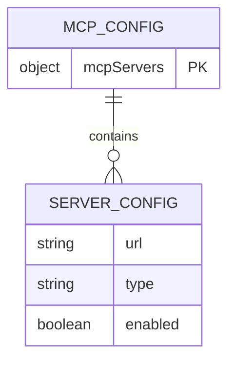
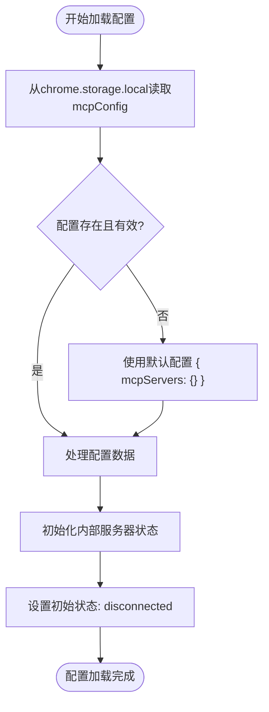
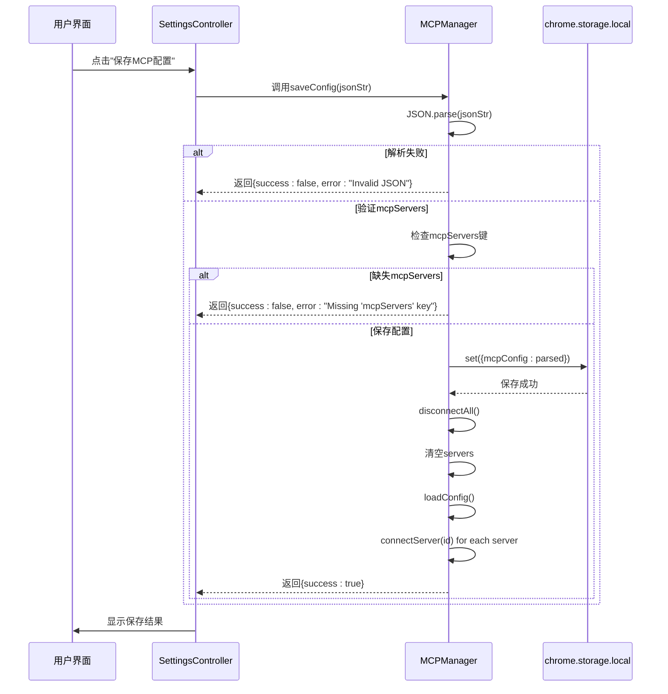
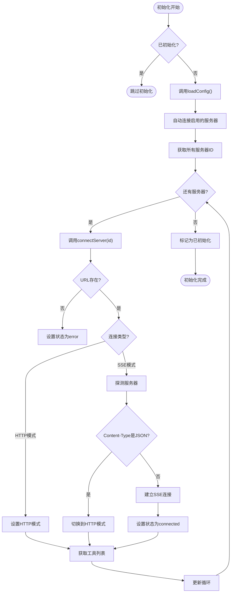
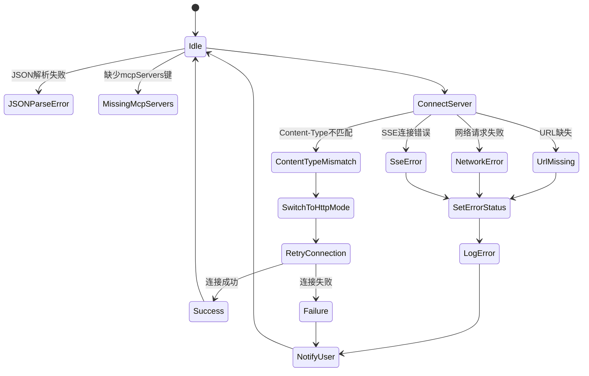

# MCP配置管理

<cite>
**本文档引用的文件**
- [mcp_manager.js](file://background/managers/mcp_manager.js)
- [mcp_controller.js](file://sandbox/controllers/mcp_controller.js)
- [messages.js](file://background/messages.js)
- [settings.js](file://sandbox/ui/settings.js)
- [settings.js](file://sandbox/ui/settings/view.js)
- [settings.js](file://sandbox/ui/templates/settings.js)
</cite>

## 目录
1. [简介](#简介)
2. [配置数据结构](#配置数据结构)
3. [配置加载流程](#配置加载流程)
4. [配置保存流程](#配置保存流程)
5. [初始化流程](#初始化流程)
6. [配置错误处理](#配置错误处理)
7. [配置管理最佳实践](#配置管理最佳实践)
8. [常见问题排查指南](#常见问题排查指南)

## 简介

MCP（Model Context Protocol）配置管理是Gemini Nexus扩展的核心功能之一，负责管理外部工具服务器的连接和配置。该系统通过chrome.storage.local存储配置数据，实现了配置的持久化和动态管理。MCPManager类是配置管理的核心组件，负责处理配置的加载、保存和初始化。配置系统支持多种连接模式，包括SSE（Server-Sent Events）和HTTP模式，能够自动探测服务器类型并建立连接。用户可以通过侧边栏的设置界面进行配置管理，系统提供了完整的错误处理机制和状态反馈。

**Section sources**
- [mcp_manager.js](file://background/managers/mcp_manager.js#L1-L530)
- [mcp_controller.js](file://sandbox/controllers/mcp_controller.js#L1-L221)

## 配置数据结构

MCP配置采用标准的JSON格式，以`mcpServers`作为根键，包含一个服务器配置对象的映射。每个服务器配置由服务器ID作为键，其值为包含连接信息的对象。配置数据结构要求严格遵循以下格式：

```json
{
  "mcpServers": {
    "serverId": {
      "url": "string",
      "type": "string",
      "enabled": "boolean"
    }
  }
}
```

其中，`url`字段是必需的，指定服务器的连接地址；`type`字段可选，指定连接类型（默认为'sse'）；`enabled`字段可选，表示服务器是否启用。服务器ID同时作为配置的键和内部状态的标识符。配置系统支持多种URL属性，包括`url`和`endpoint`，提供灵活性以适应不同的服务器实现。



**Diagram sources**
- [mcp_manager.js](file://background/managers/mcp_manager.js#L22-L37)
- [settings.js](file://sandbox/ui/templates/settings.js#L81-L82)

**Section sources**
- [mcp_manager.js](file://background/managers/mcp_manager.js#L22-L37)
- [settings.js](file://sandbox/ui/templates/settings.js#L81-L82)

## 配置加载流程

配置加载流程始于`loadConfig`方法的调用，该方法从chrome.storage.local异步读取`mcpConfig`键的值。如果存储中不存在配置或配置无效，系统将使用默认的空配置对象`{ mcpServers: {} }`。加载过程遍历配置中的每个服务器条目，将其转换为内部服务器状态对象，包括配置信息、事件源、POST地址、工具列表和连接状态。

加载过程中，系统会为每个服务器创建一个状态对象，初始化其连接状态为'disconnected'，工具列表为空数组。服务器ID直接使用配置中的名称作为键。此过程不建立实际连接，仅为后续的连接初始化准备内部状态。配置加载是初始化流程的第一步，为后续的自动连接提供基础数据。



**Diagram sources**
- [mcp_manager.js](file://background/managers/mcp_manager.js#L21-L38)
- [messages.js](file://background/messages.js#L50-L52)

**Section sources**
- [mcp_manager.js](file://background/managers/mcp_manager.js#L21-L38)

## 配置保存流程

配置保存流程通过`saveConfig`方法实现，该方法接收一个JSON字符串作为输入。首先，系统尝试解析JSON字符串，如果解析失败则捕获SyntaxError异常并返回错误信息。接着验证解析后的对象是否包含必需的`mcpServers`键，如果缺失则抛出错误。验证通过后，系统将配置数据保存到chrome.storage.local的`mcpConfig`键下。

保存配置后，系统执行重新初始化流程：断开所有现有连接，清空内部服务器状态，重新加载配置，并为所有服务器重新建立连接。这一系列操作确保配置更改立即生效。保存流程采用事务性设计，要么完全成功，要么返回详细的错误信息。方法返回一个包含`success`布尔值和可选`error`消息的对象，供调用者处理结果。



**Diagram sources**
- [mcp_manager.js](file://background/managers/mcp_manager.js#L40-L60)
- [settings.js](file://sandbox/ui/settings.js#L238-L246)

**Section sources**
- [mcp_manager.js](file://background/managers/mcp_manager.js#L40-L60)
- [settings.js](file://sandbox/ui/settings.js#L238-L246)

## 初始化流程

初始化流程由`init`方法协调，是MCP系统启动的核心过程。该方法首先检查是否已初始化，避免重复执行。初始化过程按顺序执行两个主要步骤：调用`loadConfig`加载配置，然后自动连接所有已配置的服务器。连接过程遍历内部服务器状态中的所有ID，对每个服务器调用`connectServer`方法。

`connectServer`方法根据服务器配置的`type`字段决定连接模式，默认为'sse'。系统首先检查URL是否存在，如果缺失则标记服务器状态为'error'。对于HTTP模式（'streamable_http'或'http'），系统直接使用配置的URL作为POST地址，设置状态为'connected'，并立即尝试获取工具列表。对于SSE模式，系统发送探测请求，根据响应的Content-Type头自动切换模式：如果返回JSON则切换到HTTP模式，否则建立SSE连接。



**Diagram sources**
- [mcp_manager.js](file://background/managers/mcp_manager.js#L8-L19)
- [mcp_manager.js](file://background/managers/mcp_manager.js#L71-L150)

**Section sources**
- [mcp_manager.js](file://background/managers/mcp_manager.js#L8-L19)
- [mcp_manager.js](file://background/managers/mcp_manager.js#L71-L150)

## 配置错误处理

配置系统实现了全面的错误处理机制，能够处理各种配置异常情况。在保存配置时，系统捕获JSON解析错误和缺少`mcpServers`键的错误，返回详细的错误信息。在连接过程中，系统处理URL缺失、网络请求失败、SSE连接错误等情况，将服务器状态设置为'error'并记录详细的错误日志。

前端界面提供了用户友好的错误反馈，当JSON格式无效时显示"Invalid JSON format"警告，当保存失败时显示具体的错误消息。系统还实现了自动模式切换功能，当SSE服务器返回JSON响应时，自动切换到HTTP模式，提高了系统的容错能力。错误处理贯穿整个配置管理流程，确保系统在异常情况下仍能保持稳定运行。



**Diagram sources**
- [mcp_manager.js](file://background/managers/mcp_manager.js#L41-L60)
- [mcp_manager.js](file://background/managers/mcp_manager.js#L79-L82)
- [settings.js](file://sandbox/ui/settings.js#L240-L245)

**Section sources**
- [mcp_manager.js](file://background/managers/mcp_manager.js#L41-L60)
- [settings.js](file://sandbox/ui/settings.js#L240-L245)

## 配置管理最佳实践

为了确保MCP配置的稳定性和可靠性，建议遵循以下最佳实践：首先，始终使用有效的JSON格式编写配置，可以使用在线JSON验证工具进行验证。其次，为每个服务器配置提供清晰的ID和正确的URL，避免使用特殊字符。建议在配置中明确指定`type`字段，而不是依赖默认值，以提高配置的可读性和可维护性。

在生产环境中，建议先在测试环境中验证配置，然后再应用到生产环境。定期备份配置是一个好习惯，可以在出现问题时快速恢复。当添加新服务器时，建议逐个添加并测试连接，而不是一次性添加多个服务器。对于HTTP模式的服务器，确保服务器支持POST请求和JSON-RPC协议。监控系统日志可以帮助及时发现和解决配置问题。

**Section sources**
- [mcp_manager.js](file://background/managers/mcp_manager.js#L40-L60)
- [settings.js](file://sandbox/ui/settings.js#L238-L246)

## 常见问题排查指南

当遇到MCP配置问题时，可以按照以下步骤进行排查：首先检查浏览器控制台日志，查看是否有"Invalid JSON format"或"Missing 'mcpServers' key"等错误信息。如果连接失败，检查服务器URL是否正确，网络是否通畅。对于SSE连接问题，检查服务器是否正确设置了Content-Type头为"text/event-stream"。

如果服务器状态显示为'error'，检查系统日志中的详细错误信息。对于HTTP模式服务器，确保服务器能够正确处理JSON-RPC请求。如果工具列表无法加载，检查服务器的`tools/list`端点是否正常工作。可以使用浏览器的开发者工具的Network面板监控请求和响应。如果问题持续存在，尝试重启浏览器或重新安装扩展。在极端情况下，可以重置配置到默认状态并重新配置。

**Section sources**
- [mcp_manager.js](file://background/managers/mcp_manager.js#L79-L82)
- [mcp_manager.js](file://background/managers/mcp_manager.js#L147-L149)
- [settings.js](file://sandbox/ui/settings.js#L73-L75)