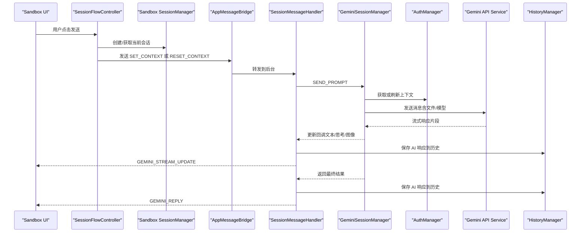
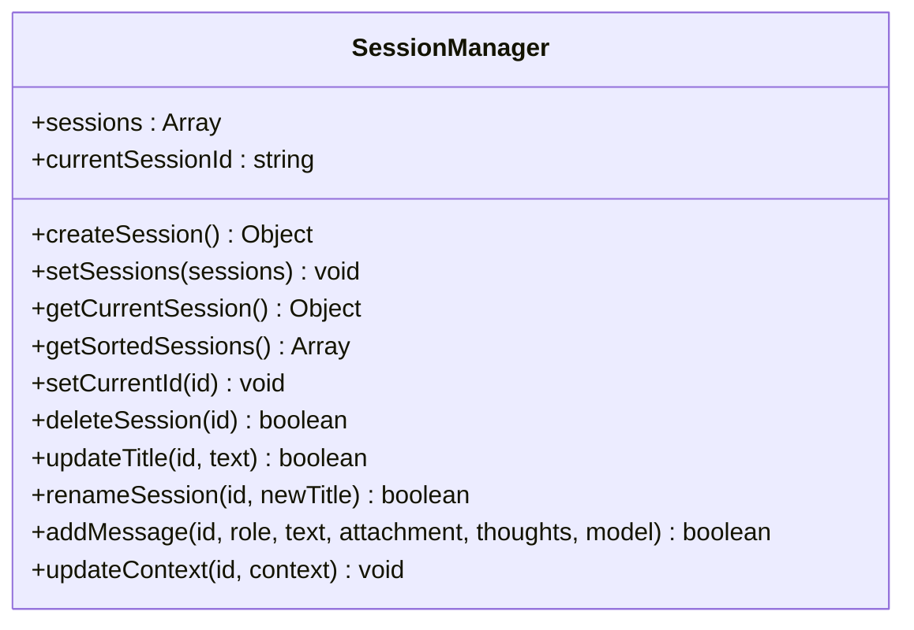
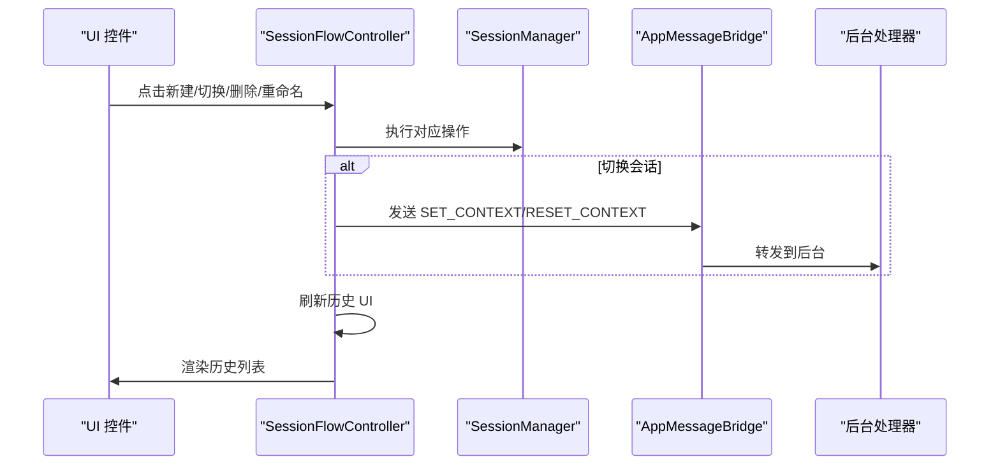
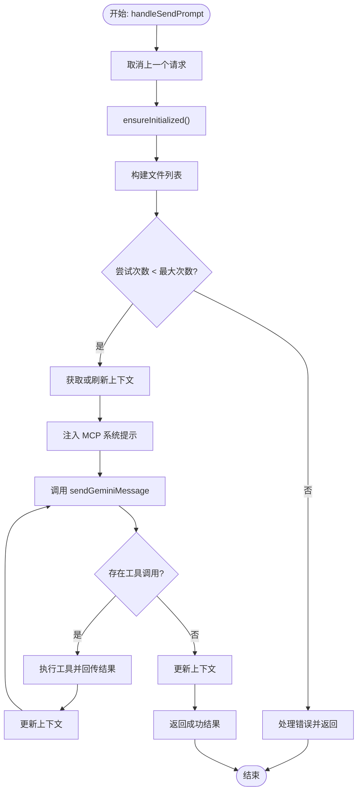
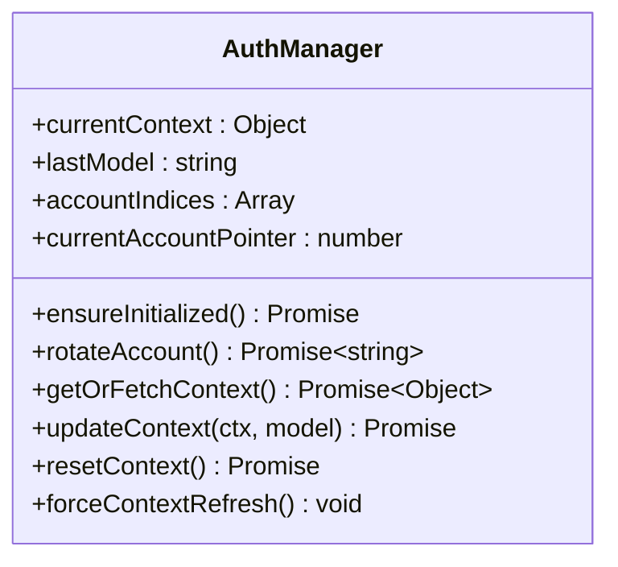
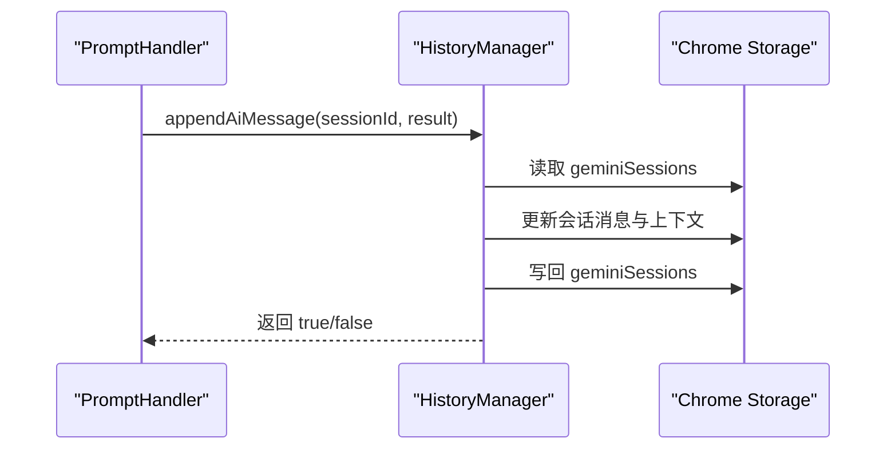
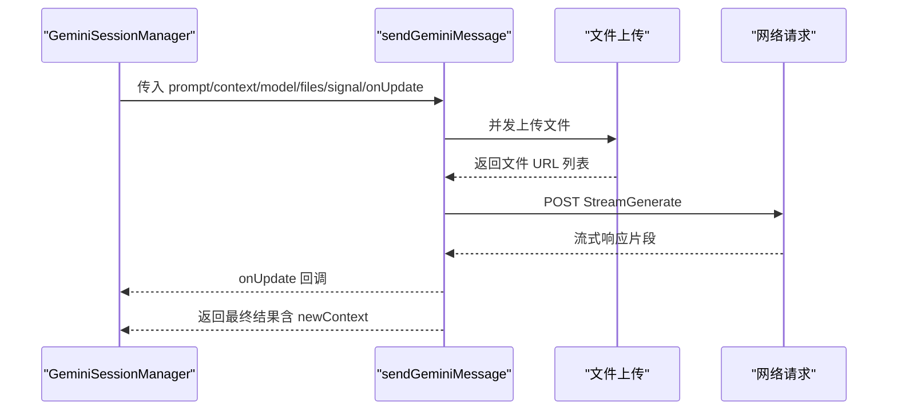
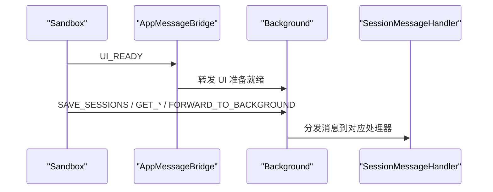
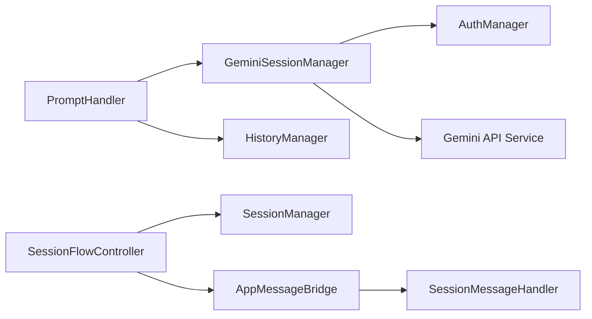

# 会话管理器

<cite>
**本文档引用的文件**
- [background/managers/session_manager.js](file://background/managers/session_manager.js)
- [sandbox/core/session_manager.js](file://sandbox/core/session_manager.js)
- [background/handlers/session.js](file://background/handlers/session.js)
- [background/handlers/session/context_handler.js](file://background/handlers/session/context_handler.js)
- [background/handlers/session/prompt_handler.js](file://background/handlers/session/prompt_handler.js)
- [background/managers/auth_manager.js](file://background/managers/auth_manager.js)
- [background/managers/history_manager.js](file://background/managers/history_manager.js)
- [services/gemini_api.js](file://services/gemini_api.js)
- [lib/messaging.js](file://lib/messaging.js)
- [sandbox/boot/messaging.js](file://sandbox/boot/messaging.js)
- [sandbox/controllers/session_flow.js](file://sandbox/controllers/session_flow.js)
- [background/index.js](file://background/index.js)
- [sandbox/boot/app.js](file://sandbox/boot/app.js)
</cite>

## 目录
1. [简介](#简介)
2. [项目结构](#项目结构)
3. [核心组件](#核心组件)
4. [架构总览](#架构总览)
5. [详细组件分析](#详细组件分析)
6. [依赖关系分析](#依赖关系分析)
7. [性能考虑](#性能考虑)
8. [故障排除指南](#故障排除指南)
9. [结论](#结论)

## 简介
本文件围绕会话管理器（SessionManager）在 background 与 sandbox 两个环境中的实现进行深入分析，重点涵盖：
- sandbox 中 SessionManager 的会话列表管理、当前会话切换、会话创建/删除/重命名、消息添加等核心功能
- background 中 GeminiSessionManager 如何与 Gemini API 交互、处理 AI 消息发送、上下文管理、多账户轮换认证等高级能力
- 两个会话管理器实例通过消息通信协同工作的机制
- 会话生命周期管理的职责划分
- 会话数据的序列化、持久化与跨组件访问模式
- 性能优化策略与常见边界情况处理

## 项目结构
本项目采用分层架构：background 负责与 Gemini API 交互、上下文管理与历史记录持久化；sandbox 负责用户界面渲染、会话状态管理与消息流控制；两者通过 postMessage 进行跨 iframe 通信。

```mermaid
graph TB
subgraph "Background"
BG_SM["GeminiSessionManager<br/>会话与上下文管理"]
BG_AM["AuthManager<br/>认证与上下文缓存"]
BG_HM["HistoryManager<br/>历史记录持久化"]
BG_API["Gemini API Service<br/>发送消息与流式响应"]
BG_MH["SessionMessageHandler<br/>消息路由"]
end
subgraph "Sandbox"
SB_SM["SessionManager<br/>本地会话状态"]
SB_SF["SessionFlowController<br/>会话流程控制"]
SB_MB["AppMessageBridge<br/>消息桥接"]
SB_LIB["Messaging Utils<br/>postMessage 封装"]
end
SB_SM <- --> SB_SF
SB_SF --> SB_LIB
SB_LIB --> SB_MB
SB_MB --> BG_MH
BG_MH --> BG_HM
BG_SM --> BG_API
BG_SM --> BG_AM
BG_MH --> BG_SM
```

图表来源
- [background/managers/session_manager.js](file://background/managers/session_manager.js#L6-L285)
- [background/managers/auth_manager.js](file://background/managers/auth_manager.js#L5-L130)
- [background/managers/history_manager.js](file://background/managers/history_manager.js#L1-L149)
- [services/gemini_api.js](file://services/gemini_api.js#L26-L230)
- [background/handlers/session.js](file://background/handlers/session.js#L7-L56)
- [sandbox/core/session_manager.js](file://sandbox/core/session_manager.js#L5-L105)
- [sandbox/controllers/session_flow.js](file://sandbox/controllers/session_flow.js#L7-L96)
- [sandbox/boot/messaging.js](file://sandbox/boot/messaging.js#L4-L90)
- [lib/messaging.js](file://lib/messaging.js#L4-L96)

章节来源
- [background/index.js](file://background/index.js#L1-L30)
- [sandbox/boot/app.js](file://sandbox/boot/app.js#L1-L90)

## 核心组件
- background/GeminiSessionManager：负责与 Gemini API 交互、上下文管理、多账户轮换、工具调用执行与错误处理。
- background/AuthManager：负责认证上下文的加载、存储、模型变更检测与账户轮换。
- background/HistoryManager：负责会话历史的保存、追加用户/AI 消息与侧边栏更新通知。
- services/gemini_api：封装 Gemini API 的请求构造、文件上传、流式读取与响应解析。
- sandbox/SessionManager：负责本地会话列表、当前会话、标题更新、消息添加与上下文设置。
- sandbox/SessionFlowController：负责新会话创建、会话切换、删除与重命名、UI 同步与持久化触发。
- 消息桥接：lib/messaging 与 sandbox/boot/messaging 提供跨 iframe 的消息传递与应用初始化。

章节来源
- [background/managers/session_manager.js](file://background/managers/session_manager.js#L6-L285)
- [background/managers/auth_manager.js](file://background/managers/auth_manager.js#L5-L130)
- [background/managers/history_manager.js](file://background/managers/history_manager.js#L1-L149)
- [services/gemini_api.js](file://services/gemini_api.js#L26-L230)
- [sandbox/core/session_manager.js](file://sandbox/core/session_manager.js#L5-L105)
- [sandbox/controllers/session_flow.js](file://sandbox/controllers/session_flow.js#L7-L96)
- [lib/messaging.js](file://lib/messaging.js#L4-L96)
- [sandbox/boot/messaging.js](file://sandbox/boot/messaging.js#L4-L90)

## 架构总览
下图展示了从用户输入到 Gemini API 请求、再到响应流式返回与本地会话更新的完整链路。



图表来源
- [sandbox/controllers/session_flow.js](file://sandbox/controllers/session_flow.js#L14-L58)
- [background/handlers/session.js](file://background/handlers/session.js#L15-L54)
- [background/handlers/session/prompt_handler.js](file://background/handlers/session/prompt_handler.js#L13-L101)
- [background/managers/session_manager.js](file://background/managers/session_manager.js#L21-L202)
- [background/managers/auth_manager.js](file://background/managers/auth_manager.js#L75-L92)
- [services/gemini_api.js](file://services/gemini_api.js#L26-L230)
- [background/managers/history_manager.js](file://background/managers/history_manager.js#L71-L106)

## 详细组件分析

### Sandbox 环境中的 SessionManager
- 数据结构设计
  - 会话列表 sessions：数组，元素包含 id、title、timestamp、messages、context。
  - 当前会话 currentSessionId：字符串标识当前选中会话。
- 关键方法
  - createSession：生成唯一 UUID，初始化新会话并置为当前会话。
  - setCurrentId/getCurrentSession：切换/获取当前会话。
  - getSortedSessions：按时间倒序返回会话列表。
  - deleteSession：删除指定会话，若删除的是当前会话则自动切换到下一个。
  - updateTitle/renameSession：限制标题长度并仅在默认标题时更新。
  - addMessage：支持用户附件（base64 字符串）与 AI 生成图片数组，自动更新时间戳。
  - updateContext：更新指定会话的上下文。
- 本地状态管理
  - 会话列表与当前会话 ID 仅存在于内存中，通过消息桥接触发持久化。



图表来源
- [sandbox/core/session_manager.js](file://sandbox/core/session_manager.js#L5-L105)

章节来源
- [sandbox/core/session_manager.js](file://sandbox/core/session_manager.js#L11-L104)
- [sandbox/controllers/session_flow.js](file://sandbox/controllers/session_flow.js#L72-L94)

### Sandbox 会话流程控制器（SessionFlowController）
- 职责
  - 新建会话：取消生成、重置流、创建会话并切换。
  - 切换会话：取消生成、重置流、渲染历史、根据会话上下文向后台发送 SET_CONTEXT 或 RESET_CONTEXT。
  - 删除/重命名：调用 SessionManager 并持久化。
  - UI 同步：清空聊天历史、逐条渲染消息、滚动到底部、刷新历史列表。
- 与消息系统协作
  - 使用 lib/messaging 的 sendToBackground 与 saveSessionsToStorage。
  - 通过 sandbox/boot/messaging 的 AppMessageBridge 接收后台消息。



图表来源
- [sandbox/controllers/session_flow.js](file://sandbox/controllers/session_flow.js#L14-L58)
- [lib/messaging.js](file://lib/messaging.js#L4-L16)
- [sandbox/boot/messaging.js](file://sandbox/boot/messaging.js#L49-L89)

章节来源
- [sandbox/controllers/session_flow.js](file://sandbox/controllers/session_flow.js#L7-L96)
- [lib/messaging.js](file://lib/messaging.js#L4-L96)
- [sandbox/boot/messaging.js](file://sandbox/boot/messaging.js#L4-L90)

### Background 环境中的 GeminiSessionManager
- 职责
  - 与 Gemini API 交互：构建请求、处理流式响应、更新上下文。
  - 多账户轮换：基于 AuthManager 的账户索引循环切换。
  - 工具调用：解析响应中的工具调用并执行，再回传给模型继续推理。
  - 错误处理：登录失效、速率限制、空响应、无效响应等场景的友好提示与恢复。
- 关键流程
  - handleSendPrompt：取消上一次请求、构造文件列表、根据账户数量决定重试次数、调用 sendGeminiMessage、解析工具调用并执行、更新上下文、返回结果。
  - cancelCurrentRequest：使用 AbortController 取消当前请求。
  - setContext/resetContext：委托 AuthManager 更新/重置上下文并持久化。
  - parseToolCall：解析响应中的工具调用 JSON 结构（多种格式兼容）。



图表来源
- [background/managers/session_manager.js](file://background/managers/session_manager.js#L21-L202)

章节来源
- [background/managers/session_manager.js](file://background/managers/session_manager.js#L6-L285)

### AuthManager 上下文管理
- 功能
  - 初始化：从 chrome.storage.local 恢复上下文、模型与账户索引。
  - 账户轮换：动态从存储刷新账户索引，循环切换当前指针并持久化。
  - 上下文获取：若无上下文则通过服务层获取请求参数并构造上下文对象。
  - 上下文更新/重置：写入存储并可触发账户轮换以分散负载。
- 与 GeminiSessionManager 协作
  - GeminiSessionManager 在每次请求前调用 getOrFetchContext，并在成功后通过 updateContext 写回存储。



图表来源
- [background/managers/auth_manager.js](file://background/managers/auth_manager.js#L5-L130)

章节来源
- [background/managers/auth_manager.js](file://background/managers/auth_manager.js#L14-L129)

### 历史记录持久化（HistoryManager）
- 功能
  - saveToHistory：创建新的会话并保存到 chrome.storage.local 的 geminiSessions 数组顶部。
  - appendAiMessage：向现有会话追加 AI 响应，更新时间戳与上下文并置顶。
  - appendUserMessage：向现有会话追加用户消息（含工具输出），用于自动化浏览器控制循环。
  - 通知侧边栏：通过 runtime.sendMessage 触发 SESSIONS_UPDATED。
- 与 GeminiSessionManager 协作
  - PromptHandler 在收到 Gemini 回复后调用 appendAiMessage 与 appendUserMessage，确保即使 UI 关闭也能持久化。



图表来源
- [background/managers/history_manager.js](file://background/managers/history_manager.js#L71-L106)

章节来源
- [background/managers/history_manager.js](file://background/managers/history_manager.js#L12-L149)

### Gemini API 服务层
- 功能
  - 构造请求体：根据模型配置与是否包含文件选择不同的消息结构。
  - 文件上传：并发上传多模态文件并收集 URL 列表。
  - 流式读取：逐行解析响应，实时回调 onUpdate。
  - 错误判定：登录失效、速率限制、空响应、无效响应等。
  - 上下文更新：从最终响应中提取新的 contextIds 并返回。
- 与 GeminiSessionManager 协作
  - GeminiSessionManager 将模型、上下文、文件与信号传递给该函数，并在 onUpdate 中驱动 UI 流式更新。



图表来源
- [services/gemini_api.js](file://services/gemini_api.js#L26-L230)
- [background/managers/session_manager.js](file://background/managers/session_manager.js#L66-L74)

章节来源
- [services/gemini_api.js](file://services/gemini_api.js#L26-L230)

### 消息通信与初始化
- Sandbox 初始化
  - sandbox/boot/app.js 动态导入 SessionManager、UIController、AppController，并通过 AppMessageBridge 接收后台消息。
- 消息封装
  - lib/messaging 提供统一的 postMessage 封装，包括保存会话、主题、语言、快捷键、账户索引、Gem ID 等。
- 后台初始化
  - background/index.js 初始化各管理器并注册消息监听器，启动 MCP 管理器与菜单。



图表来源
- [sandbox/boot/app.js](file://sandbox/boot/app.js#L11-L89)
- [sandbox/boot/messaging.js](file://sandbox/boot/messaging.js#L29-L89)
- [lib/messaging.js](file://lib/messaging.js#L4-L96)
- [background/index.js](file://background/index.js#L16-L27)

章节来源
- [sandbox/boot/app.js](file://sandbox/boot/app.js#L1-L90)
- [sandbox/boot/messaging.js](file://sandbox/boot/messaging.js#L1-L90)
- [lib/messaging.js](file://lib/messaging.js#L1-L96)
- [background/index.js](file://background/index.js#L1-L30)

## 依赖关系分析
- 组件耦合
  - GeminiSessionManager 依赖 AuthManager（上下文）、MCPManager（工具执行）、Gemini API Service（请求发送）。
  - PromptHandler 依赖 GeminiSessionManager（发送请求）、HistoryManager（持久化）、PromptBuilder/ToolExecutor（构建与执行）。
  - SessionFlowController 依赖 SessionManager（本地状态）、UIController（渲染）、AppController（应用状态）。
- 外部依赖
  - chrome.storage.local：历史记录与上下文持久化。
  - chrome.runtime：消息通知与侧边栏更新。
  - fetch：与 Gemini API 通信。
- 潜在循环依赖
  - 通过模块导入避免直接循环依赖，消息路由在 handlers 层解耦具体实现。



图表来源
- [background/managers/session_manager.js](file://background/managers/session_manager.js#L3-L11)
- [background/handlers/session/prompt_handler.js](file://background/handlers/session/prompt_handler.js#L6-L11)
- [sandbox/controllers/session_flow.js](file://sandbox/controllers/session_flow.js#L8-L12)
- [sandbox/boot/messaging.js](file://sandbox/boot/messaging.js#L4-L23)

章节来源
- [background/managers/session_manager.js](file://background/managers/session_manager.js#L3-L11)
- [background/handlers/session/prompt_handler.js](file://background/handlers/session/prompt_handler.js#L6-L11)
- [sandbox/controllers/session_flow.js](file://sandbox/controllers/session_flow.js#L8-L12)

## 性能考虑
- 流式响应与增量更新
  - Gemini API 采用流式传输，onUpdate 实时回调，避免一次性渲染大量文本导致卡顿。
- 并发文件上传
  - 文件上传使用 Promise.all 并发处理，缩短整体等待时间。
- 会话列表与 UI 渲染
  - 会话列表按时间排序，渲染时仅处理当前会话消息，减少 DOM 操作。
- 上下文缓存与模型变更
  - AuthManager 缓存上下文与模型，模型变更时强制刷新，避免无效上下文导致的重复请求。
- 账户轮换与负载分散
  - 多账户轮换与重置时的账户轮换，降低单账号被限流的风险。
- 速率限制与错误恢复
  - 对速率限制、登录失效、空响应、无效响应进行分类处理与用户提示，避免无意义重试。

[本节为通用性能建议，不直接分析特定文件]

## 故障排除指南
- 登录失效/会话过期
  - GeminiSessionManager 检测到登录错误时，会清除本地上下文并提示用户前往登录页面。
- 速率限制
  - 对频繁请求进行友好提示，建议稍后再试。
- 空响应/服务器无响应
  - 提示刷新 Gemini 页面并重试。
- 无效响应/解析失败
  - 提示刷新后重试。
- 工具执行失败
  - 在流式响应中追加错误信息，不影响主流程继续。

章节来源
- [background/managers/session_manager.js](file://background/managers/session_manager.js#L129-L199)

## 结论
本项目通过清晰的职责划分与消息桥接，实现了 sandbox 与 background 的高效协作：
- sandbox 负责本地会话状态与 UI 渲染，background 负责与 Gemini API 的复杂交互与上下文管理。
- 通过 HistoryManager 保证会话历史的可靠持久化，即使 UI 关闭也能正确保存。
- GeminiSessionManager 提供多账户轮换、工具调用执行与健壮的错误处理，提升用户体验与稳定性。
- 建议持续关注流式响应的内存占用、并发上传的资源管理与上下文缓存的命中率，以进一步优化性能。