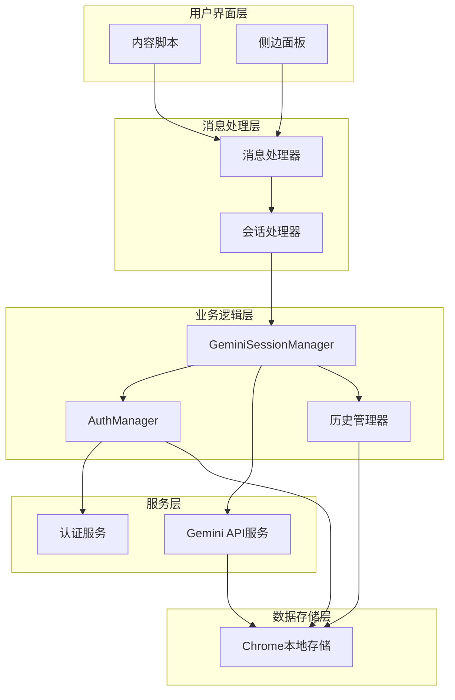
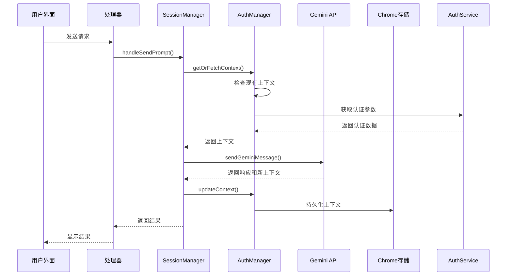
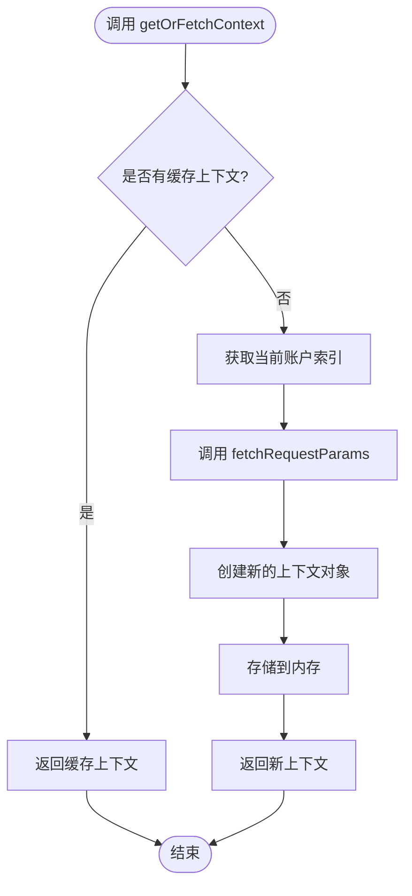
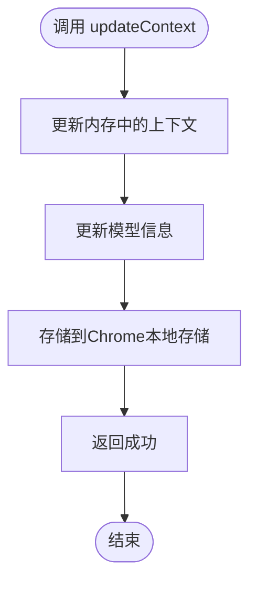
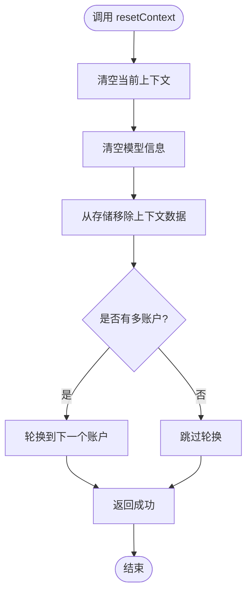
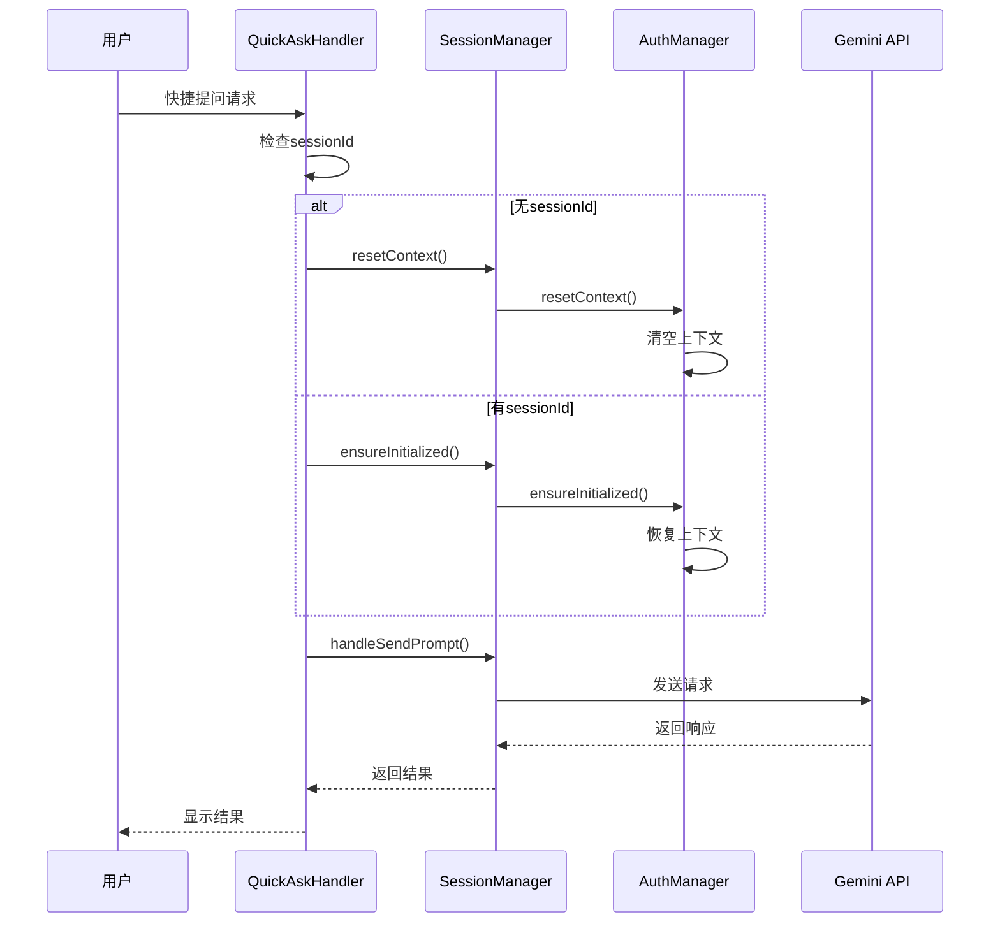
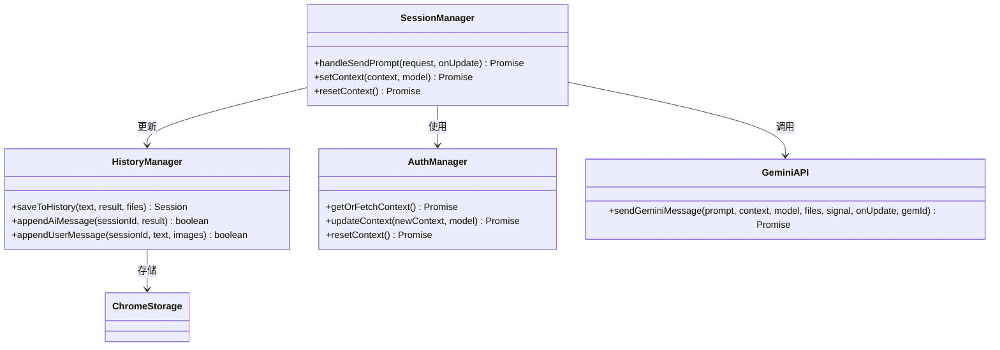
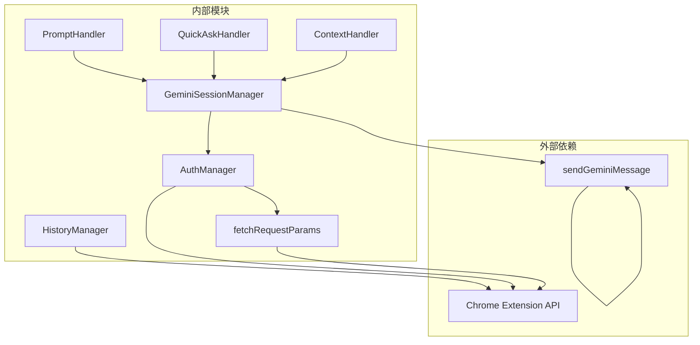

# 上下文管理集成

<cite>
**本文档引用的文件**
- [background/managers/session_manager.js](file://background/managers/session_manager.js)
- [background/managers/auth_manager.js](file://background/managers/auth_manager.js)
- [background/handlers/session/context_handler.js](file://background/handlers/session/context_handler.js)
- [background/handlers/session/prompt_handler.js](file://background/handlers/session/prompt_handler.js)
- [background/handlers/session/quick_ask_handler.js](file://background/handlers/session/quick_ask_handler.js)
- [background/handlers/session.js](file://background/handlers/session.js)
- [services/gemini_api.js](file://services/gemini_api.js)
- [services/auth.js](file://services/auth.js)
- [background/managers/history_manager.js](file://background/managers/history_manager.js)
- [background/index.js](file://background/index.js)
</cite>

## 目录
1. [简介](#简介)
2. [项目结构](#项目结构)
3. [核心组件](#核心组件)
4. [架构概览](#架构概览)
5. [详细组件分析](#详细组件分析)
6. [依赖关系分析](#依赖关系分析)
7. [性能考虑](#性能考虑)
8. [故障排除指南](#故障排除指南)
9. [结论](#结论)

## 简介

本文档深入分析了GeminiNexus项目中上下文管理集成的完整实现，重点阐述了GeminiSessionManager如何通过AuthManager实现会话上下文的全生命周期管理。该系统支持多账户切换、模型变更处理、会话持久化等高级功能，为用户提供无缝的AI对话体验。

系统的核心价值在于：
- **全生命周期管理**：从上下文初始化到持久化存储的完整流程
- **多账户支持**：动态账户轮换和会话隔离
- **智能重试机制**：基于上下文状态的错误恢复
- **会话历史记录**：完整的对话历史保存和恢复能力

## 项目结构

GeminiNexus采用模块化的架构设计，主要分为以下几个层次：

**图表来源**
- [background/index.js](file://background/index.js#L16-L26)
- [background/handlers/session.js](file://background/handlers/session.js#L7-L13)

**章节来源**
- [background/index.js](file://background/index.js#L1-L30)
- [background/handlers/session.js](file://background/handlers/session.js#L1-L56)

## 核心组件

### GeminiSessionManager - 会话管理核心

GeminiSessionManager是整个上下文管理系统的核心控制器，负责协调各个组件完成完整的会话生命周期管理。

**关键特性：**
- **请求前准备**：确保认证初始化和上下文获取
- **请求后处理**：更新上下文状态和错误处理
- **工具执行**：支持MCP工具链的自动执行
- **多账户支持**：智能账户轮换和负载均衡

**章节来源**
- [background/managers/session_manager.js](file://background/managers/session_manager.js#L6-L285)

### AuthManager - 认证与上下文管理

AuthManager专门负责认证状态和上下文数据的管理，提供完整的上下文生命周期控制。

**核心功能：**
- **上下文获取**：`getOrFetchContext()`方法实现懒加载机制
- **上下文更新**：`updateContext()`方法持久化上下文状态
- **上下文重置**：`resetContext()`方法清理所有会话状态
- **模型变更检测**：自动检测模型变化并重置上下文

**章节来源**
- [background/managers/auth_manager.js](file://background/managers/auth_manager.js#L5-L130)

### Handler系统 - 功能入口点

系统提供了多个专门的处理器来处理不同的使用场景：

- **PromptHandler**：标准对话处理
- **QuickAskHandler**：快捷提问处理  
- **ContextHandler**：上下文直接操作

**章节来源**
- [background/handlers/session/prompt_handler.js](file://background/handlers/session/prompt_handler.js#L6-L103)
- [background/handlers/session/quick_ask_handler.js](file://background/handlers/session/quick_ask_handler.js#L5-L99)
- [background/handlers/session/context_handler.js](file://background/handlers/session/context_handler.js#L4-L21)

## 架构概览

系统采用分层架构设计，每层都有明确的职责分工：

**图表来源**
- [background/managers/session_manager.js](file://background/managers/session_manager.js#L50-L118)
- [services/gemini_api.js](file://services/gemini_api.js#L26-L230)

## 详细组件分析

### 上下文获取流程 - getOrFetchContext()

getOrFetchContext()方法实现了智能的上下文懒加载机制：

**图表来源**
- [background/managers/auth_manager.js](file://background/managers/auth_manager.js#L75-L92)
- [services/auth.js](file://services/auth.js#L7-L41)

**章节来源**
- [background/managers/auth_manager.js](file://background/managers/auth_manager.js#L75-L92)
- [services/auth.js](file://services/auth.js#L7-L41)

### 上下文更新流程 - updateContext()

updateContext()方法负责将新的上下文状态持久化到Chrome存储中：

**图表来源**
- [background/managers/auth_manager.js](file://background/managers/auth_manager.js#L105-L113)

**章节来源**
- [background/managers/auth_manager.js](file://background/managers/auth_manager.js#L105-L113)

### 上下文重置流程 - resetContext()

resetContext()方法用于完全清理会话状态，支持多种使用场景：

**图表来源**
- [background/managers/auth_manager.js](file://background/managers/auth_manager.js#L115-L124)

**章节来源**
- [background/managers/auth_manager.js](file://background/managers/auth_manager.js#L115-L124)

### 快捷提问场景的上下文管理

QuickAskHandler针对快捷提问场景进行了特殊优化：

**图表来源**
- [background/handlers/session/quick_ask_handler.js](file://background/handlers/session/quick_ask_handler.js#L11-L44)

**章节来源**
- [background/handlers/session/quick_ask_handler.js](file://background/handlers/session/quick_ask_handler.js#L11-L44)

### 会话历史记录与上下文同步

系统通过HistoryManager确保会话历史与上下文状态保持同步：

**图表来源**
- [background/managers/history_manager.js](file://background/managers/history_manager.js#L12-L63)
- [background/managers/session_manager.js](file://background/managers/session_manager.js#L21-L202)

**章节来源**
- [background/managers/history_manager.js](file://background/managers/history_manager.js#L12-L149)

## 依赖关系分析

系统的依赖关系清晰且层次分明：

**图表来源**
- [background/managers/session_manager.js](file://background/managers/session_manager.js#L3-L4)
- [background/handlers/session.js](file://background/handlers/session.js#L3-L5)

**章节来源**
- [background/managers/session_manager.js](file://background/managers/session_manager.js#L3-L4)
- [background/handlers/session.js](file://background/handlers/session.js#L3-L5)

## 性能考虑

### 上下文缓存策略

系统采用了智能的上下文缓存机制：
- **懒加载**：仅在需要时才获取新的上下文
- **内存缓存**：避免重复的网络请求
- **自动失效**：基于模型变更和账户轮换的上下文失效

### 错误恢复机制

系统实现了多层次的错误恢复：
- **账户轮换**：多账户配置下的自动故障转移
- **上下文重置**：会话状态异常时的完全重置
- **请求取消**：支持用户主动取消正在进行的请求

### 并发控制

通过AbortController实现请求级别的并发控制：
- 防止多个请求同时竞争资源
- 支持快速取消和重新开始
- 维护会话状态的一致性

## 故障排除指南

### 常见问题及解决方案

**问题1：会话过期**
- **症状**：收到"未登录"或"会话已过期"错误
- **原因**：认证令牌失效或账户切换
- **解决**：调用`forceContextRefresh()`强制刷新上下文

**问题2：模型变更导致的问题**
- **症状**：切换模型后出现异常行为
- **原因**：上下文与新模型不兼容
- **解决**：系统自动检测并重置上下文

**问题3：多账户冲突**
- **症状**：不同账户间的数据混淆
- **原因**：账户索引配置错误
- **解决**：检查`geminiAccountIndices`配置

**章节来源**
- [background/managers/session_manager.js](file://background/managers/session_manager.js#L129-L192)
- [background/managers/auth_manager.js](file://background/managers/auth_manager.js#L98-L103)

### 调试技巧

1. **启用详细日志**：检查控制台输出的调试信息
2. **监控存储状态**：验证Chrome存储中的上下文数据
3. **跟踪请求流程**：使用浏览器开发者工具监控网络请求

## 结论

GeminiNexus的上下文管理集成为现代AI应用提供了完整的会话管理解决方案。通过GeminiSessionManager与AuthManager的紧密协作，系统实现了：

- **完整的生命周期管理**：从上下文初始化到持久化的全流程覆盖
- **智能的多账户支持**：动态账户轮换和会话隔离
- **强大的错误恢复能力**：基于上下文状态的智能故障转移
- **高效的性能表现**：通过缓存和并发控制优化用户体验

该系统的设计充分考虑了实际使用场景的需求，为用户提供了稳定、可靠、高性能的AI对话体验。其模块化的架构也为未来的功能扩展奠定了良好的基础。