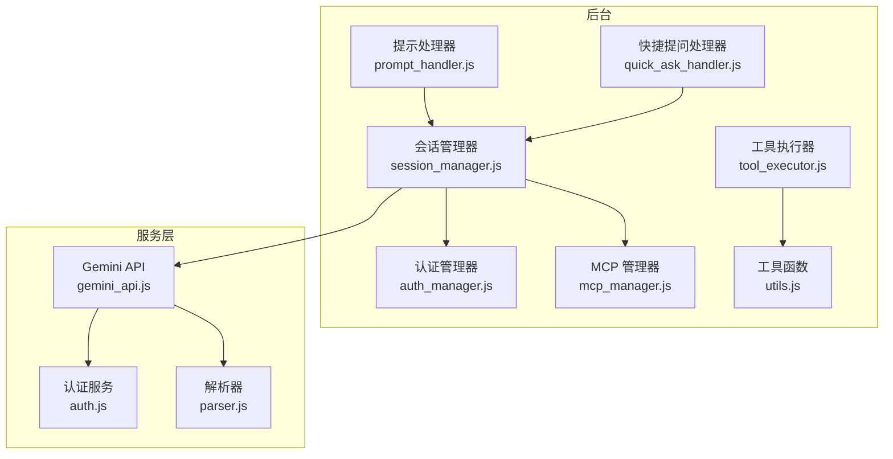
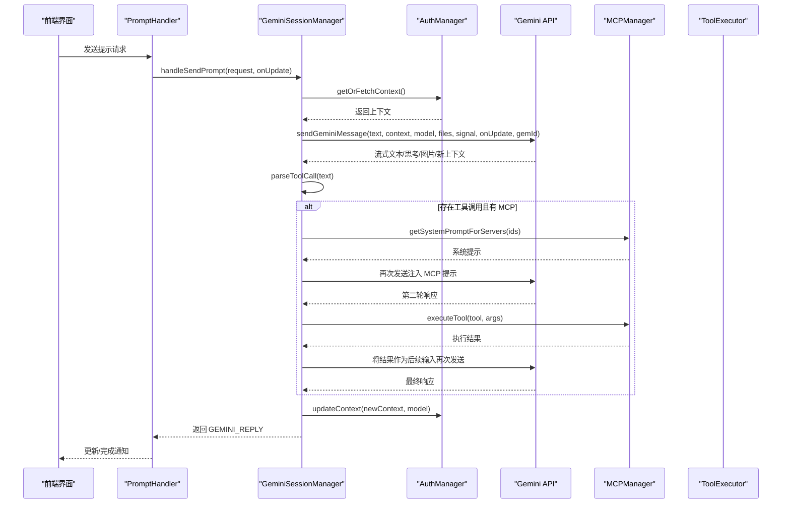
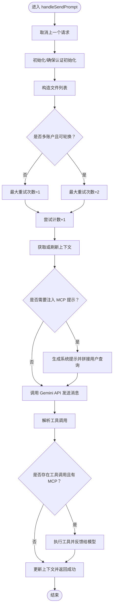
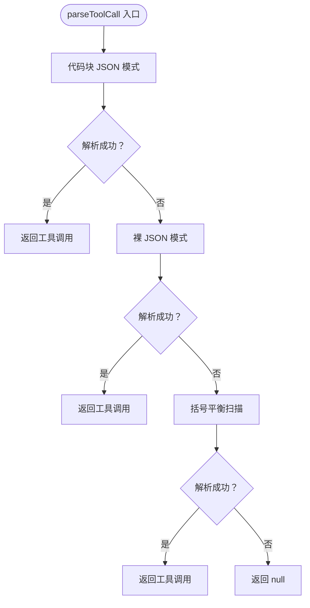
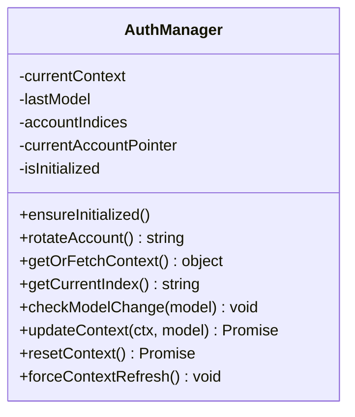
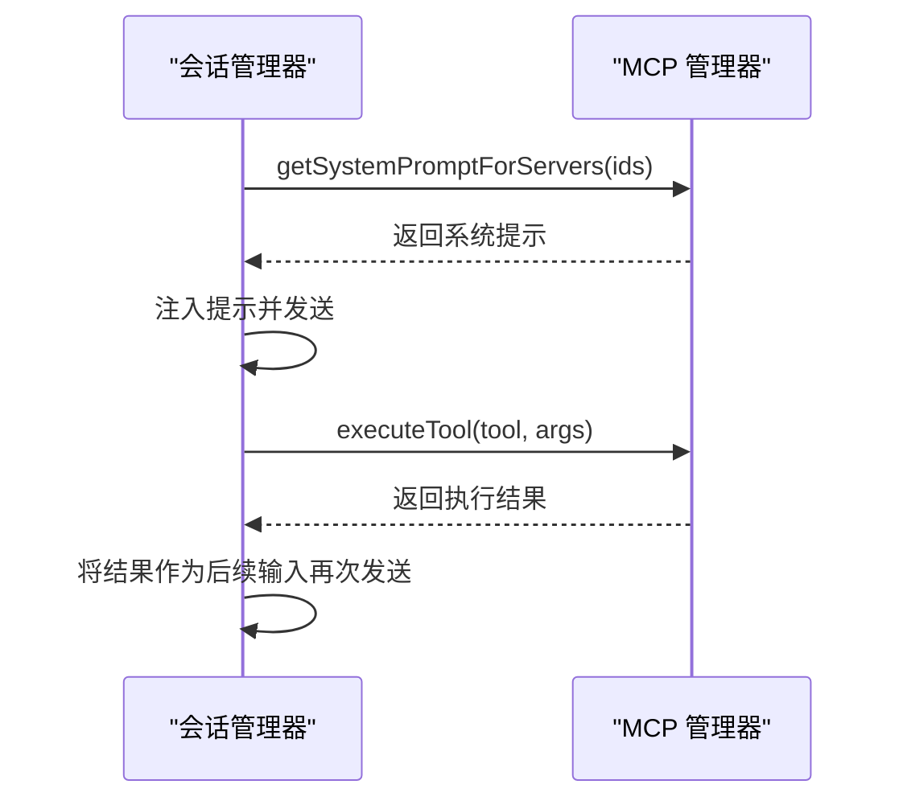
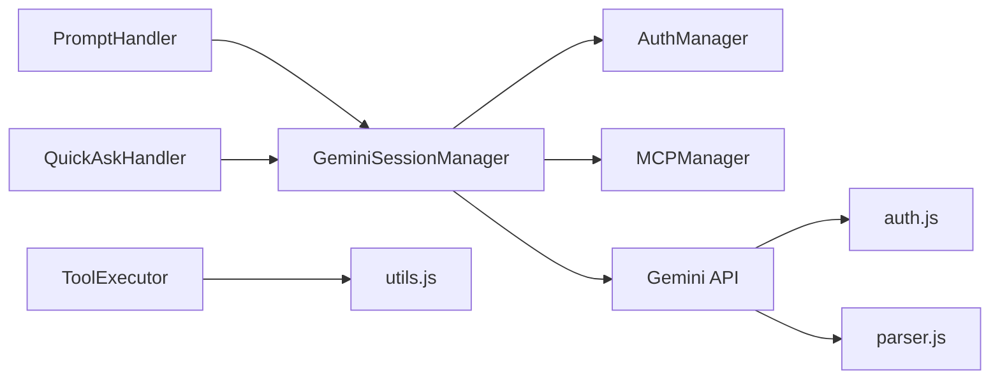

# 后台会话管理器

<cite>
**本文引用的文件**
- [background/managers/session_manager.js](file://background/managers/session_manager.js)
- [background/managers/auth_manager.js](file://background/managers/auth_manager.js)
- [background/managers/mcp_manager.js](file://background/managers/mcp_manager.js)
- [background/handlers/session/prompt_handler.js](file://background/handlers/session/prompt_handler.js)
- [background/handlers/session/quick_ask_handler.js](file://background/handlers/session/quick_ask_handler.js)
- [background/handlers/session/prompt/tool_executor.js](file://background/handlers/session/prompt/tool_executor.js)
- [background/handlers/session/utils.js](file://background/handlers/session/utils.js)
- [services/gemini_api.js](file://services/gemini_api.js)
- [services/auth.js](file://services/auth.js)
- [services/parser.js](file://services/parser.js)
- [background/index.js](file://background/index.js)
</cite>

## 目录
1. [简介](#简介)
2. [项目结构](#项目结构)
3. [核心组件](#核心组件)
4. [架构总览](#架构总览)
5. [详细组件分析](#详细组件分析)
6. [依赖关系分析](#依赖关系分析)
7. [性能考量](#性能考量)
8. [故障排查指南](#故障排查指南)
9. [结论](#结论)
10. [附录](#附录)

## 简介
本文件围绕后台会话管理器 GeminiSessionManager 的实现进行深度技术解析，重点覆盖以下方面：
- handleSendPrompt 方法的完整执行流程：包括 abortController 请求取消机制、多账户轮换重试逻辑（attemptCount 与 maxAttempts）、MCP 工具调用注入（mcpPrompt）与执行循环的实现细节。
- parseToolCall 方法的三种正则匹配模式（代码块 JSON、裸 JSON 对象、括号平衡扫描）如何应对 LLM 输出的不确定性。
- AuthManager 集成如何实现上下文管理（getOrFetchContext/updateContext）与多账户认证轮换。
- 错误处理机制中对 401/403 等特定错误码的识别与自动恢复策略，以及用户友好错误消息的本地化构建。
- 提供代码示例路径展示 cancelCurrentRequest 的中断实现与 resetContext 的上下文重置流程。
- 讨论该组件与 prompt_handler、quick_ask_handler 等处理器的依赖关系及其在 AI 请求处理链中的核心地位。

## 项目结构
本项目采用按职责分层的组织方式：
- background：后台逻辑与管理器
  - managers：会话、认证、MCP、历史、图像、日志、保持活跃等管理器
  - handlers：会话处理器（prompt_handler、quick_ask_handler 等）
  - lib：追踪与辅助工具
- services：与外部服务交互（Gemini API、认证、解析、上传）
- content：内容脚本与 UI 渲染
- sandbox：沙箱侧会话与渲染管线
- 根目录：清单、国际化、样式与入口



图表来源
- [background/managers/session_manager.js](file://background/managers/session_manager.js#L1-L285)
- [background/managers/auth_manager.js](file://background/managers/auth_manager.js#L1-L130)
- [background/managers/mcp_manager.js](file://background/managers/mcp_manager.js#L1-L530)
- [background/handlers/session/prompt_handler.js](file://background/handlers/session/prompt_handler.js#L1-L103)
- [background/handlers/session/quick_ask_handler.js](file://background/handlers/session/quick_ask_handler.js#L1-L99)
- [background/handlers/session/prompt/tool_executor.js](file://background/handlers/session/prompt/tool_executor.js#L1-L49)
- [background/handlers/session/utils.js](file://background/handlers/session/utils.js#L1-L64)
- [services/gemini_api.js](file://services/gemini_api.js#L1-L230)
- [services/auth.js](file://services/auth.js#L1-L41)
- [services/parser.js](file://services/parser.js#L1-L157)

章节来源
- [background/index.js](file://background/index.js#L1-L30)

## 核心组件
- GeminiSessionManager：负责发送提示、流式更新、MCP 注入与执行、上下文更新与错误处理。
- AuthManager：负责多账户索引加载、当前账户轮换、上下文获取与更新、模型变更检测与强制刷新。
- MCPManager：负责 MCP 服务器连接、工具发现、系统提示生成、工具执行（HTTP/SSE 模式适配）。
- PromptHandler/QuickAskHandler：前端请求入口，封装会话管理器并驱动工具执行循环与历史记录。
- Gemini API 服务：封装请求参数、文件上传、SSE 流解析、错误识别与上下文回写。
- 解析器：从 SSE 行中提取文本、思考过程、图片与上下文 ID。

章节来源
- [background/managers/session_manager.js](file://background/managers/session_manager.js#L6-L285)
- [background/managers/auth_manager.js](file://background/managers/auth_manager.js#L5-L130)
- [background/managers/mcp_manager.js](file://background/managers/mcp_manager.js#L2-L530)
- [services/gemini_api.js](file://services/gemini_api.js#L26-L230)
- [services/parser.js](file://services/parser.js#L4-L157)

## 架构总览
下图展示了从浏览器触发到最终回复的关键调用链路，以及会话管理器在其中的核心地位。



图表来源
- [background/handlers/session/prompt_handler.js](file://background/handlers/session/prompt_handler.js#L13-L101)
- [background/managers/session_manager.js](file://background/managers/session_manager.js#L21-L202)
- [background/managers/auth_manager.js](file://background/managers/auth_manager.js#L75-L113)
- [services/gemini_api.js](file://services/gemini_api.js#L26-L230)
- [background/managers/mcp_manager.js](file://background/managers/mcp_manager.js#L446-L477)

## 详细组件分析

### 会话管理器：handleSendPrompt 执行流程
- 请求取消与并发控制
  - 使用 AbortController 在每次新请求前取消上一次请求，避免竞态与资源浪费。
  - 取消后释放控制器引用，防止内存泄漏。
- 多账户轮换与重试
  - 当配置多个账户时，最多尝试两次；若首次失败且为认证类错误，则轮换账户并强制刷新上下文后重试。
  - 成功后更新模型与上下文，并返回标准化结果。
- 文件与多模态支持
  - 支持直接传入文件数组或单张图片，统一转换为上传后的文件列表。
- MCP 注入与执行循环
  - 若请求包含 MCP 服务器 ID 列表，则生成系统提示并拼接至用户查询前。
  - 解析响应中的工具调用，若存在则执行工具并将结果反馈给模型，形成一次“工具执行循环”。
  - 工具执行失败时保留原始响应文本并追加错误信息，保证用户可见性。
- 错误处理与本地化
  - 识别 401/403、未登录、会话过期、速率限制、空响应、无效响应等错误类型。
  - 根据浏览器语言环境生成本地化错误消息，并在必要时引导用户打开登录页面或刷新页面。
- 中断与上下文管理
  - cancelCurrentRequest：调用 abortController.abort() 并清理引用。
  - resetContext：清空上下文并可轮换账户指针，用于重置会话状态。



图表来源
- [background/managers/session_manager.js](file://background/managers/session_manager.js#L21-L202)

章节来源
- [background/managers/session_manager.js](file://background/managers/session_manager.js#L21-L202)

### 工具调用解析：parseToolCall 的三种正则模式
- 代码块 JSON 匹配
  - 查找形如 ```json ... ``` 的代码块，提取其中 JSON，验证 action 为 call_tool，返回工具名与参数。
- 裸 JSON 对象匹配
  - 在非代码块环境中查找包含 "action":"call_tool" 的 JSON 片段，尝试解析并校验。
- 括号平衡扫描
  - 从 "action":"call_tool" 开始，通过左右大括号计数找到最短闭合范围，再尝试解析 JSON。
- 容错策略
  - 任一阶段解析失败均忽略，继续尝试其他模式；最终无法解析则返回 null。



图表来源
- [background/managers/session_manager.js](file://background/managers/session_manager.js#L221-L283)

章节来源
- [background/managers/session_manager.js](file://background/managers/session_manager.js#L221-L283)

### 认证管理：上下文获取与多账户轮换
- 上下文获取与刷新
  - 若已有上下文则直接返回；否则根据当前账户索引拉取 AT/BL 值与用户索引，组装上下文。
- 模型变更检测
  - 若模型发生变化，强制清空上下文，以便重新初始化。
- 多账户轮换
  - 从存储中读取账户索引列表，按顺序轮换当前指针，并持久化新的指针值。
- 上下文更新与重置
  - 更新上下文与模型后写入存储；重置上下文时清除存储并可轮换账户以分散负载。



图表来源
- [background/managers/auth_manager.js](file://background/managers/auth_manager.js#L5-L130)

章节来源
- [background/managers/auth_manager.js](file://background/managers/auth_manager.js#L14-L129)

### MCP 管理：系统提示注入与工具执行
- 系统提示生成
  - 根据已连接服务器与工具集合生成系统提示，指导模型输出符合规范的工具调用 JSON。
- 工具执行
  - 根据工具名定位对应服务器，选择 HTTP 或 SSE 模式发起 JSON-RPC 调用，返回结构化结果。
- 注入与执行循环
  - 会话管理器在发送前注入 MCP 系统提示；收到工具调用后执行并再次发送结果，形成闭环。



图表来源
- [background/managers/mcp_manager.js](file://background/managers/mcp_manager.js#L446-L477)
- [background/managers/mcp_manager.js](file://background/managers/mcp_manager.js#L479-L525)
- [background/managers/session_manager.js](file://background/managers/session_manager.js#L54-L114)

章节来源
- [background/managers/mcp_manager.js](file://background/managers/mcp_manager.js#L406-L525)

### 错误处理与本地化
- 错误识别
  - 通过错误消息中包含“未登录”、“Not logged in”、“Sign in”、“401”、“403”等关键词识别认证错误。
  - 通过“请求过于频繁”、“429”、“RESOURCE_EXHAUSTED”识别速率限制。
  - 通过“服务器无响应”、“空响应”识别网络异常。
  - 通过“响应解析失败”识别格式异常。
- 自动恢复
  - 认证错误且未达最大重试次数时，轮换账户并强制刷新上下文后重试。
- 用户友好消息
  - 根据浏览器语言环境生成本地化消息，并在必要时提供登录或刷新链接。

章节来源
- [background/managers/session_manager.js](file://background/managers/session_manager.js#L129-L198)

### 代码示例路径
- 取消当前请求（中断实现）
  - [cancelCurrentRequest 实现路径](file://background/managers/session_manager.js#L204-L211)
- 重置上下文（上下文重置流程）
  - [resetContext 实现路径](file://background/managers/session_manager.js#L217-L219)
  - [AuthManager.resetContext 实现路径](file://background/managers/auth_manager.js#L115-L124)

## 依赖关系分析
- 会话管理器依赖
  - AuthManager：上下文获取/更新、多账户轮换、模型变更检测。
  - MCPManager：系统提示生成、工具执行。
  - Gemini API：发送消息、流式解析、错误识别、上下文回写。
- 处理器依赖
  - PromptHandler：驱动会话管理器，处理工具执行循环与历史记录。
  - QuickAskHandler：快速问答入口，负责上下文重置与结果保存。
- 工具执行
  - ToolExecutor：基于会话处理器解析出的工具命令，调用浏览器控制管理器执行。



图表来源
- [background/handlers/session/prompt_handler.js](file://background/handlers/session/prompt_handler.js#L6-L11)
- [background/handlers/session/quick_ask_handler.js](file://background/handlers/session/quick_ask_handler.js#L5-L9)
- [background/managers/session_manager.js](file://background/managers/session_manager.js#L3-L4)
- [services/gemini_api.js](file://services/gemini_api.js#L3-L5)

章节来源
- [background/handlers/session/prompt_handler.js](file://background/handlers/session/prompt_handler.js#L1-L103)
- [background/handlers/session/quick_ask_handler.js](file://background/handlers/session/quick_ask_handler.js#L1-L99)
- [background/handlers/session/prompt/tool_executor.js](file://background/handlers/session/prompt/tool_executor.js#L1-L49)
- [background/handlers/session/utils.js](file://background/handlers/session/utils.js#L4-L21)

## 性能考量
- 并发与取消
  - 使用 AbortController 防止旧请求占用带宽与资源，降低延迟抖动。
- 文件上传并行化
  - Gemini API 层面对多文件上传使用 Promise.all 并行处理，缩短端到端时间。
- 流式解析与增量更新
  - 服务端解析器逐行解析，及时回调 onUpdate，提升感知速度。
- MCP 执行模式
  - HTTP 模式与 SSE 模式自适应，减少不必要的连接开销。

[本节为通用性能建议，不直接分析具体文件]

## 故障排查指南
- 常见错误与对策
  - 未登录/会话过期：清除本地上下文并引导用户登录；必要时重置上下文并轮换账户。
  - 速率限制：等待一段时间后重试；检查是否有过多并发请求。
  - 空响应/网络异常：检查网络连通性，刷新页面后重试。
  - 响应解析失败：确认 Gemini 页面可用，必要时刷新后重试。
- 调试建议
  - 观察 Gemini API 的流式解析日志与错误抛出点。
  - 检查 MCP 服务器连接状态与工具列表加载情况。
  - 使用本地化错误消息定位问题场景（登录、速率限制、空响应、解析失败）。

章节来源
- [services/gemini_api.js](file://services/gemini_api.js#L154-L219)
- [background/managers/session_manager.js](file://background/managers/session_manager.js#L149-L198)

## 结论
GeminiSessionManager 作为后台 AI 请求处理链的核心，承担了请求取消、多账户轮换、MCP 注入与执行、上下文管理与错误本地化等关键职责。其与 AuthManager、MCPManager、PromptHandler/QuickAskHandler、Gemini API 服务之间的协作形成了稳定高效的会话处理闭环。通过合理的容错与本地化策略，系统在复杂多变的外部环境中仍能提供一致的用户体验。

[本节为总结性内容，不直接分析具体文件]

## 附录
- 关键实现路径参考
  - [handleSendPrompt 主流程](file://background/managers/session_manager.js#L21-L202)
  - [parseToolCall 三种模式](file://background/managers/session_manager.js#L221-L283)
  - [AuthManager 上下文与轮换](file://background/managers/auth_manager.js#L75-L124)
  - [MCP 系统提示与执行](file://background/managers/mcp_manager.js#L446-L525)
  - [PromptHandler 循环与历史记录](file://background/handlers/session/prompt_handler.js#L33-L87)
  - [QuickAskHandler 快速问答入口](file://background/handlers/session/quick_ask_handler.js#L11-L44)
  - [Gemini API 流式解析与错误识别](file://services/gemini_api.js#L26-L230)
  - [工具命令解析（处理器侧）](file://background/handlers/session/utils.js#L4-L21)