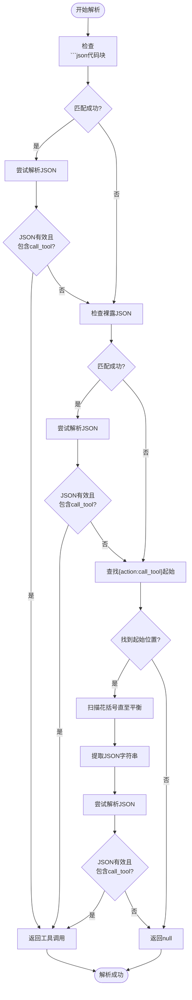
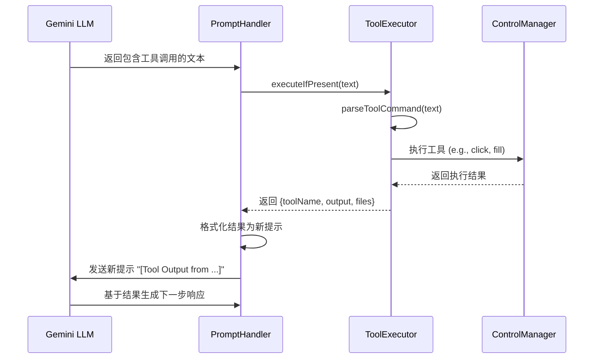

# 工具调用解析

<cite>
**本文档引用的文件**  
- [tool_executor.js](file://background/handlers/session/prompt/tool_executor.js)
- [utils.js](file://background/handlers/session/utils.js)
- [session_manager.js](file://background/managers/session_manager.js)
- [prompt_handler.js](file://background/handlers/session/prompt_handler.js)
- [preamble.js](file://background/handlers/session/prompt/preamble.js)
- [gemini_api.js](file://services/gemini_api.js)
</cite>

## 目录
1. [引言](#引言)
2. [工具调用解析机制](#工具调用解析机制)
3. [三种正则匹配模式详解](#三种正则匹配模式详解)
4. [工具执行与结果反馈](#工具执行与结果反馈)
5. [实际LLM输出示例](#实际llm输出示例)
6. [模式局限性与错误处理](#模式局限性与错误处理)
7. [总结](#总结)

## 引言
本文档深入分析Gemini Nexus扩展中`parseToolCall`方法的技术实现，重点探讨其如何应对大型语言模型（LLM）输出的不确定性。该方法通过三种不同的正则匹配模式，确保能够从LLM的响应中可靠地提取出工具调用指令。这些模式共同构成了一个健壮的解析系统，使得浏览器自动化功能能够无缝集成到Gemini的交互流程中。

**Section sources**
- [session_manager.js](file://background/managers/session_manager.js#L221-L284)

## 工具调用解析机制
`parseToolCall`方法是整个工具调用流程的核心，它负责从LLM返回的文本中识别并提取结构化的工具调用指令。该方法位于`session_manager.js`文件中，采用了一种渐进式的解析策略，依次尝试三种不同的模式来匹配和解析工具调用。

解析过程始于对LLM响应文本的检查。如果文本为空，则直接返回`null`。随后，方法会按优先级顺序尝试三种模式：首先是识别包含在```json代码块中的JSON对象，其次是匹配裸露的JSON对象，最后是通过括号平衡扫描来提取复杂的嵌套JSON结构。这种分层的解析策略极大地提高了在面对不规范或不完整输出时的成功率。

**Section sources**
- [session_manager.js](file://background/managers/session_manager.js#L221-L284)

## 三种正则匹配模式详解

### 第一种模式：代码块正则匹配 (codeBlockRegex)
第一种模式旨在识别被包裹在Markdown代码块中的JSON格式工具调用指令。这种格式是系统预设的推荐输出格式，由`preamble.js`中的`BROWSER_CONTROL_PREAMBLE`明确指定。

该模式使用正则表达式`/```json\s*(\{[\s\S]*?\})\s*```/g`来匹配文本。此正则表达式会寻找以```json开头，后跟任意字符（包括换行符），然后是一个完整的JSON对象（由`{`和`}`包围），最后以```结尾的文本块。捕获组`(\{[\s\S]*?\})`用于提取JSON对象本身。

一旦匹配成功，方法会尝试使用`JSON.parse()`解析捕获的字符串。如果解析成功且JSON对象包含`action: "call_tool"`和`tool`字段，则返回一个包含工具名称和参数的对象。这种模式的优点是格式清晰、易于识别，且能有效避免与文本中其他JSON片段的混淆。

**Section sources**
- [session_manager.js](file://background/managers/session_manager.js#L224-L236)
- [preamble.js](file://background/handlers/session/prompt/preamble.js#L13-L19)

### 第二种模式：裸露JSON正则匹配 (bareJsonRegex)
第二种模式用于处理那些没有被代码块包裹的、直接出现在文本中的JSON对象。这种情况可能发生在LLM忽略或错误地省略了代码块标记时。

该模式使用正则表达式`/\{[^{}]*"action"\s*:\s*"call_tool"[^{}]*\}/g`。这个正则表达式的关键在于`[^{}]*`，它表示匹配任意数量的非花括号字符。这意味着它只能匹配没有嵌套对象的“扁平”JSON。它会查找包含`"action": "call_tool"`的最短JSON对象。

与第一种模式类似，匹配后会进行JSON解析和字段验证。然而，由于其无法处理嵌套结构，这种模式的适用范围有限。它主要作为第一种模式的补充，用于处理格式不完整的简单情况。

**Section sources**
- [session_manager.js](file://background/managers/session_manager.js#L238-L251)

### 第三种模式：括号平衡扫描
第三种模式是一种更为激进和复杂的解析策略，用于处理前两种模式无法解析的、包含复杂嵌套结构的JSON。当LLM的输出被截断或格式严重不规范时，这种模式可以提供最后的保障。

该模式不依赖正则表达式来匹配整个JSON，而是通过扫描文本中的花括号来实现“括号平衡”。它首先在文本中查找`{"action":"call_tool"`或`{"action": "call_tool"`的起始位置。一旦找到，它会初始化一个`braceCount`计数器，并从该位置开始遍历文本。

在遍历过程中，每当遇到一个`{`，计数器加一；每当遇到一个`}`，计数器减一。当计数器首次回到0时，表示找到了与起始`{`相匹配的结束`}`。此时，方法会截取从起始位置到结束位置的整个字符串，并尝试将其解析为JSON。

这种方法能够正确处理任意深度的嵌套对象，是应对LLM输出不确定性的关键。尽管它可能不如正则表达式高效，但其强大的容错能力使其成为整个解析流程中不可或缺的一环。



**Diagram sources**
- [session_manager.js](file://background/managers/session_manager.js#L253-L284)

**Section sources**
- [session_manager.js](file://background/managers/session_manager.js#L253-L284)

## 工具执行与结果反馈
一旦`parseToolCall`成功解析出工具调用指令，整个流程并不会就此结束。`prompt_handler.js`中的`executeIfPresent`方法会接管后续的执行和反馈工作。

`executeIfPresent`方法首先调用`parseToolCommand`（与`parseToolCall`逻辑类似）来解析文本。如果解析成功，它会通过`controlManager`执行相应的工具。执行结果会被封装，并通过`onUpdate`回调函数反馈给用户界面。

最关键的是，执行结果会被格式化为一个新的提示（prompt），并再次发送给Gemini。这个新提示的格式为`[Tool Output from ${toolResult.toolName}]:\n\`\`\`\n${toolResult.output}\n\`\`\``。这使得Gemini能够“看到”上一步工具执行的结果，并基于此进行下一步的推理和决策，从而形成一个自动化的反馈循环。



**Diagram sources**
- [prompt_handler.js](file://background/handlers/session/prompt_handler.js#L59-L87)
- [tool_executor.js](file://background/handlers/session/prompt/tool_executor.js#L9-L48)

**Section sources**
- [prompt_handler.js](file://background/handlers/session/prompt_handler.js#L59-L87)

## 实际LLM输出示例
以下是一些模拟的LLM输出示例，用于演示每种匹配模式的有效性：

**示例1：代码块模式**
```
我将为您点击登录按钮。
```json
{
  "action": "call_tool",
  "tool": "click",
  "args": { "uid": "1_5" }
}
```
```
此输出将被第一种模式成功匹配和解析。

**示例2：裸露JSON模式**
```
好的，正在执行点击操作。
{"action": "call_tool", "tool": "click", "args": { "uid": "1_5" }}
```
此输出将被第二种模式成功匹配和解析。

**示例3：复杂嵌套与截断**
```
我需要先填写表单，然后点击提交。
{"action": "call_tool", "tool": "fill_form", "args": { "elements": [{ "uid": "2_1", "value": "test@example.com" }, { "uid": "2_2", "value": "password123" }], "next_action": {"tool": "click", "args": {"uid": "3_1"}}}}
```
即使这个JSON对象非常复杂，第三种模式也能通过括号平衡扫描正确地提取整个JSON字符串并进行解析。

## 模式局限性与错误处理
尽管这三种模式提供了强大的解析能力，但仍存在一些局限性。例如，如果LLM的输出中包含多个工具调用，该方法只会返回第一个成功解析的调用。此外，如果JSON字符串中包含未转义的花括号（这在JSON中是非法的），括号平衡扫描可能会失败。

错误处理策略主要依赖于`try...catch`块。在每次`JSON.parse()`调用周围都包裹了`try...catch`，以捕获任何解析错误。如果解析失败，方法会简单地忽略该匹配并继续尝试下一个模式或下一个匹配项。这种“尽力而为”的策略确保了即使部分输出无效，整个系统也不会崩溃。

**Section sources**
- [session_manager.js](file://background/managers/session_manager.js#L229-L235)
- [session_manager.js](file://background/managers/session_manager.js#L243-L247)
- [session_manager.js](file://background/managers/session_manager.js#L272-L278)

## 总结
`parseToolCall`方法通过结合三种互补的正则匹配和扫描模式，构建了一个健壮的工具调用解析系统。从优先级最高的代码块匹配，到处理简单裸露JSON的正则表达式，再到应对复杂嵌套结构的括号平衡扫描，这一系列策略共同确保了系统能够有效应对LLM输出的不确定性。结合`prompt_handler.js`中的反馈循环，该机制实现了Gemini与浏览器自动化功能的无缝集成，为用户提供了一个强大且流畅的交互体验。