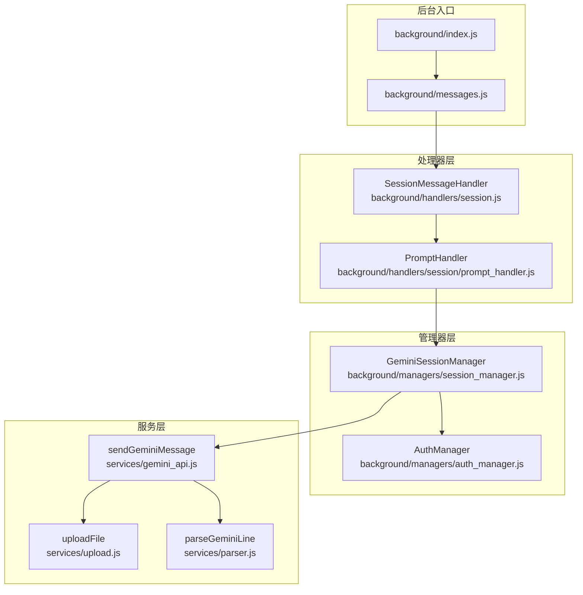
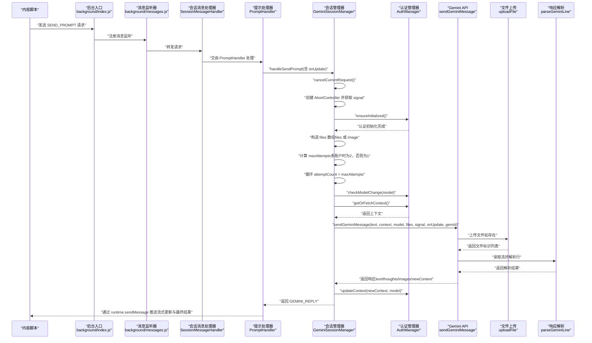
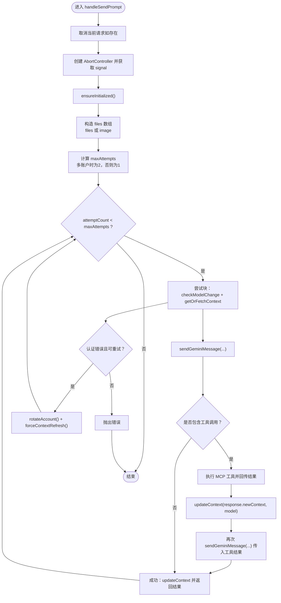
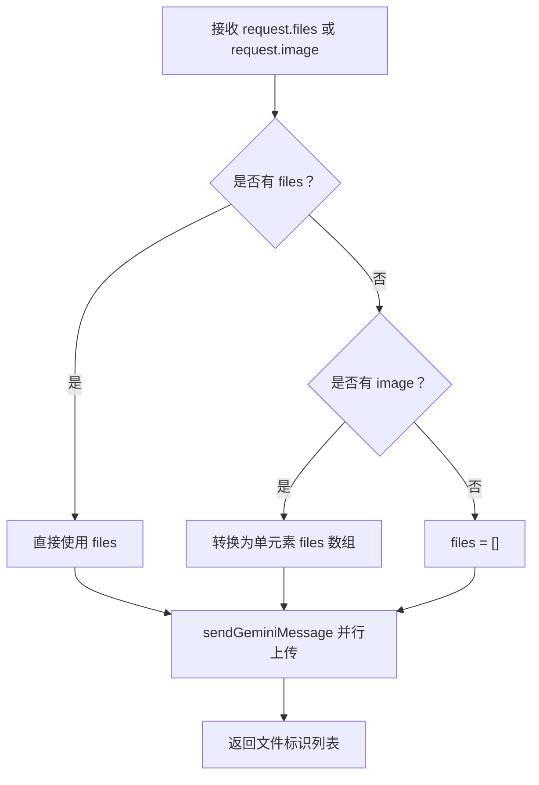
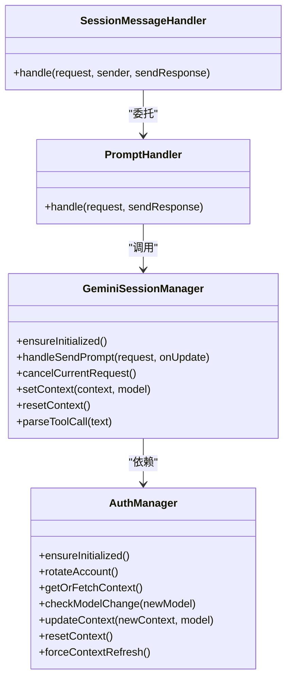

# 请求处理机制

<cite>
**本文档引用的文件**
- [background/managers/session_manager.js](file://background/managers/session_manager.js)
- [background/handlers/session.js](file://background/handlers/session.js)
- [background/handlers/session/prompt_handler.js](file://background/handlers/session/prompt_handler.js)
- [background/managers/auth_manager.js](file://background/managers/auth_manager.js)
- [services/gemini_api.js](file://services/gemini_api.js)
- [services/upload.js](file://services/upload.js)
- [services/parser.js](file://services/parser.js)
- [background/messages.js](file://background/messages.js)
- [background/index.js](file://background/index.js)
- [background/handlers/session/utils.js](file://background/handlers/session/utils.js)
- [background/handlers/session/prompt/builder.js](file://background/handlers/session/prompt/builder.js)
- [background/handlers/session/prompt/tool_executor.js](file://background/handlers/session/prompt/tool_executor.js)
</cite>

## 目录
1. [简介](#简介)
2. [项目结构](#项目结构)
3. [核心组件](#核心组件)
4. [架构总览](#架构总览)
5. [详细组件分析](#详细组件分析)
6. [依赖关系分析](#依赖关系分析)
7. [性能考量](#性能考量)
8. [故障排除指南](#故障排除指南)
9. [结论](#结论)

## 简介
本文件深入解析后台会话管理器中 handleSendPrompt 方法的完整请求处理流程，涵盖以下关键主题：
- abortController 的请求取消机制与 signal 在流式传输中的作用
- 多账户轮换重试逻辑（attemptCount 与 maxAttempts 的协同）
- 文件上传处理（request.files 与 request.image 的转换逻辑）
- 流式响应的 onUpdate 回调与实时更新
- ensureInitialized() 对认证状态的保障
- checkModelChange() 在模型切换时的上下文管理
- 与 AuthManager 的协作以获取和更新会话上下文
- 组件在请求链中的核心枢纽地位

## 项目结构
该扩展采用模块化分层设计：
- 后台管理器层：会话管理器、认证管理器等
- 消息处理器层：会话消息处理器、UI 消息处理器
- 服务层：Gemini API 调用、文件上传、响应解析
- 入口与监听：后台入口脚本与全局消息监听器

图表来源
- [background/index.js](file://background/index.js#L1-L30)
- [background/messages.js](file://background/messages.js#L1-L82)
- [background/handlers/session.js](file://background/handlers/session.js#L1-L56)
- [background/handlers/session/prompt_handler.js](file://background/handlers/session/prompt_handler.js#L1-L103)
- [background/managers/session_manager.js](file://background/managers/session_manager.js#L1-L285)
- [background/managers/auth_manager.js](file://background/managers/auth_manager.js#L1-L130)
- [services/gemini_api.js](file://services/gemini_api.js#L1-L230)
- [services/upload.js](file://services/upload.js#L1-L40)
- [services/parser.js](file://services/parser.js#L1-L157)

章节来源
- [background/index.js](file://background/index.js#L1-L30)
- [background/messages.js](file://background/messages.js#L1-L82)

## 核心组件
- GeminiSessionManager：核心请求处理与重试、上下文管理、MCP 工具执行
- AuthManager：认证状态、账户轮换、上下文获取与持久化
- SessionMessageHandler/PromptHandler：消息路由与提示构建、工具执行反馈循环
- sendGeminiMessage：实际向 Gemini 发起请求、流式读取、解析响应
- uploadFile：文件上传至 Google 内容推送服务
- parseGeminiLine：解析流式响应行，提取文本、思考过程与生成图片

章节来源
- [background/managers/session_manager.js](file://background/managers/session_manager.js#L1-L285)
- [background/managers/auth_manager.js](file://background/managers/auth_manager.js#L1-L130)
- [background/handlers/session.js](file://background/handlers/session.js#L1-L56)
- [background/handlers/session/prompt_handler.js](file://background/handlers/session/prompt_handler.js#L1-L103)
- [services/gemini_api.js](file://services/gemini_api.js#L1-L230)
- [services/upload.js](file://services/upload.js#L1-L40)
- [services/parser.js](file://services/parser.js#L1-L157)

## 架构总览
下图展示了从内容脚本发起请求到最终返回结果的端到端流程，重点标注了 abortController、多账户轮换、文件上传与流式更新的关键节点。

图表来源
- [background/index.js](file://background/index.js#L1-L30)
- [background/messages.js](file://background/messages.js#L1-L82)
- [background/handlers/session.js](file://background/handlers/session.js#L1-L56)
- [background/handlers/session/prompt_handler.js](file://background/handlers/session/prompt_handler.js#L1-L103)
- [background/managers/session_manager.js](file://background/managers/session_manager.js#L1-L285)
- [background/managers/auth_manager.js](file://background/managers/auth_manager.js#L1-L130)
- [services/gemini_api.js](file://services/gemini_api.js#L1-L230)
- [services/upload.js](file://services/upload.js#L1-L40)
- [services/parser.js](file://services/parser.js#L1-L157)

## 详细组件分析

### handleSendPrompt 执行流程详解
该方法是请求处理的核心枢纽，负责：
- 取消上一次请求（防止并发冲突）
- 初始化 AbortController 与 signal，用于取消与流式中断
- 确保认证初始化（ensureInitialized）
- 构造 files 数组（支持 request.files 或 request.image）
- 计算最大重试次数（多账户时最多两次）
- 循环重试并在认证错误时轮换账户
- 调用 sendGeminiMessage 发起请求并处理流式响应
- 解析并执行 MCP 工具调用（如有）
- 更新上下文并返回最终结果

图表来源
- [background/managers/session_manager.js](file://background/managers/session_manager.js#L21-L202)
- [background/managers/auth_manager.js](file://background/managers/auth_manager.js#L53-L92)
- [services/gemini_api.js](file://services/gemini_api.js#L26-L230)

章节来源
- [background/managers/session_manager.js](file://background/managers/session_manager.js#L21-L202)

### abortController 与 signal 的作用
- AbortController 用于取消正在进行的请求，避免资源浪费与竞态条件
- signal 作为 fetch 的取消令牌，贯穿文件上传与流式读取阶段
- 当用户触发取消或发生异常时，AbortError 将被传播到各层，确保及时释放资源

章节来源
- [background/managers/session_manager.js](file://background/managers/session_manager.js#L204-L211)
- [services/gemini_api.js](file://services/gemini_api.js#L143-L152)

### 多账户轮换与重试逻辑
- maxAttempts = 账户数量 > 1 ? 2 : 1
- 认证错误（如 401/403/未登录）触发轮换与强制刷新上下文
- 轮换后重新获取上下文并继续重试

章节来源
- [background/managers/session_manager.js](file://background/managers/session_manager.js#L43-L147)
- [background/managers/auth_manager.js](file://background/managers/auth_manager.js#L53-L69)

### 文件上传处理（request.files 与 request.image）
- 支持两种输入：
  - request.files：数组，每个元素包含 base64、type、name
  - request.image：单张图片的 base64，自动转换为 files 数组
- sendGeminiMessage 中并行上传所有文件，返回文件标识列表
- 上传过程中使用 AbortController 的 signal，确保可取消

图表来源
- [background/managers/session_manager.js](file://background/managers/session_manager.js#L32-L41)
- [services/gemini_api.js](file://services/gemini_api.js#L44-L56)
- [services/upload.js](file://services/upload.js#L7-L39)

章节来源
- [background/managers/session_manager.js](file://background/managers/session_manager.js#L32-L41)
- [services/gemini_api.js](file://services/gemini_api.js#L44-L56)
- [services/upload.js](file://services/upload.js#L7-L39)

### 流式传输与 onUpdate 回调
- sendGeminiMessage 使用 ReadableStream 逐行读取响应
- parseGeminiLine 解析每行数据，提取文本、思考过程与生成图片
- onUpdate 回调在每次解析到新片段时触发，用于 UI 实时更新
- PromptHandler 将 onUpdate 包装为 runtime.sendMessage，确保 UI 可见

章节来源
- [services/gemini_api.js](file://services/gemini_api.js#L158-L201)
- [services/parser.js](file://services/parser.js#L4-L156)
- [background/handlers/session/prompt_handler.js](file://background/handlers/session/prompt_handler.js#L13-L22)

### ensureInitialized() 与 checkModelChange()
- ensureInitialized() 保证认证状态已从存储恢复，避免重复初始化
- checkModelChange(newModel) 在模型变化时重置上下文，强制重新获取凭据
- 这两个步骤确保请求始终基于正确的认证与模型配置

章节来源
- [background/managers/session_manager.js](file://background/managers/session_manager.js#L17-L19)
- [background/managers/auth_manager.js](file://background/managers/auth_manager.js#L98-L103)

### 与 AuthManager 的协作
- 获取上下文：getOrFetchContext() 优先使用缓存，否则从服务端获取
- 更新上下文：updateContext() 持久化到本地存储，并记录当前模型
- 重置上下文：resetContext() 清空并可轮换账户指针
- 强制刷新：forceContextRefresh() 清空缓存以便后续重新获取

章节来源
- [background/managers/auth_manager.js](file://background/managers/auth_manager.js#L75-L128)

### 请求链中的核心枢纽地位
- SessionMessageHandler 负责路由与快速问答
- PromptHandler 负责构建提示、工具执行反馈循环与历史记录
- GeminiSessionManager 是真正的执行中枢，协调认证、重试、MCP 工具与上下文管理
- 三者共同构成“消息 -> 提示构建 -> 会话执行 -> 结果回传”的闭环

章节来源
- [background/handlers/session.js](file://background/handlers/session.js#L7-L55)
- [background/handlers/session/prompt_handler.js](file://background/handlers/session/prompt_handler.js#L6-L11)
- [background/managers/session_manager.js](file://background/managers/session_manager.js#L6-L11)

## 依赖关系分析

图表来源
- [background/managers/session_manager.js](file://background/managers/session_manager.js#L6-L285)
- [background/managers/auth_manager.js](file://background/managers/auth_manager.js#L5-L130)
- [background/handlers/session/prompt_handler.js](file://background/handlers/session/prompt_handler.js#L6-L11)
- [background/handlers/session.js](file://background/handlers/session.js#L7-L13)

章节来源
- [background/managers/session_manager.js](file://background/managers/session_manager.js#L1-L285)
- [background/managers/auth_manager.js](file://background/managers/auth_manager.js#L1-L130)
- [background/handlers/session/prompt_handler.js](file://background/handlers/session/prompt_handler.js#L1-L103)
- [background/handlers/session.js](file://background/handlers/session.js#L1-L56)

## 性能考量
- 并行文件上传：使用 Promise.all 并行处理多个文件上传，减少总耗时
- 流式读取：边读取边解析，降低内存占用并提升首包延迟表现
- 重试策略：仅在认证错误时进行有限次重试，避免无限循环
- 上下文复用：尽量复用已获取的上下文，减少不必要的网络往返
- 取消机制：AbortController 确保异常或用户取消时及时释放资源

## 故障排除指南
常见错误与处理：
- 未登录/会话过期：清除上下文并引导用户登录；根据语言环境显示链接
- 频繁请求限制：提示稍后再试
- 服务器无响应：建议刷新页面
- 响应解析失败：建议刷新后重试
- 工具执行失败：在流式输出中追加错误信息，不影响主流程

章节来源
- [background/managers/session_manager.js](file://background/managers/session_manager.js#L149-L199)

## 结论
handleSendPrompt 方法通过 abortController、多账户轮换、文件上传与流式解析等机制，构建了稳定高效的请求处理链路。它与 AuthManager 协同确保认证与上下文的正确性，并在 PromptHandler 的反馈循环中实现了智能工具调用与上下文演进。该组件在请求链中处于核心枢纽地位，既保证了用户体验（实时流式更新），也兼顾了可靠性（重试与错误处理）。