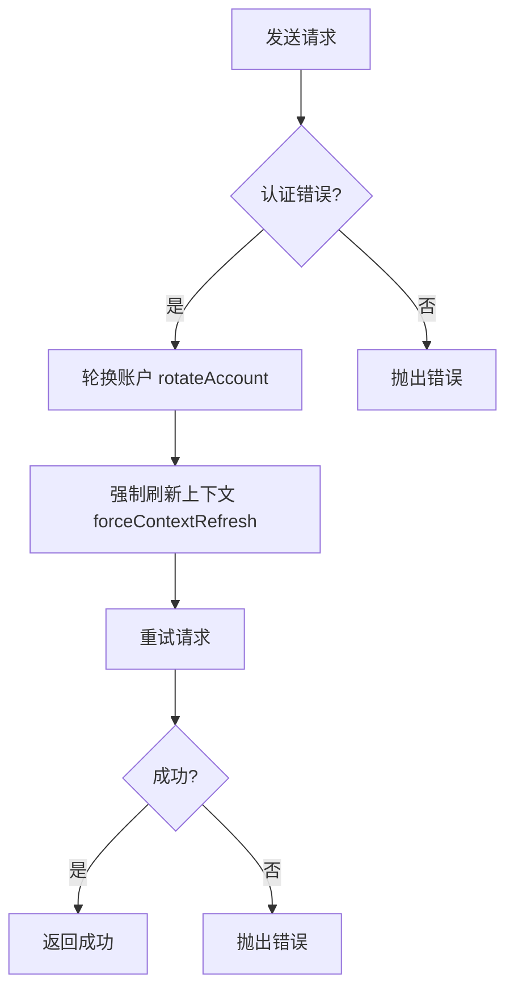
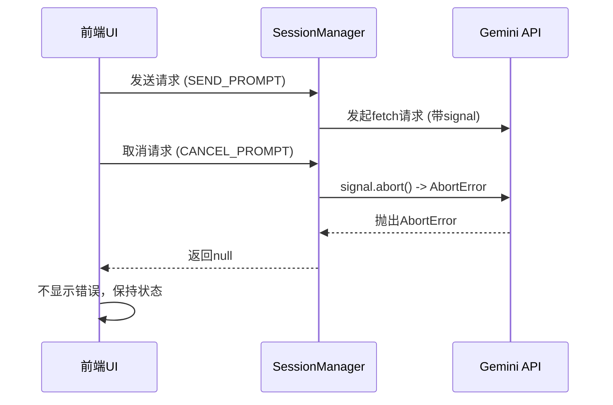
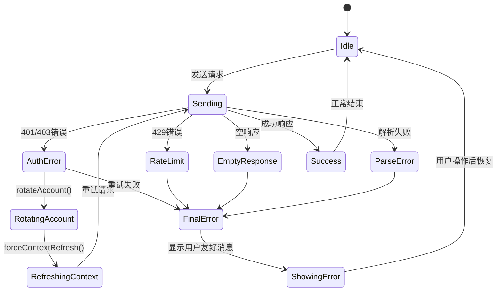

# 错误处理与恢复

<cite>
**本文档引用的文件**  
- [session_manager.js](file://background/managers/session_manager.js)
- [auth_manager.js](file://background/managers/auth_manager.js)
- [gemini_api.js](file://services/gemini_api.js)
- [auth.js](file://services/auth.js)
- [parser.js](file://services/parser.js)
- [prompt_handler.js](file://background/handlers/session/prompt_handler.js)
- [stream.js](file://content/toolbar/stream.js)
- [message.js](file://sandbox/render/message.js)
</cite>

## 目录
1. [引言](#引言)
2. [错误处理架构概述](#错误处理架构概述)
3. [内层错误捕获与账户轮换机制](#内层错误捕获与账户轮换机制)
4. [外层错误转换与用户友好消息](#外层错误转换与用户友好消息)
5. AbortError 特殊处理
6. [错误类型与UI呈现策略](#错误类型与ui呈现策略)
7. [chrome.storage.local 操作的安全性与必要性](#chromestoragelocal-操作的安全性与必要性)
8. [错误恢复流程状态转换图](#错误恢复流程状态转换图)

## 引言
本项目通过多层级的错误处理机制，确保在与 Gemini 服务交互过程中能够有效应对认证失效、频率限制、网络异常等各类错误。系统采用内层与外层双重 `try-catch` 结构，分别负责底层错误的自动恢复与上层错误的用户友好转换。核心组件包括会话管理器（`GeminiSessionManager`）、认证管理器（`AuthManager`）以及 Gemini API 服务模块，它们协同工作以实现高可用性和用户体验优化。

## 错误处理架构概述
系统的错误处理机制采用分层设计，主要由 `GeminiSessionManager` 的 `handleSendPrompt` 方法实现。该方法包含两个嵌套的 `try-catch` 块：

- **内层 `try-catch`**：位于重试循环内部，负责识别 401/403 等认证错误，并触发多账户轮换（`rotateAccount`）和上下文强制刷新（`forceContextRefresh`）。
- **外层 `try-catch`**：处理内层抛出的错误，将其转换为本地化的用户友好消息，并通过消息系统发送至前端 UI 进行展示。

该架构确保了在发生可恢复错误时能够自动重试，而在发生不可恢复错误时能够向用户提供清晰的指导。

**Section sources**
- [session_manager.js](file://background/managers/session_manager.js#L21-L202)

## 内层错误捕获与账户轮换机制
当内层 `catch` 块捕获到错误时，会通过 `err.message` 中的关键字（如 "未登录"、"Not logged in"、"401"、"403"）判断是否为认证错误。若为认证错误且当前配置了多个账户，则执行以下恢复操作：

1. **账户轮换**：调用 `AuthManager` 的 `rotateAccount()` 方法，将当前账户指针切换到下一个索引，并更新 `chrome.storage.local` 中的 `geminiAccountPointer`。
2. **上下文刷新**：调用 `forceContextRefresh()` 方法，将内存中的 `currentContext` 置为 `null`，强制下次请求时重新获取认证令牌。

此机制通过 `while` 循环实现自动重试，最多尝试次数由 `auth.accountIndices.length` 决定。若轮换账户后仍无法通过认证，则将错误抛出至外层 `catch` 块进行最终处理。

**Diagram sources**
- [session_manager.js](file://background/managers/session_manager.js#L129-L146)
- [auth_manager.js](file://background/managers/auth_manager.js#L53-L69)

**Section sources**
- [session_manager.js](file://background/managers/session_manager.js#L129-L146)
- [auth_manager.js](file://background/managers/auth_manager.js#L53-L69)

## 外层错误转换与用户友好消息
外层 `catch` 块负责将底层错误转换为用户可理解的本地化消息。转换逻辑基于 `error.message` 的内容，并根据当前浏览器的 UI 语言（通过 `chrome.i18n.getUILanguage()` 获取）选择中文或英文提示。

支持的错误类型及对应的 UI 消息如下：

| 错误类型 | 中文消息 | 英文消息 |
|---------|--------|--------|
| 登录失效 | 🔑 账号 (Index: X) 未登录或会话已过期。 <a href="#" class="gemini-link" data-url="https://gemini.google.com/u/X/">👉 点击前往 Gemini 登录</a> | 🔑 Account (Index: X) not logged in. <a href="#" class="gemini-link" data-url="https://gemini.google.com/u/X/">👉 Click to open Gemini login</a> |
| 频率限制 | ⏳ 请求过于频繁，Gemini 暂时限制了访问。请等待几分钟后再试。 | ⏳ Too many requests. Gemini has temporarily limited access. Please wait a few minutes. |
| 空响应 | 🔌 服务器无响应。 <a href="#" class="gemini-link" data-url="https://gemini.google.com/">👉 点击前往 Gemini 刷新</a> | 🔌 No response from server. <a href="#" class="gemini-link" data-url="https://gemini.google.com/">👉 Click to refresh Gemini</a> |
| 解析失败 | ⚠️ 响应解析失败。 <a href="#" class="gemini-link" data-url="https://gemini.google.com/">👉 点击前往 Gemini 刷新后重试</a> | ⚠️ Failed to parse response. <a href="#" class="gemini-link" data-url="https://gemini.google.com/">👉 Click to refresh Gemini and retry</a> |

这些消息通过 `chrome.runtime.sendMessage` 发送至前端，由 `GeminiStreamHandler` 处理并调用 `ui.showError()` 方法展示。

**Section sources**
- [session_manager.js](file://background/managers/session_manager.js#L149-L198)

## AbortError 特殊处理
当用户主动取消请求时，系统会创建并触发一个 `AbortController`，从而抛出 `AbortError`。该错误在 `handleSendPrompt` 的外层 `catch` 块中被特殊处理：直接返回 `null`，表示请求已被取消。前端 UI 在接收到 `null` 响应时，不会显示错误消息，而是保持当前状态或清除加载指示器。

**Diagram sources**
- [session_manager.js](file://background/managers/session_manager.js#L150-L152)
- [session.js](file://background/handlers/session.js#L38-L41)

**Section sources**
- [session_manager.js](file://background/managers/session_manager.js#L150-L152)

## 错误类型与UI呈现策略
不同类型的错误在 UI 上有不同的呈现策略，主要通过 `GeminiStreamHandler` 和 `appendMessage` 函数实现。

- **认证错误**：显示包含登录链接的富文本消息，用户可直接点击链接跳转至 Gemini 登录页面。
- **频率限制**：显示等待提示，建议用户稍后再试。
- **空响应与解析失败**：显示刷新链接，引导用户刷新 Gemini 页面以恢复会话。
- **工具执行错误**：在响应流中追加错误信息，格式为 `> ❌ Tool Error: ${e.message}`，不影响主响应内容。

前端通过监听 `GEMINI_STREAM_UPDATE` 和 `GEMINI_STREAM_DONE` 消息，实时更新 UI 状态。错误消息通过 `ui.showError()` 方法展示，确保用户能够及时获知操作结果。

**Section sources**
- [stream.js](file://content/toolbar/stream.js#L16-L43)
- [message.js](file://sandbox/render/message.js#L39-L57)

## chrome.storage.local 操作的安全性与必要性
在认证错误处理流程中，系统会直接操作 `chrome.storage.local` 执行 `remove(['geminiContext'])`。这一操作具有以下安全性和必要性：

- **必要性**：清除本地存储的无效会话上下文，防止后续请求重复使用已过期的令牌，确保系统能够从干净状态重新初始化。
- **安全性**：`chrome.storage.local` 是 Chrome 扩展的安全存储机制，数据仅限本扩展访问，不会被第三方网站读取。`remove` 操作仅影响特定键值，不会清除用户其他数据。

此外，`AuthManager` 在初始化时会从 `chrome.storage.local` 恢复 `geminiContext`、`geminiModel` 等状态，确保跨会话的连续性。

**Section sources**
- [session_manager.js](file://background/managers/session_manager.js#L162)
- [auth_manager.js](file://background/managers/auth_manager.js#L18-L47)

## 错误恢复流程状态转换图
以下状态图描述了从请求发送到错误恢复的完整流程。

**Diagram sources**
- [session_manager.js](file://background/managers/session_manager.js#L21-L202)
- [gemini_api.js](file://services/gemini_api.js#L154-L219)