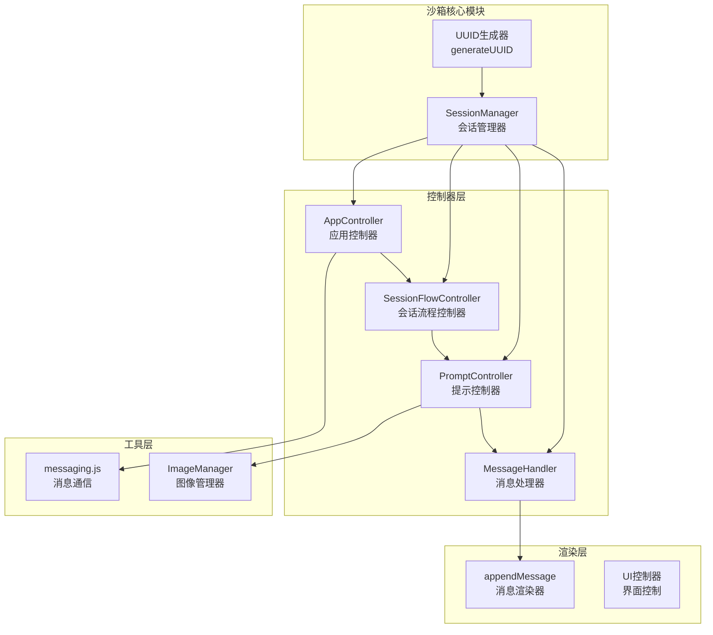
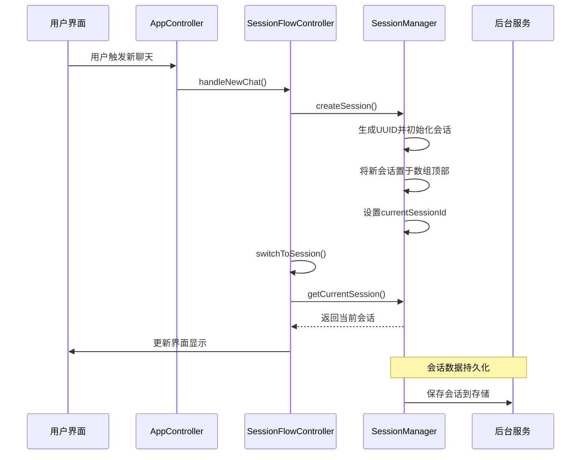
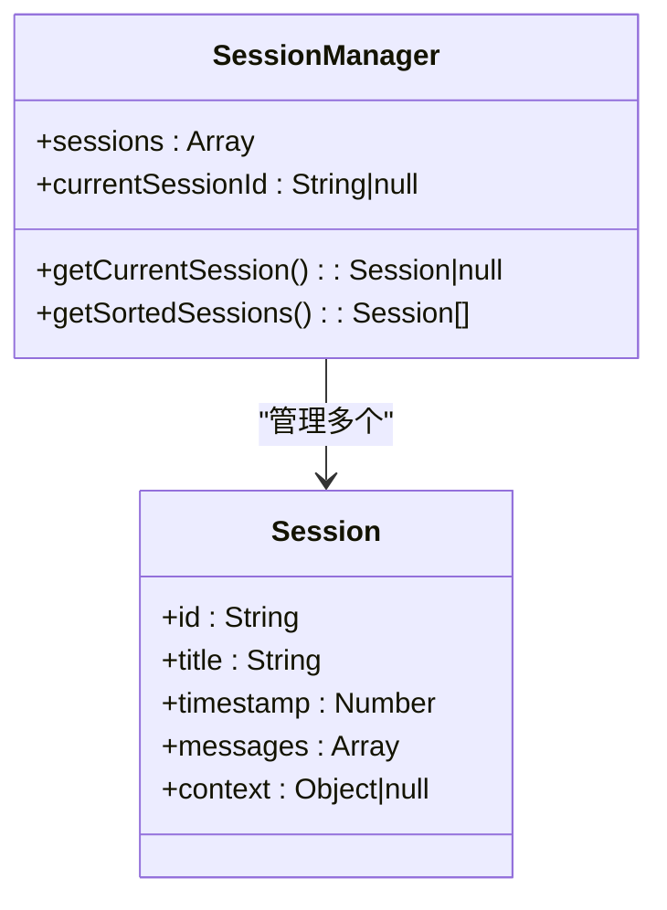
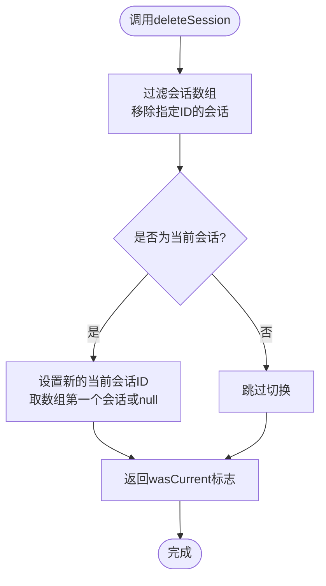
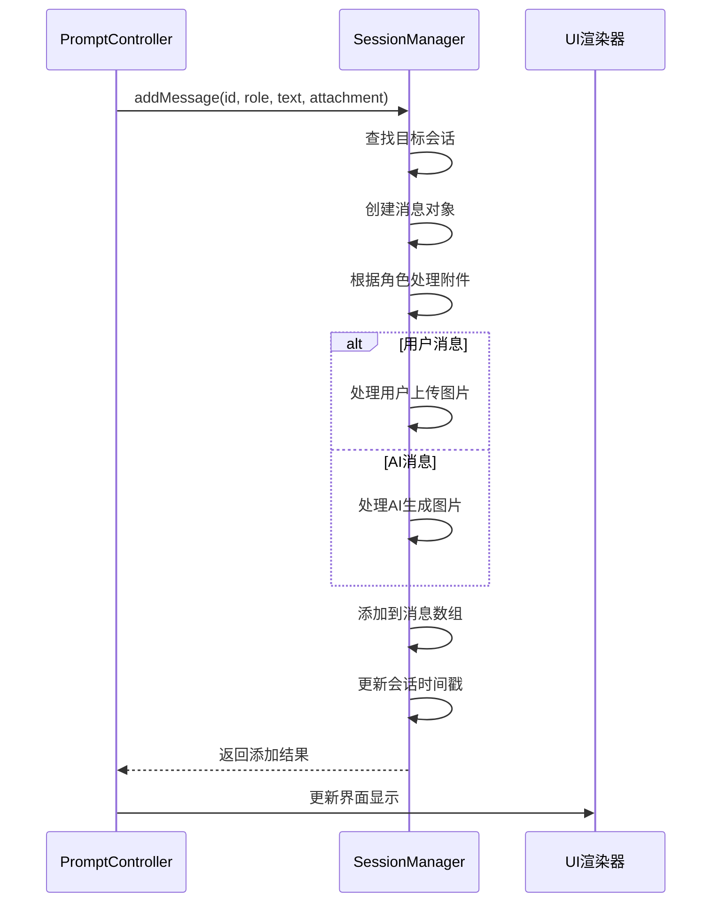
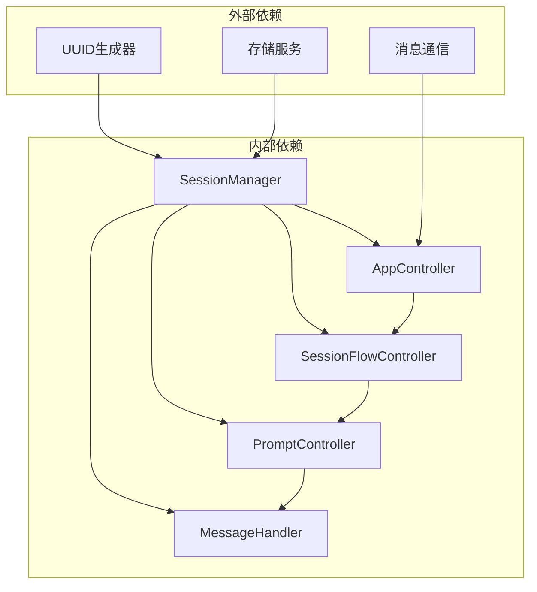

# 沙箱会话管理器

<cite>
**本文档引用的文件**
- [sandbox/core/session_manager.js](file://sandbox/core/session_manager.js)
- [lib/utils.js](file://lib/utils.js)
- [sandbox/controllers/app_controller.js](file://sandbox/controllers/app_controller.js)
- [sandbox/controllers/session_flow.js](file://sandbox/controllers/session_flow.js)
- [sandbox/controllers/prompt.js](file://sandbox/controllers/prompt.js)
- [sandbox/render/message.js](file://sandbox/render/message.js)
</cite>

## 目录
1. [简介](#简介)
2. [项目结构](#项目结构)
3. [核心组件](#核心组件)
4. [架构概览](#架构概览)
5. [详细组件分析](#详细组件分析)
6. [依赖关系分析](#依赖关系分析)
7. [性能考虑](#性能考虑)
8. [故障排除指南](#故障排除指南)
9. [结论](#结论)

## 简介

沙箱会话管理器是Gemini Nexus项目中负责管理本地会话状态的核心组件。它位于沙箱环境的`sandbox/core/session_manager.js`文件中，采用ES6类设计模式，为整个应用提供了完整的会话生命周期管理功能。该组件不仅管理会话列表的存储结构，还负责会话的创建、切换、删除等核心操作，并与UI层和后台服务进行深度集成。

## 项目结构

沙箱会话管理器在整个项目架构中扮演着关键角色，主要涉及以下模块：



**图表来源**
- [sandbox/core/session_manager.js](file://sandbox/core/session_manager.js#L1-L105)
- [sandbox/controllers/app_controller.js](file://sandbox/controllers/app_controller.js#L1-L207)
- [sandbox/controllers/session_flow.js](file://sandbox/controllers/session_flow.js#L1-L95)

**章节来源**
- [sandbox/core/session_manager.js](file://sandbox/core/session_manager.js#L1-L105)
- [lib/utils.js](file://lib/utils.js#L1-L59)

## 核心组件

### SessionManager类设计

SessionManager类采用了简洁而高效的设计模式，主要包含以下核心属性：

- **sessions数组**：存储所有会话对象的主容器，采用数组结构便于快速排序和遍历
- **currentSessionId**：当前活动会话的唯一标识符，确保会话状态的一致性

该类实现了完整的CRUD操作，包括会话的创建、查询、更新和删除，同时提供了会话状态的持久化和恢复能力。

**章节来源**
- [sandbox/core/session_manager.js](file://sandbox/core/session_manager.js#L5-L39)

## 架构概览

SessionManager在整个系统架构中处于核心地位，形成了清晰的分层结构：



**图表来源**
- [sandbox/controllers/session_flow.js](file://sandbox/controllers/session_flow.js#L14-L22)
- [sandbox/core/session_manager.js](file://sandbox/core/session_manager.js#L11-L23)

## 详细组件分析

### 会话存储结构设计

SessionManager采用数组作为会话存储的基础结构，这种设计具有以下优势：

#### sessions数组特性
- **顺序重要性**：数组元素的顺序代表了会话的使用频率和时间顺序
- **快速访问**：支持O(1)的随机访问，便于快速定位特定会话
- **排序便利**：支持基于时间戳的快速排序操作

#### currentSessionId设计原理
- **状态同步**：确保UI层和业务逻辑层的会话状态保持一致
- **默认值处理**：初始值为null，明确表示没有活动会话
- **全局可见性**：作为类的公共属性，便于其他组件直接访问

**章节来源**
- [sandbox/core/session_manager.js](file://sandbox/core/session_manager.js#L6-L8)

### createSession方法实现

createSession方法是会话管理的核心入口，实现了完整的会话创建流程：

```mermaid
flowchart TD
    Start(["调用createSession"]) --> GenUUID["生成UUID"]
    GenUUID --> CreateObj["创建会话对象"]
    CreateObj --> InitFields["初始化字段<br/>- id: UUID<br/>- title: \"New Chat\"<br/>- timestamp: 当前时间<br/>- messages: 空数组<br/>- context: null"]
    InitFields --> Unshift["使用unshift插入数组顶部"]
    Unshift --> SetCurrent["设置currentSessionId"]
    SetCurrent --> Return["返回新会话对象"]
    Return --> End(["完成"])
```

**图表来源**
- [sandbox/core/session_manager.js](file://sandbox/core/session_manager.js#L11-L23)
- [lib/utils.js](file://lib/utils.js#L11-L17)

#### 关键实现细节
- **UUID生成**：使用标准的UUID v4算法，确保会话ID的唯一性和安全性
- **数组插入策略**：使用unshift方法将新会话插入到数组开头，保证最新会话始终置顶
- **状态初始化**：为新会话设置合理的默认值，包括标题、时间戳和空消息数组

**章节来源**
- [sandbox/core/session_manager.js](file://sandbox/core/session_manager.js#L11-L23)
- [lib/utils.js](file://lib/utils.js#L11-L17)

### 会话检索方法对比

SessionManager提供了两种不同的会话检索方法，各自适用于不同的使用场景：

#### getCurrentSession方法
- **查找策略**：基于currentSessionId进行精确匹配
- **时间复杂度**：O(n)线性搜索，其中n为会话数量
- **适用场景**：需要获取当前活动会话时使用
- **实现特点**：直接返回找到的第一个匹配项

#### getSortedSessions方法
- **查找策略**：返回一个新的排序数组，不修改原数组
- **排序规则**：按timestamp降序排列（最新的在前）
- **时间复杂度**：O(n log n)，主要由排序操作决定
- **适用场景**：需要显示会话历史列表或进行会话浏览时使用



**图表来源**
- [sandbox/core/session_manager.js](file://sandbox/core/session_manager.js#L29-L35)

**章节来源**
- [sandbox/core/session_manager.js](file://sandbox/core/session_manager.js#L29-L35)

### 会话删除与切换逻辑

deleteSession方法实现了智能的会话删除和自动切换功能：



**图表来源**
- [sandbox/core/session_manager.js](file://sandbox/core/session_manager.js#L41-L49)

#### 删除逻辑的关键特性
- **条件返回**：返回wasCurrent布尔值，指示是否删除了当前会话
- **自动切换**：当删除当前会话时，自动切换到下一个可用会话
- **边界处理**：当没有剩余会话时，currentSessionId设为null

**章节来源**
- [sandbox/core/session_manager.js](file://sandbox/core/session_manager.js#L41-L49)

### 消息管理与附件处理

addMessage方法提供了灵活的消息添加功能，能够处理不同类型的角色和附件：



**图表来源**
- [sandbox/core/session_manager.js](file://sandbox/core/session_manager.js#L69-L96)
- [sandbox/render/message.js](file://sandbox/render/message.js#L8-L324)

#### 附件处理策略
- **用户角色附件**：支持单个字符串(Base64)或数组形式的多张图片
- **AI角色附件**：支持对象数组形式的生成图片，包含URL和替代文本
- **向后兼容**：保留了对旧版数据格式的支持

**章节来源**
- [sandbox/core/session_manager.js](file://sandbox/core/session_manager.js#L69-L96)
- [sandbox/render/message.js](file://sandbox/render/message.js#L8-L324)

### 自动命名与重命名机制

SessionManager实现了智能的会话标题管理功能：

#### updateTitle方法
- **触发条件**：仅当会话标题仍为默认值"New Chat"且消息数为0时才更新
- **长度限制**：自动截取前30个字符，并添加省略号
- **应用场景**：首次消息发送时的自动命名

#### renameSession方法
- **强制更新**：无论当前标题为何都会进行重命名
- **长度限制**：严格限制为50个字符
- **应用场景**：用户手动重命名会话

```mermaid
flowchart TD
    Start(["updateTitle调用"]) --> CheckDefault{"标题是否为<br/>\"New Chat\"?"}
    CheckDefault --> |否| ReturnFalse["返回false"]
    CheckDefault --> |是| CheckMessages{"消息数是否为0?"}
    CheckMessages --> |否| ReturnFalse
    CheckMessages --> |是| Truncate["截取前30字符"]
    Truncate --> SetTitle["设置新标题"]
    SetTitle --> ReturnTrue["返回true"]
    ReturnFalse --> End(["结束"])
    ReturnTrue --> End
```

**图表来源**
- [sandbox/core/session_manager.js](file://sandbox/core/session_manager.js#L51-L58)

**章节来源**
- [sandbox/core/session_manager.js](file://sandbox/core/session_manager.js#L51-L67)

## 依赖关系分析

### 组件耦合度分析

SessionManager与其他组件的依赖关系体现了良好的分层设计：



**图表来源**
- [sandbox/core/session_manager.js](file://sandbox/core/session_manager.js#L1-L3)
- [sandbox/controllers/app_controller.js](file://sandbox/controllers/app_controller.js#L1-L8)

### 数据流依赖

SessionManager的数据流遵循单向依赖原则：

1. **输入依赖**：UUID生成器提供唯一标识符
2. **状态依赖**：UI控制器依赖会话状态进行界面更新
3. **持久化依赖**：存储服务依赖会话数据进行长期保存

**章节来源**
- [sandbox/core/session_manager.js](file://sandbox/core/session_manager.js#L1-L3)
- [sandbox/controllers/app_controller.js](file://sandbox/controllers/app_controller.js#L1-L8)

## 性能考虑

### 时间复杂度分析

- **createSession**: O(1) - 数组头部插入操作
- **getCurrentSession**: O(n) - 线性搜索操作
- **getSortedSessions**: O(n log n) - 排序操作主导
- **deleteSession**: O(n) - 过滤操作
- **addMessage**: O(1) - 数组尾部添加操作

### 内存使用优化

- **惰性加载**：会话列表按需排序，避免不必要的计算
- **对象复用**：消息对象在内存中复用，减少垃圾回收压力
- **及时清理**：删除会话时立即释放相关资源

## 故障排除指南

### 常见问题诊断

#### 会话丢失问题
- **症状**：切换会话后发现内容为空
- **可能原因**：currentSessionId未正确设置或sessions数组被意外清空
- **解决方案**：检查setCurrentId调用和sessions数组状态

#### 消息显示异常
- **症状**：图片无法正常显示或显示格式错误
- **可能原因**：附件类型不匹配或数据格式错误
- **解决方案**：验证消息对象的attachment字段类型

#### 性能问题
- **症状**：会话列表加载缓慢
- **可能原因**：getSortedSessions频繁调用导致的排序开销
- **解决方案**：缓存排序结果或延迟执行排序操作

**章节来源**
- [sandbox/core/session_manager.js](file://sandbox/core/session_manager.js#L29-L35)
- [sandbox/core/session_manager.js](file://sandbox/core/session_manager.js#L41-L49)

## 结论

沙箱会话管理器通过精心设计的数据结构和算法，为Gemini Nexus项目提供了稳定可靠的会话管理基础。其核心优势包括：

1. **简洁高效的API设计**：方法命名直观，功能职责明确
2. **智能的状态管理**：自动化的会话切换和标题管理
3. **灵活的扩展性**：支持多种消息类型和附件格式
4. **良好的性能表现**：针对常见操作进行了优化

该组件的成功实施为整个沙箱环境的会话管理奠定了坚实基础，为用户提供流畅的聊天体验。