# UI图像管理器

<cite>
**本文档引用的文件**
- [sandbox/core/image_manager.js](file://sandbox/core/image_manager.js)
- [background/managers/image_manager.js](file://background/managers/image_manager.js)
- [sandbox/boot/app.js](file://sandbox/boot/app.js)
- [css/input.css](file://css/input.css)
- [services/upload.js](file://services/upload.js)
</cite>

## 目录
1. [简介](#简介)
2. [项目结构](#项目结构)
3. [核心组件](#核心组件)
4. [架构概览](#架构概览)
5. [详细组件分析](#详细组件分析)
6. [依赖关系分析](#依赖关系分析)
7. [性能考虑](#性能考虑)
8. [故障排除指南](#故障排除指南)
9. [最佳实践](#最佳实践)
10. [结论](#结论)

## 简介

UI图像管理器（ImageManager）是Gemini Nexus项目中负责处理图像上传、预览和管理的核心组件。该组件专为沙箱环境设计，提供了完整的多文件图像上传功能，支持文件选择、拖拽、粘贴等多种用户交互方式，并实现了实时预览和队列管理。

ImageManager采用现代化的JavaScript类设计模式，通过构造函数接收DOM元素和回调函数，实现了高度模块化的架构。该组件不仅处理本地文件上传，还支持从URL加载远程图像，为用户提供无缝的图像处理体验。

## 项目结构

ImageManager在项目中的组织结构如下：

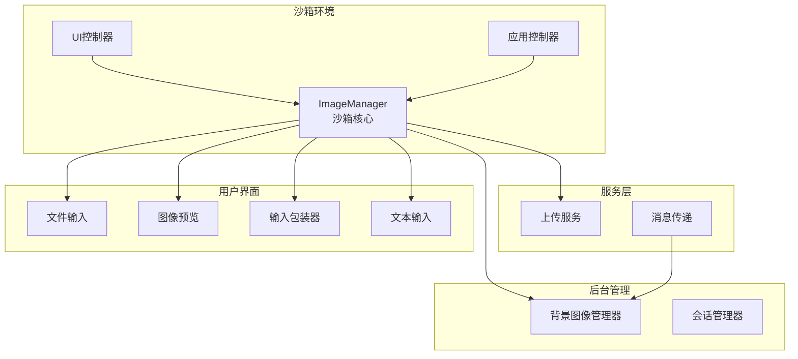

**图表来源**
- [sandbox/core/image_manager.js](file://sandbox/core/image_manager.js#L4-L17)
- [background/managers/image_manager.js](file://background/managers/image_manager.js#L4-L46)

**章节来源**
- [sandbox/core/image_manager.js](file://sandbox/core/image_manager.js#L1-L281)
- [background/managers/image_manager.js](file://background/managers/image_manager.js#L1-L97)

## 核心组件

### 构造函数与初始化

ImageManager的构造函数接收两个主要参数：DOM元素对象和回调函数对象。

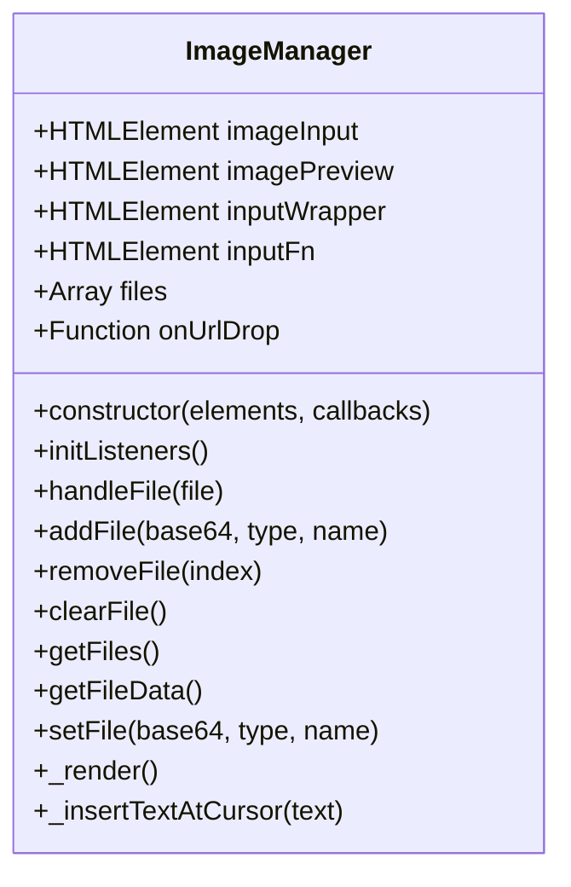

**图表来源**
- [sandbox/core/image_manager.js](file://sandbox/core/image_manager.js#L4-L281)

### 主要DOM元素

ImageManager通过构造函数接收以下关键DOM元素：

- **imageInput**: 文件输入元素，用于处理本地文件选择
- **imagePreview**: 图像预览容器，显示已选择的文件
- **inputWrapper**: 输入包装器，用于拖拽状态指示
- **inputFn**: 文本输入元素，支持粘贴内容插入

**章节来源**
- [sandbox/core/image_manager.js](file://sandbox/core/image_manager.js#L5-L16)
- [sandbox/boot/app.js](file://sandbox/boot/app.js#L64-L76)

## 架构概览

ImageManager采用了分层架构设计，将用户交互、数据处理和视图渲染分离：

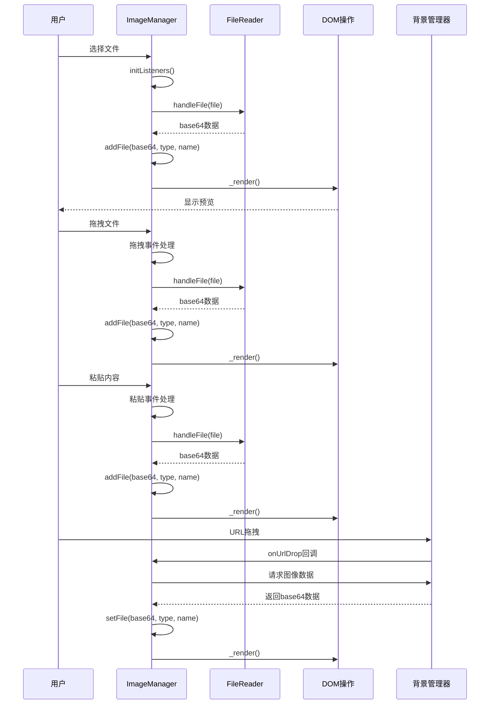

**图表来源**
- [sandbox/core/image_manager.js](file://sandbox/core/image_manager.js#L19-L172)
- [background/managers/image_manager.js](file://background/managers/image_manager.js#L7-L46)

## 详细组件分析

### 事件监听系统

ImageManager实现了三个主要的事件监听机制：

#### 文件选择监听器
当用户通过文件输入元素选择文件时，系统会遍历所有选中的文件并逐个处理：

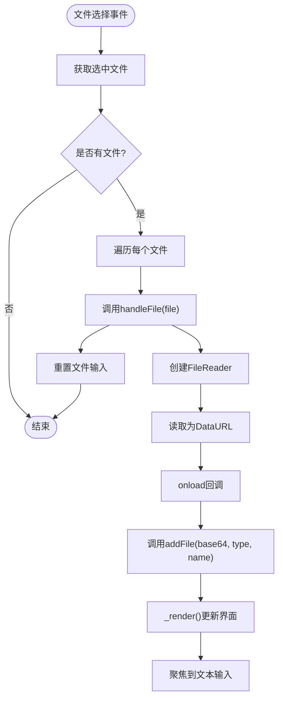

**图表来源**
- [sandbox/core/image_manager.js](file://sandbox/core/image_manager.js#L21-L27)
- [sandbox/core/image_manager.js](file://sandbox/core/image_manager.js#L195-L203)

#### 粘贴事件处理器

粘贴功能支持多种内容类型，包括直接文件、HTML图像和纯文本：

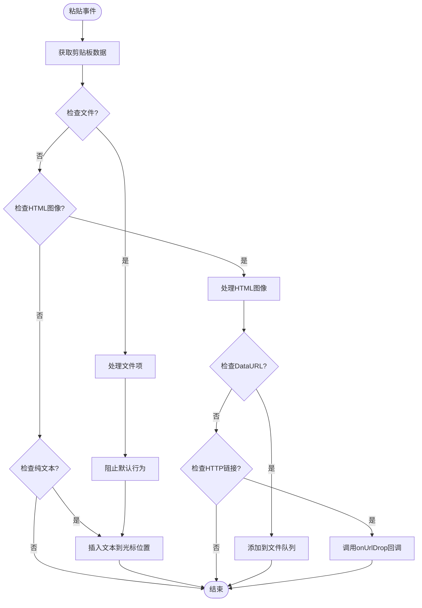

**图表来源**
- [sandbox/core/image_manager.js](file://sandbox/core/image_manager.js#L31-L86)

#### 拖拽事件处理器

拖拽功能支持系统文件拖拽和网页内容拖拽两种模式：

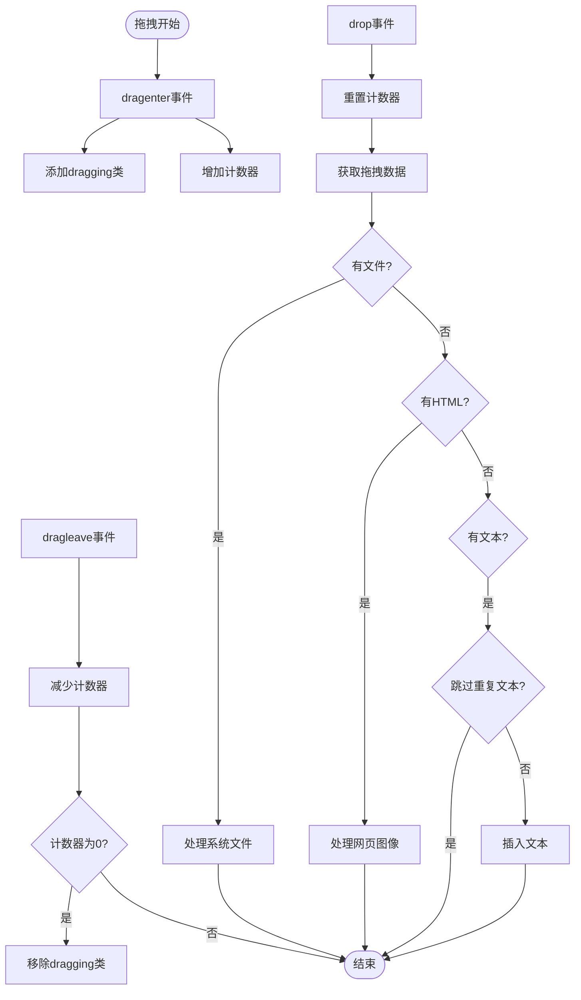

**图表来源**
- [sandbox/core/image_manager.js](file://sandbox/core/image_manager.js#L88-L171)

### 文件处理流程

#### FileReader集成

ImageManager使用FileReader API将文件转换为base64格式：

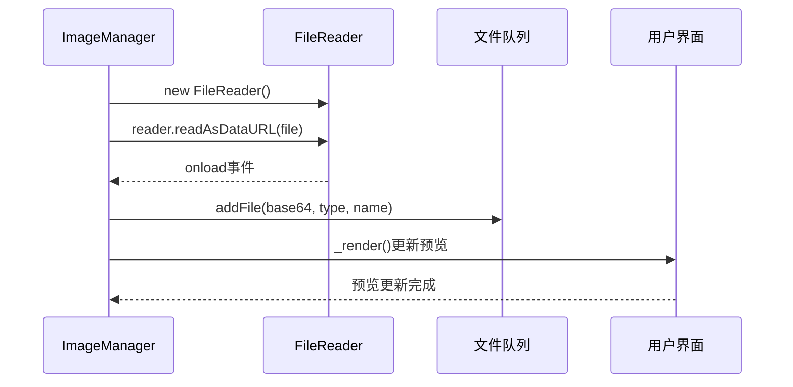

**图表来源**
- [sandbox/core/image_manager.js](file://sandbox/core/image_manager.js#L195-L203)
- [sandbox/core/image_manager.js](file://sandbox/core/image_manager.js#L210-L214)

#### 多文件队列管理

ImageManager维护一个文件数组队列，支持多文件同时处理：

| 方法 | 功能 | 参数 | 返回值 |
|------|------|------|--------|
| `addFile(base64, type, name)` | 添加文件到队列 | base64字符串, MIME类型, 文件名 | void |
| `removeFile(index)` | 从队列移除指定索引的文件 | 文件索引 | void |
| `clearFile()` | 清空整个文件队列 | 无 | void |
| `getFiles()` | 获取文件队列副本 | 无 | Array |
| `getFileData()` | 获取第一个文件数据（兼容性） | 无 | Object |

**章节来源**
- [sandbox/core/image_manager.js](file://sandbox/core/image_manager.js#L210-L236)

### 界面渲染系统

#### 实时预览渲染

ImageManager的渲染系统根据文件类型动态生成不同的预览组件：

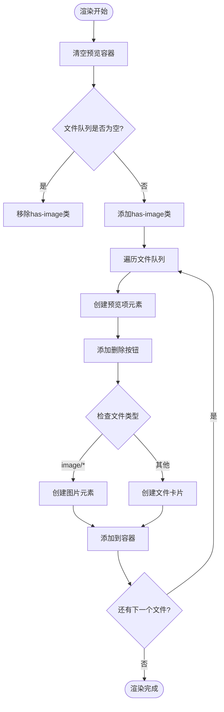

**图表来源**
- [sandbox/core/image_manager.js](file://sandbox/core/image_manager.js#L238-L279)

#### 删除功能实现

每个预览项都包含一个删除按钮，支持单个文件的精确删除：

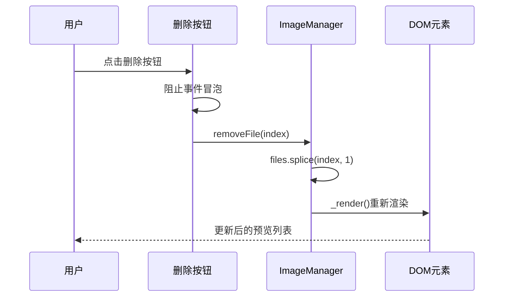

**图表来源**
- [sandbox/core/image_manager.js](file://sandbox/core/image_manager.js#L256-L259)
- [sandbox/core/image_manager.js](file://sandbox/core/image_manager.js#L216-L219)

### 文本插入系统

#### 光标位置文本插入

ImageManager实现了智能的文本插入功能，能够在用户光标位置准确插入文本：

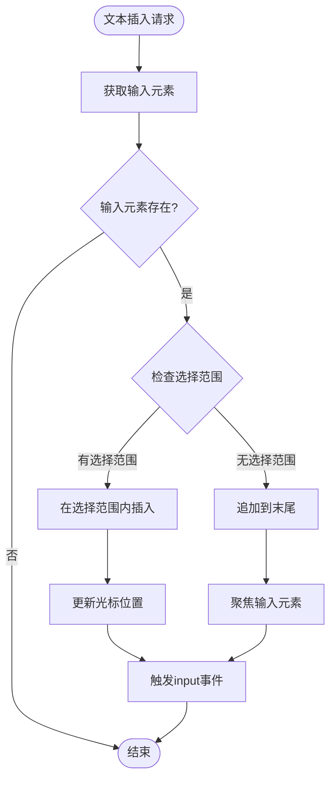

**图表来源**
- [sandbox/core/image_manager.js](file://sandbox/core/image_manager.js#L174-L193)

**章节来源**
- [sandbox/core/image_manager.js](file://sandbox/core/image_manager.js#L174-L193)

## 依赖关系分析

### 组件间依赖关系

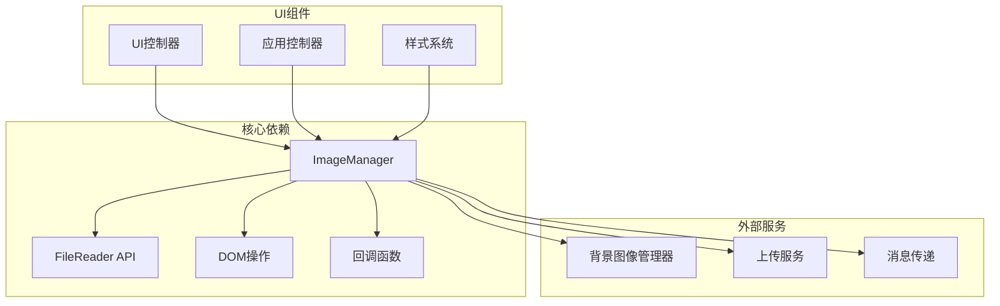

**图表来源**
- [sandbox/core/image_manager.js](file://sandbox/core/image_manager.js#L1-L281)
- [background/managers/image_manager.js](file://background/managers/image_manager.js#L1-L97)

### 数据流分析

ImageManager的数据流遵循单向数据绑定原则：

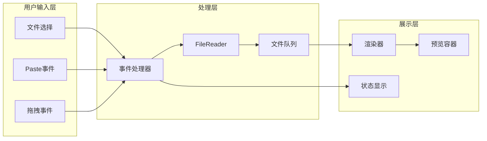

**图表来源**
- [sandbox/core/image_manager.js](file://sandbox/core/image_manager.js#L19-L172)

**章节来源**
- [sandbox/core/image_manager.js](file://sandbox/core/image_manager.js#L1-L281)

## 性能考虑

### 内存管理

ImageManager在设计时充分考虑了内存效率：

- **Base64数据存储**: 使用base64格式存储图像数据，便于跨组件传输
- **文件队列限制**: 建议在实际应用中实现文件大小和数量限制
- **DOM元素复用**: 通过重新渲染而非频繁的DOM操作来优化性能

### 异步处理

- **异步文件读取**: 使用FileReader的异步API避免阻塞主线程
- **事件驱动架构**: 基于事件的响应式设计确保良好的用户体验
- **防抖处理**: 在高频事件（如拖拽）中合理使用计数器避免重复处理

### 最佳实践建议

1. **文件大小验证**: 在处理大文件前进行大小检查
2. **内存清理**: 及时清理不再使用的文件引用
3. **错误处理**: 实现完善的异常捕获和用户反馈机制
4. **进度指示**: 为长时间操作提供进度反馈

## 故障排除指南

### 常见问题及解决方案

#### 文件读取失败

**症状**: 文件无法正确读取或显示为空白

**可能原因**:
- 文件格式不支持
- 文件损坏或权限问题
- 浏览器安全策略限制

**解决方法**:
1. 检查文件扩展名和MIME类型
2. 验证文件完整性
3. 确认浏览器允许文件访问

#### 预览渲染异常

**症状**: 图像无法正确显示或布局错乱

**可能原因**:
- CSS样式冲突
- DOM元素未正确初始化
- 渲染时机问题

**解决方法**:
1. 检查CSS类名匹配
2. 确保DOM元素存在且可访问
3. 延迟渲染直到页面完全加载

#### 事件处理失效

**症状**: 拖拽、粘贴等功能无法正常工作

**可能原因**:
- 事件监听器未正确绑定
- 浏览器兼容性问题
- 权限不足

**解决方法**:
1. 验证事件监听器绑定状态
2. 检查浏览器支持情况
3. 确认必要的权限已授予

**章节来源**
- [sandbox/core/image_manager.js](file://sandbox/core/image_manager.js#L19-L172)

## 最佳实践

### 多文件上传队列管理

1. **队列容量控制**: 实现最大文件数量限制，避免内存溢出
2. **优先级排序**: 支持按文件大小或类型进行排序
3. **并发处理**: 合理控制同时处理的文件数量
4. **进度跟踪**: 提供详细的上传进度反馈

### 实时预览渲染

1. **懒加载策略**: 对大量文件采用虚拟滚动技术
2. **缩略图生成**: 为大文件生成缩略图提高渲染效率
3. **缓存机制**: 缓存已处理的文件数据避免重复计算
4. **响应式设计**: 确保在不同设备上都有良好的显示效果

### 用户交互优化

1. **拖拽反馈**: 提供清晰的拖拽区域视觉提示
2. **错误提示**: 及时友好的错误信息反馈
3. **键盘导航**: 支持键盘快捷键操作
4. **无障碍访问**: 确保残障用户也能正常使用

### 安全考虑

1. **文件类型验证**: 严格验证上传文件的类型和内容
2. **大小限制**: 实施合理的文件大小限制
3. **恶意内容检测**: 检测和阻止潜在的恶意文件
4. **权限控制**: 确保只有授权用户可以访问敏感功能

## 结论

UI图像管理器（ImageManager）是一个功能完整、架构清晰的图像处理组件。它成功地将复杂的用户交互需求抽象为简洁的API接口，为开发者提供了强大的图像上传和管理能力。

该组件的主要优势包括：

- **多源支持**: 同时支持文件选择、拖拽和粘贴三种输入方式
- **实时预览**: 提供即时的视觉反馈和交互体验
- **队列管理**: 完善的多文件队列处理机制
- **扩展性强**: 清晰的架构设计便于功能扩展和定制

通过合理的设计和实现，ImageManager为Gemini Nexus项目提供了可靠的图像处理基础，为用户创造了流畅自然的交互体验。在未来的发展中，可以进一步优化性能、增强安全性，并扩展更多高级功能来满足不断增长的用户需求。