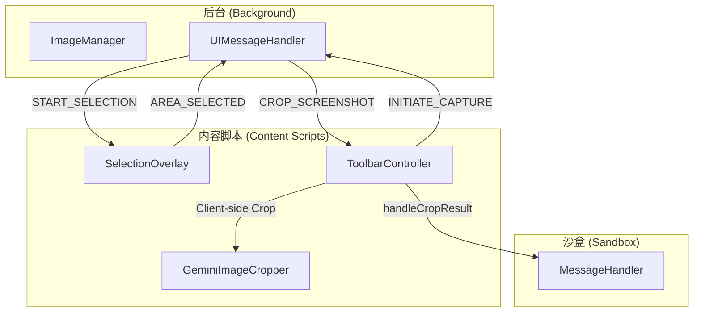
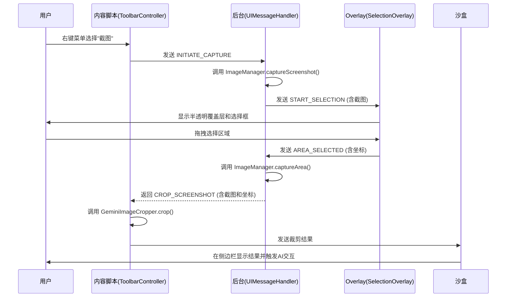
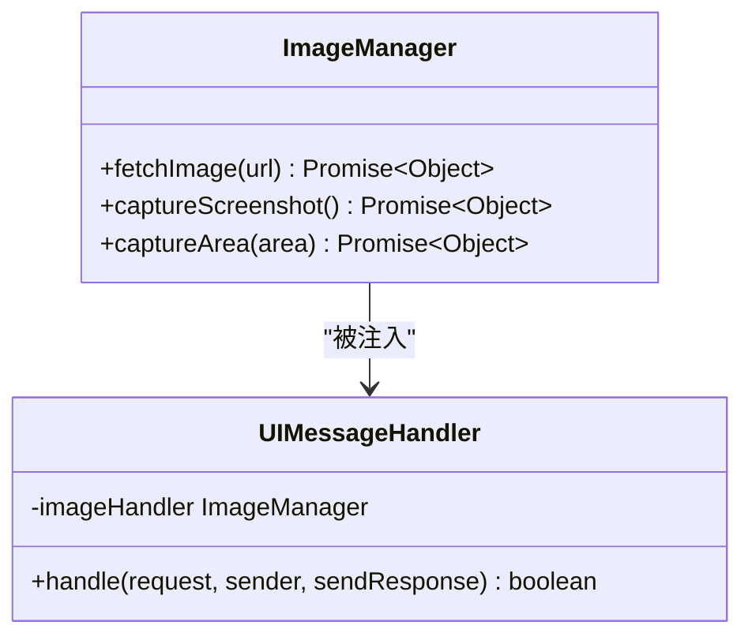
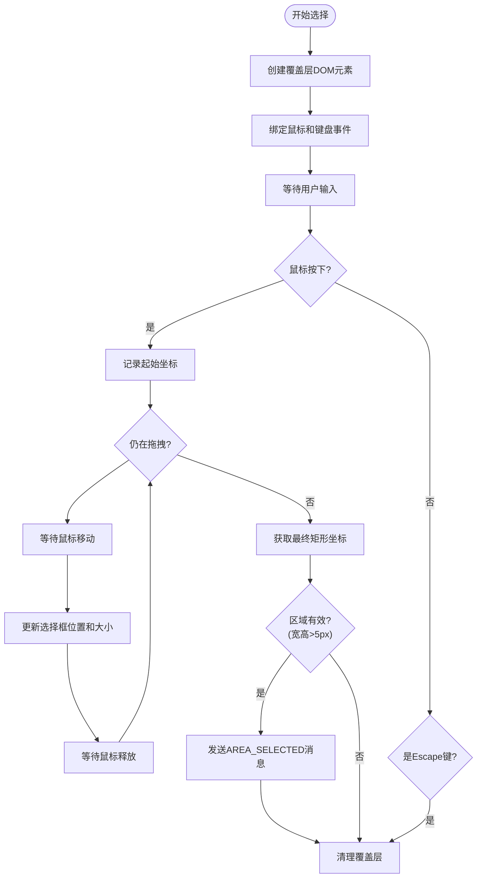
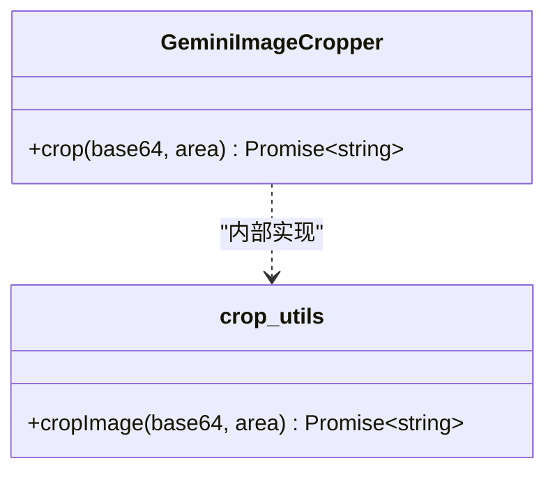
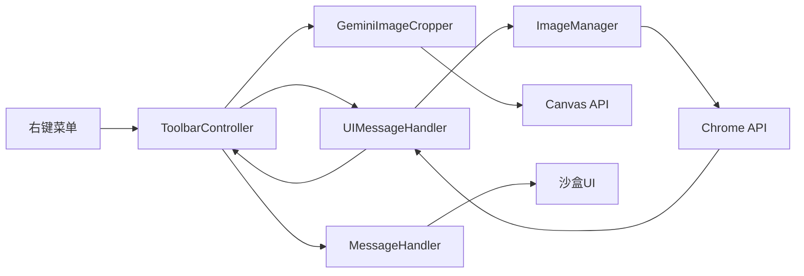

# 区域裁剪

<cite>
**本文档中引用的文件**  
- [background/managers/image_manager.js](file://background/managers/image_manager.js)
- [background/handlers/ui.js](file://background/handlers/ui.js)
- [content/overlay.js](file://content/overlay.js)
- [content/toolbar/crop.js](file://content/toolbar/crop.js)
- [lib/crop_utils.js](file://lib/crop_utils.js)
- [content/toolbar/controller.js](file://content/toolbar/controller.js)
- [sandbox/controllers/message_handler.js](file://sandbox/controllers/message_handler.js)
- [content/index.js](file://content/index.js)
</cite>

## 目录
1. [简介](#简介)
2. [项目结构](#项目结构)
3. [核心组件](#核心组件)
4. [架构概述](#架构概述)
5. [详细组件分析](#详细组件分析)
6. [依赖分析](#依赖分析)
7. [性能考虑](#性能考虑)
8. [故障排除指南](#故障排除指南)
9. [结论](#结论)

## 简介
本文档全面解析了Gemini Nexus扩展中区域裁剪功能的技术实现。该功能允许用户通过鼠标拖拽选择屏幕区域，系统将自动捕获完整截图，并根据选定坐标进行裁剪，最终将裁剪后的图像数据传递给AI模型进行后续处理（如OCR、翻译或图像理解）。文档详细阐述了后台与前端内容脚本之间的协作机制，包括截图捕获、区域选择、图像裁剪和跨组件通信等关键环节。

## 项目结构
区域裁剪功能涉及多个模块的协同工作，主要分布在`background`、`content`和`sandbox`三个目录中。`background`负责核心的截图捕获和消息路由；`content`目录下的脚本处理用户交互和DOM操作；`sandbox`则在隔离环境中处理来自裁剪操作的最终结果。

**Diagram sources**
- [background/managers/image_manager.js](file://background/managers/image_manager.js)
- [content/overlay.js](file://content/overlay.js)
- [content/toolbar/controller.js](file://content/toolbar/controller.js)

**Section sources**
- [background/managers/image_manager.js](file://background/managers/image_manager.js)
- [content/overlay.js](file://content/overlay.js)
- [content/toolbar/controller.js](file://content/toolbar/controller.js)

## 核心组件
区域裁剪功能的核心组件包括后台的`ImageManager`用于捕获截图，`content/overlay.js`中的`SelectionOverlay`类用于提供用户交互界面，以及`content/toolbar/crop.js`中的`GeminiImageCropper`用于执行客户端裁剪。这些组件通过Chrome的`runtime.sendMessage` API进行异步通信，形成一个完整的工作流。

**Section sources**
- [background/managers/image_manager.js](file://background/managers/image_manager.js#L48-L96)
- [content/overlay.js](file://content/overlay.js#L4-L213)
- [content/toolbar/crop.js](file://content/toolbar/crop.js#L4-L29)

## 架构概述
区域裁剪功能的架构遵循清晰的分层和职责分离原则。用户操作首先由内容脚本捕获，然后通过消息系统通知后台服务。后台服务执行高权限操作（如全屏截图），并将结果返回给内容脚本进行进一步处理。最终，裁剪结果被发送到沙盒环境中的主应用进行AI交互。

**Diagram sources**
- [background/handlers/ui.js](file://background/handlers/ui.js#L88-L119)
- [content/overlay.js](file://content/overlay.js#L22-L213)
- [content/toolbar/controller.js](file://content/toolbar/controller.js#L112-L147)

## 详细组件分析

### 后台截图管理器分析
`ImageManager`类是区域裁剪功能的后端核心，它封装了与Chrome截图API的交互。

#### 类图

**Diagram sources**
- [background/managers/image_manager.js](file://background/managers/image_manager.js#L4-L97)
- [background/handlers/ui.js](file://background/handlers/ui.js#L4-L195)

#### 关键方法分析
- `_captureTab()`: 内部私有方法，直接调用`chrome.tabs.captureVisibleTab`获取当前标签页的PNG格式Data URL。此方法包装了异步回调，返回一个Promise，确保了现代JavaScript的异步编程风格。
- `captureArea(area)`: 公共方法，接收前端传来的区域坐标对象。它首先调用`_captureTab()`获取完整截图，然后将截图Data URL和区域坐标封装成`CROP_SCREENSHOT`消息对象返回。值得注意的是，实际的像素级裁剪并未在此处执行，而是将完整截图和坐标信息一并发送回前端，由前端进行裁剪，这有助于保持后台进程的轻量化。

**Section sources**
- [background/managers/image_manager.js](file://background/managers/image_manager.js#L48-L96)

### 前端选择覆盖层分析
`SelectionOverlay`类提供了用户选择屏幕区域的可视化界面。

#### 流程图

**Diagram sources**
- [content/overlay.js](file://content/overlay.js#L4-L213)

#### 实现原理
该组件通过创建一个全屏的`div`覆盖层来捕获所有鼠标事件。当用户按下鼠标时，记录起始坐标并显示一个半透明的选择框。随着鼠标移动，实时更新选择框的尺寸和位置。当用户释放鼠标时，计算出最终的矩形区域，并通过`chrome.runtime.sendMessage`将包含`x, y, width, height`和`pixelRatio`的`area`对象发送给后台。`pixelRatio`的引入是关键，它确保了在高DPI屏幕上选择的坐标能正确映射到实际的设备像素。

**Section sources**
- [content/overlay.js](file://content/overlay.js#L4-L213)

### 前端图像裁剪器分析
`GeminiImageCropper`负责在客户端执行最终的图像裁剪。

#### 类图

**Diagram sources**
- [content/toolbar/crop.js](file://content/toolbar/crop.js#L4-L29)
- [lib/crop_utils.js](file://lib/crop_utils.js#L4-L28)

#### 实现原理
`crop`方法接收一个图像的Data URL和一个区域对象。它利用HTML5 Canvas的`drawImage`方法进行像素级裁剪：
1. 创建一个`Image`对象并设置其`src`为传入的Data URL。
2. 当图片加载完成后，创建一个`canvas`元素。
3. 根据`area.pixelRatio`调整canvas的`width`和`height`，确保在高DPI屏幕上也能正确渲染。
4. 使用`ctx.drawImage()`方法，将原图中指定区域（源矩形）绘制到canvas的整个区域（目标矩形）。
5. 调用`canvas.toDataURL('image/png')`将裁剪后的图像转换为新的Data URL，并通过Promise的`resolve`返回。

此方法使用Promise封装，保证了异步操作的可靠性，调用者可以使用`async/await`语法进行优雅的链式调用。

**Section sources**
- [content/toolbar/crop.js](file://content/toolbar/crop.js#L5-L27)
- [lib/crop_utils.js](file://lib/crop_utils.js#L4-L28)

## 依赖分析
区域裁剪功能的组件间依赖关系清晰，形成了一个单向的数据流。

**Diagram sources**
- [go.mod](file://go.mod#L1-L20)
- [background/index.js](file://background/index.js#L1-L30)

**Section sources**
- [background/index.js](file://background/index.js#L1-L30)
- [background/handlers/ui.js](file://background/handlers/ui.js#L1-L195)
- [content/toolbar/controller.js](file://content/toolbar/controller.js#L1-L301)

## 性能考虑
虽然本节不分析具体文件，但基于代码实现，可以提出以下性能优化建议：
- **内存释放**: 在`SelectionOverlay.cleanup()`方法中，及时移除DOM元素和事件监听器，防止内存泄漏。
- **Canvas重用**: 可以考虑缓存`canvas`和`context`对象，避免在频繁裁剪操作中重复创建和销毁，减少垃圾回收压力。
- **防抖处理**: 如果未来支持连续截图，应对`_captureTab`调用进行防抖，避免短时间内频繁截图导致性能下降。

## 故障排除指南
当区域裁剪功能失效时，可参考以下步骤进行排查：
1. **检查权限**: 确保扩展已获得`"activeTab"`或`"tabCapture"`权限。
2. **查看控制台**: 在后台页面和内容脚本的上下文中检查是否有JavaScript错误。
3. **验证消息流**: 确认`INITIATE_CAPTURE`、`AREA_SELECTED`和`CROP_SCREENSHOT`等消息是否按预期发送和接收。
4. **网络问题**: `fetchImage`方法可能因跨域或网络问题失败，需检查相关错误处理逻辑。

**Section sources**
- [background/managers/image_manager.js](file://background/managers/image_manager.js#L7-L45)
- [content/toolbar/controller.js](file://content/toolbar/controller.js#L136-L140)

## 结论
区域裁剪功能通过精心设计的前后端协作机制，实现了高效、可靠的屏幕区域捕获。后台负责安全的截图操作，前端负责用户交互和最终的像素处理，两者通过结构化的消息进行通信。`pixelRatio`的正确处理保证了在各种DPI屏幕上的兼容性，而Promise的使用则确保了异步流程的健壮性。该设计模式清晰，职责分明，为扩展的其他功能提供了良好的参考范例。