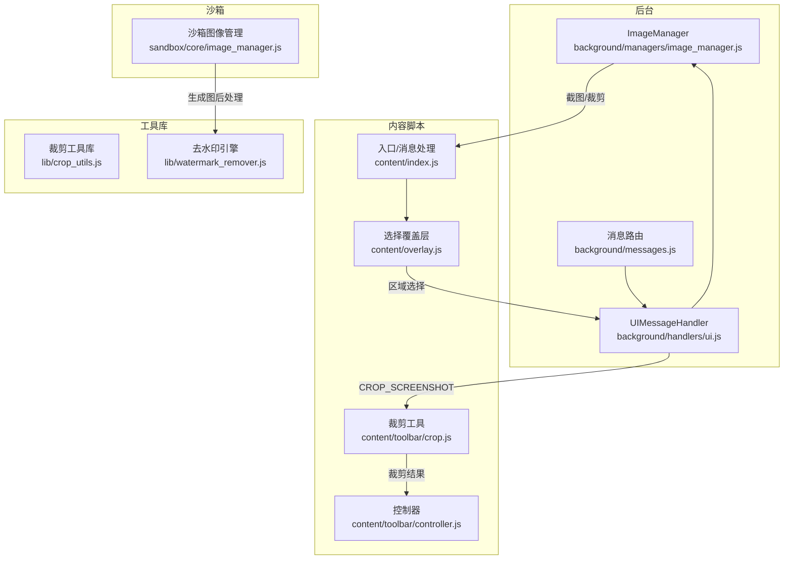
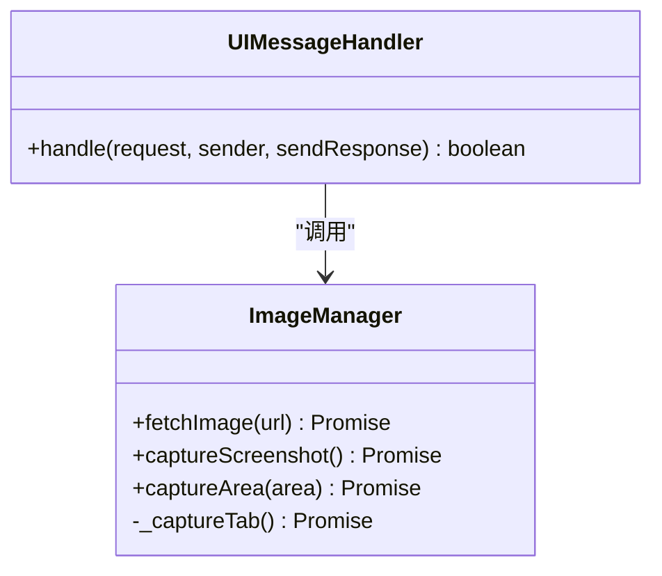
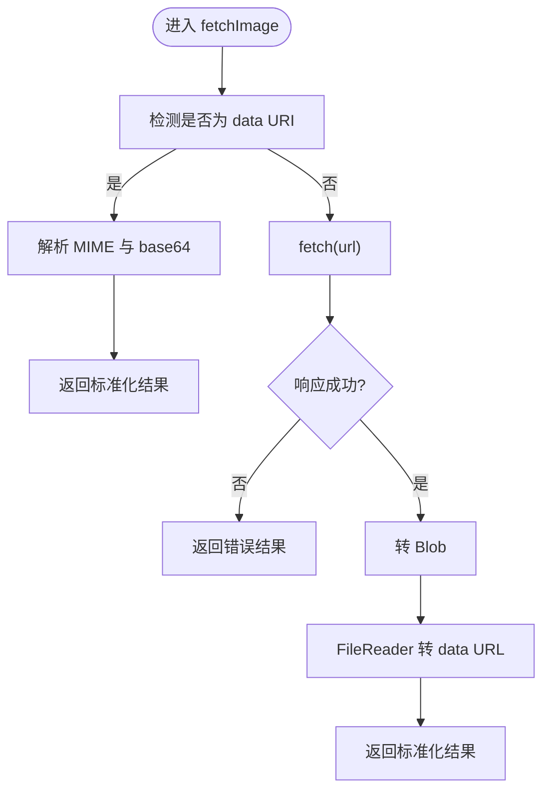
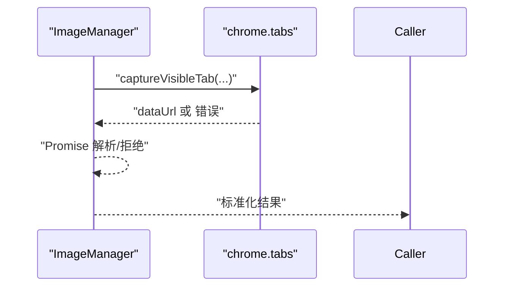
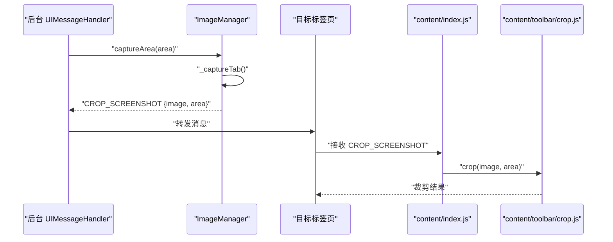
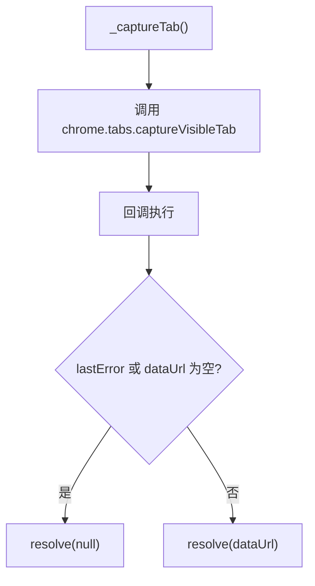
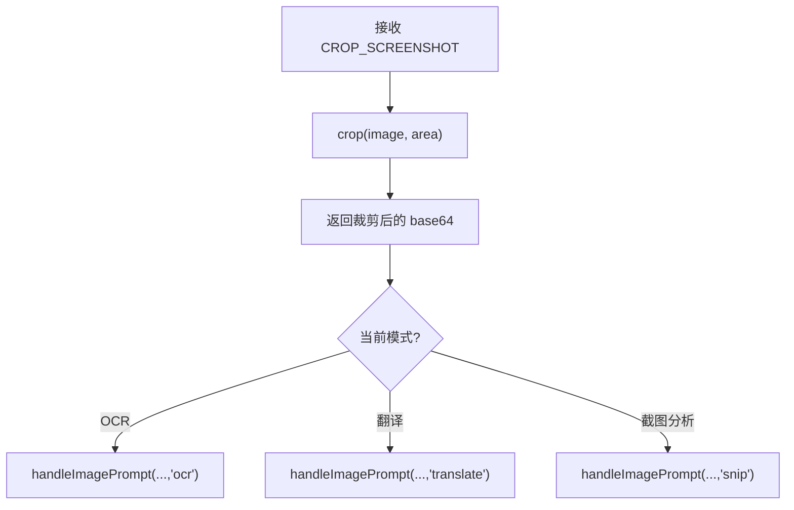
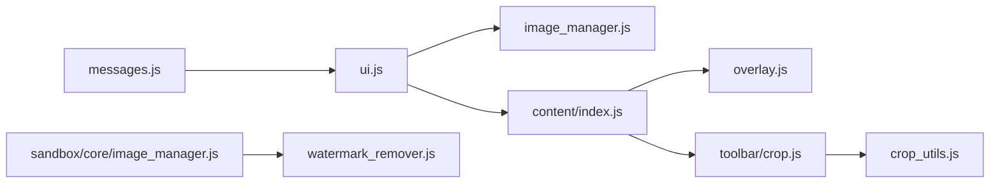

# 后台图像管理器

<cite>
**本文档引用的文件**
- [background/managers/image_manager.js](file://background/managers/image_manager.js)
- [background/handlers/ui.js](file://background/handlers/ui.js)
- [content/toolbar/crop.js](file://content/toolbar/crop.js)
- [content/overlay.js](file://content/overlay.js)
- [content/index.js](file://content/index.js)
- [content/toolbar/controller.js](file://content/toolbar/controller.js)
- [lib/crop_utils.js](file://lib/crop_utils.js)
- [lib/watermark_remover.js](file://lib/watermark_remover.js)
- [background/messages.js](file://background/messages.js)
- [sandbox/core/image_manager.js](file://sandbox/core/image_manager.js)
</cite>

## 目录
1. [简介](#简介)
2. [项目结构](#项目结构)
3. [核心组件](#核心组件)
4. [架构总览](#架构总览)
5. [详细组件分析](#详细组件分析)
6. [依赖关系分析](#依赖关系分析)
7. [性能考量](#性能考量)
8. [故障排查指南](#故障排查指南)
9. [结论](#结论)

## 简介
本文件系统化梳理后台图像管理器（ImageManager）在 background 服务中的实现，重点覆盖以下能力：
- fetchImage 方法对 data URI 与远程 URL 的统一处理，使用 fetch API 获取网络图片并转换为 base64 格式
- captureScreenshot 方法通过 chrome.tabs.captureVisibleTab 捕获当前标签页截图，并封装为标准响应格式
- captureArea 方法与 content/toolbar/crop.js 协作：先捕获完整截图，再将截图数据与区域信息发送至前端进行裁剪
- _cropTab 内部方法的 Promise 封装与错误处理策略
- 图片数据在跨组件间传输的安全性考虑与性能优化建议

## 项目结构
围绕图像管理的关键模块分布如下：
- 后台管理器：background/managers/image_manager.js
- UI 消息处理：background/handlers/ui.js
- 前端裁剪逻辑：content/toolbar/crop.js、content/overlay.js、content/index.js
- 控制器与动作分发：content/toolbar/controller.js
- 工具函数：lib/crop_utils.js、lib/watermark_remover.js
- 全局消息路由：background/messages.js
- 沙箱图像管理（渲染侧复用）：sandbox/core/image_manager.js



图表来源
- [background/managers/image_manager.js](file://background/managers/image_manager.js#L1-L97)
- [background/handlers/ui.js](file://background/handlers/ui.js#L1-L195)
- [content/toolbar/crop.js](file://content/toolbar/crop.js#L1-L30)
- [content/overlay.js](file://content/overlay.js#L1-L212)
- [content/index.js](file://content/index.js#L1-L120)
- [lib/crop_utils.js](file://lib/crop_utils.js#L1-L29)
- [lib/watermark_remover.js](file://lib/watermark_remover.js#L1-L143)
- [background/messages.js](file://background/messages.js#L1-L82)
- [sandbox/core/image_manager.js](file://sandbox/core/image_manager.js#L1-L281)

章节来源
- [background/managers/image_manager.js](file://background/managers/image_manager.js#L1-L97)
- [background/handlers/ui.js](file://background/handlers/ui.js#L1-L195)
- [content/toolbar/crop.js](file://content/toolbar/crop.js#L1-L30)
- [content/overlay.js](file://content/overlay.js#L1-L212)
- [content/index.js](file://content/index.js#L1-L120)
- [lib/crop_utils.js](file://lib/crop_utils.js#L1-L29)
- [lib/watermark_remover.js](file://lib/watermark_remover.js#L1-L143)
- [background/messages.js](file://background/messages.js#L1-L82)
- [sandbox/core/image_manager.js](file://sandbox/core/image_manager.js#L1-L281)

## 核心组件
- ImageManager（后台）：负责图片抓取、截图捕获与区域裁剪的统一入口，提供 Promise 化封装与错误回退
- UIMessageHandler（后台）：承接扩展消息，调用 ImageManager 并将结果广播或定向发送到指定标签页
- 裁剪工具（前端）：基于 Canvas 的客户端裁剪，支持高 DPI 缩放
- 选择覆盖层（前端）：提供可视化的截图区域选择交互
- 控制器（前端）：协调 UI、动作与消息流，处理裁剪结果并触发后续 AI 提示

章节来源
- [background/managers/image_manager.js](file://background/managers/image_manager.js#L4-L96)
- [background/handlers/ui.js](file://background/handlers/ui.js#L4-L170)
- [content/toolbar/crop.js](file://content/toolbar/crop.js#L4-L28)
- [content/overlay.js](file://content/overlay.js#L22-L195)
- [content/toolbar/controller.js](file://content/toolbar/controller.js#L119-L153)

## 架构总览
下图展示从用户触发截图到最终裁剪完成的端到端流程：

```mermaid
sequenceDiagram
participant User as "用户"
participant BG as "后台<br/>UIMessageHandler"
participant IM as "后台<br/>ImageManager"
participant TAB as "当前标签页"
participant CTX as "内容脚本<br/>content/index.js"
participant OVER as "覆盖层<br/>content/overlay.js"
participant CROP as "裁剪工具<br/>content/toolbar/crop.js"
User->>BG : "INITIATE_CAPTURE"
BG->>IM : "captureScreenshot()"
IM-->>BG : "FETCH_IMAGE_RESULT"
BG->>TAB : "START_SELECTION {image}"
TAB->>CTX : "START_SELECTION"
CTX->>OVER : "start(image)"
User->>OVER : "拖拽选择区域"
OVER-->>BG : "AREA_SELECTED {area}"
BG->>IM : "captureArea(area)"
IM-->>BG : "CROP_SCREENSHOT {image, area}"
BG->>TAB : "CROP_SCREENSHOT"
TAB->>CROP : "crop(image, area)"
CROP-->>TAB : "裁剪后的 base64"
TAB-->>BG : "处理结果"
BG-->>User : "完成"
```

图表来源
- [background/handlers/ui.js](file://background/handlers/ui.js#L88-L120)
- [background/managers/image_manager.js](file://background/managers/image_manager.js#L63-L95)
- [content/index.js](file://content/index.js#L49-L64)
- [content/overlay.js](file://content/overlay.js#L179-L194)
- [content/toolbar/crop.js](file://content/toolbar/crop.js#L5-L27)

## 详细组件分析

### ImageManager 组件分析
- 职责边界清晰：统一处理图片来源（data URI 与远程 URL）、截图捕获与区域裁剪
- Promise 化与错误处理：所有异步操作均返回 Promise；失败时返回标准化错误载荷
- 数据格式统一：输出统一的响应结构，便于上层消息处理器与前端控制器消费



图表来源
- [background/managers/image_manager.js](file://background/managers/image_manager.js#L4-L96)
- [background/handlers/ui.js](file://background/handlers/ui.js#L9-L170)

章节来源
- [background/managers/image_manager.js](file://background/managers/image_manager.js#L4-L96)

#### fetchImage 方法：data URI 与远程 URL 的统一处理
- data URI 分支：直接解析 MIME 类型与 base64 数据，返回标准化结果
- 远程 URL 分支：使用 fetch 获取二进制数据，转 Blob 后通过 FileReader 转换为 data URL（base64），并保留原始 MIME 类型
- 错误处理：捕获异常并返回包含错误信息的结果对象，确保调用方可感知失败



图表来源
- [background/managers/image_manager.js](file://background/managers/image_manager.js#L7-L46)

章节来源
- [background/managers/image_manager.js](file://background/managers/image_manager.js#L7-L46)

#### captureScreenshot 方法：截图捕获与响应封装
- 使用 chrome.tabs.captureVisibleTab 捕获 PNG 截图
- Promise 化封装：将回调风格 API 转为 Promise，便于链式调用
- 错误回退：若捕获失败，返回包含错误信息的结果对象



图表来源
- [background/managers/image_manager.js](file://background/managers/image_manager.js#L48-L79)

章节来源
- [background/managers/image_manager.js](file://background/managers/image_manager.js#L63-L79)

#### captureArea 方法：与前端裁剪协作
- 先调用 _captureTab 捕获完整截图
- 返回 CROP_SCREENSHOT 消息，携带截图与区域信息
- 前端通过 content/toolbar/crop.js 执行客户端裁剪，再交由控制器处理后续 AI 提示



图表来源
- [background/handlers/ui.js](file://background/handlers/ui.js#L105-L120)
- [background/managers/image_manager.js](file://background/managers/image_manager.js#L82-L95)
- [content/toolbar/crop.js](file://content/toolbar/crop.js#L5-L27)

章节来源
- [background/handlers/ui.js](file://background/handlers/ui.js#L105-L120)
- [background/managers/image_manager.js](file://background/managers/image_manager.js#L82-L95)
- [content/toolbar/crop.js](file://content/toolbar/crop.js#L5-L27)

#### _cropTab 内部方法：Promise 封装与错误处理
- 将 chrome.tabs.captureVisibleTab 的回调封装为 Promise
- 对 chrome.runtime.lastError 与空值进行判错，保证调用方能稳定收到 null 或 data URL
- 作为内部私有方法，避免外部直接依赖 chrome.tabs API



图表来源
- [background/managers/image_manager.js](file://background/managers/image_manager.js#L49-L59)

章节来源
- [background/managers/image_manager.js](file://background/managers/image_manager.js#L49-L59)

### 前端协作组件

#### 选择覆盖层与区域选择
- 在 START_SELECTION 消息到达后，创建覆盖层并注入截图背景
- 用户拖拽绘制矩形区域，延迟一段时间后发送 AREA_SELECTED 消息
- 区域信息包含 CSS 像素坐标与 devicePixelRatio，用于高 DPI 场景下的精确裁剪

```mermaid
sequenceDiagram
participant CTX as "content/index.js"
participant OVER as "SelectionOverlay"
participant BG as "后台 UIMessageHandler"
CTX->>OVER : "start(image)"
User->>OVER : "拖拽选择区域"
OVER-->>BG : "AREA_SELECTED {x,y,width,height,pixelRatio}"
```

图表来源
- [content/index.js](file://content/index.js#L49-L64)
- [content/overlay.js](file://content/overlay.js#L22-L195)

章节来源
- [content/index.js](file://content/index.js#L49-L64)
- [content/overlay.js](file://content/overlay.js#L22-L195)

#### 客户端裁剪与控制器处理
- 前端裁剪工具根据区域与 pixelRatio 计算缩放，绘制到 Canvas 并导出 PNG
- 控制器在收到裁剪结果后，根据当前模式（OCR、翻译、截图分析等）触发相应的 AI 提示



图表来源
- [content/toolbar/crop.js](file://content/toolbar/crop.js#L5-L27)
- [content/toolbar/controller.js](file://content/toolbar/controller.js#L119-L153)

章节来源
- [content/toolbar/crop.js](file://content/toolbar/crop.js#L5-L27)
- [content/toolbar/controller.js](file://content/toolbar/controller.js#L119-L153)

## 依赖关系分析
- 后台消息路由：background/messages.js 将扩展消息分发给会话与 UI 处理器
- UI 处理器：background/handlers/ui.js 负责图像相关消息（抓取、截图、区域选择）
- 前端交互：content/index.js 接收 START_SELECTION 与 CROP_SCREENSHOT，配合 overlay 与 crop 工具完成交互
- 工具库：lib/crop_utils.js 提供通用裁剪能力；lib/watermark_remover.js 提供去水印能力（沙箱渲染侧复用）



图表来源
- [background/messages.js](file://background/messages.js#L14-L81)
- [background/handlers/ui.js](file://background/handlers/ui.js#L9-L170)
- [background/managers/image_manager.js](file://background/managers/image_manager.js#L1-L97)
- [content/index.js](file://content/index.js#L1-L120)
- [content/overlay.js](file://content/overlay.js#L1-L212)
- [content/toolbar/crop.js](file://content/toolbar/crop.js#L1-L30)
- [lib/crop_utils.js](file://lib/crop_utils.js#L1-L29)
- [sandbox/core/image_manager.js](file://sandbox/core/image_manager.js#L1-L281)
- [lib/watermark_remover.js](file://lib/watermark_remover.js#L1-L143)

章节来源
- [background/messages.js](file://background/messages.js#L14-L81)
- [background/handlers/ui.js](file://background/handlers/ui.js#L9-L170)
- [background/managers/image_manager.js](file://background/managers/image_manager.js#L1-L97)
- [content/index.js](file://content/index.js#L1-L120)
- [content/overlay.js](file://content/overlay.js#L1-L212)
- [content/toolbar/crop.js](file://content/toolbar/crop.js#L1-L30)
- [lib/crop_utils.js](file://lib/crop_utils.js#L1-L29)
- [sandbox/core/image_manager.js](file://sandbox/core/image_manager.js#L1-L281)
- [lib/watermark_remover.js](file://lib/watermark_remover.js#L1-L143)

## 性能考量
- 截图与裁剪的内存占用
  - 截图通常为大尺寸 PNG，建议在前端裁剪后再传递，减少不必要的数据体积
  - 高 DPI 场景下，Canvas 尺寸按 pixelRatio 放大，注意控制导出质量参数以平衡清晰度与体积
- 网络图片抓取
  - 远程 URL 抓取需考虑跨域限制与响应大小，建议在后台统一校验与限流
  - 对于超大图片，优先在前端裁剪或降采样，避免内存峰值过高
- 消息传输
  - base64 字符串体积较大，尽量在必要时才传输；如需预览，可考虑仅传输缩略图
  - 使用定向消息（chrome.tabs.sendMessage）而非广播，降低冗余传输

[本节为通用性能建议，不直接分析具体文件]

## 故障排查指南
- 截图失败
  - 检查 _captureTab 的错误分支：当 chrome.runtime.lastError 或 dataUrl 为空时返回 null
  - 确认当前标签页可见且未被扩展权限限制
- 区域选择无效
  - 确认 overlay 已正确注入截图背景并监听拖拽事件
  - 检查 AREA_SELECTED 是否延迟发送（存在 50ms 延迟）
- 裁剪结果异常
  - 确认前端 crop 工具传入的 area 包含正确的 pixelRatio
  - 检查 Canvas 绘制参数与导出质量设置
- 消息未到达
  - 核对 START_SELECTION 与 CROP_SCREENSHOT 的消息路径与目标标签页
  - 检查后台 UI 处理器是否正确转发消息

章节来源
- [background/managers/image_manager.js](file://background/managers/image_manager.js#L49-L59)
- [content/overlay.js](file://content/overlay.js#L179-L195)
- [content/toolbar/crop.js](file://content/toolbar/crop.js#L5-L27)
- [background/handlers/ui.js](file://background/handlers/ui.js#L88-L120)

## 结论
后台图像管理器通过统一的 API 设计，将 data URI、远程 URL、截图与区域裁剪整合为一致的响应格式，配合前端覆盖层与裁剪工具，实现了从用户交互到 AI 提示的完整闭环。其 Promise 化封装与错误回退机制提升了稳定性，结合像素比与 Canvas 的高 DPI 裁剪策略，兼顾了精度与性能。建议在生产环境中进一步完善跨域与权限校验、消息定向传输与图片体积控制，以提升整体用户体验与安全性。