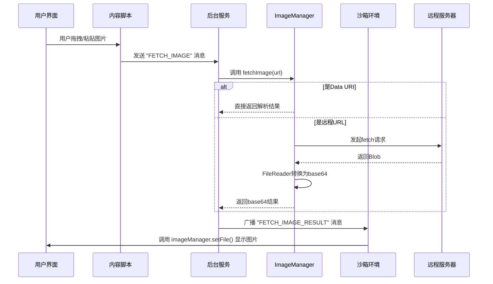

# 图片获取

<cite>
**本文档引用的文件**   
- [image_manager.js](file://background/managers/image_manager.js)
- [ui.js](file://background/handlers/ui.js)
- [message_handler.js](file://sandbox/controllers/message_handler.js)
- [utils.js](file://lib/utils.js)
- [crop_utils.js](file://lib/crop_utils.js)
- [image.js](file://content/toolbar/image.js)
</cite>

## 目录
1. [简介](#简介)
2. [核心功能分析](#核心功能分析)
3. [架构与集成](#架构与集成)
4. [错误处理机制](#错误处理机制)
5. [高级特性集成](#高级特性集成)
6. [性能优化建议](#性能优化建议)
7. [使用示例](#使用示例)

## 简介
本文件详细说明了扩展程序中图片获取功能的实现机制，重点聚焦于`ImageManager`类中的`fetchImage`方法。该功能支持从两种主要来源获取图片：data URI（数据URI）和远程URL。系统能够智能区分这两种来源并采用相应的处理策略，最终将图片转换为base64格式，以便在后续的AI分析、OCR识别等高级功能中使用。

## 核心功能分析

`fetchImage`方法是图片获取功能的核心，它根据输入URL的类型采取不同的处理路径。

### Data URI处理流程
当输入的URL以`data:`开头时，系统将其识别为内嵌的data URI。该方法使用正则表达式`/^data:(.+);base64,(.+)$/`来解析URL，提取出MIME类型和base64编码的数据。解析成功后，方法直接返回一个包含原始data URI、解析出的MIME类型和默认文件名`dropped_image.png`的响应对象。

### 远程URL处理流程
对于以`http`或`https`开头的远程URL，处理流程更为复杂：
1.  使用`fetch` API发起网络请求获取资源。
2.  检查响应状态，如果请求失败（`!response.ok`），则抛出错误。
3.  将成功的响应体转换为`Blob`对象。
4.  利用`FileReader` API的`readAsDataURL`方法，将`Blob`异步转换为包含MIME类型的data URL（即base64字符串）。
5.  最后，返回一个包含转换后的base64数据、`Blob`的MIME类型和默认文件名`web_image.png`的响应对象。

**Section sources**
- [image_manager.js](file://background/managers/image_manager.js#L7-L39)

## 架构与集成

图片获取功能并非孤立存在，而是深度集成在整个应用的架构中，通过消息传递机制与其他组件协同工作。



**Diagram sources**
- [image_manager.js](file://background/managers/image_manager.js#L7-L46)
- [ui.js](file://background/handlers/ui.js#L13-L23)
- [message_handler.js](file://sandbox/controllers/message_handler.js#L31-L33)

### 与高级特性的集成
此功能是实现图像分析、OCR等高级特性的基础。例如，当用户选择“OCR”模式时：
1.  用户通过截图或选择网页图片触发操作。
2.  系统调用`captureArea`或`captureScreenshot`方法获取图片。
3.  获取的图片数据通过`fetchImage`的逻辑被转换为base64。
4.  base64数据被封装并发送给AI模型进行文字识别。
5.  识别结果返回后，系统会自动填充到输入框并发送，实现无缝的OCR体验。

**Section sources**
- [image_manager.js](file://background/managers/image_manager.js#L62-L96)
- [message_handler.js](file://sandbox/controllers/message_handler.js#L318-L336)

## 错误处理机制

`fetchImage`方法通过`try-catch`块实现了健壮的错误处理。任何在处理过程中发生的错误（如网络请求失败、解析失败等）都会被捕获，并返回一个统一的错误响应对象。该对象包含`action`字段（值为`"FETCH_IMAGE_RESULT"`）和`error`字段（值为错误信息字符串）。这种设计确保了调用方始终能收到一个结构化的响应，无论是成功还是失败，从而简化了上层逻辑的处理。

**Section sources**
- [image_manager.js](file://background/managers/image_manager.js#L40-L45)

## 高级特性集成

除了基础的图片上传，该功能还支持与多种高级特性集成：
- **图像分析**：用户可以将图片拖拽到输入框，AI将分析图片内容并提供描述。
- **OCR文字识别**：通过截图功能，用户可以选中网页上的图片区域，系统自动进行OCR识别，并将识别出的文字填充到输入框。
- **图片生成与显示**：对于AI生成的图片，系统使用类似的`FETCH_GENERATED_IMAGE`流程，通过`fetchImage`获取图片并显示在聊天界面中。

**Section sources**
- [image.js](file://content/toolbar/image.js#L5-L79)
- [ui.js](file://background/handlers/ui.js#L27-L63)
- [message_handler.js](file://sandbox/controllers/message_handler.js#L293-L315)

## 性能优化建议

为了提升用户体验和系统性能，可以考虑以下优化策略：
- **缓存策略**：对于频繁访问的远程图片URL，可以引入内存或`localStorage`缓存。在`fetchImage`方法中，首先检查缓存，如果存在且未过期，则直接返回缓存的base64数据，避免重复的网络请求和转换开销。
- **并发控制**：当用户一次性上传多张图片时，应限制并发的`fetch`请求数量，防止对浏览器或服务器造成过大压力。可以使用信号量（Semaphore）或队列机制来管理并发。
- **预加载与懒加载**：对于生成的图片，可以采用懒加载策略，只有当图片进入视口时才发起`FETCH_GENERATED_IMAGE`请求。

## 使用示例

以下是`fetchImage`方法在不同场景下的典型使用方式：

### 处理Data URI
```javascript
// 假设用户粘贴了一个base64编码的图片
const dataUri = "data:image/png;base64,iVBORw0KGgoAAAANSUhEUgAAAAEAAAABCAYAAAAfFcSJ...";
const result = await imageManager.fetchImage(dataUri);
// result 将包含 action, base64, type, name 字段
```

### 处理远程URL
```javascript
// 假设用户输入了一个网络图片链接
const imageUrl = "https://example.com/photo.jpg";
const result = await imageManager.fetchImage(imageUrl);
// 方法会发起网络请求，获取图片并转换为base64
```

### 错误处理示例
```javascript
// 处理一个无效的URL
const invalidUrl = "https://nonexistent-site.com/image.jpg";
const result = await imageManager.fetchImage(invalidUrl);
if (result.error) {
    console.error("图片获取失败:", result.error);
    // 显示错误提示给用户
}
```

**Section sources**
- [image_manager.js](file://background/managers/image_manager.js#L7-L46)
- [quick_ask_handler.js](file://background/handlers/session/quick_ask_handler.js#L48-L68)