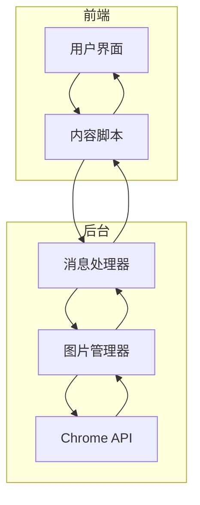
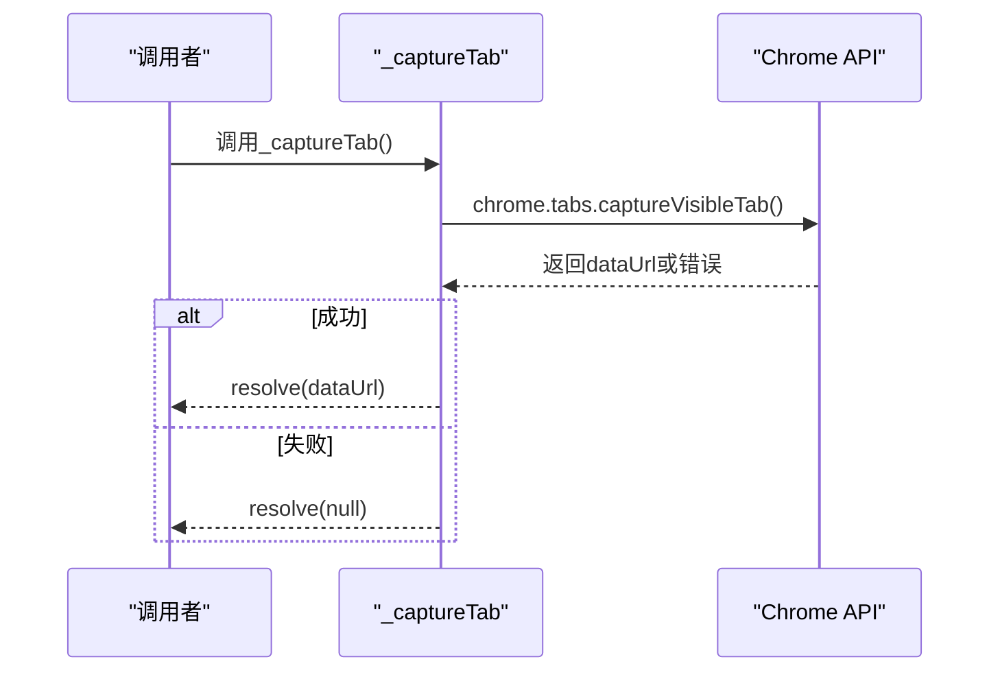
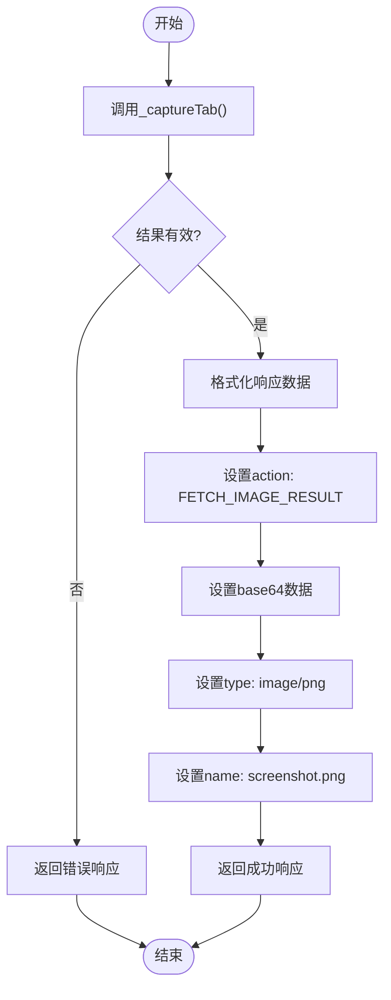
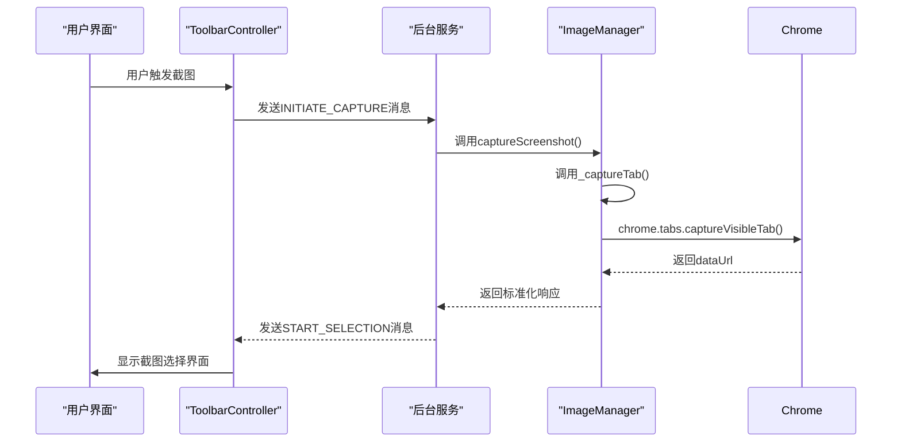
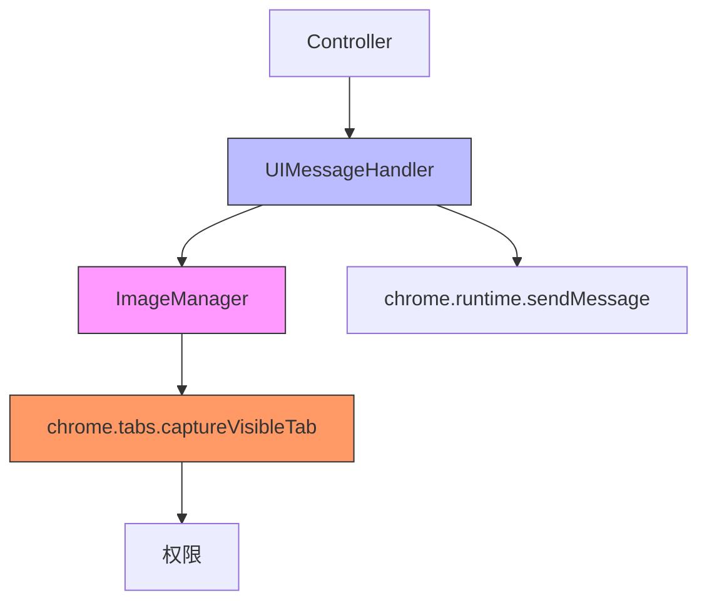

# 截图捕获

<cite>
**本文档引用的文件**   
- [image_manager.js](file://background/managers/image_manager.js)
- [ui.js](file://background/handlers/ui.js)
- [observation.js](file://background/control/actions/observation.js)
- [controller.js](file://content/toolbar/controller.js)
- [crop.js](file://content/toolbar/crop.js)
- [overlay.js](file://content/overlay.js)
- [crop_utils.js](file://lib/crop_utils.js)
- [index.js](file://background/index.js)
- [manifest.json](file://manifest.json)
</cite>

## 目录
1. [简介](#简介)
2. [核心组件](#核心组件)
3. [架构概述](#架构概述)
4. [详细组件分析](#详细组件分析)
5. [依赖分析](#依赖分析)
6. [性能考虑](#性能考虑)
7. [故障排查指南](#故障排查指南)
8. [结论](#结论)

## 简介
本文件深入分析了Gemini Nexus扩展中的全屏截图功能。该功能允许用户捕获当前活动标签页的可见区域，并支持多种使用场景，包括OCR识别、截图翻译和区域选择。文档重点分析了`captureScreenshot`方法及其内部依赖`_captureTab`的实现机制，详细说明了从UI触发到后台服务返回截图数据的完整调用链路。同时讨论了截图质量、格式选择以及高DPI屏幕下的适配策略。

## 核心组件
全屏截图功能主要由后台服务中的`ImageManager`类实现，该类提供了截图捕获的核心方法。`_captureTab`方法封装了Chrome扩展的异步截图调用，而`captureScreenshot`方法则在此基础上构建标准化的响应格式。UI消息处理器`UIMessageHandler`负责接收来自前端的截图请求并协调截图操作。

**Section sources**
- [image_manager.js](file://background/managers/image_manager.js#L48-L96)
- [ui.js](file://background/handlers/ui.js#L65-L76)

## 架构概述
截图功能的架构涉及多个组件的协同工作。当用户通过UI触发截图操作时，请求首先被发送到后台服务的消息处理器。消息处理器调用`ImageManager`的截图方法，后者使用Chrome的`tabs.captureVisibleTab`API捕获当前标签页的可见区域。捕获完成后，数据通过消息系统返回给前端进行进一步处理。



**Diagram sources**
- [ui.js](file://background/handlers/ui.js#L65-L76)
- [image_manager.js](file://background/managers/image_manager.js#L48-L96)

## 详细组件分析

### _captureTab方法分析
`_captureTab`是`ImageManager`类中的内部辅助方法，负责封装Chrome扩展的异步截图调用。该方法使用Promise适配器模式将基于回调的Chrome API转换为现代的异步编程模型。



**Diagram sources**
- [image_manager.js](file://background/managers/image_manager.js#L48-L60)

**Section sources**
- [image_manager.js](file://background/managers/image_manager.js#L48-L60)

### captureScreenshot方法分析
`captureScreenshot`方法是截图功能的主要入口点，它调用`_captureTab`方法获取截图数据，并将其转换为标准化的响应格式。该方法处理了错误情况，并确保返回的数据包含base64编码的图像、MIME类型和文件名。



**Diagram sources**
- [image_manager.js](file://background/managers/image_manager.js#L62-L79)

**Section sources**
- [image_manager.js](file://background/managers/image_manager.js#L62-L79)

### 调用链路时序分析
从UI触发到后台服务返回截图数据的完整流程涉及多个组件的交互。以下时序图展示了这一过程的详细执行流程。



**Diagram sources**
- [controller.js](file://content/toolbar/controller.js#L112-L114)
- [ui.js](file://background/handlers/ui.js#L88-L102)
- [image_manager.js](file://background/managers/image_manager.js#L62-L79)

**Section sources**
- [controller.js](file://content/toolbar/controller.js#L112-L114)
- [ui.js](file://background/handlers/ui.js#L88-L102)

## 依赖分析
截图功能依赖于多个Chrome扩展API和内部组件。主要依赖包括`chrome.tabs.captureVisibleTab`用于捕获标签页截图，`chrome.runtime.sendMessage`用于组件间通信，以及`chrome.storage`用于配置管理。`ImageManager`类依赖于Chrome的截图API，而`UIMessageHandler`则依赖于`ImageManager`提供的截图功能。



**Diagram sources**
- [manifest.json](file://manifest.json#L6-L10)
- [image_manager.js](file://background/managers/image_manager.js#L51-L58)
- [ui.js](file://background/handlers/ui.js#L93-L99)

**Section sources**
- [manifest.json](file://manifest.json#L6-L10)
- [image_manager.js](file://background/managers/image_manager.js#L51-L58)

## 性能考虑
截图功能在性能方面有多个优化点。首先，使用PNG格式确保了无损压缩，适合文本和图形内容的准确捕获。其次，通过Promise适配器模式避免了回调地狱，提高了代码的可读性和可维护性。在高DPI屏幕下，系统通过`devicePixelRatio`正确处理像素缩放，确保截图质量。

对于大尺寸截图，系统采用流式处理方式，避免内存峰值。截图数据以base64编码传输，虽然增加了约33%的数据量，但简化了数据处理流程。建议在处理大量截图时考虑使用二进制传输优化性能。

## 故障排查指南
以下是常见截图功能失败场景及其排查方法：

**Section sources**
- [image_manager.js](file://background/managers/image_manager.js#L52-L54)
- [observation.js](file://background/control/actions/observation.js#L11-L13)

### 权限缺失
如果截图功能无法工作，首先检查扩展权限是否正确配置。确保`manifest.json`中包含必要的权限声明：

```json
"permissions": ["sidePanel", "storage", "contextMenus", "scripting", "downloads"],
"host_permissions": ["<all_urls>"]
```

### Chrome运行时错误
当`chrome.runtime.lastError`存在时，表示截图操作失败。常见原因包括：
- 当前标签页不支持截图（如Chrome内部页面）
- 用户拒绝了截图权限
- 内存不足导致截图失败

检查控制台日志中的错误信息，根据具体错误代码采取相应措施。

### 高DPI适配问题
在高DPI屏幕上，可能出现截图模糊或坐标错位问题。确保在裁剪和处理截图时正确应用`devicePixelRatio`：

```javascript
const scale = area.pixelRatio || window.devicePixelRatio || 1;
canvas.width = area.width * scale;
canvas.height = area.height * scale;
```

### 内容脚本通信失败
如果前端无法接收到截图数据，检查消息通道是否正常工作。确保内容脚本和后台服务之间的消息监听器已正确设置，并且消息格式符合预期。

## 结论
Gemini Nexus的截图功能通过精心设计的架构实现了高效、可靠的屏幕捕获能力。`_captureTab`方法成功地将Chrome的回调式API转换为现代Promise模式，提高了代码的可维护性。`captureScreenshot`方法提供了标准化的响应格式，便于前端处理。系统在高DPI屏幕适配、错误处理和性能优化方面都表现出色，为用户提供了一致的截图体验。通过理解这一功能的内部机制，开发者可以更好地利用和扩展截图能力，满足更多使用场景的需求。