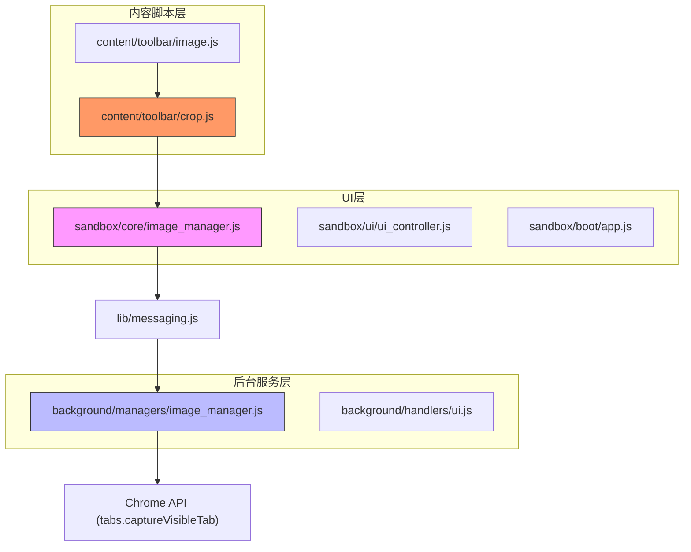
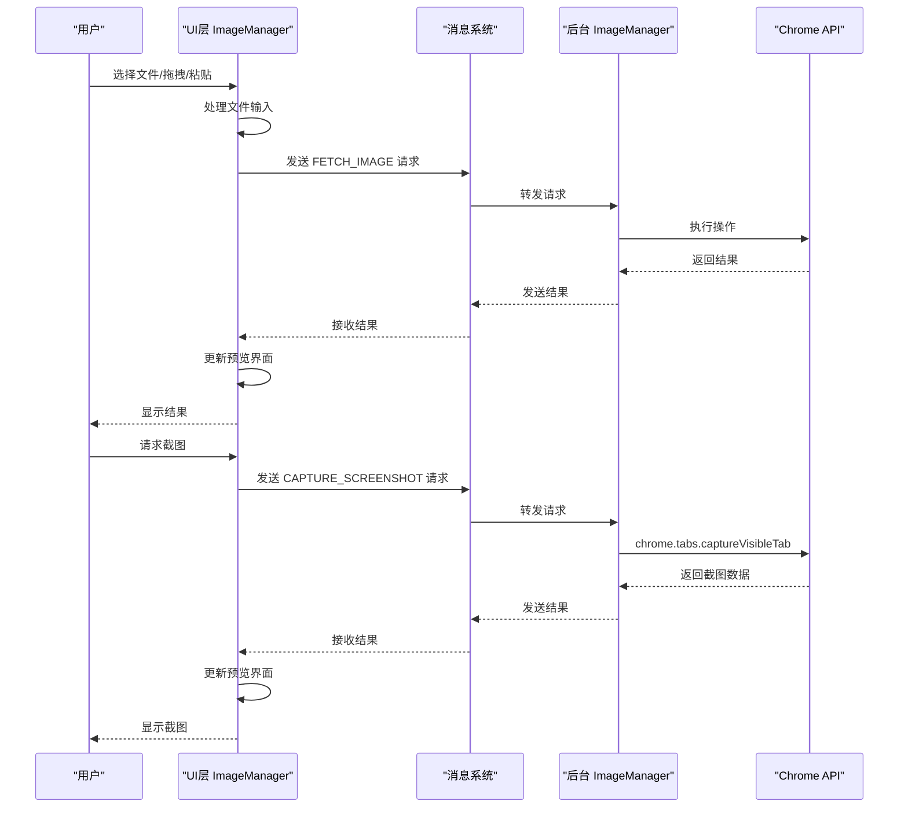
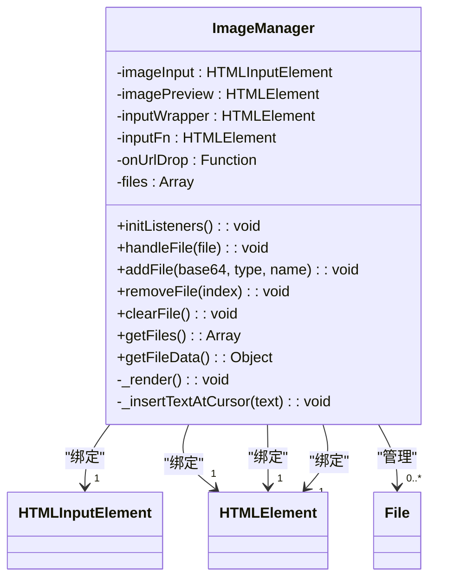
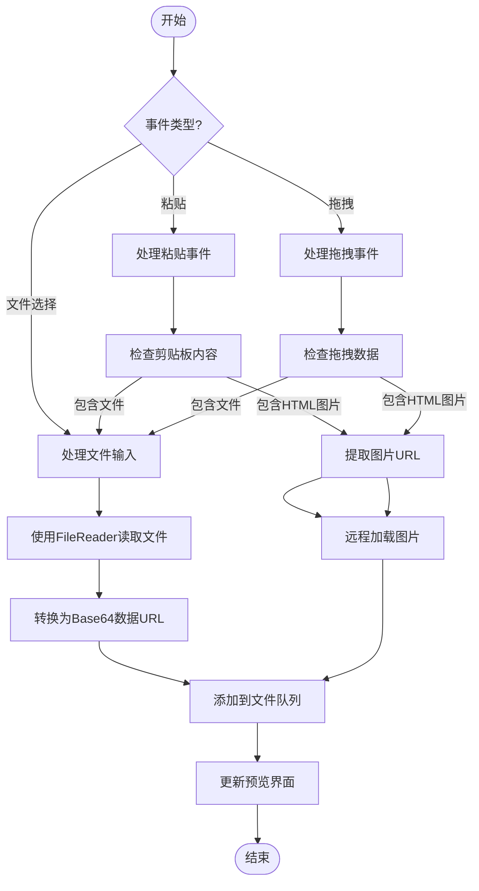
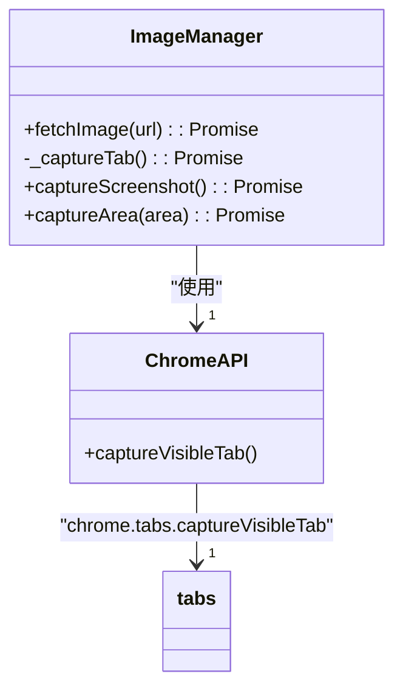
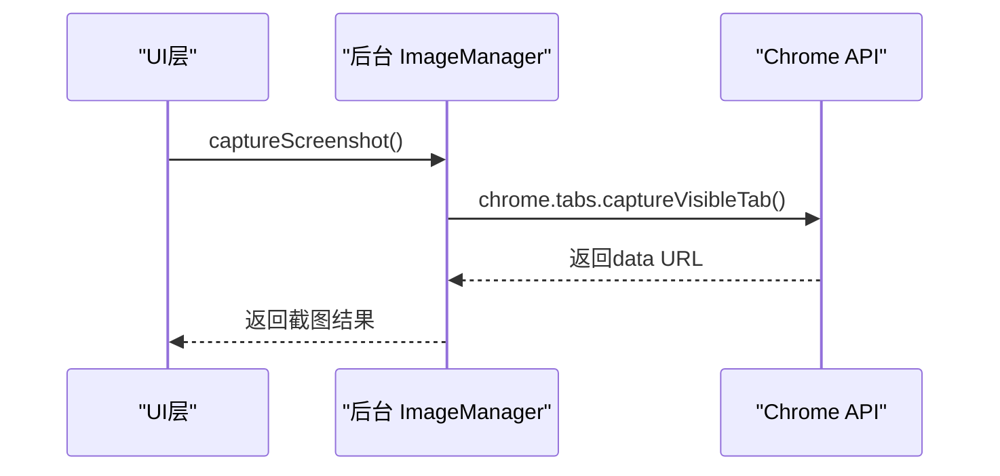
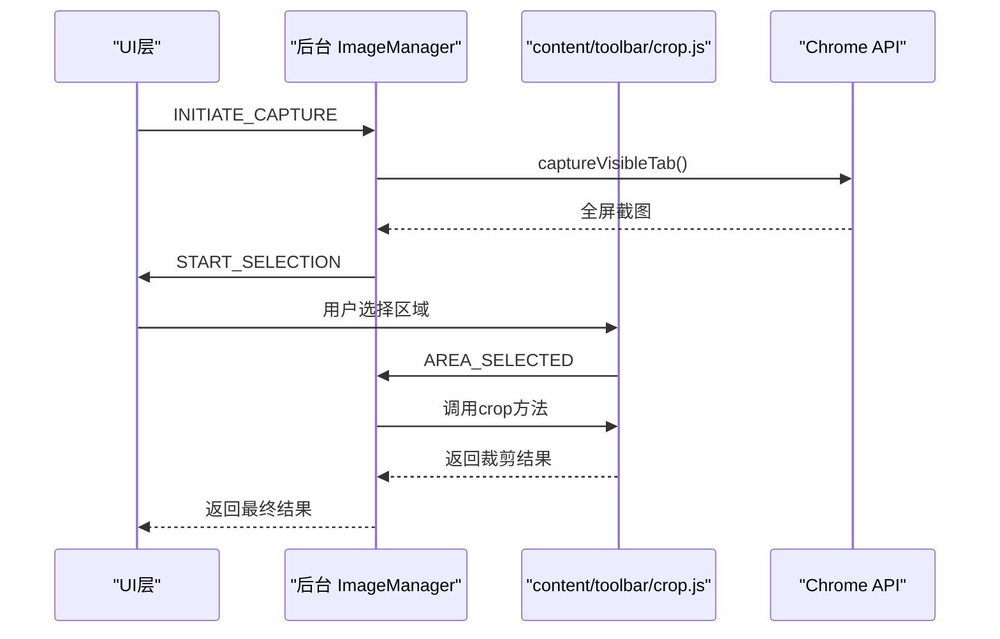
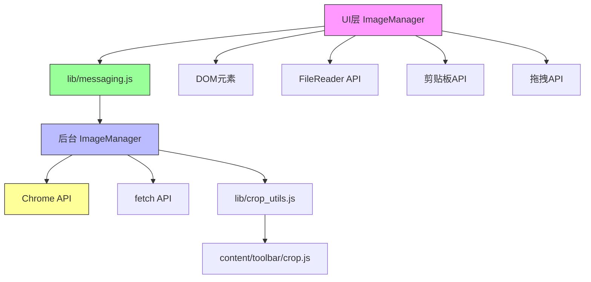

# 图像管理器

<cite>
**本文档中引用的文件**  
- [image_manager.js](file://sandbox/core/image_manager.js)
- [image_manager.js](file://background/managers/image_manager.js)
- [crop.js](file://content/toolbar/crop.js)
- [image.js](file://content/toolbar/image.js)
- [ui_controller.js](file://sandbox/ui/ui_controller.js)
- [app.js](file://sandbox/boot/app.js)
- [ui.js](file://background/handlers/ui.js)
- [message_handler.js](file://sandbox/controllers/message_handler.js)
- [generated_image.js](file://sandbox/render/generated_image.js)
- [messaging.js](file://lib/messaging.js)
- [utils.js](file://lib/utils.js)
</cite>

## 目录
1. [简介](#简介)
2. [项目结构](#项目结构)
3. [核心组件](#核心组件)
4. [架构概述](#架构概述)
5. [详细组件分析](#详细组件分析)
6. [依赖分析](#依赖分析)
7. [性能考虑](#性能考虑)
8. [故障排除指南](#故障排除指南)
9. [结论](#结论)

## 简介
本文档全面介绍了图像管理器（ImageManager）在Gemini Nexus扩展中的双重实现，涵盖其在UI层和后台服务层的功能。文档详细说明了图像管理器如何处理用户交互（如文件输入、拖拽、粘贴）、管理多文件上传队列、提供实时预览功能，以及与UI元素的绑定机制。同时，文档还阐述了后台图像管理器如何通过Chrome API实现屏幕截图、远程图片加载和区域截图功能，并描述了base64格式图片数据的传输、存储和性能优化策略。

## 项目结构
图像管理器在项目中分为两个主要实现：一个位于`sandbox`目录下，负责处理用户界面交互；另一个位于`background`目录下，负责执行后台操作。这种分离架构确保了用户交互的响应性和后台任务的安全性。

**Diagram sources**
- [image_manager.js](file://sandbox/core/image_manager.js)
- [image_manager.js](file://background/managers/image_manager.js)
- [crop.js](file://content/toolbar/crop.js)
- [image.js](file://content/toolbar/image.js)

**Section sources**
- [image_manager.js](file://sandbox/core/image_manager.js)
- [image_manager.js](file://background/managers/image_manager.js)

## 核心组件
图像管理器的核心功能分为UI层和后台服务层两个部分。UI层的ImageManager负责处理所有用户交互事件，包括文件选择、拖拽、粘贴等，并管理文件队列和预览显示。后台服务层的ImageManager则负责执行需要权限的操作，如屏幕截图和远程图片获取。

**Section sources**
- [image_manager.js](file://sandbox/core/image_manager.js)
- [image_manager.js](file://background/managers/image_manager.js)

## 架构概述
图像管理器采用分层架构设计，通过清晰的职责分离实现高效的功能协作。UI层负责用户交互和界面更新，后台服务层负责执行需要浏览器权限的操作，两者通过消息传递机制进行通信。

**Diagram sources**
- [image_manager.js](file://sandbox/core/image_manager.js)
- [image_manager.js](file://background/managers/image_manager.js)
- [messaging.js](file://lib/messaging.js)

## 详细组件分析

### UI层图像管理器分析
UI层的ImageManager是用户交互的核心组件，负责处理所有与图像相关的用户操作。

#### 类图

**Diagram sources**
- [image_manager.js](file://sandbox/core/image_manager.js)

#### 事件处理流程

**Diagram sources**
- [image_manager.js](file://sandbox/core/image_manager.js)

**Section sources**
- [image_manager.js](file://sandbox/core/image_manager.js)
- [app.js](file://sandbox/boot/app.js)

### 后台服务层图像管理器分析
后台服务层的ImageManager负责执行需要浏览器权限的操作，确保安全性和功能完整性。

#### 类图

**Diagram sources**
- [image_manager.js](file://background/managers/image_manager.js)

#### 屏幕截图流程

**Diagram sources**
- [image_manager.js](file://background/managers/image_manager.js)

**Section sources**
- [image_manager.js](file://background/managers/image_manager.js)
- [ui.js](file://background/handlers/ui.js)

### 区域截图功能分析
区域截图功能通过UI层、内容脚本层和后台服务层的协作实现，提供了精确的截图能力。

#### 协作流程

**Diagram sources**
- [image_manager.js](file://background/managers/image_manager.js)
- [crop.js](file://content/toolbar/crop.js)
- [ui.js](file://background/handlers/ui.js)

## 依赖分析
图像管理器的实现依赖于多个核心组件和Chrome API，形成了复杂的依赖网络。

**Diagram sources**
- [image_manager.js](file://sandbox/core/image_manager.js)
- [image_manager.js](file://background/managers/image_manager.js)
- [messaging.js](file://lib/messaging.js)
- [crop.js](file://content/toolbar/crop.js)

**Section sources**
- [image_manager.js](file://sandbox/core/image_manager.js)
- [image_manager.js](file://background/managers/image_manager.js)
- [messaging.js](file://lib/messaging.js)

## 性能考虑
图像管理器在处理大量图片或大尺寸图片时需要考虑性能优化，以确保用户体验的流畅性。

1. **内存管理**：Base64编码的图片数据会占用较多内存，建议在不需要时及时清理。
2. **异步处理**：所有图片处理操作都应使用异步方式，避免阻塞主线程。
3. **队列管理**：多文件上传时应实现合理的队列机制，控制并发数量。
4. **缓存策略**：对于频繁访问的图片，可以考虑实现缓存机制。
5. **尺寸优化**：在上传前可对大尺寸图片进行压缩处理。

## 故障排除指南
以下是图像管理器常见问题的解决方案：

1. **图片无法上传**：检查文件类型是否支持，确认文件大小未超过限制。
2. **截图功能失效**：确保扩展具有必要的权限，检查Chrome版本兼容性。
3. **粘贴图片失败**：确认剪贴板内容格式正确，检查是否有权限限制。
4. **预览显示异常**：检查Base64数据格式是否正确，验证图片编码。
5. **性能下降**：减少同时处理的图片数量，优化图片尺寸和质量。

**Section sources**
- [image_manager.js](file://sandbox/core/image_manager.js)
- [image_manager.js](file://background/managers/image_manager.js)
- [message_handler.js](file://sandbox/controllers/message_handler.js)

## 结论
图像管理器作为Gemini Nexus扩展的核心组件，通过UI层和后台服务层的协同工作，实现了强大的图像处理功能。其设计充分考虑了用户体验、安全性和性能，为用户提供了一套完整的图像管理解决方案。通过清晰的架构分离和高效的消息传递机制，图像管理器能够稳定可靠地处理各种图像相关操作，为应用的整体功能提供了坚实的基础。