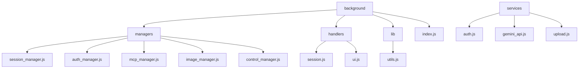
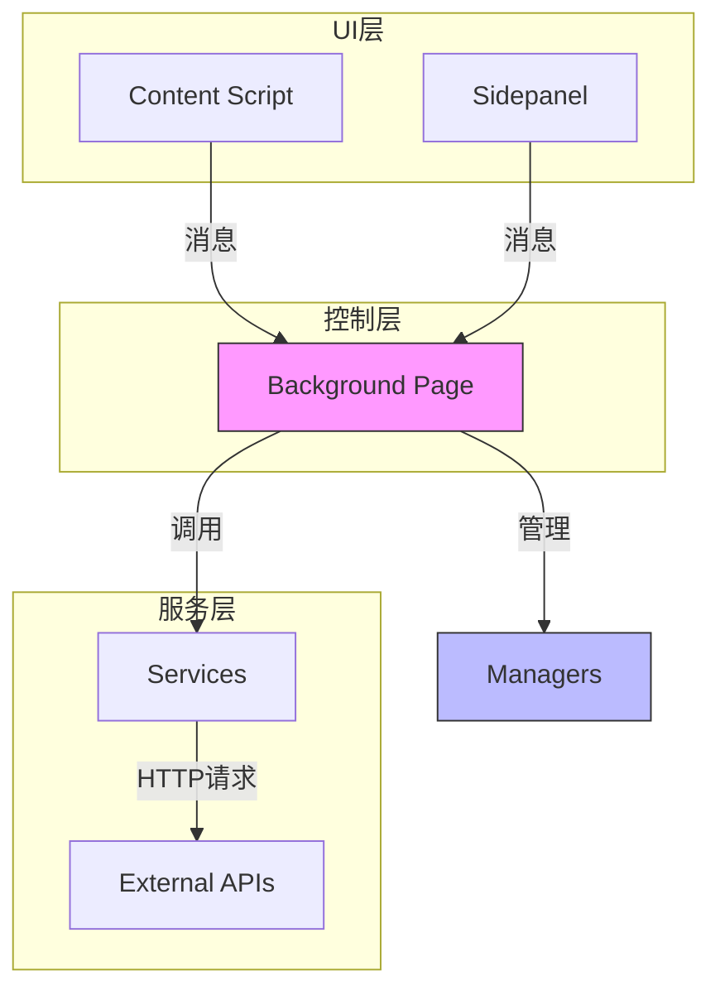
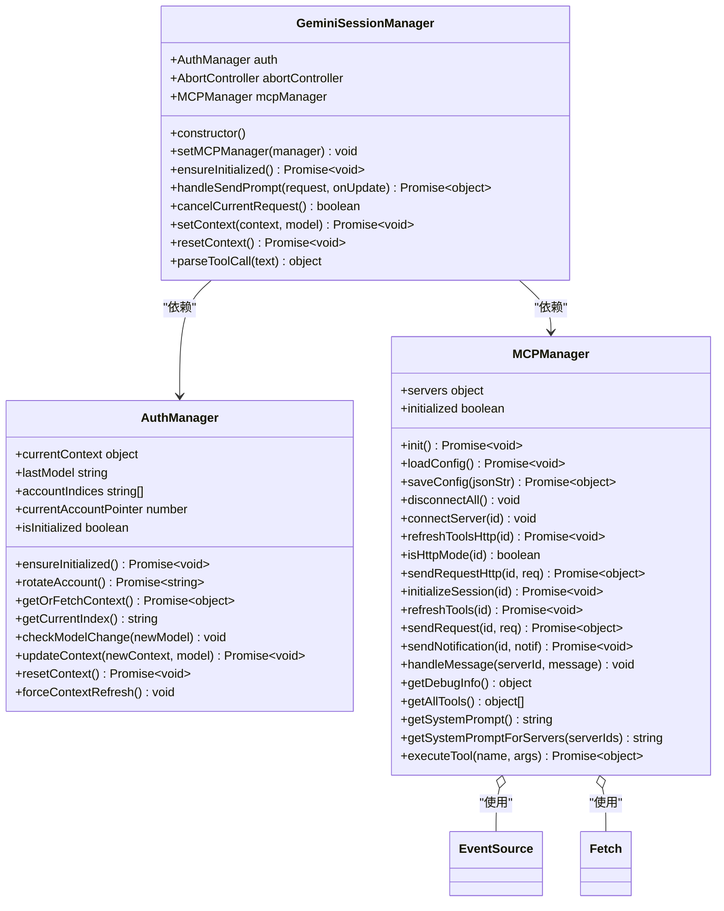
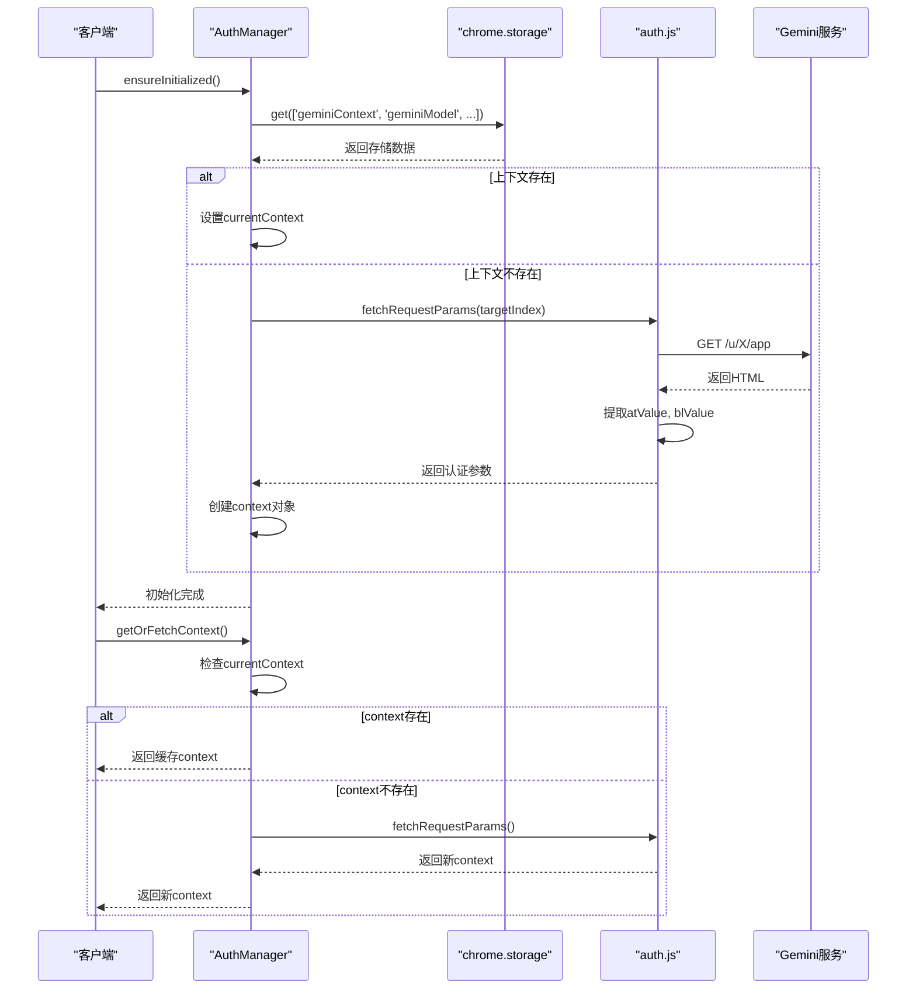
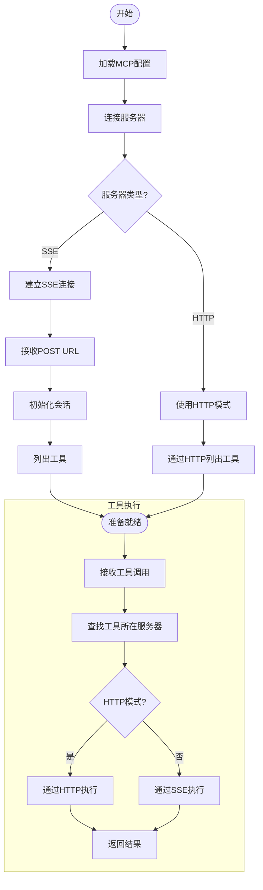
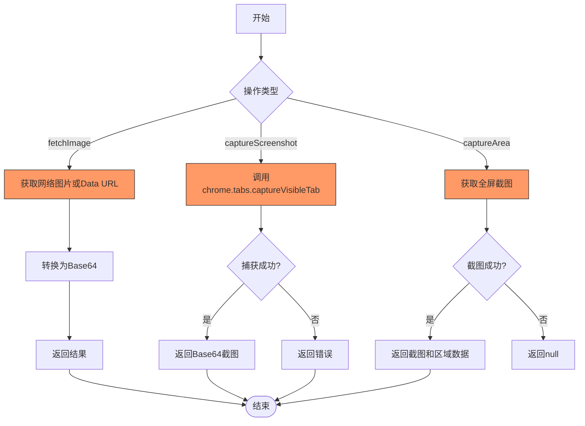
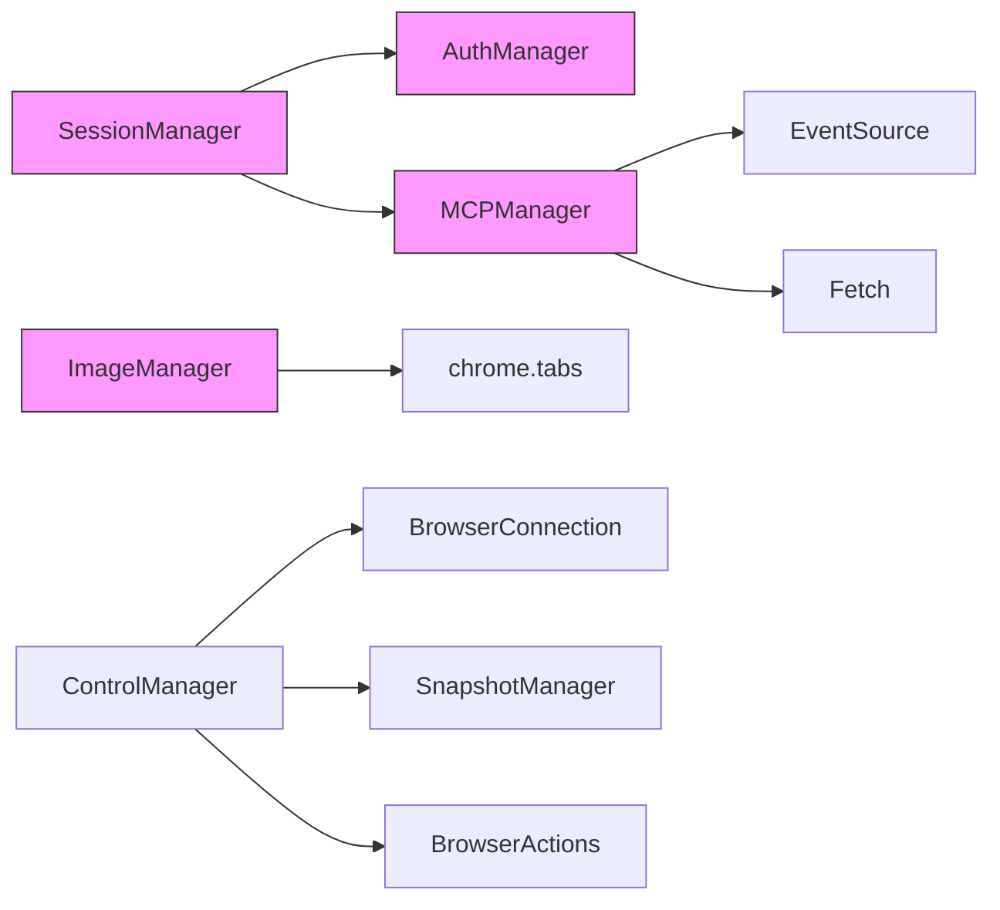

# 核心模块

<cite>
**本文档中引用的文件**   
- [session_manager.js](file://background/managers/session_manager.js)
- [auth_manager.js](file://background/managers/auth_manager.js)
- [mcp_manager.js](file://background/managers/mcp_manager.js)
- [image_manager.js](file://background/managers/image_manager.js)
- [auth.js](file://services/auth.js)
- [control_manager.js](file://background/managers/control_manager.js)
- [history_manager.js](file://background/managers/history_manager.js)
- [index.js](file://background/index.js)
- [upload.js](file://services/upload.js)
- [messages.js](file://background/messages.js)
- [menus.js](file://background/menus.js)
- [utils.js](file://lib/utils.js)
- [session.js](file://background/handlers/session.js)
- [ui.js](file://background/handlers/ui.js)
</cite>

## 目录
1. [简介](#简介)
2. [项目结构](#项目结构)
3. [核心组件](#核心组件)
4. [架构概述](#架构概述)
5. [详细组件分析](#详细组件分析)
6. [依赖分析](#依赖分析)
7. [性能考量](#性能考量)
8. [故障排除指南](#故障排除指南)
9. [结论](#结论)

## 简介
本文档深入分析了Gemini Nexus Chrome扩展的核心管理模块，重点关注SessionManager、AuthManager、MCPManager和ImageManager的设计与实现。这些模块共同构成了扩展的核心功能，实现了与Gemini AI的交互、多账户认证、外部工具集成和图像处理等关键功能。文档详细说明了各模块的公共接口、方法签名、事件钩子和错误处理机制，并讨论了其配置选项、性能考量和常见问题排查方法。

## 项目结构
项目采用分层的模块化结构，将功能划分为不同的目录。核心管理模块位于`background/managers/`目录下，包括会话、认证、MCP、图像等管理器。服务层位于`services/`目录，提供与外部API的交互。`lib/`目录包含通用工具函数。`content/`和`sandbox/`目录分别处理内容脚本和沙箱环境的UI逻辑。这种清晰的分层设计提高了代码的可维护性和可扩展性。

**图源**
- [session_manager.js](file://background/managers/session_manager.js#L1-L285)
- [auth_manager.js](file://background/managers/auth_manager.js#L1-L130)
- [mcp_manager.js](file://background/managers/mcp_manager.js#L1-L530)
- [image_manager.js](file://background/managers/image_manager.js#L1-L97)
- [auth.js](file://services/auth.js#L1-L41)
- [upload.js](file://services/upload.js#L1-L40)
- [utils.js](file://lib/utils.js#L1-L59)

**章节来源**
- [background](file://background)
- [services](file://services)
- [lib](file://lib)

## 核心组件
核心组件包括SessionManager、AuthManager、MCPManager和ImageManager。SessionManager负责维护与Gemini AI的会话状态，处理多轮对话和上下文管理。AuthManager处理多账户认证和令牌管理，确保与Gemini服务的安全连接。MCPManager实现了Model Context Protocol，支持与外部工具的集成。ImageManager协调图像上传、截图处理和OCR功能，为AI交互提供视觉输入。

**章节来源**
- [session_manager.js](file://background/managers/session_manager.js#L1-L285)
- [auth_manager.js](file://background/managers/auth_manager.js#L1-L130)
- [mcp_manager.js](file://background/managers/mcp_manager.js#L1-L530)
- [image_manager.js](file://background/managers/image_manager.js#L1-L97)

## 架构概述
系统架构采用分层设计，由背景页（background）作为核心控制中心，通过消息传递与内容脚本（content script）和侧边栏（sidepanel）进行通信。背景页中的管理器模块（Manager）负责具体业务逻辑，如会话管理、认证、MCP集成和图像处理。服务层（services）提供与外部API的交互。这种架构实现了关注点分离，提高了系统的可维护性和可扩展性。

**图源**
- [index.js](file://background/index.js#L1-L30)
- [messages.js](file://background/messages.js#L1-L82)
- [session.js](file://background/handlers/session.js#L1-L56)
- [ui.js](file://background/handlers/ui.js#L1-L195)

## 详细组件分析
本节详细分析每个核心管理模块的设计与实现，包括其公共接口、方法签名、事件钩子和错误处理机制。

### SessionManager分析
SessionManager是与Gemini AI交互的核心，负责维护会话状态、管理历史记录和处理会话生命周期。

**图源**
- [session_manager.js](file://background/managers/session_manager.js#L1-L285)
- [auth_manager.js](file://background/managers/auth_manager.js#L1-L130)
- [mcp_manager.js](file://background/managers/mcp_manager.js#L1-L530)

**章节来源**
- [session_manager.js](file://background/managers/session_manager.js#L1-L285)
- [auth_manager.js](file://background/managers/auth_manager.js#L1-L130)
- [mcp_manager.js](file://background/managers/mcp_manager.js#L1-L530)

### AuthManager分析
AuthManager与`services/auth.js`协作，实现Google账号认证和令牌管理。它支持多账户切换和自动令牌刷新。

**图源**
- [auth_manager.js](file://background/managers/auth_manager.js#L1-L130)
- [auth.js](file://services/auth.js#L1-L41)

**章节来源**
- [auth_manager.js](file://background/managers/auth_manager.js#L1-L130)
- [auth.js](file://services/auth.js#L1-L41)

### MCPManager分析
MCPManager支持外部工具集成协议，允许Gemini AI调用外部工具来完成复杂任务。

**图源**
- [mcp_manager.js](file://background/managers/mcp_manager.js#L1-L530)
- [control_manager.js](file://background/managers/control_manager.js#L1-L159)

**章节来源**
- [mcp_manager.js](file://background/managers/mcp_manager.js#L1-L530)
- [control_manager.js](file://background/managers/control_manager.js#L1-L159)

### ImageManager分析
ImageManager协调图片上传、截图处理和OCR功能，为AI交互提供视觉输入。

**图源**
- [image_manager.js](file://background/managers/image_manager.js#L1-L97)
- [upload.js](file://services/upload.js#L1-L40)
- [utils.js](file://lib/utils.js#L1-L59)

**章节来源**
- [image_manager.js](file://background/managers/image_manager.js#L1-L97)
- [upload.js](file://services/upload.js#L1-L40)
- [utils.js](file://lib/utils.js#L1-L59)

## 依赖分析
核心管理模块之间存在明确的依赖关系。SessionManager依赖AuthManager进行认证，依赖MCPManager进行工具集成。MCPManager依赖EventSource和Fetch API进行网络通信。ImageManager依赖chrome.tabs API进行截图。这些依赖通过构造函数注入，实现了松耦合的设计。

**图源**
- [session_manager.js](file://background/managers/session_manager.js#L1-L285)
- [auth_manager.js](file://background/managers/auth_manager.js#L1-L130)
- [mcp_manager.js](file://background/managers/mcp_manager.js#L1-L530)
- [image_manager.js](file://background/managers/image_manager.js#L1-L97)
- [control_manager.js](file://background/managers/control_manager.js#L1-L159)

**章节来源**
- [session_manager.js](file://background/managers/session_manager.js#L1-L285)
- [auth_manager.js](file://background/managers/auth_manager.js#L1-L130)
- [mcp_manager.js](file://background/managers/mcp_manager.js#L1-L530)
- [image_manager.js](file://background/managers/image_manager.js#L1-L97)
- [control_manager.js](file://background/managers/control_manager.js#L1-L159)

## 性能考量
各管理模块在设计时考虑了性能优化。SessionManager使用AbortController支持请求取消，避免资源浪费。AuthManager缓存认证上下文，减少重复的网络请求。MCPManager支持多服务器连接和负载均衡。ImageManager使用Base64编码处理图像，避免了文件I/O操作。这些优化确保了扩展的响应速度和用户体验。

## 故障排除指南
常见问题包括认证失败、MCP连接问题和图像处理错误。认证失败通常由于未登录Gemini或令牌过期，可通过重新登录解决。MCP连接问题可能由于服务器配置错误或网络问题，可通过检查配置和网络连接解决。图像处理错误可能由于权限不足或浏览器限制，可通过检查扩展权限和浏览器设置解决。

**章节来源**
- [session_manager.js](file://background/managers/session_manager.js#L1-L285)
- [auth_manager.js](file://background/managers/auth_manager.js#L1-L130)
- [mcp_manager.js](file://background/managers/mcp_manager.js#L1-L530)
- [image_manager.js](file://background/managers/image_manager.js#L1-L97)

## 结论
SessionManager、AuthManager、MCPManager和ImageManager构成了Gemini Nexus扩展的核心。它们通过清晰的接口和松耦合的设计，实现了复杂的AI交互功能。模块化设计提高了代码的可维护性和可扩展性，使得添加新功能和修复问题变得更加容易。这些模块的协同工作，为用户提供了强大的AI辅助体验。