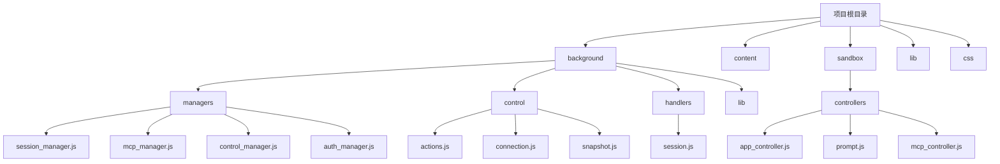
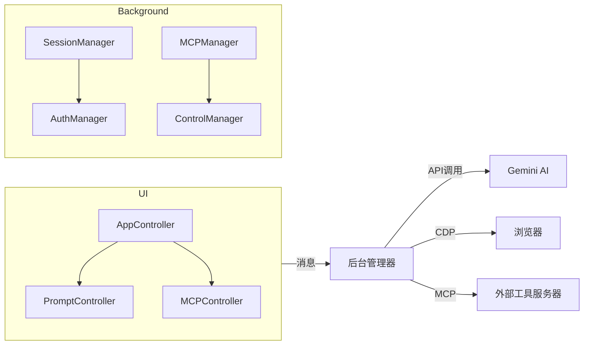
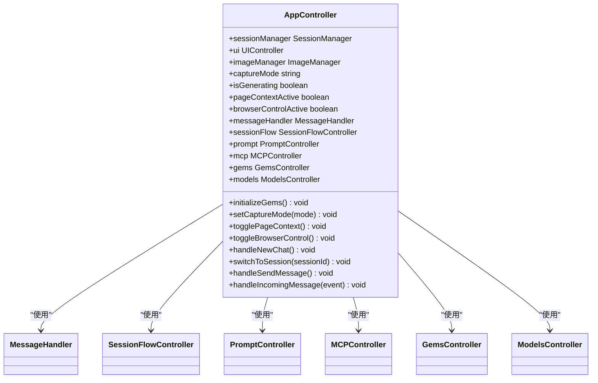
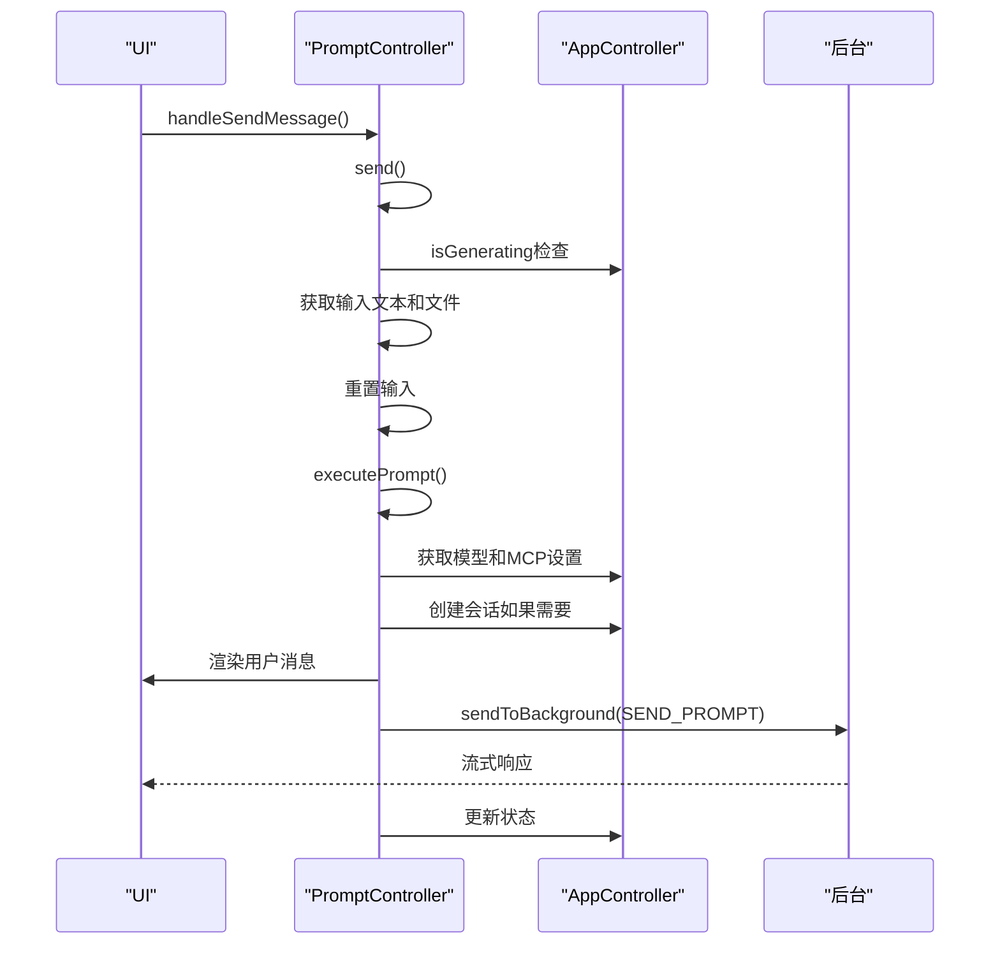
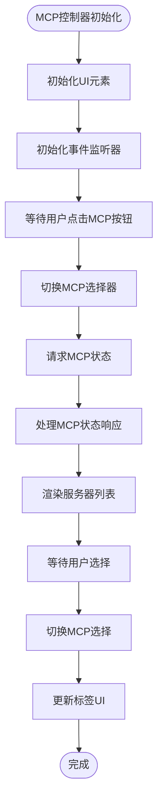
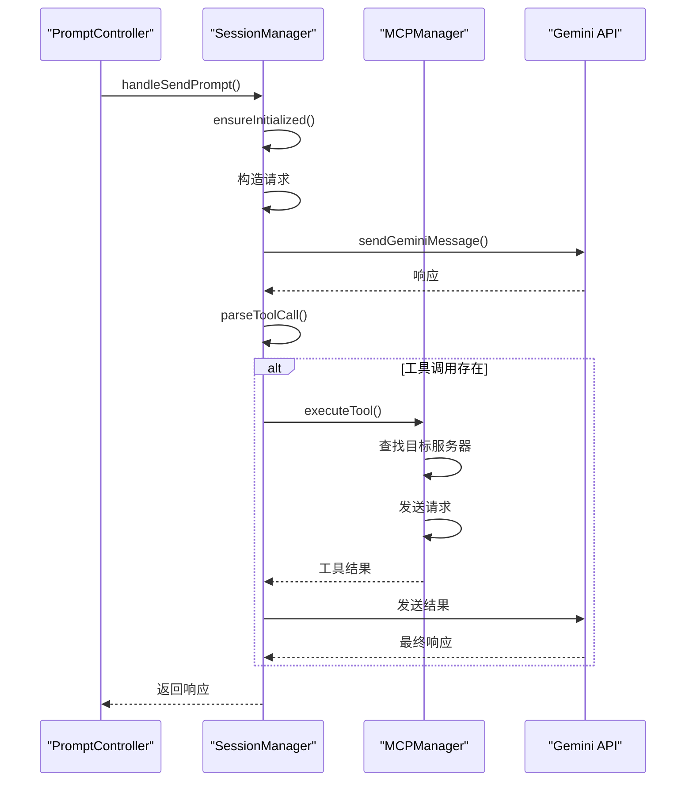
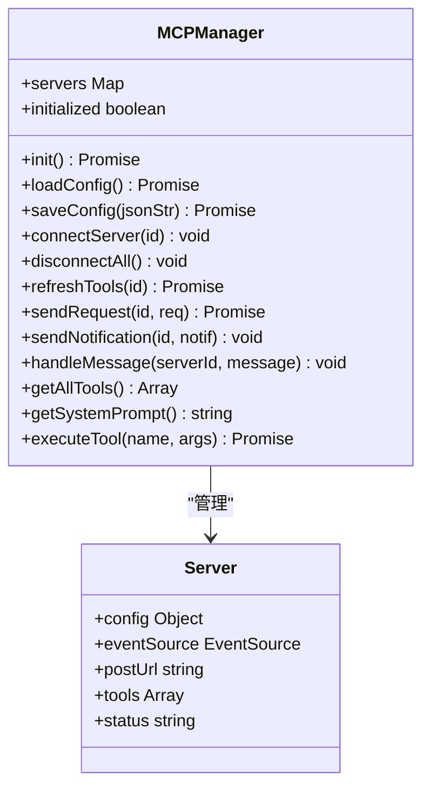
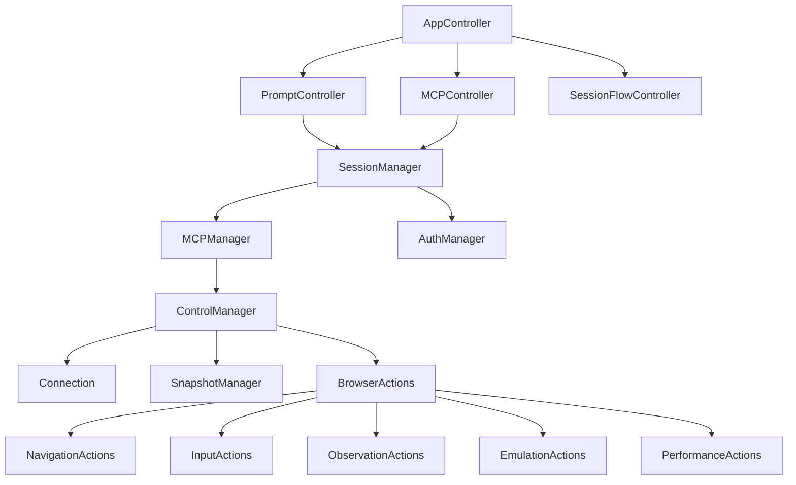

# 模型控制器实现

<cite>
**本文档中引用的文件**  
- [app_controller.js](file://sandbox/controllers/app_controller.js)
- [prompt.js](file://sandbox/controllers/prompt.js)
- [mcp_controller.js](file://sandbox/controllers/mcp_controller.js)
- [session_manager.js](file://background/managers/session_manager.js)
- [mcp_manager.js](file://background/managers/mcp_manager.js)
- [control_manager.js](file://background/managers/control_manager.js)
- [actions.js](file://background/control/actions.js)
- [connection.js](file://background/control/connection.js)
- [snapshot.js](file://background/control/snapshot.js)
- [session.js](file://background/handlers/session.js)
- [messages.js](file://background/messages.js)
- [messaging.js](file://lib/messaging.js)
- [auth_manager.js](file://background/managers/auth_manager.js)
</cite>

## 目录
1. [简介](#简介)
2. [项目结构](#项目结构)
3. [核心组件](#核心组件)
4. [架构概述](#架构概述)
5. [详细组件分析](#详细组件分析)
6. [依赖分析](#依赖分析)
7. [性能考虑](#性能考虑)
8. [故障排除指南](#故障排除指南)
9. [结论](#结论)

## 简介
本文档详细分析了Gemini Nexus扩展中模型控制器的实现。该系统通过一系列协调的控制器和管理器，实现了与Gemini AI模型的深度集成，支持上下文管理、多账户切换、MCP（Model Context Protocol）工具调用和浏览器自动化控制。核心功能包括会话管理、模型选择、工具执行和状态同步，为用户提供了一个强大的AI辅助浏览体验。

## 项目结构
Gemini Nexus扩展的项目结构清晰地分为多个功能模块，每个模块负责特定的功能领域。主要目录包括`background`（后台逻辑）、`content`（内容脚本）、`sandbox`（沙箱UI控制器）、`lib`（通用工具库）和`css`（样式表）。

**Diagram sources**
- [background/managers/session_manager.js](file://background/managers/session_manager.js)
- [background/managers/mcp_manager.js](file://background/managers/mcp_manager.js)
- [background/managers/control_manager.js](file://background/managers/control_manager.js)
- [sandbox/controllers/app_controller.js](file://sandbox/controllers/app_controller.js)

**Section sources**
- [background/index.js](file://background/index.js)
- [sandbox/index.js](file://sandbox/index.js)

## 核心组件
系统的核心组件包括会话管理器（SessionManager）、MCP管理器（MCPManager）和浏览器控制管理器（ControlManager）。这些组件协同工作，处理从用户输入到AI响应再到工具执行的完整流程。会话管理器负责维护对话上下文和状态，MCP管理器管理外部工具服务器的连接和调用，而控制管理器则处理与浏览器调试API的交互，实现页面控制和状态获取。

**Section sources**
- [background/managers/session_manager.js](file://background/managers/session_manager.js#L6-L286)
- [background/managers/mcp_manager.js](file://background/managers/mcp_manager.js#L2-L530)
- [background/managers/control_manager.js](file://background/managers/control_manager.js#L11-L159)

## 架构概述
系统采用分层架构，前端UI控制器与后台管理器通过消息传递进行通信。UI层（沙箱）负责用户交互和界面更新，而后台层处理所有核心逻辑和外部通信。这种分离确保了系统的可维护性和安全性。

**Diagram sources**
- [sandbox/controllers/app_controller.js](file://sandbox/controllers/app_controller.js#L12-L265)
- [background/managers/session_manager.js](file://background/managers/session_manager.js#L6-L286)
- [background/managers/mcp_manager.js](file://background/managers/mcp_manager.js#L2-L530)
- [background/managers/control_manager.js](file://background/managers/control_manager.js#L11-L159)

## 详细组件分析
本节深入分析系统中的关键组件，包括应用控制器、提示控制器和MCP控制器，以及后台的会话管理器和MCP管理器。

### 应用控制器分析
AppController是沙箱环境中的主控制器，负责协调所有UI子控制器并处理来自后台的消息。它管理会话流程、模型选择和MCP工具激活。

**Diagram sources**
- [sandbox/controllers/app_controller.js](file://sandbox/controllers/app_controller.js#L12-L265)

**Section sources**
- [sandbox/controllers/app_controller.js](file://sandbox/controllers/app_controller.js#L12-L265)

### 提示控制器分析
PromptController处理用户输入的发送和取消，管理消息的渲染和会话状态的更新。它与AppController紧密协作，确保用户输入被正确处理并发送到后台。

**Diagram sources**
- [sandbox/controllers/prompt.js](file://sandbox/controllers/prompt.js#L7-L132)
- [lib/messaging.js](file://lib/messaging.js#L4-L96)

**Section sources**
- [sandbox/controllers/prompt.js](file://sandbox/controllers/prompt.js#L7-L132)

### MCP控制器分析
MCPController管理MCP服务器的选择和状态显示，允许用户在发送提示前选择要激活的工具服务器。

**Diagram sources**
- [sandbox/controllers/mcp_controller.js](file://sandbox/controllers/mcp_controller.js#L5-L221)

**Section sources**
- [sandbox/controllers/mcp_controller.js](file://sandbox/controllers/mcp_controller.js#L5-L221)

### 会话管理器分析
SessionManager是后台的核心组件，负责处理与Gemini API的通信，管理会话上下文，并协调MCP工具的执行。

**Diagram sources**
- [background/managers/session_manager.js](file://background/managers/session_manager.js#L6-L286)
- [background/managers/mcp_manager.js](file://background/managers/mcp_manager.js#L2-L530)

**Section sources**
- [background/managers/session_manager.js](file://background/managers/session_manager.js#L6-L286)

### MCP管理器分析
MCPManager负责管理与外部MCP服务器的连接，处理工具发现和执行，支持SSE和HTTP两种通信模式。

**Diagram sources**
- [background/managers/mcp_manager.js](file://background/managers/mcp_manager.js#L2-L530)

**Section sources**
- [background/managers/mcp_manager.js](file://background/managers/mcp_manager.js#L2-L530)

## 依赖分析
系统组件之间的依赖关系清晰，遵循分层架构原则。UI控制器依赖于后台管理器提供的功能，而后台管理器之间也存在明确的依赖关系。

**Diagram sources**
- [background/index.js](file://background/index.js#L4-L26)
- [background/managers/control_manager.js](file://background/managers/control_manager.js#L11-L159)
- [background/managers/session_manager.js](file://background/managers/session_manager.js#L6-L286)
- [background/managers/mcp_manager.js](file://background/managers/mcp_manager.js#L2-L530)

**Section sources**
- [background/index.js](file://background/index.js#L4-L26)
- [background/messages.js](file://background/messages.js#L17-L142)

## 性能考虑
系统在设计时考虑了多个性能方面，包括连接管理、上下文缓存和错误处理。AuthManager实现了上下文缓存和多账户轮换，以提高API调用的可靠性和性能。ControlManager在执行操作前确保调试器连接，避免不必要的连接开销。MCPManager实现了工具列表的缓存，减少对服务器的频繁查询。

## 故障排除指南
当系统出现问题时，可以从以下几个方面进行排查：
1. **认证问题**：检查AuthManager的状态和账户配置，确保有有效的会话上下文。
2. **MCP连接问题**：使用MCPManager的调试信息检查服务器连接状态和工具列表。
3. **浏览器控制问题**：确认ControlManager能够成功连接到活动标签页，检查受限URL。
4. **消息流问题**：检查消息传递链路，确保UI控制器和后台管理器之间的通信正常。

**Section sources**
- [background/managers/auth_manager.js](file://background/managers/auth_manager.js#L5-L130)
- [background/managers/mcp_manager.js](file://background/managers/mcp_manager.js#L389-L403)
- [background/managers/control_manager.js](file://background/managers/control_manager.js#L20-L37)

## 结论
Gemini Nexus的模型控制器实现了一个复杂而强大的系统，通过精心设计的组件和清晰的架构，实现了与AI模型的深度集成。系统的关键优势在于其模块化设计、清晰的职责分离和强大的错误处理能力。未来可以进一步优化连接管理、增强工具发现机制，并提供更详细的性能监控。