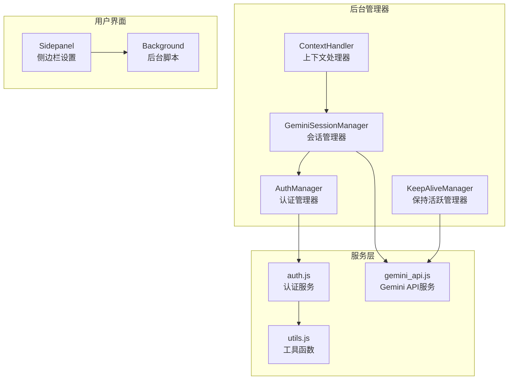
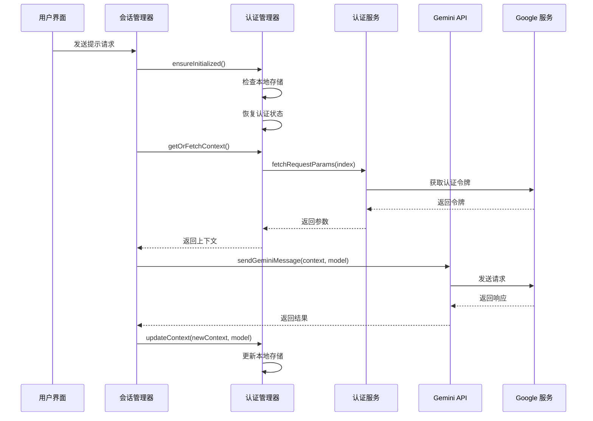
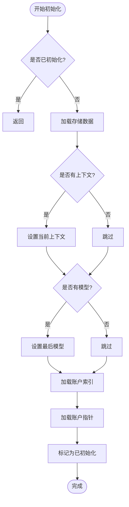
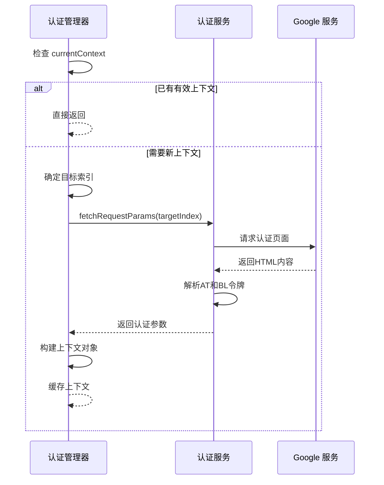
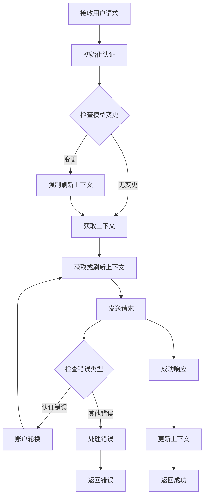
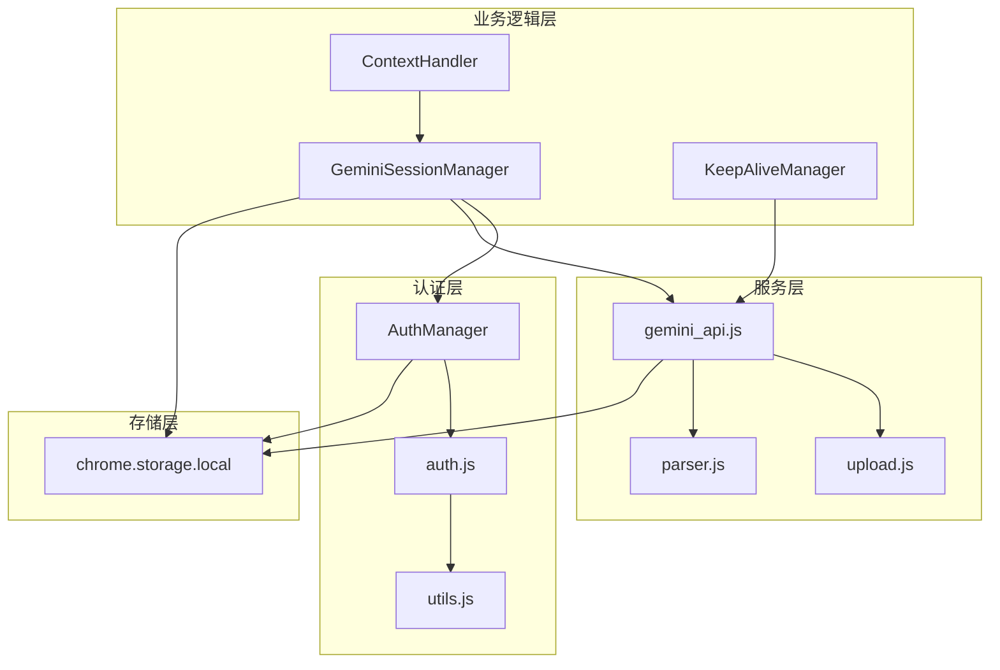

# 认证管理器

<cite>
**本文档引用的文件**
- [background/managers/auth_manager.js](file://background/managers/auth_manager.js)
- [services/auth.js](file://services/auth.js)
- [background/managers/session_manager.js](file://background/managers/session_manager.js)
- [services/gemini_api.js](file://services/gemini_api.js)
- [background/handlers/session/context_handler.js](file://background/handlers/session/context_handler.js)
- [background/managers/keep_alive.js](file://background/managers/keep_alive.js)
- [sidepanel/index.js](file://sidepanel/index.js)
- [manifest.json](file://manifest.json)
- [lib/utils.js](file://lib/utils.js)
</cite>

## 目录
1. [简介](#简介)
2. [项目结构](#项目结构)
3. [核心组件](#核心组件)
4. [架构概览](#架构概览)
5. [详细组件分析](#详细组件分析)
6. [依赖关系分析](#依赖关系分析)
7. [性能考虑](#性能考虑)
8. [故障排除指南](#故障排除指南)
9. [结论](#结论)
10. [附录](#附录)

## 简介

认证管理器（AuthManager）是 Gemini Nexus 扩展程序中的核心组件，负责管理与 Google Gemini 服务的身份验证机制。该系统实现了多账户上下文管理、令牌刷新、账户轮换和状态持久化等功能，为整个扩展程序提供可靠的认证支持。

AuthManager 通过 `chrome.storage.local` 实现数据持久化，管理以下关键状态：
- 多账户上下文：`geminiContext`
- 账户索引列表：`geminiAccountIndices`
- 当前模型状态：`geminiModel`
- 账户指针位置：`geminiAccountPointer`

## 项目结构

Gemini Nexus 的认证系统采用模块化架构，主要分布在以下几个关键目录中：



**图表来源**
- [background/managers/auth_manager.js](file://background/managers/auth_manager.js#L1-L130)
- [services/auth.js](file://services/auth.js#L1-L41)
- [background/managers/session_manager.js](file://background/managers/session_manager.js#L1-L200)

**章节来源**
- [manifest.json](file://manifest.json#L1-L93)
- [background/managers/auth_manager.js](file://background/managers/auth_manager.js#L1-L130)

## 核心组件

### AuthManager 类

AuthManager 是认证系统的核心类，负责管理所有认证相关的状态和操作。其主要职责包括：

- **状态管理**：维护当前认证上下文、模型状态和账户索引
- **初始化控制**：确保从持久化存储中正确恢复状态
- **上下文获取**：提供获取或刷新认证上下文的方法
- **账户轮换**：在多个账户之间进行智能轮换
- **状态更新**：将认证状态持久化到存储中

### 关键属性说明

| 属性名 | 类型 | 描述 | 默认值 |
|--------|------|------|--------|
| `currentContext` | Object | 当前认证上下文 | null |
| `lastModel` | String | 最后使用的模型 | null |
| `accountIndices` | Array | 账户索引列表 | ['0'] |
| `currentAccountPointer` | Number | 当前账户指针位置 | 0 |
| `isInitialized` | Boolean | 初始化状态标志 | false |

**章节来源**
- [background/managers/auth_manager.js](file://background/managers/auth_manager.js#L5-L12)

## 架构概览

认证系统的整体架构采用分层设计，各组件职责明确且相互协作：



**图表来源**
- [background/managers/session_manager.js](file://background/managers/session_manager.js#L21-L128)
- [background/managers/auth_manager.js](file://background/managers/auth_manager.js#L75-L92)
- [services/auth.js](file://services/auth.js#L7-L40)

## 详细组件分析

### AuthManager 方法详解

#### ensureInitialized() - 初始化方法

`ensureInitialized()` 方法负责从 `chrome.storage.local` 中恢复认证状态。该方法检查并加载以下存储项：

- `geminiContext`：完整的认证上下文对象
- `geminiModel`：最后使用的模型名称
- `geminiAccountIndices`：账户索引列表（逗号分隔）
- `geminiAccountPointer`：当前账户指针位置



**图表来源**
- [background/managers/auth_manager.js](file://background/managers/auth_manager.js#L14-L48)

#### getOrFetchContext() - 上下文获取方法

`getOrFetchContext()` 方法实现了智能的上下文获取逻辑：

1. **缓存检查**：如果存在有效的 `currentContext`，直接返回
2. **目标索引确定**：根据 `accountIndices` 和 `currentAccountPointer` 确定目标账户
3. **令牌获取**：调用 `fetchRequestParams()` 获取新的认证参数
4. **上下文构建**：创建包含必要认证信息的上下文对象



**图表来源**
- [background/managers/auth_manager.js](file://background/managers/auth_manager.js#L75-L92)
- [services/auth.js](file://services/auth.js#L7-L40)

#### rotateAccount() - 账户轮换方法

`rotateAccount()` 方法实现了智能的账户轮换机制：

1. **动态刷新**：从存储中重新加载最新的账户索引列表
2. **边界检查**：确保账户列表不为空，至少包含默认账户 '0'
3. **指针更新**：使用模运算实现循环轮换
4. **状态持久化**：将新的账户指针保存到存储中

#### updateContext() - 上下文更新方法

`updateContext()` 方法负责将新的认证状态持久化到存储中，并更新内存中的状态：

- 更新 `geminiContext`：存储新的认证上下文
- 更新 `geminiModel`：记录使用的模型
- 自动触发存储写入操作

**章节来源**
- [background/managers/auth_manager.js](file://background/managers/auth_manager.js#L14-L129)

### 与服务层的协作关系

#### 与 services/auth.js 的集成

AuthManager 通过导入 `fetchRequestParams` 函数与认证服务进行交互。该函数负责：

- **URL 构建**：根据账户索引构建正确的请求 URL
- **HTML 解析**：从响应的 HTML 内容中提取认证令牌
- **令牌提取**：使用正则表达式提取 AT 和 BL 令牌
- **用户索引识别**：通过 HTML 属性确定实际的认证用户索引

#### 与 services/gemini_api.js 的配合

AuthManager 提供的上下文信息被 Gemini API 服务用于构建最终的请求：

- **认证头设置**：使用 AT 令牌作为认证凭据
- **模型选择**：通过特定头部选择不同的 Gemini 模型
- **用户标识**：通过 X-Goog-AuthUser 头部指定用户
- **端点路由**：根据用户索引调整 API 端点

**章节来源**
- [services/auth.js](file://services/auth.js#L7-L40)
- [services/gemini_api.js](file://services/gemini_api.js#L26-L152)

### 会话管理器中的认证集成

#### GeminiSessionManager 的认证流程

会话管理器通过 AuthManager 实现了完整的认证生命周期管理：



**图表来源**
- [background/managers/session_manager.js](file://background/managers/session_manager.js#L21-L147)

**章节来源**
- [background/managers/session_manager.js](file://background/managers/session_manager.js#L17-L147)

## 依赖关系分析

### 组件间依赖图



**图表来源**
- [background/managers/auth_manager.js](file://background/managers/auth_manager.js#L3)
- [services/auth.js](file://services/auth.js#L3)
- [background/managers/session_manager.js](file://background/managers/session_manager.js#L3-L4)

### 外部依赖分析

#### Chrome 扩展 API 依赖

认证系统依赖以下 Chrome 扩展 API：

- **chrome.storage.local**：用于持久化认证状态
- **chrome.permissions**：权限管理（storage 权限）
- **chrome.runtime**：消息传递和事件监听

#### Google 服务依赖

- **gemini.google.com**：主认证和 API 端点
- **不同用户索引路径**：支持多账户场景
- **会话管理和令牌刷新**：维持长期连接

**章节来源**
- [manifest.json](file://manifest.json#L6-L10)
- [background/managers/keep_alive.js](file://background/managers/keep_alive.js#L56-L73)

## 性能考虑

### 缓存策略优化

AuthManager 实现了多层次的缓存机制：

1. **内存缓存**：避免重复的存储访问
2. **智能失效**：基于模型变更自动刷新上下文
3. **延迟加载**：仅在需要时才获取新的认证令牌

### 并发控制

系统通过以下机制避免并发问题：

- **单例模式**：每个会话管理器实例包含一个认证管理器
- **异步操作**：所有存储和网络操作都是异步的
- **错误隔离**：认证错误不会影响其他功能

### 资源管理

- **存储访问最小化**：批量读取和写入相关数据
- **内存使用控制**：及时清理不再使用的上下文
- **网络请求优化**：复用已建立的连接

## 故障排除指南

### 常见认证错误及恢复策略

#### 未登录错误 (Not logged in)

**错误特征**：
- 错误消息包含 "未登录" 或 "Not logged in"
- 通常发生在会话过期或手动登出后

**恢复步骤**：
1. 清除本地认证上下文
2. 强制刷新认证状态
3. 引导用户到正确的登录页面
4. 重新尝试操作

#### 401/403 认证失败

**错误特征**：
- HTTP 状态码 401（未授权）或 403（禁止访问）
- 表示认证凭据无效或过期

**恢复策略**：
1. 自动账户轮换
2. 强制刷新上下文
3. 在多账户配置下重试其他账户
4. 如果失败，清除本地状态并重新登录

#### 请求过于频繁 (Rate limited)

**错误特征**：
- 错误消息包含 "请求过于频繁"
- Google 服务暂时限制访问

**处理方案**：
1. 实施指数退避策略
2. 提示用户稍后重试
3. 调整请求频率
4. 考虑使用备用账户

#### 服务器无响应 (No response)

**错误特征**：
- 网络请求超时或无响应
- 可能是临时网络问题

**解决方法**：
1. 自动重试机制
2. 引导用户刷新页面
3. 检查网络连接
4. 清理浏览器缓存

### 错误码对照表

| 错误类型 | 错误码 | 描述 | 恢复建议 |
|----------|--------|------|----------|
| 未登录 | 401/403 | 认证失败或会话过期 | 清除上下文，重新登录 |
| 未登录 | 未登录 | 会话已过期 | 强制刷新，重新认证 |
| 速率限制 | 429 | 请求过于频繁 | 等待后重试，降低频率 |
| 网络错误 | 5xx | 服务器内部错误 | 重试，检查服务状态 |
| 解析错误 | 无效响应 | 响应格式不正确 | 刷新页面，重新加载 |

**章节来源**
- [background/managers/session_manager.js](file://background/managers/session_manager.js#L129-L198)
- [background/managers/keep_alive.js](file://background/managers/keep_alive.js#L82-L93)

### 配置多账户实践指南

#### 账户索引设置

通过侧边栏设置界面可以配置多账户：

1. **格式要求**：使用逗号分隔的数字列表
2. **默认账户**：至少包含 '0' 作为默认账户
3. **顺序重要**：账户顺序决定轮换优先级

#### 账户轮换策略

系统支持智能账户轮换：

- **自动轮换**：在认证失败时自动尝试下一个账户
- **循环机制**：使用模运算实现无限循环
- **状态同步**：轮换状态实时保存到存储中

#### 安全最佳实践

1. **最小权限原则**：仅授予必要的存储权限
2. **数据加密**：敏感数据在传输过程中加密
3. **定期清理**：定期清理过期的认证数据
4. **错误监控**：监控认证失败率和异常情况

**章节来源**
- [sidepanel/index.js](file://sidepanel/index.js#L327-L330)
- [background/managers/auth_manager.js](file://background/managers/auth_manager.js#L53-L69)

## 结论

认证管理器（AuthManager）为 Gemini Nexus 扩展程序提供了强大而灵活的多账户认证解决方案。通过精心设计的状态管理、智能的账户轮换机制和完善的错误处理策略，系统能够在复杂的多账户环境中保持稳定运行。

### 主要优势

1. **多账户支持**：完全支持 Google 账户的多账户场景
2. **智能轮换**：自动处理认证失败和会话过期
3. **状态持久化**：可靠的数据持久化机制
4. **错误恢复**：完善的错误检测和恢复策略
5. **性能优化**：高效的缓存和资源管理

### 技术亮点

- **模块化设计**：清晰的职责分离和接口定义
- **异步架构**：充分利用现代 JavaScript 的异步特性
- **错误隔离**：防止认证错误影响其他功能
- **可扩展性**：易于添加新的认证策略和账户类型

### 未来改进方向

1. **增强的安全性**：考虑使用更安全的存储机制
2. **性能监控**：添加详细的性能指标收集
3. **用户体验**：优化错误提示和用户引导
4. **兼容性**：支持更多类型的认证服务

## 附录

### 配置参考

#### 必需权限

```json
{
  "permissions": ["storage", "contextMenus", "scripting"],
  "host_permissions": ["https://gemini.google.com/*"]
}
```

#### 存储键值参考

| 键名 | 类型 | 描述 |
|------|------|------|
| `geminiContext` | Object | 认证上下文对象 |
| `geminiModel` | String | 使用的模型名称 |
| `geminiAccountIndices` | String | 账户索引列表（逗号分隔） |
| `geminiAccountPointer` | Number | 当前账户指针位置 |

### 开发者指南

#### 添加新认证策略

1. 创建新的认证服务函数
2. 更新 AuthManager 的导入语句
3. 修改 getOrFetchContext() 方法
4. 添加相应的错误处理逻辑

#### 扩展多账户支持

1. 修改账户索引解析逻辑
2. 更新账户轮换算法
3. 添加账户状态监控
4. 实现账户切换界面