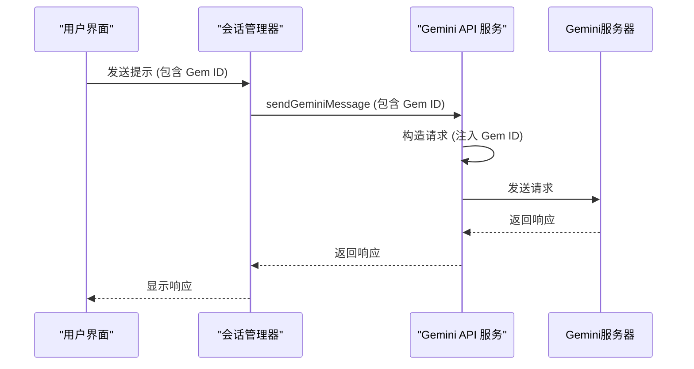
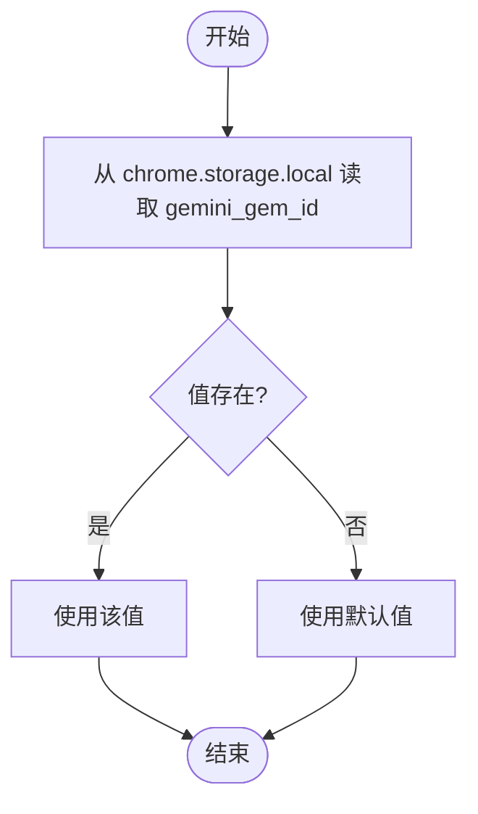
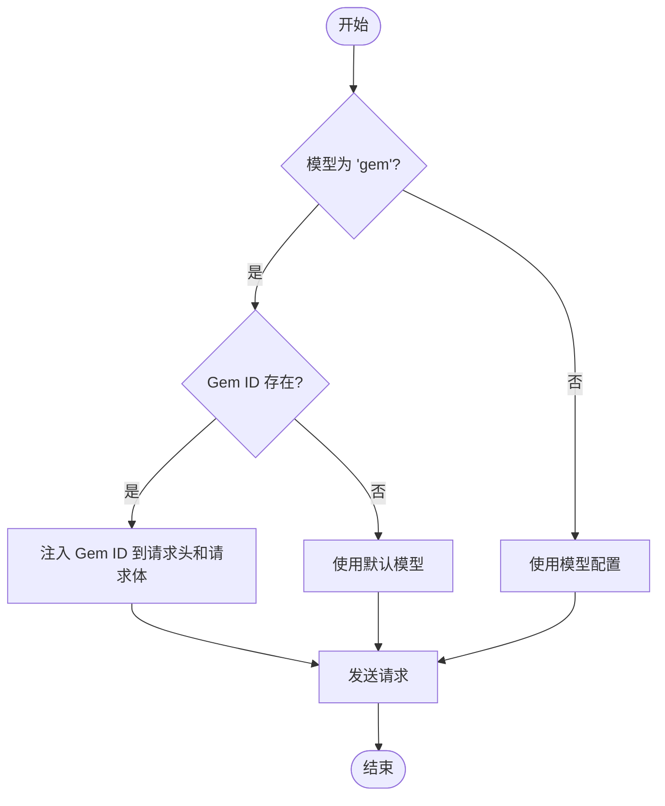
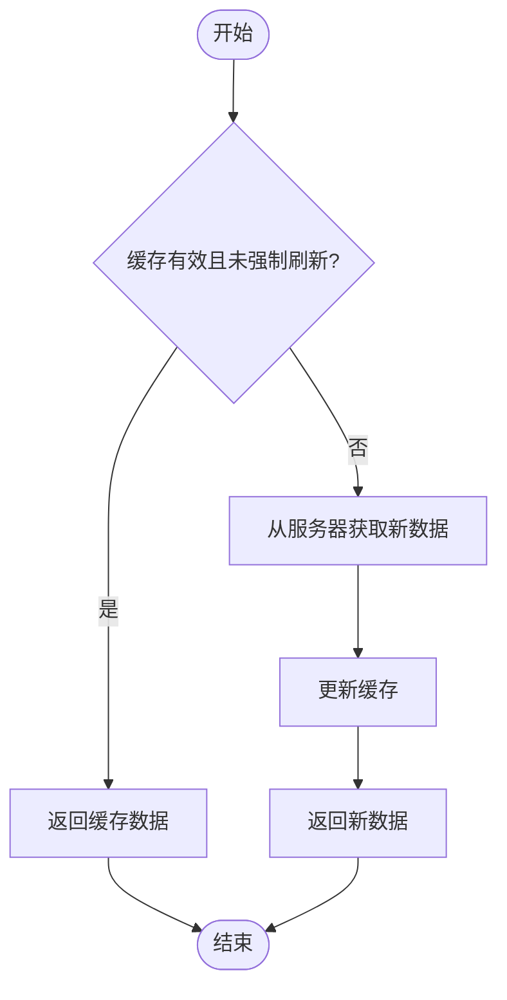

# Gem ID 配置

<cite>
**本文档引用的文件**  
- [manifest.json](file://manifest.json)
- [metadata.json](file://metadata.json)
- [package.json](file://package.json)
- [README.md](file://README.md)
- [background/index.js](file://background/index.js)
- [background/managers/session_manager.js](file://background/managers/session_manager.js)
- [background/managers/auth_manager.js](file://background/managers/auth_manager.js)
- [background/messages.js](file://background/messages.js)
- [services/gemini_api.js](file://services/gemini_api.js)
- [sidepanel/index.js](file://sidepanel/index.js)
- [services/gems.js](file://services/gems.js)
- [sandbox/controllers/gems_controller.js](file://sandbox/controllers/gems_controller.js)
</cite>

## 目录
1. [简介](#简介)
2. [Gem ID 配置机制](#gem-id-配置机制)
3. [核心组件分析](#核心组件分析)
4. [Gem ID 存储与管理](#gem-id-存储与管理)
5. [Gem ID 在请求中的注入](#gem-id-在请求中的注入)
6. [Gem 列表获取与缓存](#gem-列表获取与缓存)
7. [用户界面集成](#用户界面集成)
8. [配置流程总结](#配置流程总结)

## 简介

Gemini Nexus 是一款由 Google Gemini 驱动的强大 AI 助手 Chrome 扩展。该扩展支持多种功能，包括侧边栏对话、智能总结、图像分析、文本选中工具、浏览器控制等。其中，Gem ID 配置是实现使用特定 Gemini 模型（Gem）进行对话的关键功能。本文档将深入分析 Gem ID 的配置机制、存储管理、请求注入以及与用户界面的集成。

**Section sources**
- [README.md](file://README.md#L1-L102)
- [manifest.json](file://manifest.json#L1-L93)

## Gem ID 配置机制

Gem ID 配置机制允许用户选择并使用特定的 Gemini 模型（Gem）进行对话。该机制通过在 API 请求中注入 Gem ID 来实现。当用户选择一个 Gem 时，其 ID 会被存储在本地，并在后续的 API 请求中作为参数传递，从而确保请求被路由到指定的 Gem。

**Section sources**
- [README.md](file://README.md#L85-L92)

## 核心组件分析

Gem ID 配置涉及多个核心组件，包括会话管理器、认证管理器、API 服务和消息处理器。这些组件协同工作，确保 Gem ID 能够正确地从用户界面传递到 API 请求中。

### 会话管理器 (Session Manager)

会话管理器负责处理用户的提示请求，并协调与 Gemini API 的通信。它接收来自用户界面的请求，其中包含 Gem ID，并将其传递给 API 服务。

```mermaid
classDiagram
class GeminiSessionManager {
+handleSendPrompt(request, onUpdate)
+cancelCurrentRequest()
+setContext(context, model)
+resetContext()
+parseToolCall(text)
}
class AuthManager {
+ensureInitialized()
+rotateAccount()
+getOrFetchContext()
+updateContext(newContext, model)
+resetContext()
+forceContextRefresh()
}
class GeminiSessionManager --> AuthManager : "uses"
```

**Diagram sources**
- [background/managers/session_manager.js](file://background/managers/session_manager.js#L6-L285)
- [background/managers/auth_manager.js](file://background/managers/auth_manager.js#L5-L130)

### API 服务 (Gemini API)

API 服务负责构造和发送实际的 API 请求到 Gemini 服务器。它接收来自会话管理器的请求，包括 Gem ID，并将其注入到请求头和请求体中。



**Diagram sources**
- [background/managers/session_manager.js](file://background/managers/session_manager.js#L21-L202)
- [services/gemini_api.js](file://services/gemini_api.js#L30-L245)

## Gem ID 存储与管理

Gem ID 的存储与管理通过 Chrome 扩展的 `chrome.storage.local` API 实现。相关的键名为 `gemini_gem_id`，用于持久化存储用户选择的 Gem ID。

### 存储键名

- **gemini_gem_id**: 存储用户选择的 Gem ID。

### 存储操作

- **保存**: 当用户在设置面板中选择一个新的 Gem 时，`sidepanel/index.js` 文件中的 `SAVE_GEM_ID` 消息处理器会将新的 Gem ID 保存到 `chrome.storage.local` 中。
- **读取**: 在 `sidepanel/index.js` 的初始化过程中，会从 `chrome.storage.local` 中读取 `gemini_gem_id` 的值，并将其传递给沙盒环境。



**Diagram sources**
- [sidepanel/index.js](file://sidepanel/index.js#L32-L341)
- [background/managers/auth_manager.js](file://background/managers/auth_manager.js#L18-L48)

**Section sources**
- [sidepanel/index.js](file://sidepanel/index.js#L32-L341)
- [background/managers/auth_manager.js](file://background/managers/auth_manager.js#L18-L48)

## Gem ID 在请求中的注入

Gem ID 在请求中的注入是通过 `services/gemini_api.js` 文件中的 `sendGeminiMessage` 函数实现的。该函数负责构造 API 请求，并将 Gem ID 注入到请求头和请求体中。

### 请求头注入

Gem ID 被注入到请求头 `x-goog-ext-525005358-jspb` 中，格式为 `["${gemId}",1]`。

### 请求体注入

Gem ID 被直接注入到请求体的第 19 个位置（索引 19），即 `data[19]`。



**Diagram sources**
- [services/gemini_api.js](file://services/gemini_api.js#L43-L153)

**Section sources**
- [services/gemini_api.js](file://services/gemini_api.js#L43-L153)

## Gem 列表获取与缓存

Gem 列表的获取与缓存是通过 `services/gems.js` 文件中的 `getCachedGemsList` 函数实现的。该函数负责从 Gemini 服务器获取可用的 Gem 列表，并将其缓存以避免重复请求。

### 缓存机制

- **缓存有效期**: 5 分钟。
- **缓存键**: 基于用户索引 (`userIndex`)。
- **强制刷新**: 支持通过 `forceRefresh` 参数强制刷新缓存。

### 获取流程

1. 检查缓存是否有效。
2. 如果缓存有效且未强制刷新，则返回缓存数据。
3. 否则，从服务器获取新的 Gem 列表，并更新缓存。



**Diagram sources**
- [services/gems.js](file://services/gems.js#L289-L311)

**Section sources**
- [services/gems.js](file://services/gems.js#L289-L311)

## 用户界面集成

Gem ID 配置在用户界面中通过模型选择下拉菜单实现。用户可以在设置面板中选择不同的模型，包括标准模型和特定的 Gem。

### 模型选择

- **标准模型**: 如 `gemini-2.5-flash`、`gemini-2.5-pro`。
- **Gem 模型**: 格式为 `gem:${gemId}`，例如 `gem:4c81ac3f4657`。

### 控制器

`sandbox/controllers/gems_controller.js` 文件中的 `GemsController` 类负责管理 Gem 列表的显示和选择。它从后台获取 Gem 列表，并将其填充到模型选择下拉菜单中。

```mermaid
classDiagram
class GemsController {
+fetchGems(userIndex, forceRefresh)
+populateModelSelect()
+getGemIdFromValue(modelValue)
}
class GemsController --> fetchGems : "calls"
class GemsController --> populateModelSelect : "calls"
class GemsController --> getGemIdFromValue : "calls"
```

**Diagram sources**
- [sandbox/controllers/gems_controller.js](file://sandbox/controllers/gems_controller.js#L105-L140)

**Section sources**
- [sandbox/controllers/gems_controller.js](file://sandbox/controllers/gems_controller.js#L105-L140)

## 配置流程总结

Gem ID 配置流程可以总结为以下几个步骤：

1. **用户选择**: 用户在设置面板中选择一个 Gem。
2. **存储**: 选择的 Gem ID 被保存到 `chrome.storage.local` 中，键名为 `gemini_gem_id`。
3. **读取**: 扩展初始化时，从 `chrome.storage.local` 中读取 `gemini_gem_id`。
4. **注入**: 在发送 API 请求时，Gem ID 被注入到请求头和请求体中。
5. **缓存**: Gem 列表被缓存 5 分钟，以提高性能和减少服务器请求。

通过这一系列步骤，Gemini Nexus 扩展实现了对特定 Gemini 模型的灵活配置和使用。

**Section sources**
- [sidepanel/index.js](file://sidepanel/index.js#L32-L341)
- [services/gemini_api.js](file://services/gemini_api.js#L43-L153)
- [services/gems.js](file://services/gems.js#L289-L311)
- [sandbox/controllers/gems_controller.js](file://sandbox/controllers/gems_controller.js#L105-L140)