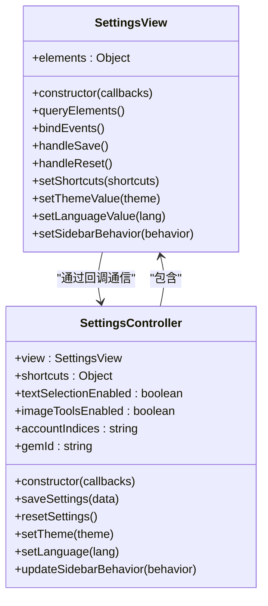

# 基础设置

<cite>
**本文档引用的文件**  
- [settings/view.js](file://sandbox/ui/settings/view.js)
- [settings.js](file://sandbox/ui/settings.js)
- [auth_manager.js](file://background/managers/auth_manager.js)
- [session_manager.js](file://background/managers/session_manager.js)
- [messaging.js](file://lib/messaging.js)
- [sidepanel/index.js](file://sidepanel/index.js)
- [constants.js](file://lib/constants.js)
- [templates/settings.js](file://sandbox/ui/templates/settings.js)
- [i18n.js](file://sandbox/core/i18n.js)
- [config.js](file://sandbox/render/config.js)
</cite>

## 目录
1. [简介](#简介)
2. [模型选择配置](#模型选择配置)
3. [侧边栏行为配置](#侧边栏行为配置)
4. [语言设置与同步机制](#语言设置与同步机制)
5. [配置项默认值与验证规则](#配置项默认值与验证规则)
6. [配置变更生效机制](#配置变更生效机制)
7. [用户界面绑定关系](#用户界面绑定关系)

## 简介
本文档详细说明Gemini Nexus扩展的核心功能配置项，重点阐述模型选择、侧边栏行为和语言设置三大核心配置机制。通过分析代码实现，揭示配置项如何通过chrome.storage.local进行持久化存储，以及如何与用户界面进行双向绑定。文档还解释了各配置项的默认值、有效范围和验证规则，并说明配置变更后的生效机制。

## 模型选择配置
Gemini Nexus支持在Gemini Flash和Pro等不同模型之间切换，该功能通过`geminiModel`字段实现模型切换机制。系统使用`chrome.storage.local`存储当前选择的模型标识，确保用户偏好在浏览器会话间持久化。

模型选择的配置机制由`AuthManager`类负责管理，当检测到模型变更时，会自动重置上下文以确保新模型的正确初始化。系统支持的模型包括`gemini-2.5-flash`（默认）、`gemini-2.5-pro`和`gemini-3.0-pro`，每个模型都有对应的API请求头配置。

**Section sources**
- [auth_manager.js](file://background/managers/auth_manager.js#L98-L103)
- [session_manager.js](file://background/managers/session_manager.js#L51-L53)
- [gemini_api.js](file://services/gemini_api.js#L7-L24)

## 侧边栏行为配置
侧边栏行为通过`geminiSidebarBehavior`配置项控制，该配置决定了侧边栏重新打开时的聊天恢复策略。用户可以在设置界面中选择三种不同的行为模式：

- **自动恢复或重新开始**：如果在10分钟内重新打开侧边栏，则恢复上次的聊天；否则开始新的聊天
- **始终恢复上次的聊天**：无论时间间隔，总是尝试恢复之前的对话上下文
- **始终开始新的聊天**：每次打开侧边栏都创建全新的聊天会话

这些配置选项直接影响用户体验和对话连续性，用户可以根据自己的使用习惯进行选择。配置值通过`chrome.storage.local`进行存储，并在侧边栏加载时读取以确定初始行为。

**Section sources**
- [settings/view.js](file://sandbox/ui/settings/view.js#L41)
- [settings.js](file://sandbox/ui/settings.js#L32)
- [sidepanel/index.js](file://sidepanel/index.js#L54-L57)

## 语言设置与同步机制
语言设置通过`geminiLanguage`字段实现，系统支持多语言界面切换。配置机制采用双重存储策略：使用`chrome.storage.local`进行持久化存储，同时使用`localStorage`进行缓存优化，以实现快速加载。

这种双重存储机制确保了语言设置的即时生效和跨会话持久性。当用户更改语言设置时，系统会同时更新两种存储，并触发`gemini-language-changed`自定义事件，通知界面组件重新应用翻译。系统支持英语和中文两种界面语言，并能根据系统语言自动选择默认语言。

**Section sources**
- [messaging.js](file://lib/messaging.js#L36-L45)
- [sidepanel/index.js](file://sidepanel/index.js#L10-L11)
- [i18n.js](file://sandbox/core/i18n.js#L196-L215)

## 配置项默认值与验证规则
所有配置项都有明确的默认值和验证规则，确保系统的稳定运行。模型选择配置的默认值为`gemini-2.5-flash`，这是一个经过优化的快速响应模型。配置项的有效范围受到严格限制，模型选择仅限于预定义的枚举值，防止无效的模型标识导致API调用失败。

侧边栏行为配置的默认值为`auto`，提供平衡的用户体验。语言设置的默认值为`system`，即跟随系统语言设置。这些配置项在存储前都会经过验证，确保数据的完整性和有效性。

**Section sources**
- [constants.js](file://lib/constants.js#L9)
- [settings.js](file://sandbox/ui/settings.js#L18)
- [auth_manager.js](file://background/managers/auth_manager.js#L9)

## 配置变更生效机制
配置变更后，系统采用即时生效机制，无需页面刷新或扩展重启。当用户在设置界面中更改配置并点击保存后，新的配置值会立即通过消息传递系统广播到所有相关组件。

对于模型选择变更，系统会自动重置上下文并重新初始化会话，确保新模型的正确使用。语言设置变更会触发界面重渲染，立即显示翻译后的内容。这种即时生效机制提供了流畅的用户体验，用户可以立即看到配置变更的效果。

**Section sources**
- [settings.js](file://sandbox/ui/settings.js#L24-L25)
- [auth_manager.js](file://background/managers/auth_manager.js#L104-L108)
- [messaging.js](file://lib/messaging.js#L18-L74)

## 用户界面绑定关系
配置项与用户界面通过`SettingsView`和`SettingsController`类进行双向绑定。`SettingsView`负责管理界面元素，`SettingsController`负责处理业务逻辑和数据同步。两者通过回调函数和事件机制紧密协作，实现配置的读取、修改和持久化。

UI组件与配置项的绑定关系在`settings/view.js`中定义，通过`queryElements`方法获取所有相关DOM元素，并在`bindEvents`方法中为这些元素绑定事件监听器。当用户与界面交互时，事件会触发相应的处理函数，最终通过消息系统将变更同步到存储层。

**Diagram sources**
- [settings/view.js](file://sandbox/ui/settings/view.js#L4-L240)
- [settings.js](file://sandbox/ui/settings.js#L8-L248)

**Section sources**
- [settings/view.js](file://sandbox/ui/settings/view.js#L4-L240)
- [settings.js](file://sandbox/ui/settings.js#L8-L248)
- [templates/settings.js](file://sandbox/ui/templates/settings.js#L2-L173)