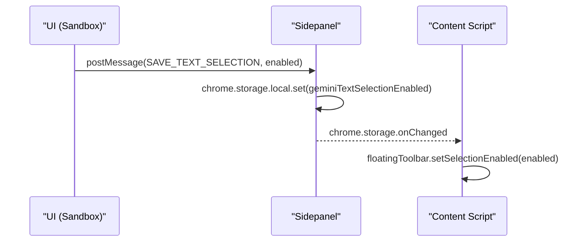
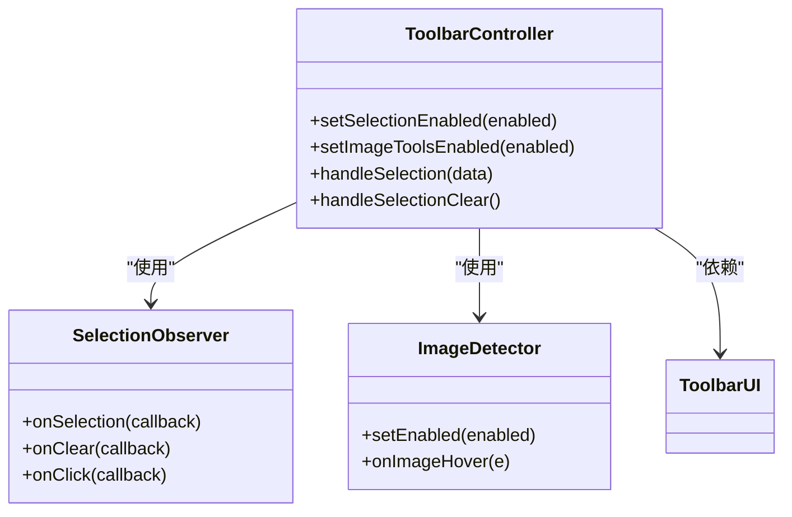

# 工具配置

<cite>
**本文档引用的文件**
- [manifest.json](file://manifest.json)
- [content/index.js](file://content/index.js)
- [content/selection.js](file://content/selection.js)
- [content/toolbar/controller.js](file://content/toolbar/controller.js)
- [content/toolbar/ui/manager.js](file://content/toolbar/ui/manager.js)
- [content/toolbar/image.js](file://content/toolbar/image.js)
- [sidepanel/index.js](file://sidepanel/index.js)
- [sandbox/ui/settings/view.js](file://sandbox/ui/settings/view.js)
- [lib/messaging.js](file://lib/messaging.js)
- [background/messages.js](file://background/messages.js)
</cite>

## 目录
1. [简介](#简介)
2. [配置项实现原理](#配置项实现原理)
3. [消息传递流程](#消息传递流程)
4. [功能模块依赖关系](#功能模块依赖关系)
5. [调试方法](#调试方法)
6. [异常处理策略](#异常处理策略)

## 简介
本文档深入解析Gemini Nexus扩展中的工具配置机制，重点阐述文本选中工具和图像工具的开关配置。文档详细说明了`geminiTextSelectionEnabled`和`geminiImageToolsEnabled`配置项的实现原理，包括其默认启用状态和存储策略。同时，文档阐述了配置变更时的消息传递流程、工具配置与功能模块的依赖关系、调试方法以及配置异常情况的处理策略。

## 配置项实现原理
`geminiTextSelectionEnabled`和`geminiImageToolsEnabled`是Gemini Nexus扩展中的两个核心配置项，用于控制文本选中工具和图像工具的启用状态。这两个配置项均采用`chrome.storage.local`存储策略，确保用户配置在浏览器会话之间持久化。

根据代码分析，这两个配置项的默认状态均为启用（default true）。当配置项未在存储中定义时，系统会将其视为启用状态。这种设计确保了新用户安装扩展后能够立即使用所有功能，而无需进行额外配置。

`geminiTextSelectionEnabled`配置项控制文本选中功能的启用状态。当该配置项为`true`时，用户在网页上选中文本后，浮动工具栏会自动显示，提供与Gemini交互的选项。当该配置项为`false`时，文本选中功能被禁用，即使用户选中文本，工具栏也不会显示。

`geminiImageToolsEnabled`配置项控制图像工具的启用状态。当该配置项为`true`时，系统会监听鼠标悬停在图像上的事件，并在图像附近显示一个图像分析按钮。用户点击该按钮后，可以对图像进行OCR、翻译或分析等操作。当该配置项为`false`时，图像工具被禁用，系统不会监听图像悬停事件，也不会显示图像分析按钮。

**Section sources**
- [content/index.js](file://content/index.js#L117-L132)
- [content/toolbar/controller.js](file://content/toolbar/controller.js#L89-L98)
- [content/toolbar/image.js](file://content/toolbar/image.js#L21-L32)

## 消息传递流程
工具配置的变更通过一套完整的消息传递机制在UI、content script和background script之间同步。当用户在设置界面更改配置时，消息传递流程如下：

1. UI组件（位于sandbox环境中）通过`postMessage`向`sidepanel/index.js`发送`SAVE_TEXT_SELECTION`或`SAVE_IMAGE_TOOLS`消息。
2. `sidepanel/index.js`接收到消息后，使用`chrome.storage.local.set`方法将新的配置值存储到本地存储中。
3. `content/index.js`中注册的`chrome.storage.onChanged`监听器检测到存储变化，获取新的配置值。
4. `content/index.js`调用`floatingToolbar`实例的`setSelectionEnabled`或`setImageToolsEnabled`方法，将新的配置状态同步到content script中。

这个消息传递流程确保了配置变更能够实时反映在用户界面上。例如，当用户禁用文本选中工具时，`setSelectionEnabled(false)`方法会立即禁用`SelectionObserver`，阻止工具栏在用户选中文本时显示。



**Diagram sources**
- [sidepanel/index.js](file://sidepanel/index.js#L315-L317)
- [content/index.js](file://content/index.js#L139-L143)

## 功能模块依赖关系
工具配置与多个功能模块紧密集成，其中最核心的依赖关系是文本选中工具与`content/toolbar/manager.js`（在代码中为`controller.js`）的集成。

`ToolbarController`类是浮动工具栏的核心控制器，负责协调各个子模块的工作。文本选中功能通过`SelectionObserver`类实现，该类在`ToolbarController`的构造函数中被实例化，并注册了`onSelection`回调函数。当用户选中文本时，`SelectionObserver`会触发`handleSelection`方法，该方法会检查`isSelectionEnabled`状态，决定是否显示工具栏。



**Diagram sources**
- [content/toolbar/controller.js](file://content/toolbar/controller.js#L29-L33)
- [content/selection.js](file://content/selection.js#L5-L61)

## 调试方法
要调试工具配置，可以使用Chrome开发者工具检查存储状态。以下是具体的调试步骤：

1. 打开Chrome开发者工具（F12）。
2. 切换到"Application"（应用程序）标签页。
3. 在左侧边栏中展开"Storage"（存储）部分，选择"Chrome Extensions"（Chrome扩展）。
4. 找到"gemini-nexus"扩展，查看`chrome.storage.local`中的`geminiTextSelectionEnabled`和`geminiImageToolsEnabled`值。

通过这种方式，可以验证配置项是否正确存储，并检查其当前值。此外，还可以在开发者工具的Console（控制台）中使用以下代码来读取配置值：

```javascript
chrome.storage.local.get(['geminiTextSelectionEnabled', 'geminiImageToolsEnabled'], (result) => console.log(result));
```

这种方法可以快速验证配置读取逻辑是否正常工作。

**Section sources**
- [content/index.js](file://content/index.js#L117-L132)
- [sidepanel/index.js](file://sidepanel/index.js#L246-L253)

## 异常处理策略
系统对配置异常情况有完善的处理策略。当配置项被意外删除或损坏时，系统会采用默认值作为回退机制。

对于`geminiTextSelectionEnabled`和`geminiImageToolsEnabled`配置项，系统的处理逻辑是：如果配置项不存在或其值不为`false`，则视为启用状态。这种设计确保了即使配置项被意外删除，用户仍然可以正常使用相关功能。

在代码实现中，这种逻辑通过以下方式体现：
```javascript
const selectionEnabled = result.geminiTextSelectionEnabled !== false;
const imageToolsEnabled = result.geminiImageToolsEnabled !== false;
```

这种"默认启用"的策略符合用户体验的最佳实践，避免了因配置丢失导致功能不可用的情况。同时，系统通过`chrome.storage.onChanged`监听器持续监控配置变化，确保任何配置更新都能被及时捕获和处理。

**Section sources**
- [content/index.js](file://content/index.js#L122-L123)
- [content/index.js](file://content/index.js#L128-L129)