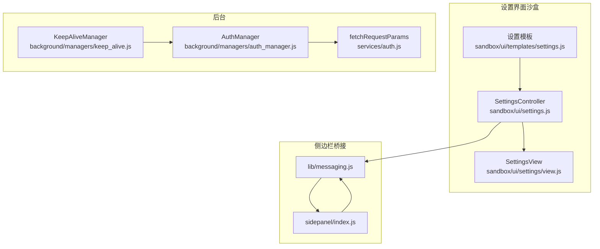
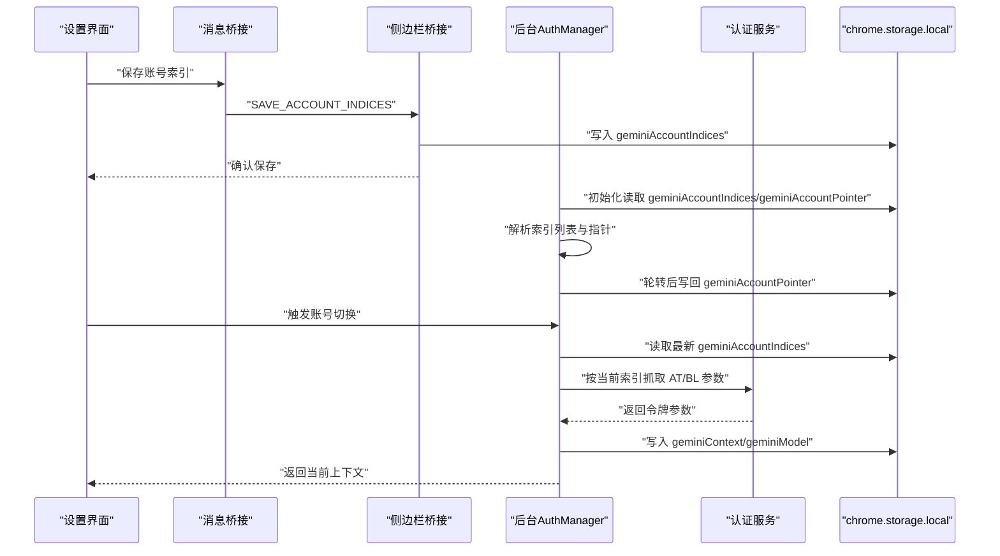
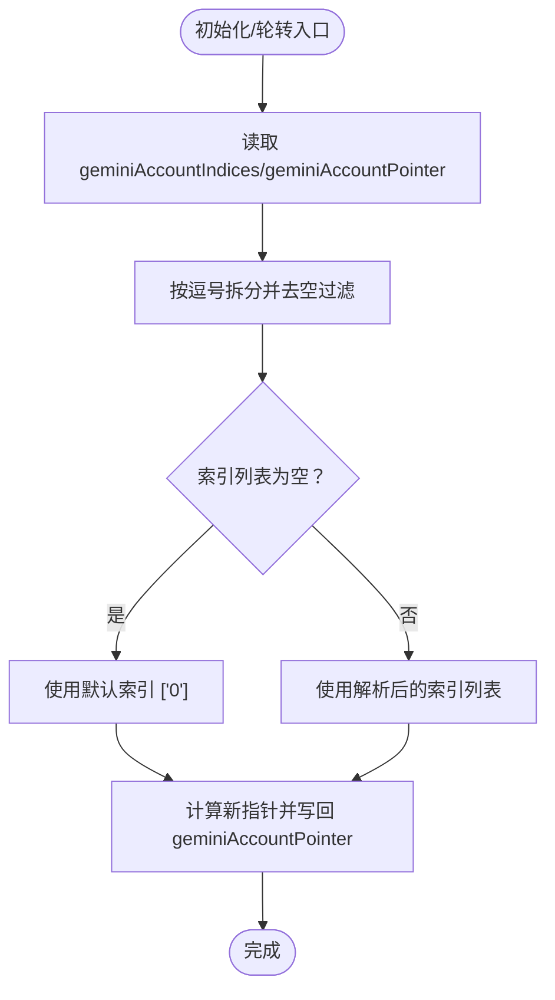
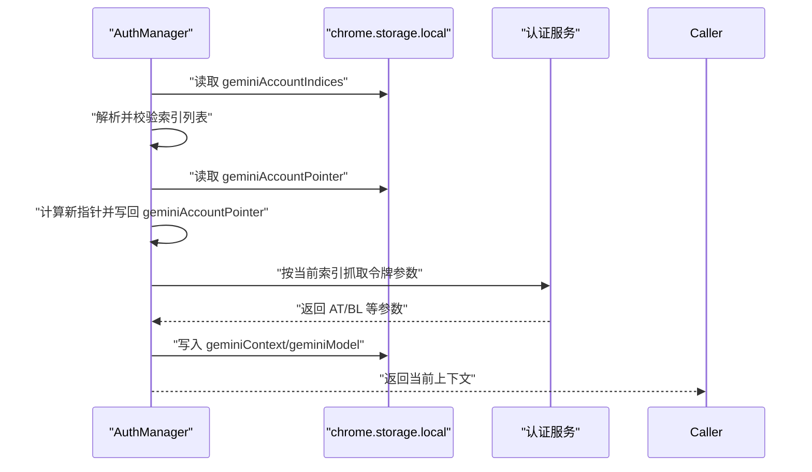
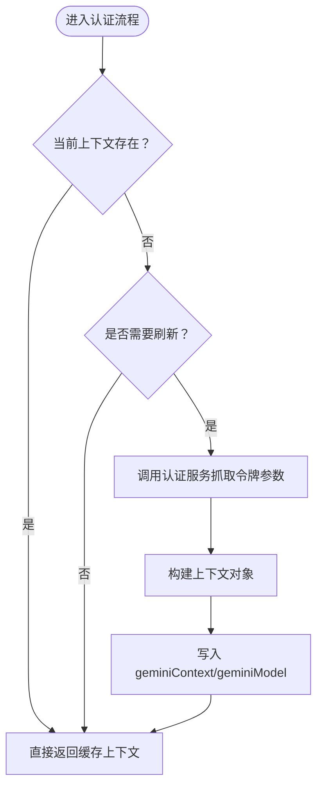
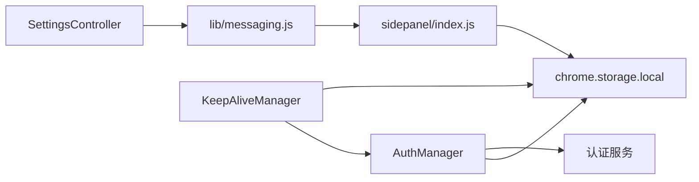

# 账号管理

<cite>
**本文引用的文件**
- [background/managers/auth_manager.js](file://background/managers/auth_manager.js)
- [services/auth.js](file://services/auth.js)
- [sidepanel/index.js](file://sidepanel/index.js)
- [sandbox/ui/settings.js](file://sandbox/ui/settings.js)
- [sandbox/ui/settings/view.js](file://sandbox/ui/settings/view.js)
- [sandbox/ui/templates/settings.js](file://sandbox/ui/templates/settings.js)
- [lib/messaging.js](file://lib/messaging.js)
- [lib/utils.js](file://lib/utils.js)
- [background/managers/keep_alive.js](file://background/managers/keep_alive.js)
</cite>

## 目录
1. [简介](#简介)
2. [项目结构](#项目结构)
3. [核心组件](#核心组件)
4. [架构总览](#架构总览)
5. [详细组件分析](#详细组件分析)
6. [依赖关系分析](#依赖关系分析)
7. [性能考量](#性能考量)
8. [故障排查指南](#故障排查指南)
9. [结论](#结论)
10. [附录](#附录)

## 简介
本文件系统化说明多账户系统的配置与管理机制，重点围绕 geminiAccountIndices 配置项在 chrome.storage.local 中的存储结构、多账号索引管理、账号切换时的配置同步流程、认证信息的加载与缓存策略，以及与认证状态的关联关系。同时提供最佳实践、默认值与边界情况处理建议，并给出扩展多账户功能的技术指导。

## 项目结构
多账户能力由以下模块协同实现：
- 认证管理器：负责从本地存储恢复配置、轮转账号索引、按当前索引获取或刷新上下文。
- 认证服务：根据用户索引抓取 AT/BL 等令牌参数。
- 设置界面：提供输入框与保存逻辑，将账号索引写入本地存储。
- 消息桥接：在沙盒与后台之间转发存储读写请求与响应。
- 健康维持：周期性轮换 Cookie，避免会话过期导致的认证失效。

图表来源
- [background/managers/auth_manager.js](file://background/managers/auth_manager.js#L1-L130)
- [services/auth.js](file://services/auth.js#L1-L41)
- [sidepanel/index.js](file://sidepanel/index.js#L1-L200)
- [sandbox/ui/settings.js](file://sandbox/ui/settings.js#L1-L200)
- [sandbox/ui/settings/view.js](file://sandbox/ui/settings/view.js#L1-L240)
- [sandbox/ui/templates/settings.js](file://sandbox/ui/templates/settings.js#L22-L36)
- [lib/messaging.js](file://lib/messaging.js#L1-L96)
- [background/managers/keep_alive.js](file://background/managers/keep_alive.js#L1-L97)

章节来源
- [background/managers/auth_manager.js](file://background/managers/auth_manager.js#L1-L130)
- [services/auth.js](file://services/auth.js#L1-L41)
- [sidepanel/index.js](file://sidepanel/index.js#L1-L200)
- [sandbox/ui/settings.js](file://sandbox/ui/settings.js#L1-L200)
- [sandbox/ui/settings/view.js](file://sandbox/ui/settings/view.js#L1-L240)
- [sandbox/ui/templates/settings.js](file://sandbox/ui/templates/settings.js#L22-L36)
- [lib/messaging.js](file://lib/messaging.js#L1-L96)
- [background/managers/keep_alive.js](file://background/managers/keep_alive.js#L1-L97)

## 核心组件
- AuthManager：维护当前上下文、模型、账号索引列表与指针；从 chrome.storage.local 初始化；提供轮转与获取上下文的能力。
- fetchRequestParams：根据用户索引访问对应页面，解析 AT/BL 等令牌参数。
- SettingsController/SettingsView：提供“账号索引”输入框，保存到本地存储。
- sidepanel/index.js：作为桥接层，向沙盒发送初始配置并处理保存请求。
- lib/messaging.js：封装与后台通信的消息接口，包括获取/保存账号索引。
- KeepAliveManager：周期性轮换 Cookie，避免 401/403 导致的会话失效。

章节来源
- [background/managers/auth_manager.js](file://background/managers/auth_manager.js#L5-L129)
- [services/auth.js](file://services/auth.js#L7-L40)
- [sandbox/ui/settings.js](file://sandbox/ui/settings.js#L113-L136)
- [sandbox/ui/settings/view.js](file://sandbox/ui/settings/view.js#L199-L205)
- [sidepanel/index.js](file://sidepanel/index.js#L269-L334)
- [lib/messaging.js](file://lib/messaging.js#L76-L85)
- [background/managers/keep_alive.js](file://background/managers/keep_alive.js#L39-L93)

## 架构总览
多账户配置与认证的关键交互如下：

图表来源
- [background/managers/auth_manager.js](file://background/managers/auth_manager.js#L14-L48)
- [background/managers/auth_manager.js](file://background/managers/auth_manager.js#L53-L69)
- [background/managers/auth_manager.js](file://background/managers/auth_manager.js#L75-L92)
- [services/auth.js](file://services/auth.js#L7-L40)
- [sidepanel/index.js](file://sidepanel/index.js#L327-L330)
- [lib/messaging.js](file://lib/messaging.js#L76-L85)

## 详细组件分析

### geminiAccountIndices 存储结构与多账号索引管理
- 存储位置：chrome.storage.local，键名为 geminiAccountIndices。
- 存储格式：字符串，逗号分隔的数字索引序列（如 "0,1,2"）。AuthManager 在初始化时将其拆分为数组并过滤空串，确保健壮性。
- 默认值：若未设置或为空，AuthManager 使用 ["0"] 作为默认索引列表；轮转时若索引列表为空也会回退到 ["0"]。
- 指针管理：geminiAccountPointer 表示当前使用的索引在列表中的位置，每次轮转后写回存储，保证持久化。
- UI 输入：设置界面允许用户输入索引序列，保存前会清理非数字与逗号字符，最终写入存储。

图表来源
- [background/managers/auth_manager.js](file://background/managers/auth_manager.js#L18-L48)
- [background/managers/auth_manager.js](file://background/managers/auth_manager.js#L53-L69)
- [sandbox/ui/settings.js](file://sandbox/ui/settings.js#L125-L130)

章节来源
- [background/managers/auth_manager.js](file://background/managers/auth_manager.js#L9-L48)
- [background/managers/auth_manager.js](file://background/managers/auth_manager.js#L53-L69)
- [sandbox/ui/settings.js](file://sandbox/ui/settings.js#L125-L130)
- [sidepanel/index.js](file://sidepanel/index.js#L327-L330)

### 账号切换时的配置同步流程
- 同步来源：每次轮转前，AuthManager 会重新从存储读取 geminiAccountIndices，确保与其他窗口/标签页的变更保持一致。
- 指针更新：轮转后立即写回 geminiAccountPointer，保证下次启动或切换时能正确恢复。
- 上下文刷新：当需要获取当前账号上下文时，若缓存为空则按当前索引调用认证服务抓取令牌参数，构建上下文并写回存储以供后续使用。
- 模型变更：若检测到模型变化，会强制清空上下文，以便重新初始化。

图表来源
- [background/managers/auth_manager.js](file://background/managers/auth_manager.js#L53-L69)
- [background/managers/auth_manager.js](file://background/managers/auth_manager.js#L75-L92)
- [services/auth.js](file://services/auth.js#L7-L40)

章节来源
- [background/managers/auth_manager.js](file://background/managers/auth_manager.js#L53-L92)
- [services/auth.js](file://services/auth.js#L7-L40)

### 认证信息的加载与缓存策略
- 缓存命中：若当前上下文存在，直接返回，避免重复抓取。
- 缓存失效：模型变更或显式重置会清空上下文；会话过期（401/403）时也会清除本地上下文，等待下一次操作触发刷新。
- 刷新触发：通过 getOrFetchContext 或轮转操作触发；成功后写入存储，提升后续访问速度。
- 健康维持：KeepAliveManager 定期轮换 Cookie，降低因会话过期导致的失败概率。

图表来源
- [background/managers/auth_manager.js](file://background/managers/auth_manager.js#L75-L92)
- [background/managers/keep_alive.js](file://background/managers/keep_alive.js#L82-L93)

章节来源
- [background/managers/auth_manager.js](file://background/managers/auth_manager.js#L75-L113)
- [background/managers/keep_alive.js](file://background/managers/keep_alive.js#L39-L93)

### 配置数据与认证状态的关联关系
- geminiContext：包含 AT/BL 等令牌及用户标识等认证上下文，用于后续请求。
- geminiModel：记录当前模型，用于判断是否需要刷新上下文。
- geminiAccountIndices/geminiAccountPointer：决定当前使用的账号索引与轮转策略。
- 三者共同决定认证状态的稳定性与一致性。

章节来源
- [background/managers/auth_manager.js](file://background/managers/auth_manager.js#L18-L48)
- [background/managers/auth_manager.js](file://background/managers/auth_manager.js#L105-L113)

### 最佳实践
- 安全存储建议
  - 仅在 chrome.storage.local 存放账号索引与上下文，避免在其他位置明文保存敏感令牌。
  - 对外暴露的存储键名应尽量语义化且稳定，便于维护。
- 跨设备同步注意事项
  - 当前实现基于本地存储，不包含跨设备同步逻辑。若需跨设备使用，应在上层增加同步层（如扩展同步 API 或云端备份），并注意令牌有效期与安全传输。
- 输入清洗与容错
  - UI 层已对输入进行清洗（仅保留数字与逗号），后台也进行拆分与过滤，确保健壮性。
- 模型变更与上下文刷新
  - 发现模型变化时应主动重置上下文，避免使用旧上下文导致请求失败。

章节来源
- [sandbox/ui/settings.js](file://sandbox/ui/settings.js#L125-L130)
- [background/managers/auth_manager.js](file://background/managers/auth_manager.js#L98-L103)

### 默认值与边界情况处理
- 默认索引：若未设置或为空，使用 ["0"] 作为默认索引列表。
- 空列表回退：轮转前若发现索引列表为空，立即回退到 ["0"] 并继续轮转。
- 指针越界：通过取模运算保证指针在有效范围内循环。
- 会话过期：遇到 401/403 时清除本地上下文，等待下一次操作触发刷新。

章节来源
- [background/managers/auth_manager.js](file://background/managers/auth_manager.js#L62-L68)
- [background/managers/auth_manager.js](file://background/managers/auth_manager.js#L115-L124)
- [background/managers/keep_alive.js](file://background/managers/keep_alive.js#L82-L93)

### 开发者扩展指导
- 新增账号类型
  - 若需支持新的账号类型（例如不同域名或路径），可在认证服务中根据索引动态拼接 URL 或添加分支逻辑。
  - 更新 UI 的提示文案与输入限制，确保用户输入合法。
- 扩展存储字段
  - 如需为不同账号类型维护独立上下文，可考虑在上下文中增加类型标识，并在存储中按类型分组或命名空间化。
- 增强健康检查
  - 可在轮转失败时增加重试与告警机制，或引入更细粒度的状态机管理。

章节来源
- [services/auth.js](file://services/auth.js#L7-L14)
- [sandbox/ui/templates/settings.js](file://sandbox/ui/templates/settings.js#L30-L36)

## 依赖关系分析
- AuthManager 依赖认证服务以获取令牌参数，并依赖本地存储以持久化上下文与索引。
- 设置界面通过消息桥接与侧边栏桥接与后台通信，实现配置的读取与保存。
- KeepAliveManager 与 AuthManager 协作，通过周期性轮换 Cookie 维持会话有效性。

图表来源
- [background/managers/auth_manager.js](file://background/managers/auth_manager.js#L1-L130)
- [services/auth.js](file://services/auth.js#L1-L41)
- [lib/messaging.js](file://lib/messaging.js#L1-L96)
- [sidepanel/index.js](file://sidepanel/index.js#L1-L200)
- [background/managers/keep_alive.js](file://background/managers/keep_alive.js#L1-L97)

章节来源
- [background/managers/auth_manager.js](file://background/managers/auth_manager.js#L1-L130)
- [services/auth.js](file://services/auth.js#L1-L41)
- [lib/messaging.js](file://lib/messaging.js#L1-L96)
- [sidepanel/index.js](file://sidepanel/index.js#L1-L200)
- [background/managers/keep_alive.js](file://background/managers/keep_alive.js#L1-L97)

## 性能考量
- 缓存优先：优先返回缓存上下文，减少网络请求与解析开销。
- 异步初始化：从存储一次性读取多个键，避免多次往返。
- 轮转最小化：仅在必要时刷新上下文，避免频繁抓取。
- 周期轮换：通过定时器定期轮换 Cookie，降低会话过期风险，减少失败重试成本。

## 故障排查指南
- 无法获取上下文
  - 检查是否已登录对应账号页面；若未登录，认证服务会抛出错误提示。
  - 查看存储中是否存在 geminiContext；若缺失，触发重新抓取。
- 401/403 错误
  - 观察 KeepAliveManager 是否清除本地上下文；若被清除，等待下一次操作自动刷新。
- 账号轮转无效
  - 确认 geminiAccountIndices 是否正确保存；轮转前会重新读取该值。
  - 检查 geminiAccountPointer 是否被写回存储。

章节来源
- [services/auth.js](file://services/auth.js#L35-L37)
- [background/managers/keep_alive.js](file://background/managers/keep_alive.js#L82-L93)
- [background/managers/auth_manager.js](file://background/managers/auth_manager.js#L53-L69)

## 结论
本系统通过 chrome.storage.local 提供稳定的本地存储，结合 AuthManager 的初始化、轮转与上下文缓存机制，实现了多账号索引的灵活管理与认证状态的可靠维护。配合设置界面的输入清洗与消息桥接，形成从 UI 到后台的一体化配置流程。建议在扩展新账号类型时，遵循现有模式并在认证服务与 UI 层同步更新，同时关注跨设备同步与安全存储的最佳实践。

## 附录
- 关键存储键名
  - geminiAccountIndices：账号索引列表（字符串）
  - geminiAccountPointer：当前索引在列表中的位置（数字）
  - geminiContext：认证上下文（对象）
  - geminiModel：当前模型（字符串）

章节来源
- [background/managers/auth_manager.js](file://background/managers/auth_manager.js#L18-L48)
- [background/managers/auth_manager.js](file://background/managers/auth_manager.js#L105-L113)