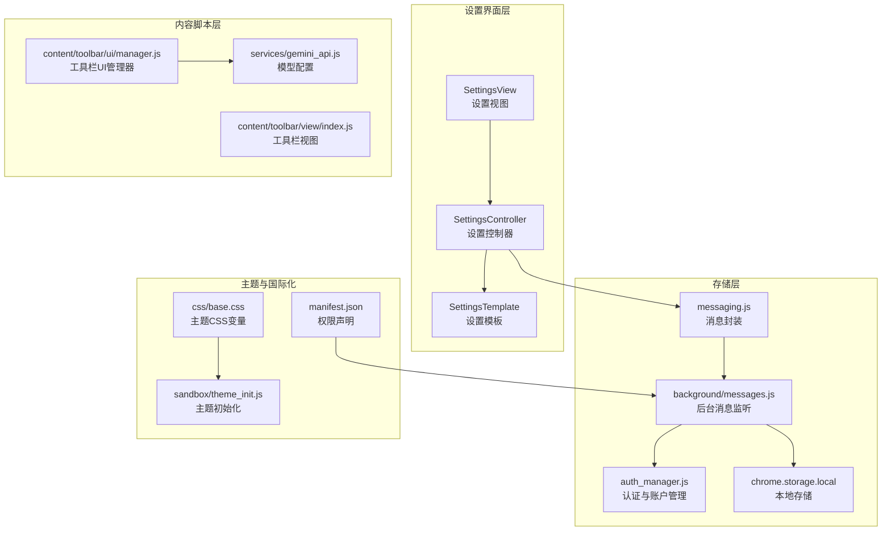
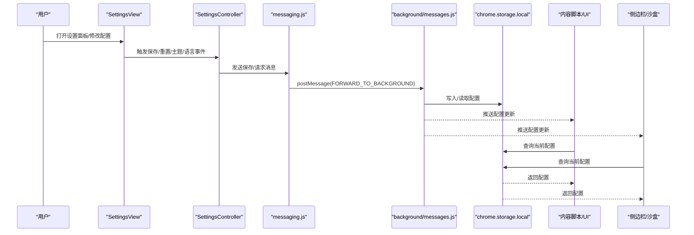
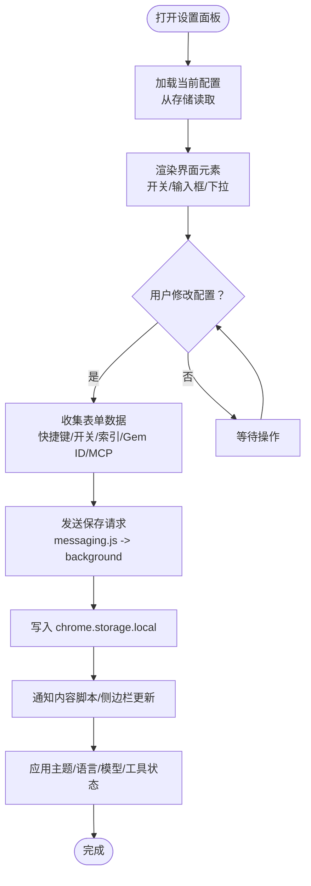
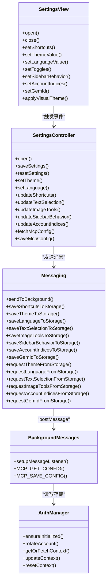

# 配置管理

<cite>
**本文档引用的文件**
- [lib/constants.js](file://lib/constants.js)
- [lib/messaging.js](file://lib/messaging.js)
- [sandbox/ui/settings/view.js](file://sandbox/ui/settings/view.js)
- [sandbox/ui/settings.js](file://sandbox/ui/settings.js)
- [sandbox/ui/templates/settings.js](file://sandbox/ui/templates/settings.js)
- [background/managers/auth_manager.js](file://background/managers/auth_manager.js)
- [background/messages.js](file://background/messages.js)
- [background/index.js](file://background/index.js)
- [content/toolbar/ui/manager.js](file://content/toolbar/ui/manager.js)
- [content/toolbar/view/index.js](file://content/toolbar/view/index.js)
- [services/gemini_api.js](file://services/gemini_api.js)
- [manifest.json](file://manifest.json)
- [css/base.css](file://css/base.css)
- [sandbox/theme_init.js](file://sandbox/theme_init.js)
- [sidepanel/index.js](file://sidepanel/index.js)
</cite>

## 目录
1. [简介](#简介)
2. [项目结构](#项目结构)
3. [核心组件](#核心组件)
4. [架构总览](#架构总览)
5. [详细组件分析](#详细组件分析)
6. [依赖关系分析](#依赖关系分析)
7. [性能考量](#性能考量)
8. [故障排除指南](#故障排除指南)
9. [结论](#结论)
10. [附录](#附录)

## 简介
本文件系统化说明 Gemini Nexus 的配置管理机制，涵盖设置面板的各项配置项（模型选择、多账号管理、工具开关、快捷键与主题语言等）、配置数据的存储与同步策略、全局常量的作用、以及高级配置与扩展方法。目标是帮助用户与开发者快速理解配置项的含义、生效方式与最佳实践。

## 项目结构
配置管理涉及多个层次：
- 设置界面层：负责展示与收集用户输入（设置面板）
- 控制器层：协调视图与存储交互，处理事件与状态更新
- 存储层：通过 Chrome Extension 的 storage API 持久化配置
- 背景页与内容脚本：在不同上下文间同步配置状态
- 主题与国际化：基于 CSS 变量与语言偏好实现外观与文案切换

图表来源
- [sandbox/ui/settings/view.js](file://sandbox/ui/settings/view.js#L1-L241)
- [sandbox/ui/settings.js](file://sandbox/ui/settings.js#L1-L249)
- [lib/messaging.js](file://lib/messaging.js#L1-L96)
- [background/messages.js](file://background/messages.js#L1-L82)
- [background/managers/auth_manager.js](file://background/managers/auth_manager.js#L1-L130)
- [content/toolbar/ui/manager.js](file://content/toolbar/ui/manager.js#L1-L280)
- [content/toolbar/view/index.js](file://content/toolbar/view/index.js#L103-L133)
- [services/gemini_api.js](file://services/gemini_api.js#L7-L24)
- [css/base.css](file://css/base.css#L2-L130)
- [sandbox/theme_init.js](file://sandbox/theme_init.js#L1-L22)
- [manifest.json](file://manifest.json#L1-L93)

章节来源
- [sandbox/ui/settings/view.js](file://sandbox/ui/settings/view.js#L1-L241)
- [sandbox/ui/settings.js](file://sandbox/ui/settings.js#L1-L249)
- [lib/messaging.js](file://lib/messaging.js#L1-L96)
- [background/messages.js](file://background/messages.js#L1-L82)
- [background/managers/auth_manager.js](file://background/managers/auth_manager.js#L1-L130)
- [content/toolbar/ui/manager.js](file://content/toolbar/ui/manager.js#L1-L280)
- [content/toolbar/view/index.js](file://content/toolbar/view/index.js#L103-L133)
- [services/gemini_api.js](file://services/gemini_api.js#L7-L24)
- [css/base.css](file://css/base.css#L2-L130)
- [sandbox/theme_init.js](file://sandbox/theme_init.js#L1-L22)
- [manifest.json](file://manifest.json#L1-L93)

## 核心组件
- 设置视图（SettingsView）：负责渲染设置面板、绑定事件、即时应用主题与语言、收集快捷键与开关状态
- 设置控制器（SettingsController）：协调视图与存储，处理保存、重置、日志下载、MCP 配置读写
- 消息封装（messaging.js）：统一向后台发送配置请求与保存指令
- 后台消息监听（background/messages.js）：接收并处理来自前端的消息，转发到对应管理器或存储
- 认证与账户管理（auth_manager.js）：维护模型上下文、账户索引轮换、持久化认证信息
- 内容脚本 UI 管理（content/toolbar/ui/manager.js）：提供模型选择接口与窗口尺寸缓存
- 模型配置（services/gemini_api.js）：定义可用模型及其请求头配置
- 主题与国际化（css/base.css、sandbox/theme_init.js）：基于 CSS 变量的主题切换与语言初始化
- 权限与清单（manifest.json）：声明 storage 权限与侧边栏行为

章节来源
- [sandbox/ui/settings/view.js](file://sandbox/ui/settings/view.js#L1-L241)
- [sandbox/ui/settings.js](file://sandbox/ui/settings.js#L1-L249)
- [lib/messaging.js](file://lib/messaging.js#L1-L96)
- [background/messages.js](file://background/messages.js#L1-L82)
- [background/managers/auth_manager.js](file://background/managers/auth_manager.js#L1-L130)
- [content/toolbar/ui/manager.js](file://content/toolbar/ui/manager.js#L1-L280)
- [services/gemini_api.js](file://services/gemini_api.js#L7-L24)
- [css/base.css](file://css/base.css#L2-L130)
- [sandbox/theme_init.js](file://sandbox/theme_init.js#L1-L22)
- [manifest.json](file://manifest.json#L1-L93)

## 架构总览
配置从设置面板进入，经由消息封装发送至后台，后台通过消息监听器分发到相应模块（如认证管理器、日志管理器），最终写入 chrome.storage.local。内容脚本与侧边栏通过查询存储或接收后台推送来同步配置状态。

图表来源
- [sandbox/ui/settings/view.js](file://sandbox/ui/settings/view.js#L45-L130)
- [sandbox/ui/settings.js](file://sandbox/ui/settings.js#L113-L141)
- [lib/messaging.js](file://lib/messaging.js#L4-L96)
- [background/messages.js](file://background/messages.js#L22-L81)
- [sidepanel/index.js](file://sidepanel/index.js#L245-L334)

章节来源
- [sandbox/ui/settings/view.js](file://sandbox/ui/settings/view.js#L45-L130)
- [sandbox/ui/settings.js](file://sandbox/ui/settings.js#L113-L141)
- [lib/messaging.js](file://lib/messaging.js#L4-L96)
- [background/messages.js](file://background/messages.js#L22-L81)
- [sidepanel/index.js](file://sidepanel/index.js#L245-L334)

## 详细组件分析

### 设置面板与配置项
设置面板包含以下主要配置项：
- 工具开关
  - 文本选中工具：控制是否显示浮动工具栏
  - 图像工具：控制悬停时是否显示 AI 分析按钮
- 多账号管理
  - 账户索引：逗号分隔的用户索引列表，用于轮换使用
- 模型选择
  - 支持 Fast（gemini-2.5-flash）、Thinking（gemini-2.5-pro）、3 Pro（gemini-3.0-pro）
- Google Gems（Beta）
  - 自定义 Gem ID，用于指定特定对话
- MCP（模型上下文协议，Beta）
  - JSON 配置，连接外部工具服务器
- 外观与语言
  - 主题：系统/浅色/深色
  - 语言：系统/英语/中文
- 快捷键
  - 快速提问（浮动）、打开侧边栏、聚焦输入、切换模型
- 系统
  - 下载调试日志

图表来源
- [sandbox/ui/settings/view.js](file://sandbox/ui/settings/view.js#L114-L130)
- [sandbox/ui/settings.js](file://sandbox/ui/settings.js#L113-L136)
- [lib/messaging.js](file://lib/messaging.js#L18-L96)
- [background/messages.js](file://background/messages.js#L49-L55)
- [sidepanel/index.js](file://sidepanel/index.js#L295-L334)

章节来源
- [sandbox/ui/settings/view.js](file://sandbox/ui/settings/view.js#L13-L43)
- [sandbox/ui/settings.js](file://sandbox/ui/settings.js#L82-L111)
- [sandbox/ui/templates/settings.js](file://sandbox/ui/templates/settings.js#L10-L174)

### 存储机制与同步策略
- 存储位置
  - chrome.storage.local：持久化配置（主题、语言、快捷键、开关、账户索引、Gem ID、MCP 配置等）
  - localStorage：主题与语言的本地缓存，提升首次加载速度
- 同步方式
  - 前端通过 messaging.js 将保存/读取请求转发给后台
  - 后台 messages.js 监听消息，执行存储操作并返回结果
  - 内容脚本与侧边栏通过查询存储或接收后台推送实现状态同步
- 关键键名
  - geminiTheme、geminiLanguage、geminiShortcuts、geminiTextSelectionEnabled、geminiImageToolsEnabled、geminiSidebarBehavior、geminiAccountIndices、gemini_gem_id、mcpConfig、geminiContext、geminiModel、geminiAccountPointer

章节来源
- [lib/messaging.js](file://lib/messaging.js#L18-L96)
- [background/messages.js](file://background/messages.js#L49-L55)
- [sidepanel/index.js](file://sidepanel/index.js#L295-L334)
- [background/managers/auth_manager.js](file://background/managers/auth_manager.js#L18-L48)

### 全局常量与默认值
- 默认快捷键
  - 快速提问：Ctrl+G
  - 打开面板：Alt+S
- 默认模型
  - gemini-2.5-flash

章节来源
- [lib/constants.js](file://lib/constants.js#L4-L10)

### 模型选择与上下文
- 可用模型
  - Fast（gemini-2.5-flash）
  - Thinking（gemini-2.5-pro）
  - 3 Pro（gemini-3.0-pro）
- 请求头配置
  - 不同模型对应不同的头部参数，确保请求兼容性
- 上下文与模型变更
  - 当模型变化时，会重置上下文以强制重新初始化

章节来源
- [services/gemini_api.js](file://services/gemini_api.js#L7-L24)
- [content/toolbar/view/index.js](file://content/toolbar/view/index.js#L113-L123)
- [content/toolbar/ui/manager.js](file://content/toolbar/ui/manager.js#L212-L220)
- [background/managers/auth_manager.js](file://background/managers/auth_manager.js#L98-L103)

### 多账号管理
- 账户索引列表
  - 以逗号分隔的字符串，支持轮换使用
- 轮换逻辑
  - 通过指针在索引列表中循环前进，并持久化当前指针
- 上下文刷新
  - 切换账户或模型变化时，会重置上下文以确保凭据正确

章节来源
- [background/managers/auth_manager.js](file://background/managers/auth_manager.js#L53-L69)
- [background/managers/auth_manager.js](file://background/managers/auth_manager.js#L75-L92)

### 主题与语言设置
- 主题
  - 支持系统/浅色/深色；系统模式根据系统配色自动切换
  - 通过 CSS 变量实现主题切换，根元素设置 data-theme 属性
- 语言
  - 支持系统/英语/中文；初始化时根据系统语言或参数设置
- 初始化流程
  - sandbox/theme_init.js 读取 URL 参数与系统偏好，设置主题与语言

章节来源
- [sandbox/ui/settings/view.js](file://sandbox/ui/settings/view.js#L211-L217)
- [sandbox/ui/settings.js](file://sandbox/ui/settings.js#L171-L190)
- [css/base.css](file://css/base.css#L2-L130)
- [sandbox/theme_init.js](file://sandbox/theme_init.js#L1-L22)

### 快捷键自定义
- 输入捕获
  - 在设置面板中点击输入框后，按下组合键即可记录
- 保存与恢复
  - 保存到存储并在下次打开时恢复
- 默认值
  - 快速提问：Ctrl+G；打开面板：Alt+S；聚焦输入：Ctrl+P；切换模型：Tab

章节来源
- [sandbox/ui/settings/view.js](file://sandbox/ui/settings/view.js#L136-L154)
- [sandbox/ui/settings.js](file://sandbox/ui/settings.js#L192-L197)
- [lib/constants.js](file://lib/constants.js#L4-L10)

### 高级配置：MCP 与 Google Gems
- MCP（模型上下文协议）
  - 通过 JSON 配置连接外部工具服务器
  - 支持保存与读取，保存前进行基本格式校验
- Google Gems（Beta）
  - 支持输入部分 Gem ID，用于指定特定对话

章节来源
- [sandbox/ui/settings.js](file://sandbox/ui/settings.js#L234-L247)
- [background/messages.js](file://background/messages.js#L49-L55)
- [sandbox/ui/templates/settings.js](file://sandbox/ui/templates/settings.js#L63-L87)

### 配置变更生效机制与重启要求
- 即时生效
  - 主题、语言、工具开关、快捷键等在设置面板内即时应用
- 延迟生效
  - 模型切换与账户轮换需要重新发起请求以刷新上下文
- 重启要求
  - 无强制重启要求；配置变更通过消息与存储同步，无需重启浏览器

章节来源
- [sandbox/ui/settings/view.js](file://sandbox/ui/settings/view.js#L73-L93)
- [background/managers/auth_manager.js](file://background/managers/auth_manager.js#L98-L103)

### 验证规则与默认值
- 快捷键
  - 组合键格式：Ctrl/Alt/Shift/Meta + 键位；空格键显示为 Space
- 账户索引
  - 清洗规则：仅保留数字与逗号，去除多余字符
- MCP 配置
  - 保存前进行 JSON 格式校验
- 默认值
  - 文本选中工具与图像工具默认开启
  - 账户索引默认为 "0"
  - 模型默认为 gemini-2.5-flash
  - 快捷键默认为 Ctrl+G 与 Alt+S

章节来源
- [sandbox/ui/settings/view.js](file://sandbox/ui/settings/view.js#L136-L154)
- [sandbox/ui/settings.js](file://sandbox/ui/settings.js#L125-L136)
- [sandbox/ui/settings.js](file://sandbox/ui/settings.js#L238-L247)
- [lib/constants.js](file://lib/constants.js#L4-L10)

### 开发者添加新配置项指南
- 步骤
  1) 在设置模板中添加新的表单项（输入框/开关/下拉）
  2) 在 SettingsView 中查询并绑定事件
  3) 在 SettingsController 中处理保存与更新逻辑
  4) 通过 messaging.js 发送保存请求到后台
  5) 在 background/messages.js 中注册处理函数并写入存储
  6) 在内容脚本或侧边栏中查询存储或接收推送以同步状态
- 注意事项
  - 使用一致的键名规范（gemini_xxx）
  - 对输入进行必要的清洗与校验
  - 提供默认值与回退逻辑
  - 如需即时生效，直接在前端应用样式或状态

章节来源
- [sandbox/ui/templates/settings.js](file://sandbox/ui/templates/settings.js#L10-L174)
- [sandbox/ui/settings/view.js](file://sandbox/ui/settings/view.js#L13-L43)
- [sandbox/ui/settings.js](file://sandbox/ui/settings.js#L82-L111)
- [lib/messaging.js](file://lib/messaging.js#L18-L96)
- [background/messages.js](file://background/messages.js#L49-L55)

## 依赖关系分析

图表来源
- [sandbox/ui/settings/view.js](file://sandbox/ui/settings/view.js#L4-L241)
- [sandbox/ui/settings.js](file://sandbox/ui/settings.js#L8-L249)
- [lib/messaging.js](file://lib/messaging.js#L1-L96)
- [background/messages.js](file://background/messages.js#L1-L82)
- [background/managers/auth_manager.js](file://background/managers/auth_manager.js#L1-L130)

章节来源
- [sandbox/ui/settings/view.js](file://sandbox/ui/settings/view.js#L4-L241)
- [sandbox/ui/settings.js](file://sandbox/ui/settings.js#L8-L249)
- [lib/messaging.js](file://lib/messaging.js#L1-L96)
- [background/messages.js](file://background/messages.js#L1-L82)
- [background/managers/auth_manager.js](file://background/managers/auth_manager.js#L1-L130)

## 性能考量
- 存储访问
  - 使用 chrome.storage.local 进行批量读取与写入，减少频繁 IO
- 同步策略
  - 通过 postMessage 实现跨上下文通信，避免阻塞主线程
- 主题与语言
  - 本地缓存（localStorage）提升首次加载体验
- 模型切换
  - 模型变更时重置上下文，避免重复初始化带来的开销

## 故障排除指南
- 快捷键无效
  - 检查是否正确捕获组合键；确认未被其他扩展冲突
- 主题/语言不生效
  - 确认系统主题设置与页面 data-theme 属性；检查本地缓存是否正确
- 账户轮换异常
  - 检查账户索引格式与存储中的指针；必要时重置上下文
- MCP 配置保存失败
  - 确认 JSON 格式正确；查看后台响应提示

章节来源
- [sandbox/ui/settings/view.js](file://sandbox/ui/settings/view.js#L136-L154)
- [sandbox/ui/settings.js](file://sandbox/ui/settings.js#L238-L247)
- [background/managers/auth_manager.js](file://background/managers/auth_manager.js#L115-L124)

## 结论
Gemini Nexus 的配置管理采用“设置面板 + 消息封装 + 后台监听 + 存储”的清晰分层架构，既保证了配置项的易用性，也确保了跨上下文的一致性与可扩展性。通过合理的默认值、验证规则与同步策略，用户可以便捷地定制模型、工具、主题与快捷键，开发者也能轻松添加新的配置项。

## 附录
- 权限与清单
  - storage 权限用于配置持久化
  - side_panel 权限用于侧边栏行为控制
- 模板与样式
  - 设置模板定义了所有配置项的 UI 结构
  - CSS 变量驱动主题切换，支持系统/浅色/深色三种模式

章节来源
- [manifest.json](file://manifest.json#L6-L36)
- [sandbox/ui/templates/settings.js](file://sandbox/ui/templates/settings.js#L10-L174)
- [css/base.css](file://css/base.css#L2-L130)