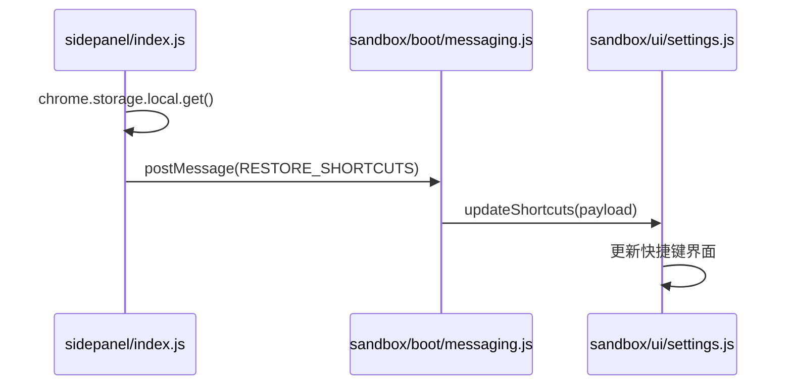
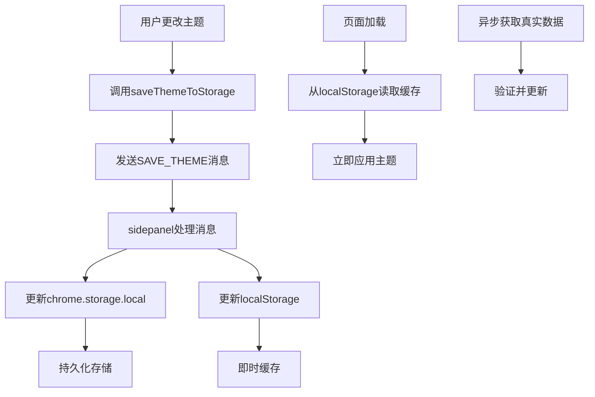
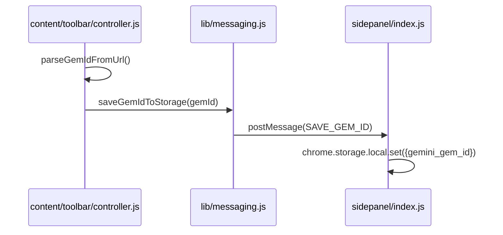
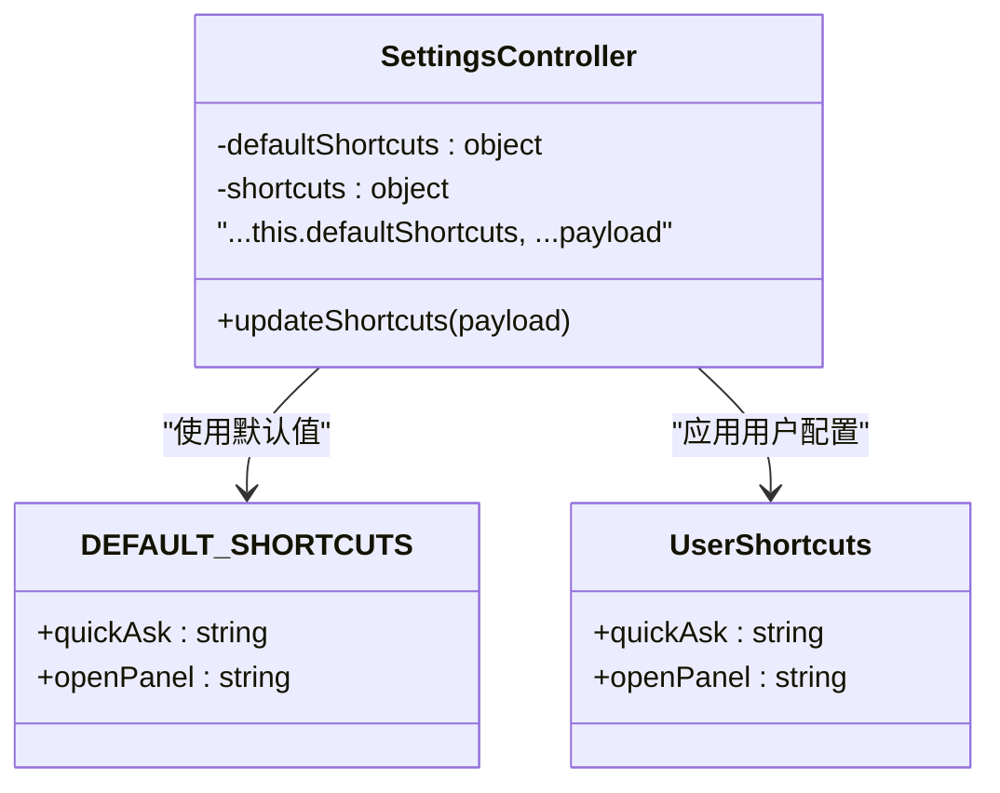
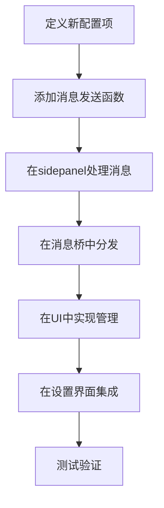

# 高级选项

<cite>
**本文档中引用的文件**  
- [constants.js](file://lib/constants.js)
- [messaging.js](file://lib/messaging.js)
- [sidepanel/index.js](file://sidepanel/index.js)
- [sandbox/ui/settings.js](file://sandbox/ui/settings.js)
- [content/toolbar/controller.js](file://content/toolbar/controller.js)
</cite>

## 目录
1. [简介](#简介)
2. [快捷键配置](#快捷键配置)
3. [主题设置](#主题设置)
4. [自定义ID配置](#自定义id配置)
5. [系统常量与高级配置的交互](#系统常量与高级配置的交互)
6. [最佳实践](#最佳实践)
7. [扩展高级配置项的技术指南](#扩展高级配置项的技术指南)

## 简介
本高级配置文档详细介绍了Gemini Nexus扩展中的高级配置功能，包括快捷键、主题和自定义ID等核心配置项。文档深入分析了这些配置项的存储机制、数据结构和通信协议，为开发者和高级用户提供全面的技术指导。通过理解这些高级配置的实现原理，用户可以更好地定制扩展行为，开发者可以在此基础上进行功能扩展。

## 快捷键配置

### 存储结构与JSON格式
快捷键配置通过`geminiShortcuts`键存储在Chrome的`chrome.storage.local`中。其数据结构是一个JSON对象，包含不同功能的快捷键映射。根据`lib/constants.js`中的定义，系统提供了默认的快捷键配置：

```json
{
  "quickAsk": "Ctrl+G",
  "openPanel": "Alt+S"
}
```

用户可以通过设置界面修改这些快捷键，系统会保存完整的快捷键对象。

### 配置更新机制
快捷键配置的更新通过`SAVE_SHORTCUTS`消息完成。当用户在设置界面保存快捷键时，系统调用`saveShortcutsToStorage`函数，该函数通过`postMessage`向`sidepanel/index.js`发送`SAVE_SHORTCUTS`消息：

```javascript
export function saveShortcutsToStorage(shortcuts) {
    window.parent.postMessage({
        action: 'SAVE_SHORTCUTS',
        payload: shortcuts
    }, '*');
}
```

在`sidepanel/index.js`中，接收到此消息后，系统同时更新`chrome.storage.local`和内存中的预取数据：

```javascript
if (action === 'SAVE_SHORTCUTS') {
    chrome.storage.local.set({ geminiShortcuts: payload });
    if (preFetchedData) preFetchedData.geminiShortcuts = payload;
}
```

### 初始化加载流程
快捷键配置的加载流程如下：
1. `sidepanel/index.js`从`chrome.storage.local`异步获取所有配置数据
2. 获取到数据后，通过`postMessage`将`RESTORE_SHORTCUTS`消息发送到沙箱环境
3. `sandbox/boot/messaging.js`中的`AppMessageBridge`接收到消息后，调用UI的`updateShortcuts`方法更新界面



**Section sources**
- [lib/messaging.js](file://lib/messaging.js#L18-L23)
- [sidepanel/index.js](file://sidepanel/index.js#L299-L302)
- [sandbox/ui/settings.js](file://sandbox/ui/settings.js#L113-L117)

**Diagram sources**
- [sidepanel/index.js](file://sidepanel/index.js#L22-L34)
- [sandbox/boot/messaging.js](file://sandbox/boot/messaging.js#L49-L52)
- [sandbox/ui/settings.js](file://sandbox/ui/settings.js#L192-L197)

## 主题设置

### 双重存储机制
主题设置采用双重存储机制，结合了`chrome.storage.local`的持久化存储和`localStorage`的即时缓存，以确保主题能够快速加载。

#### 持久化存储
`chrome.storage.local`用于持久化存储主题配置，确保用户重启浏览器后设置仍然保留：

```javascript
chrome.storage.local.set({ geminiTheme: payload });
```

#### 即时缓存
`localStorage`用于缓存主题设置，实现同步加载，避免因异步存储API导致的加载延迟：

```javascript
localStorage.setItem('geminiTheme', payload); // Cache for Sync Load
```

### 快速加载优化
系统在`sidepanel/index.js`中实现了主题快速加载优化：

```javascript
// 1. 从localStorage同步获取缓存主题
const cachedTheme = localStorage.getItem('geminiTheme') || 'system';

// 2. 立即设置iframe的src，包含缓存的主题参数
iframe.src = `../sandbox/index.html?theme=${cachedTheme}&lang=${cachedLang}`;

// 3. 异步从chrome.storage.local获取真实数据
chrome.storage.local.get(['geminiTheme'], (result) => {
    // ...处理结果
});
```

这种设计确保了用户界面能够立即以正确的主题显示，而不是等待异步存储操作完成。

### 主题配置生命周期


**Section sources**
- [sidepanel/index.js](file://sidepanel/index.js#L1-L334)
- [lib/messaging.js](file://lib/messaging.js#L29-L34)

**Diagram sources**
- [sidepanel/index.js](file://sidepanel/index.js#L8-L14)
- [sidepanel/index.js](file://sidepanel/index.js#L307-L310)
- [lib/messaging.js](file://lib/messaging.js#L29-L34)

## 自定义ID配置

### gem_id配置项用途
`gemini_gem_id`配置项用于存储当前Gem的唯一标识符，主要用途包括：
- 在Gem页面上自动识别当前Gem的ID
- 将操作与特定的Gem关联
- 支持跨Gem的上下文管理

### 设置方法
`gem_id`的设置通过`SAVE_GEM_ID`消息完成，系统提供了`saveGemIdToStorage`辅助函数：

```javascript
export function saveGemIdToStorage(gemId) {
    window.parent.postMessage({
        action: 'SAVE_GEM_ID',
        payload: gemId
    }, '*');
}
```

在`SettingsController`中，当用户保存设置时，系统会保存`gemId`：

```javascript
saveSettings(data) {
    // ...
    this.gemId = data.gemId || "";
    saveGemIdToStorage(this.gemId);
}
```

### 自动识别机制
系统实现了自动识别Gem ID的机制，通过解析URL路径：

```javascript
parseGemIdFromUrl() {
    // URL pattern: https://gemini.google.com/gem/GEM_ID
    const match = window.location.pathname.match(/\/gem\/([a-zA-Z0-9]+)/);
    return match ? match[1] : null;
}
```

该机制在`content/toolbar/controller.js`中被调用，当用户执行操作时，系统会优先使用从URL解析出的Gem ID，若无法解析则使用存储的自定义ID。

### 配置同步流程


**Section sources**
- [sandbox/ui/settings.js](file://sandbox/ui/settings.js#L132-L136)
- [sidepanel/index.js](file://sidepanel/index.js#L331-L334)
- [content/toolbar/controller.js](file://content/toolbar/controller.js#L235-L239)

**Diagram sources**
- [content/toolbar/controller.js](file://content/toolbar/controller.js#L235-L239)
- [lib/messaging.js](file://lib/messaging.js#L91-L96)
- [sidepanel/index.js](file://sidepanel/index.js#L331-L334)

## 系统常量与高级配置的交互

### 全局常量定义
`lib/constants.js`文件定义了系统的核心常量，这些常量作为高级配置的基础：

```javascript
export const DEFAULT_SHORTCUTS = {
    quickAsk: "Ctrl+G",
    openPanel: "Alt+S"
};

export const DEFAULT_MODEL = "gemini-2.5-flash";
```

### 常量与配置的交互模式
系统常量与高级配置通过以下方式交互：

1. **默认值提供**：系统常量为高级配置提供默认值
2. **配置覆盖**：用户配置优先于系统常量
3. **动态合并**：系统在运行时合并默认值和用户配置

在`SettingsController`中，系统初始化时合并默认快捷键：

```javascript
constructor(callbacks) {
    this.defaultShortcuts = { ...DEFAULT_SHORTCUTS };
    this.shortcuts = { ...this.defaultShortcuts };
}
```

当从存储中恢复配置时，系统使用默认值作为基础，然后应用用户配置：

```javascript
updateShortcuts(payload) {
    if (payload) {
        this.shortcuts = { ...this.defaultShortcuts, ...payload };
        this.view.setShortcuts(this.shortcuts);
    }
}
```

### 交互关系图


**Section sources**
- [lib/constants.js](file://lib/constants.js#L4-L9)
- [sandbox/ui/settings.js](file://sandbox/ui/settings.js#L13-L15)

**Diagram sources**
- [lib/constants.js](file://lib/constants.js#L4-L7)
- [sandbox/ui/settings.js](file://sandbox/ui/settings.js#L13-L15)
- [sandbox/ui/settings.js](file://sandbox/ui/settings.js#L193-L195)

## 最佳实践

### 快捷键冲突解决
1. **避免系统级快捷键**：不要使用`Ctrl+T`、`Ctrl+W`等浏览器系统快捷键
2. **提供冲突检测**：在设置界面添加快捷键冲突检测功能
3. **使用修饰键组合**：推荐使用`Ctrl+Alt`、`Ctrl+Shift`等组合键减少冲突
4. **允许空快捷键**：允许用户将快捷键设置为空以禁用特定功能

### 主题自定义扩展
1. **支持CSS变量**：在CSS中使用CSS变量，允许用户通过自定义CSS扩展主题
2. **提供主题API**：为开发者提供主题注册API，支持动态加载主题
3. **主题预览功能**：在设置界面提供主题实时预览功能
4. **暗色模式自动检测**：支持`prefers-color-scheme`媒体查询，自动匹配系统主题

### 配置管理最佳实践
1. **配置验证**：在保存配置前进行格式验证
2. **配置备份**：定期备份配置到云端或本地文件
3. **配置同步**：支持多设备间的配置同步
4. **配置版本控制**：为配置添加版本号，支持向后兼容

## 扩展高级配置项的技术指南

### 消息通信协议扩展
要添加新的高级配置项，需要遵循以下步骤扩展消息通信协议：

#### 1. 定义新的消息类型
在`lib/messaging.js`中添加新的消息发送函数：

```javascript
export function saveNewConfigToStorage(config) {
    window.parent.postMessage({
        action: 'SAVE_NEW_CONFIG',
        payload: config
    }, '*');
}

export function requestNewConfigFromStorage() {
    window.parent.postMessage({ action: 'GET_NEW_CONFIG' }, '*');
}
```

#### 2. 在sidepanel中处理新消息
在`sidepanel/index.js`中添加消息处理逻辑：

```javascript
if (action === 'SAVE_NEW_CONFIG') {
    chrome.storage.local.set({ geminiNewConfig: payload });
    if (preFetchedData) preFetchedData.geminiNewConfig = payload;
}

if (action === 'GET_NEW_CONFIG') {
    chrome.storage.local.get(['geminiNewConfig'], (res) => {
        const config = res.geminiNewConfig || defaultNewConfig;
        if (iframe.contentWindow) {
            iframe.contentWindow.postMessage({
                action: 'RESTORE_NEW_CONFIG',
                payload: config
            }, '*');
        }
    });
}
```

#### 3. 在消息桥中处理恢复消息
在`sandbox/boot/messaging.js`中添加消息分发处理：

```javascript
dispatch(action, payload, event) {
    if (action === 'RESTORE_NEW_CONFIG') {
        this.ui.updateNewConfig(payload);
        return;
    }
    // ...其他处理
}
```

#### 4. 在UI控制器中实现配置管理
在`sandbox/ui/settings.js`中添加配置管理方法：

```javascript
class SettingsController {
    // ...
    
    saveNewConfig(config) {
        this.newConfig = config;
        saveNewConfigToStorage(this.newConfig);
    }
    
    updateNewConfig(payload) {
        if (payload) {
            this.newConfig = { ...defaultNewConfig, ...payload };
            this.view.setNewConfig(this.newConfig);
        }
    }
}
```

### 扩展流程图


**Section sources**
- [lib/messaging.js](file://lib/messaging.js#L18-L96)
- [sidepanel/index.js](file://sidepanel/index.js#L295-L334)
- [sandbox/boot/messaging.js](file://sandbox/boot/messaging.js#L49-L89)

**Diagram sources**
- [lib/messaging.js](file://lib/messaging.js#L18-L96)
- [sidepanel/index.js](file://sidepanel/index.js#L295-L334)
- [sandbox/boot/messaging.js](file://sandbox/boot/messaging.js#L49-L89)
- [sandbox/ui/settings.js](file://sandbox/ui/settings.js#L192-L197)