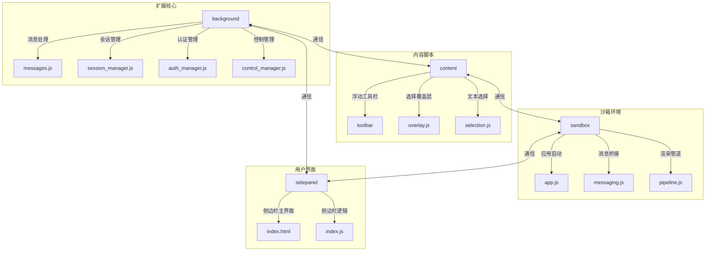
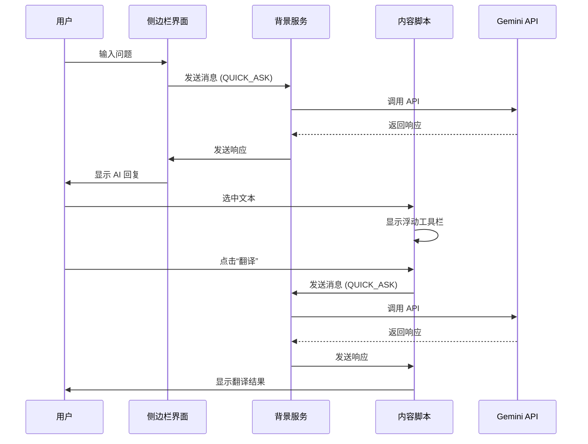
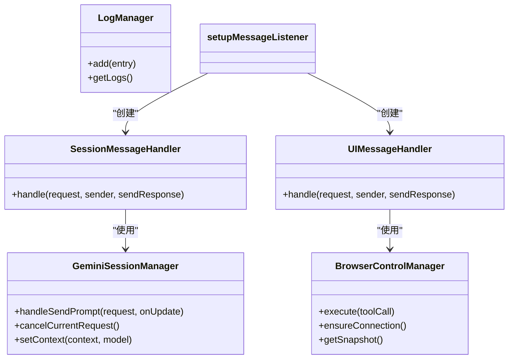
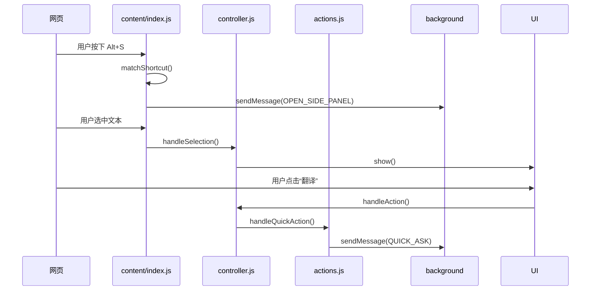
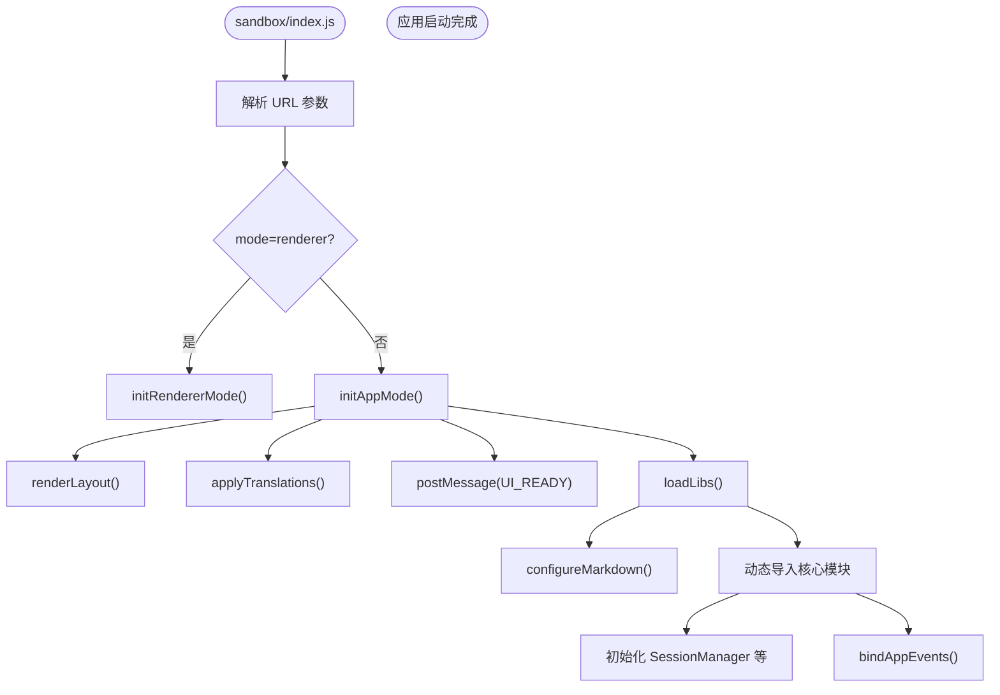
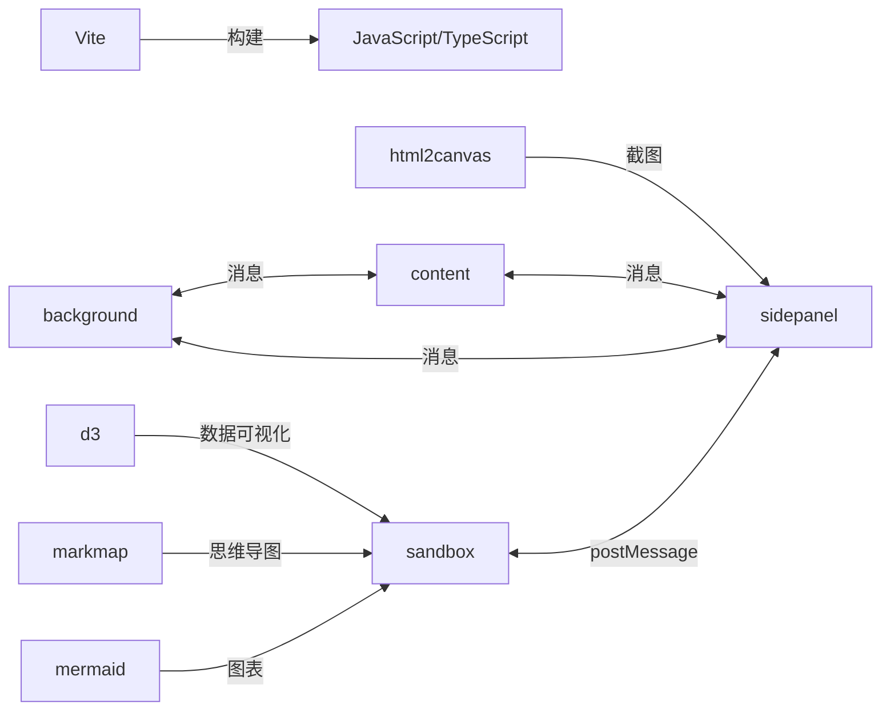

# 项目概述

<cite>
**本文档引用的文件**
- [README.md](file://README.md)
- [manifest.json](file://manifest.json)
- [package.json](file://package.json)
- [background/index.js](file://background/index.js)
- [content/index.js](file://content/index.js)
- [sandbox/index.js](file://sandbox/index.js)
- [sidepanel/index.js](file://sidepanel/index.js)
- [background/managers/session_manager.js](file://background/managers/session_manager.js)
- [content/toolbar/controller.js](file://content/toolbar/controller.js)
- [sandbox/boot/app.js](file://sandbox/boot/app.js)
- [services/gemini_api.js](file://services/gemini_api.js)
- [lib/constants.js](file://lib/constants.js)
- [content/overlay.js](file://content/overlay.js)
- [background/messages.js](file://background/messages.js)
- [content/toolbar/actions.js](file://content/toolbar/actions.js)
- [sandbox/controllers/app_controller.js](file://sandbox/controllers/app_controller.js)
- [lib/messaging.js](file://lib/messaging.js)
- [background/managers/control_manager.js](file://background/managers/control_manager.js)
- [content/toolbar/ui/manager.js](file://content/toolbar/ui/manager.js)
</cite>

## 目录
1. [简介](#简介)
2. [项目结构](#项目结构)
3. [核心组件](#核心组件)
4. [架构概览](#架构概览)
5. [详细组件分析](#详细组件分析)
6. [依赖分析](#依赖分析)
7. [性能考量](#性能考量)
8. [故障排除指南](#故障排除指南)
9. [结论](#结论)

## 简介

Gemini Nexus 是一款基于 Chrome 扩展架构的智能 AI 助手，其核心定位是通过集成 Google Gemini 大模型与浏览器原生能力，为用户提供强大的 AI 驱动功能。该项目旨在实现网页内容理解、智能对话、图像分析和浏览器自动化控制。其设计目标是创建一个无缝集成到用户浏览体验中的工具，通过侧边栏对话、文本选中工具和浏览器控制等功能，提升用户的生产力和信息处理效率。项目支持中英双语，并具备深色/浅色主题自动适配系统主题的能力，为用户提供友好的使用体验。

**Section sources**
- [README.md](file://README.md#L1-L102)

## 项目结构

Gemini Nexus 项目采用模块化设计，将不同功能的代码分离到独立的目录中，以提高代码的可维护性和可读性。主要目录包括 `background`（服务工作线程）、`content`（内容脚本）、`sandbox`（沙箱环境）、`sidepanel`（侧边栏界面）和 `services`（API 服务）。这种结构清晰地划分了扩展的不同部分，使得每个组件的职责明确。

**Diagram sources**
- [manifest.json](file://manifest.json#L11-L14)
- [background/index.js](file://background/index.js#L4-L8)
- [content/index.js](file://content/index.js#L19-L20)
- [sandbox/index.js](file://sandbox/index.js#L2-L3)
- [sidepanel/index.js](file://sidepanel/index.js#L4-L5)

**Section sources**
- [manifest.json](file://manifest.json#L1-L93)
- [project_structure](file://project_structure)

## 核心组件

Gemini Nexus 的核心组件包括 `background` 服务工作线程、`content` 内容脚本、`sandbox` 沙箱环境和 `sidepanel` 侧边栏界面。`background` 组件负责处理 API 调用、会话管理和消息处理，是整个扩展的控制中心。`content` 组件注入到网页中，负责创建浮动工具栏、处理文本选择和截图功能。`sandbox` 组件提供一个安全的环境来渲染 Markdown 内容和执行第三方库。`sidepanel` 组件则提供了用户与 AI 进行对话的主要界面。这些组件通过消息传递机制协同工作，共同实现扩展的功能。

**Section sources**
- [README.md](file://README.md#L50-L66)
- [manifest.json](file://manifest.json#L34-L36)
- [background/index.js](file://background/index.js#L4-L8)
- [content/index.js](file://content/index.js#L12-L13)
- [sandbox/index.js](file://sandbox/index.js#L2-L3)
- [sidepanel/index.js](file://sidepanel/index.js#L4-L5)

## 架构概览

Gemini Nexus 的架构基于 Chrome 扩展的典型模式，利用 `manifest.json` 文件定义扩展的权限、背景服务、内容脚本和侧边栏。`background` 服务工作线程作为扩展的持久化后台进程，负责管理会话、处理消息和与 Gemini API 通信。`content` 脚本注入到每个网页中，监听用户交互（如文本选择和快捷键），并将请求转发给 `background`。`sidepanel` 提供了一个独立的 UI 界面，用户可以在其中与 AI 进行多轮对话。`sandbox` 环境用于安全地渲染 AI 生成的 Markdown 内容，防止潜在的 XSS 攻击。

**Diagram sources**
- [manifest.json](file://manifest.json#L11-L14)
- [background/index.js](file://background/index.js#L10)
- [content/index.js](file://content/index.js#L19-L20)
- [sidepanel/index.js](file://sidepanel/index.js#L4-L5)
- [services/gemini_api.js](file://services/gemini_api.js#L26-L230)

**Section sources**
- [README.md](file://README.md#L50-L66)
- [manifest.json](file://manifest.json#L1-L93)

## 详细组件分析

### background 服务工作线程分析

`background` 服务工作线程是 Gemini Nexus 的核心，负责管理所有后台任务。它通过 `messages.js` 中的 `setupMessageListener` 函数监听来自 `content` 脚本和 `sidepanel` 的消息。`session_manager.js` 负责管理与 Gemini 的会话，处理消息的发送和接收。`control_manager.js` 则负责浏览器控制功能，允许 AI 执行如点击、填写表单等操作。这些管理器在 `background/index.js` 中被初始化并连接在一起。

#### 对象导向组件

**Diagram sources**
- [background/messages.js](file://background/messages.js#L14-L82)
- [background/managers/session_manager.js](file://background/managers/session_manager.js#L6-L285)
- [background/managers/control_manager.js](file://background/managers/control_manager.js#L11-L159)
- [background/index.js](file://background/index.js#L4-L8)

**Section sources**
- [background/index.js](file://background/index.js#L1-L30)
- [background/messages.js](file://background/messages.js#L1-L82)
- [background/managers/session_manager.js](file://background/managers/session_manager.js#L1-L285)
- [background/managers/control_manager.js](file://background/managers/control_manager.js#L1-L159)

### content 内容脚本分析

`content` 内容脚本负责与用户当前浏览的网页进行交互。`index.js` 是入口文件，它初始化了 `GeminiNexusOverlay` 用于截图和 `GeminiToolbarController` 用于管理浮动工具栏。`controller.js` 是工具栏的核心控制器，它协调 UI、动作和事件。当用户选中文本时，`selectionObserver` 会触发 `handleSelection` 方法，显示浮动工具栏。快捷键（如 Alt+S 打开侧边栏）也在 `index.js` 中通过 `keydown` 事件监听器进行处理。

#### API/服务组件

**Diagram sources**
- [content/index.js](file://content/index.js#L19-L190)
- [content/toolbar/controller.js](file://content/toolbar/controller.js#L7-L301)
- [content/toolbar/actions.js](file://content/toolbar/actions.js#L4-L197)
- [background/messages.js](file://background/messages.js#L70-L76)

**Section sources**
- [content/index.js](file://content/index.js#L1-L190)
- [content/toolbar/controller.js](file://content/toolbar/controller.js#L1-L301)
- [content/toolbar/actions.js](file://content/toolbar/actions.js#L1-L197)

### sandbox 沙箱环境分析

`sandbox` 环境提供了一个安全的上下文来渲染 AI 生成的内容，特别是 Markdown。`index.js` 根据 URL 参数决定启动 `app.js` 还是 `renderer.js` 模式。`app.js` 初始化了应用布局、消息桥接和核心控制器。`messaging.js` 在 `lib` 目录中定义了与 `sidepanel` 和 `background` 通信的函数，如 `sendToBackground` 和 `saveSessionsToStorage`。这种设计确保了沙箱内的代码无法直接访问敏感的浏览器 API，提高了安全性。

#### 复杂逻辑组件

**Diagram sources**
- [sandbox/index.js](file://sandbox/index.js#L1-L12)
- [sandbox/boot/app.js](file://sandbox/boot/app.js#L11-L90)
- [lib/messaging.js](file://lib/messaging.js#L1-L96)

**Section sources**
- [sandbox/index.js](file://sandbox/index.js#L1-L12)
- [sandbox/boot/app.js](file://sandbox/boot/app.js#L1-L90)
- [lib/messaging.js](file://lib/messaging.js#L1-L96)

## 依赖分析

Gemini Nexus 项目依赖于多种技术和库。根据 `package.json`，项目使用 Vite 作为构建工具，并依赖 `d3`、`html2canvas`、`markmap` 和 `mermaid` 等库来实现数据可视化和内容渲染。`manifest.json` 定义了扩展所需的权限，如 `sidePanel`、`storage` 和 `<all_urls>`。`background`、`content` 和 `sidepanel` 组件之间通过 `chrome.runtime.sendMessage` 和 `window.postMessage` 进行通信，形成了一个松耦合但高度协作的系统。

**Diagram sources**
- [package.json](file://package.json#L1-L24)
- [manifest.json](file://manifest.json#L6-L10)
- [lib/messaging.js](file://lib/messaging.js#L4-L96)
- [sidepanel/index.js](file://sidepanel/index.js#L150-L425)

**Section sources**
- [package.json](file://package.json#L1-L24)
- [manifest.json](file://manifest.json#L1-L93)
- [lib/messaging.js](file://lib/messaging.js#L1-L96)

## 性能考量

Gemini Nexus 在性能方面进行了多项优化。`sidepanel/index.js` 使用 `localStorage` 缓存主题和语言设置，以实现即时加载，避免了异步 `chrome.storage` 查询的延迟。`content/index.js` 使用 `chrome.storage.onChanged` 监听器来动态更新快捷键和功能开关，确保了配置的实时性。`services/gemini_api.js` 中的 `sendGeminiMessage` 函数支持流式响应，允许 AI 的回复逐字显示，提升了用户体验。此外，`background` 服务工作线程中的 `keep_alive` 机制有助于保持扩展的活跃状态。

**Section sources**
- [sidepanel/index.js](file://sidepanel/index.js#L7-L15)
- [content/index.js](file://content/index.js#L117-L152)
- [services/gemini_api.js](file://services/gemini_api.js#L159-L202)
- [background/index.js](file://background/index.js#L28-L30)

## 故障排除指南

当遇到问题时，可以参考以下指南进行排查。如果 AI 无法响应，首先检查是否已在 `gemini.google.com` 登录 Google 账号。如果出现“未登录”错误，尝试刷新 Gemini 页面。对于请求过于频繁的错误，等待几分钟后再试。如果侧边栏无法打开，请检查 Chrome 扩展设置中是否已正确加载扩展。开发者可以通过 `chrome://extensions` 页面的“检查视图”来调试 `background` 服务工作线程和 `sidepanel`，查看控制台日志以获取更多信息。

**Section sources**
- [services/gemini_api.js](file://services/gemini_api.js#L154-L198)
- [README.md](file://README.md#L47-L49)

## 结论

Gemini Nexus 是一个功能强大且架构精良的 Chrome 扩展，它成功地将 Google Gemini 大模型与浏览器环境深度融合。通过清晰的模块划分和高效的消息通信机制，项目实现了智能对话、内容总结、图像分析和浏览器自动化等复杂功能。其采用的现代技术栈（Vite, TypeScript）和对安全性的重视（沙箱环境）使其成为一个可维护和可扩展的优秀范例。无论是初学者还是资深开发者，都能从该项目的结构和实现中获得宝贵的见解。